# Turbo EA - **https://www.turbo-ea.org**


Enterprise Architecture in practice : https://www.turbo-ea.org/blog

[](https://github.com/vincentmakes/turbo-ea/actions/workflows/ci.yml)
[](LICENSE)
[](https://www.python.org/)
[](https://react.dev/)
[](https://ko-fi.com/vincentmakes)

Self-hosted Enterprise Architecture Management platform that creates a **digital twin of your IT landscape**. Inspired by LeanIX, with a fully admin-configurable metamodel — card types, fields, subtypes, and relations are all data, not code.

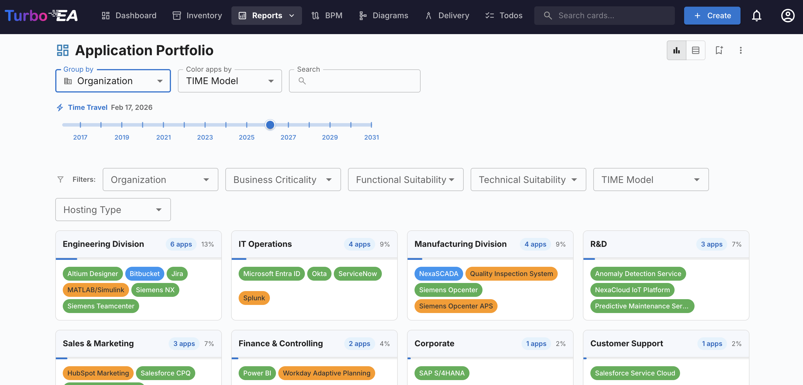

## Features

### Core EA Management

- **Configurable Metamodel** — 13 built-in card types across 4 architecture layers (Strategy, Business, Application, Technical). Add custom types, fields, subtypes, and relation types from the admin UI. Interactive metamodel graph visualization with hover highlighting.
- **Inventory Management** — AG Grid-powered data table with search, dynamic multi-select filtering for all columns (subtype, lifecycle, data quality, attributes), column customization, Excel import/export, mass archive/delete, and select-all across filtered rows.
- **Card Detail Pages** — Full detail view with fields, lifecycle, hierarchy, relations, stakeholders, comments, todos, documents, and event history. Approval workflow (Draft/Approved/Rejected/Broken) with auto-breaking on substantive edits. Auto-computed data quality scoring (0–100%) based on field weights.
- **Hierarchy Support** — Parent-child trees for hierarchical card types. Business Capabilities enforce max 5-level depth with auto-computed capability levels.

### Reporting & Analytics

- **Interactive Reports** — Portfolio bubble chart, capability heatmap, lifecycle roadmap, dependency graph, cost treemap, matrix cross-reference, data quality dashboard, and EOL risk report. All report filters, colors, and grouping are dynamically generated from card type field schemas with auto-persist to localStorage.
- **Time-Travel** — View any report as it appeared at a historical date using a timeline slider with year-level granularity.
- **Saved Reports** — Save report configurations (filters, axes, colors, grouping), share with other users (edit/view permissions), and generate OData feeds for programmatic access.
- **Print-to-PDF** — Native browser print for all reports with optimized compact layout, white background, and time-travel date display.
- **Matrix Hierarchical Headers** — Matrix report supports hierarchical grouped headers with collapsible row/column depth controls.

### Business Process Management (BPM)

- **BPMN 2.0 Editor** — Full process flow modeling with a built-in BPMN editor and viewer, template chooser, and process navigator.
- **Process Flow Versioning** — Draft, published, and archived states for process diagrams with approval workflows and stakeholder sign-offs.
- **Element Linking** — Link BPMN process elements to EA cards (applications, IT components, etc.) for traceability between processes and the IT landscape.
- **Process Assessments** — Record maturity assessments (efficiency, effectiveness, compliance, automation) with 1–5 scoring, action items, and historical tracking.
- **BPM Reports** — Process map, capability-process matrix, process-application matrix, process dependencies, and element-application map.

### Diagrams & Documents

- **Diagram Editor** — Self-hosted DrawIO integration for creating architecture diagrams linked to your cards. Shapes are colored by card type with synced/pending states.
- **EA Delivery** — TOGAF-compliant Statement of Architecture Work (SoAW) editor with rich text editing (TipTap), version history, sign-off requests, and DOCX export.

### Data Governance

- **Data Maintenance Surveys** — Admin-driven workflows for keeping card data accurate at scale. Target by card type with tag/relation/attribute filters. Users maintain or confirm field values; admins review and apply changes in bulk.
- **Calculated Fields** — Admin-configurable formula engine for computed fields. Supports IF, SUM, AVG, MIN, MAX, COUNT, ROUND, COALESCE, FILTER, MAP_SCORE with syntax-highlighted editor, inline autocomplete, and cycle detection.
- **End-of-Life Tracking** — Integration with endoflife.date for monitoring technology lifecycle status. Fuzzy product search, mass search/link for IT components, and dedicated EOL report.
- **Data Quality Scoring** — Auto-calculated completeness percentage based on field schema weights. Data quality report shows by-type stats, orphaned/stale counts, and worst items.

### Collaboration

- **Notifications & Events** — Real-time SSE updates, in-app notification bell with unread counts, and optional SMTP email alerts. Notification types: todo assigned, card updated, comment added, approval status changed, SoAW sign requested/signed, stakeholder updates.
- **Threaded Comments** — Full threaded comment system on cards with edit and delete.
- **Todos** — Task management linked to cards with assignment, due dates, and status tracking. Badge counts for open todos shown in navigation.
- **Stakeholders** — Per-card stakeholder roles (responsible, observer, technical/business application owner) with configurable custom roles per card type.
- **Documents** — URL/link attachments on cards.
- **Tags** — Hierarchical tag groups with single/multi-select modes and open/restricted creation. Filter-by-tag across inventory and reports.

### Integrations

> [!IMPORTANT]
> At this stage (v0.5.0) the SSO and ServiceNow integration are implemented but untested.  
> I'm looking for volunteer testers for this who would have access to such integration end point.
> If you are interested, please check the discussions or raise an issue.


- **ServiceNow Integration** — Bidirectional sync with ServiceNow. Connection management, field mapping with transform rules, direction control (Turbo EA → SNOW, SNOW → Turbo EA, or bidirectional), staged record review before applying, and encrypted credential storage.
- **SSO / Single Sign-On** — SSO callback handling with password setup flow for invited users.
- **Web Portals** — Public, slug-based views of your EA landscape (no login required). Configurable card type display, field selection, card layout, per-portal logo toggle, and relation-based filtering.
- **OData Feeds** — Generate OData-compatible feeds from saved views and saved reports for consumption by external tools (Excel, Power BI, etc.).


### Administration

- **Custom RBAC Roles** — Admin-configurable roles beyond the 3 built-in roles (admin/member/viewer) with 50+ granular permissions for both app-level and card-level actions.
- **Card Layout Editor** — Drag-and-drop visual editor for customizing card detail page layouts with section ordering, field grouping, 2-column support, and collapsible sections.
- **Saved Views with Sharing** — Save inventory filter/column/sort configurations with private, public, or shared visibility. Share with specific users with edit/view permissions.
- **Custom Branding** — Upload a custom logo (max 2 MB; PNG, JPEG, SVG, WebP, GIF) and favicon. Per-portal logo visibility toggle.
- **Currency Settings** — Global display currency for all cost values with compact formatting.
- **SMTP Email Configuration** — Configure SMTP settings from the admin UI with test email support.

## Screenshots

<details>
<summary>Click to expand screenshots</summary>

| | |
|---|---|
| 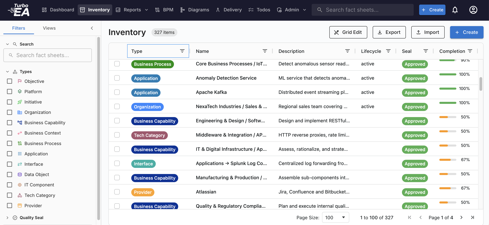 | 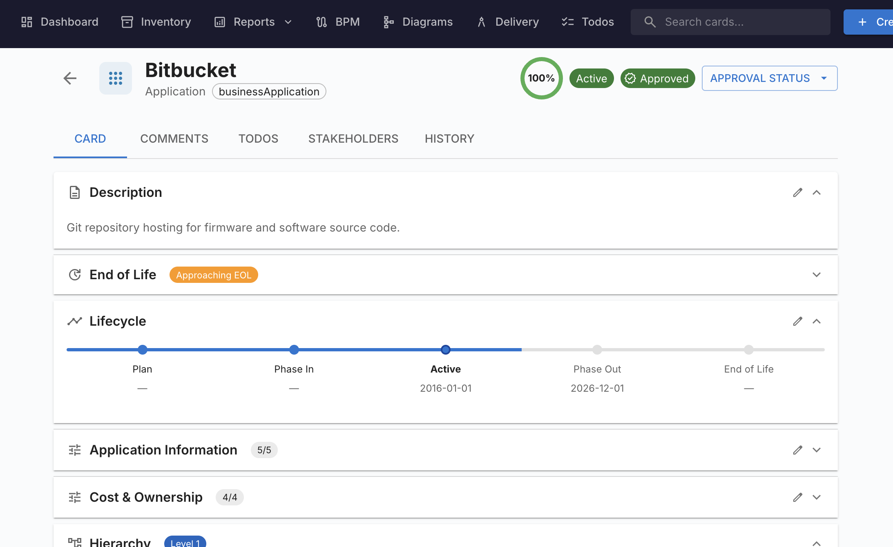 |
| 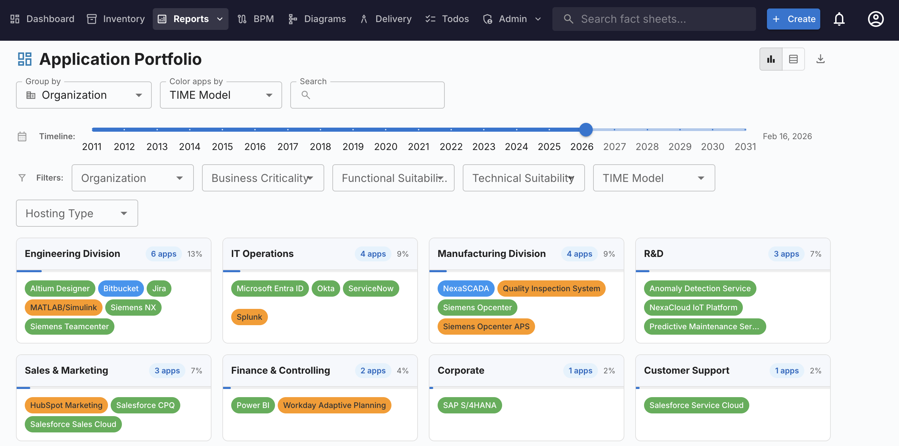 | 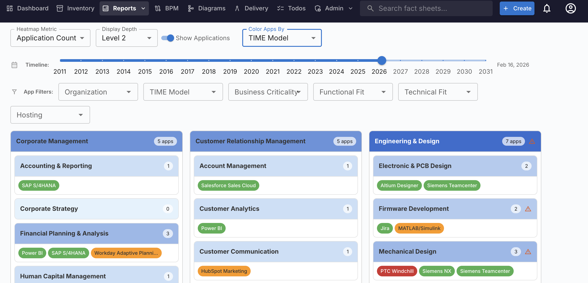 |
| 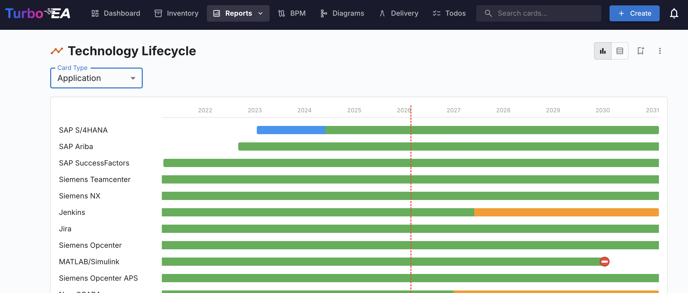 | 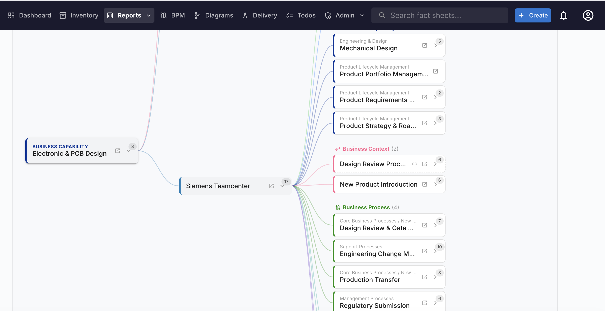 |
| 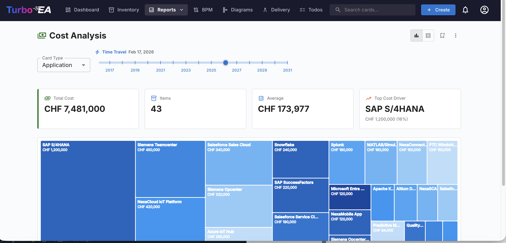 | 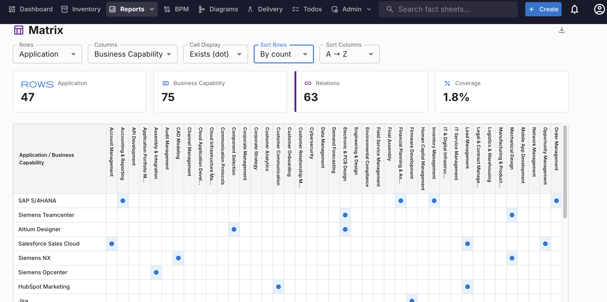 |
| 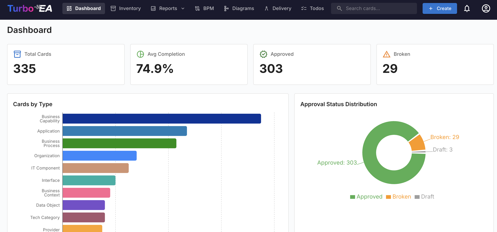 | 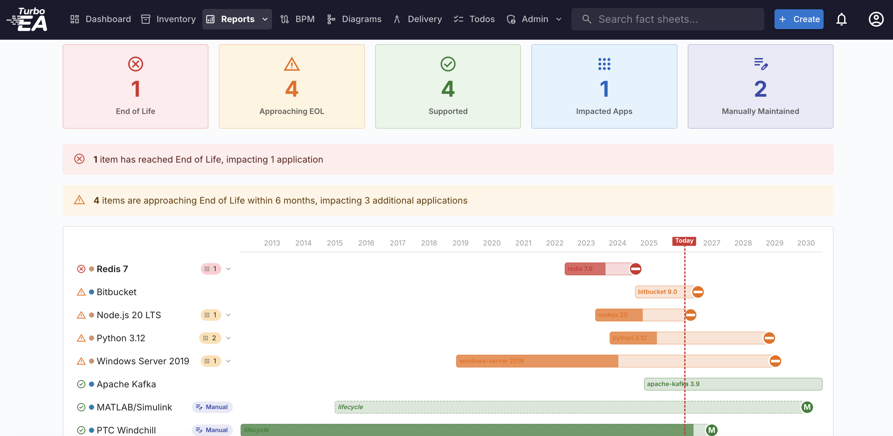 |
| 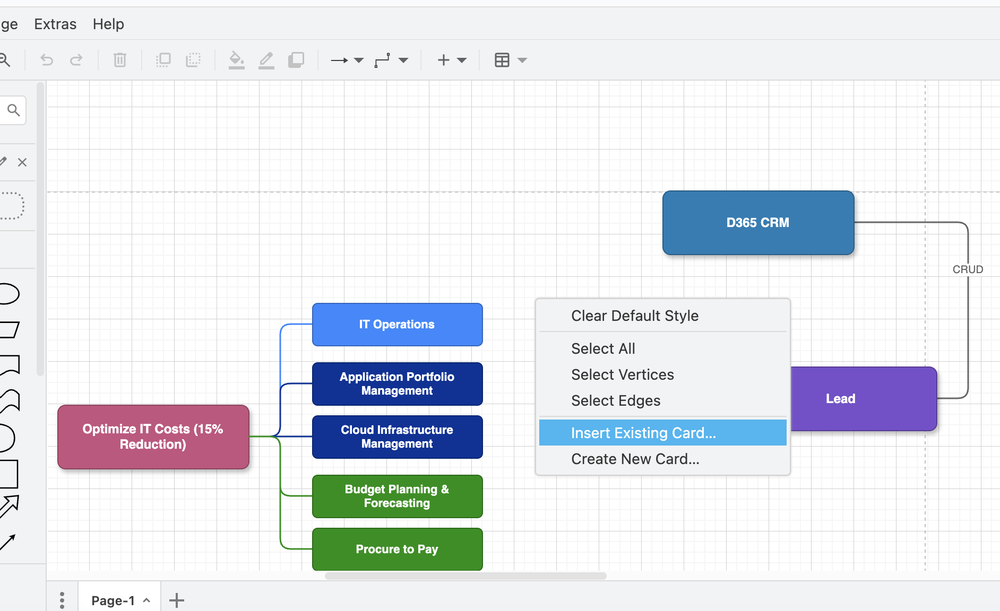 | 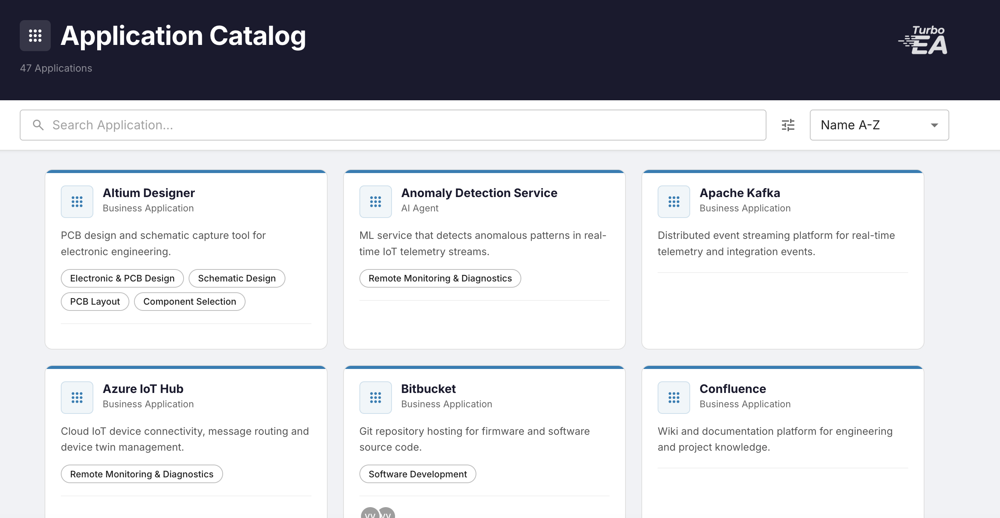 |
| 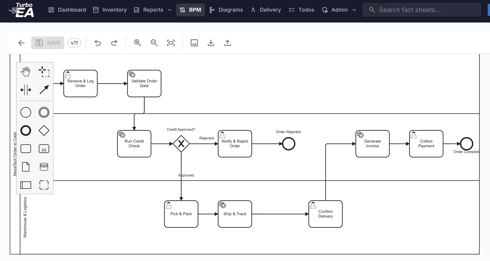 | 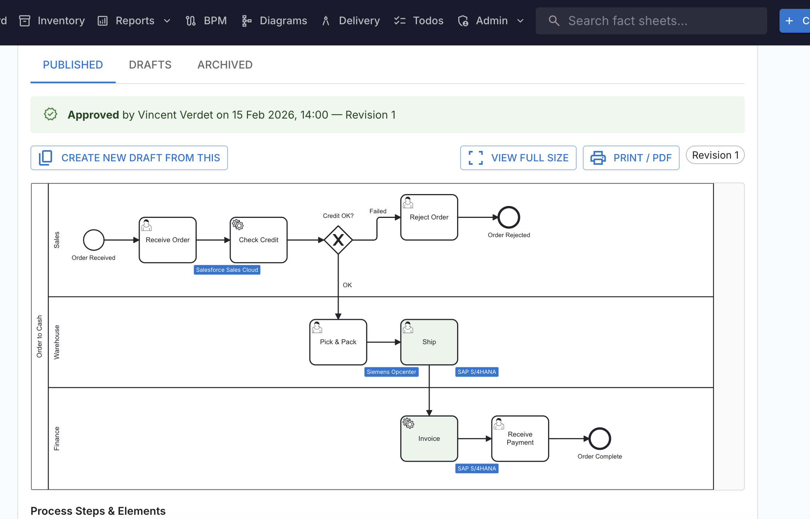 |
| 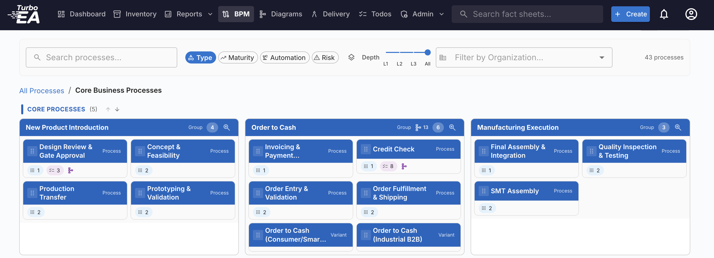 | 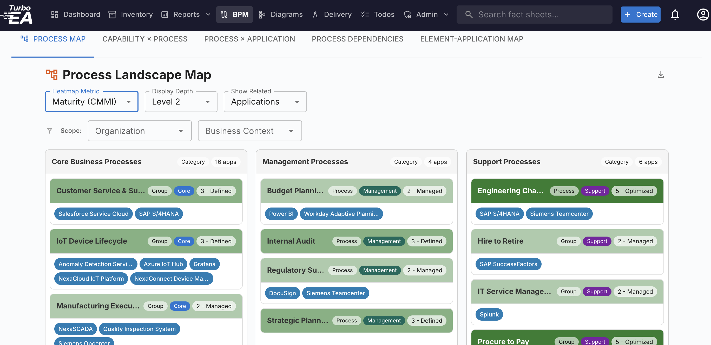 |
| 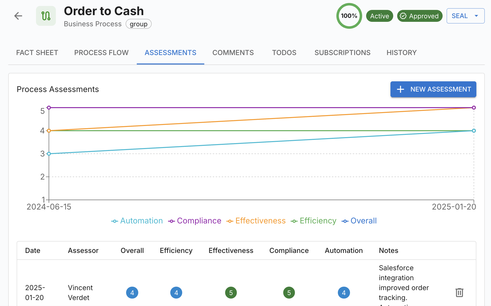 | 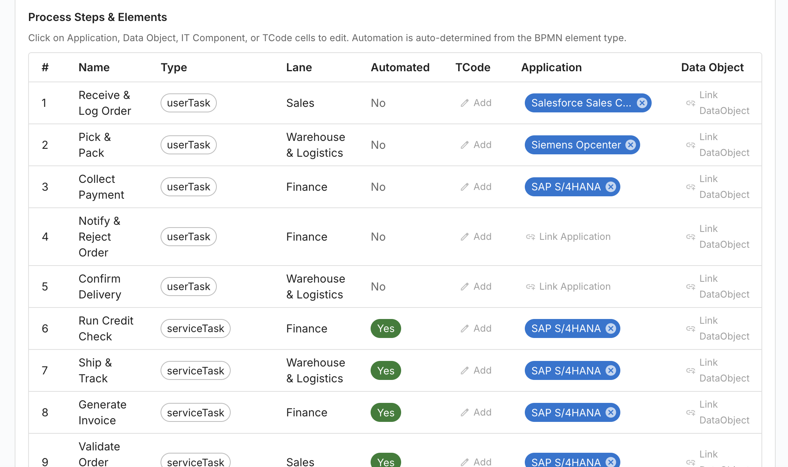 |

</details>

---

## Quick Start

The quickest way to get Turbo EA running. This starts PostgreSQL, the backend, and the frontend all in Docker containers with a single command.

### Prerequisites

- [Docker](https://docs.docker.com/get-docker/) (v20.10+)
- [Docker Compose](https://docs.docker.com/compose/install/) (v2.0+)

### 1. Clone the repository

```bash
git clone https://github.com/vincentmakes/turbo-ea.git
cd turbo-ea
```

### 2. Create your environment file

```bash
cp .env.example .env
```

Edit `.env` and configure:

```dotenv
# PostgreSQL credentials
POSTGRES_PASSWORD=<choose-a-strong-password>

# JWT signing key — generate one with:
#   python3 -c "import secrets; print(secrets.token_urlsafe(64))"
SECRET_KEY=<your-generated-secret>

# Port the app will be available on (default: 8920)
HOST_PORT=8920
```

### 3. Start the app

```bash
docker compose -f docker-compose.db.yml up --build -d
```

That's it. Open **http://localhost:8920** in your browser.

The **first user to register** automatically gets the **admin** role.

### Load demo data (optional)

To start with a fully populated demo dataset (NexaTech Industries), add this to your `.env` before the first startup:

```dotenv
SEED_DEMO=true
```

---

## Using an Existing PostgreSQL Database

If you already have a PostgreSQL server (managed database, separate container, local install), you can run just the backend and frontend.

### 1. Prepare the database

Create a database and user for Turbo EA:

```sql
CREATE USER turboea WITH PASSWORD 'your-password';
CREATE DATABASE turboea OWNER turboea;
```

### 2. Configure `.env`

```dotenv
POSTGRES_HOST=your-postgres-host   # hostname or IP of your PostgreSQL server
POSTGRES_PORT=5432
POSTGRES_DB=turboea
POSTGRES_USER=turboea
POSTGRES_PASSWORD=your-password
SECRET_KEY=<your-generated-secret>
HOST_PORT=8920
```

### 3. Start the app

The base `docker-compose.yml` runs only the backend and frontend (no database container). You need to make sure the backend can reach your PostgreSQL host. If PostgreSQL is on the same Docker host, the easiest approach is to use `host.docker.internal` or attach both to the same Docker network.

```bash
docker compose up --build -d
```

> **Note:** The base `docker-compose.yml` expects a Docker network called `guac-net`. If you don't have one, either create it (`docker network create guac-net`) or use `docker-compose.db.yml` and override `POSTGRES_HOST` to point to your external database.

---

## Local Development (Without Docker)

For active development with hot-reload on both frontend and backend.

### Prerequisites

- Python 3.12+
- Node.js 20+
- PostgreSQL (running and accessible)

### Backend

```bash
cd backend
python -m venv venv
source venv/bin/activate        # Windows: venv\Scripts\activate
pip install -e ".[dev]"

# Set environment variables
export POSTGRES_HOST=localhost
export POSTGRES_DB=turboea
export POSTGRES_USER=turboea
export POSTGRES_PASSWORD=your-db-password
export SECRET_KEY=dev-secret-key

uvicorn app.main:app --reload --port 8000
```

The API will be available at `http://localhost:8000`. Swagger docs at `http://localhost:8000/api/docs`.

### Frontend

```bash
cd frontend
npm install

# For local dev, DrawIO is loaded from the public CDN instead of self-hosted
echo 'VITE_DRAWIO_URL=https://embed.diagrams.net' > .env.development

npm run dev
```

The dev server starts at `http://localhost:5173` and proxies `/api` requests to the backend on port 8000.

### Linting & Testing

```bash
# Backend
cd backend
ruff check .          # Lint
ruff format .         # Auto-format
pytest                # Run tests

# Frontend
cd frontend
npm run lint          # ESLint
npm run build         # TypeScript check + production build
```

---

## Architecture

```
┌───────────────────────────────────────────────────────────┐
│  Browser                                                  │
│  React 18 + MUI 6 + React Router 7 + Recharts + AG Grid  │
│  Vite dev server (port 5173) / Nginx in production        │
└──────────────────────────┬────────────────────────────────┘
                           │  /api/* (proxy)
┌──────────────────────────▼────────────────────────────────┐
│  FastAPI Backend (Python 3.12, uvicorn, port 8000)        │
│  SQLAlchemy 2 (async) + Alembic migrations                │
│  JWT auth (HMAC-SHA256, bcrypt passwords)                 │
│  SSE event stream for real-time updates                   │
└──────────────────────────┬────────────────────────────────┘
                           │
┌──────────────────────────▼────────────────────────────────┐
│  PostgreSQL 18 (asyncpg driver)                           │
└───────────────────────────────────────────────────────────┘
```

**DrawIO** is self-hosted inside the frontend Docker image (cloned at build time from `jgraph/drawio` v29.5.1) and served under `/drawio/` by Nginx.

---

## Environment Variables

| Variable | Default | Description |
|----------|---------|-------------|
| `POSTGRES_HOST` | `db` | PostgreSQL hostname |
| `POSTGRES_PORT` | `5432` | PostgreSQL port |
| `POSTGRES_DB` | `turboea` | Database name |
| `POSTGRES_USER` | `turboea` | Database user |
| `POSTGRES_PASSWORD` | *(required)* | Database password |
| `SECRET_KEY` | *(required)* | HMAC key for JWT signing |
| `ACCESS_TOKEN_EXPIRE_MINUTES` | `1440` | JWT token lifetime (24h default) |
| `HOST_PORT` | `8920` | Port exposed on the host |
| `ALLOWED_ORIGINS` | `http://localhost:8920` | CORS allowed origins (comma-separated) |
| `RESET_DB` | `false` | Drop all tables and re-seed on startup |
| `SEED_DEMO` | `false` | Populate demo dataset on first startup |

---

## Database Management

### Migrations

Alembic migrations run automatically on startup:

- **Fresh database** — Tables are created and stamped at the latest migration.
- **Existing database** — Pending migrations are applied automatically.
- **Reset** — Set `RESET_DB=true` to drop all tables and re-create from scratch.

### Backups

If using the bundled PostgreSQL container (`docker-compose.db.yml`), data is persisted in the `turboea-pgdata` Docker volume.

```bash
# Backup
docker compose -f docker-compose.db.yml exec db \
  pg_dump -U turboea turboea > backup.sql

# Restore
docker compose -f docker-compose.db.yml exec -T db \
  psql -U turboea turboea < backup.sql
```

---

## Deployment Notes

### TLS / HTTPS

Turbo EA does not terminate TLS itself. Deploy behind a TLS-terminating reverse proxy such as:

- [Caddy](https://caddyserver.com/) (automatic HTTPS)
- [Traefik](https://traefik.io/)
- Nginx with [Let's Encrypt](https://letsencrypt.org/)
- Cloudflare Tunnel

Update `ALLOWED_ORIGINS` to match your domain:

```dotenv
ALLOWED_ORIGINS=https://ea.yourdomain.com
```

### Updating

```bash
git pull
docker compose -f docker-compose.db.yml up --build -d
```

Migrations run automatically on startup, so the database schema is updated as needed.

---

## Project Structure

```
turbo-ea/
├── backend/
│   ├── app/
│   │   ├── api/v1/          # All API route handlers
│   │   ├── core/            # JWT, password hashing, permissions, calculation engine
│   │   ├── models/          # SQLAlchemy ORM models
│   │   ├── schemas/         # Pydantic request/response models
│   │   ├── services/        # Business logic, seeding, events, notifications, email
│   │   ├── config.py        # Settings from env vars
│   │   ├── database.py      # Async engine + session factory
│   │   └── main.py          # FastAPI app entrypoint
│   ├── alembic/             # Database migrations
│   ├── tests/
│   ├── pyproject.toml
│   └── Dockerfile
│
├── frontend/
│   ├── src/
│   │   ├── api/             # Fetch wrapper with JWT
│   │   ├── hooks/           # Auth, metamodel, SSE, currency, timeline hooks
│   │   ├── components/      # Shared UI components
│   │   ├── features/
│   │   │   ├── admin/       # Metamodel, users & roles, settings, surveys,
│   │   │   │                # EOL, web portals, ServiceNow, card layout,
│   │   │   │                # calculations, tags
│   │   │   ├── auth/        # Login, SSO callback, password setup
│   │   │   ├── bpm/         # BPMN editor, viewer, process navigator,
│   │   │   │                # assessments, element linker, BPM reports
│   │   │   ├── cards/       # Card detail page
│   │   │   ├── dashboard/   # KPI cards + recent activity
│   │   │   ├── diagrams/    # DrawIO editor + shape system
│   │   │   ├── ea-delivery/ # SoAW editor + preview + DOCX export
│   │   │   ├── inventory/   # AG Grid table + Excel import/export
│   │   │   ├── reports/     # 9 report types + saved reports
│   │   │   ├── surveys/     # Survey response page
│   │   │   ├── todos/       # Todos + surveys combined page
│   │   │   └── web-portals/ # Public portal viewer
│   │   ├── types/           # TypeScript interfaces
│   │   └── App.tsx          # Routes + MUI theme
│   ├── drawio-config/       # DrawIO customization
│   ├── nginx.conf           # Production reverse proxy config
│   ├── package.json
│   └── Dockerfile           # Multi-stage: node build → drawio clone → nginx
│
├── docker-compose.yml       # Backend + frontend only (external DB)
├── docker-compose.db.yml    # Full stack including PostgreSQL
├── .env.example             # Template for environment variables
└── CLAUDE.md                # AI assistant context file
```

---

## License

MIT License. See [LICENSE](LICENSE) for details.
