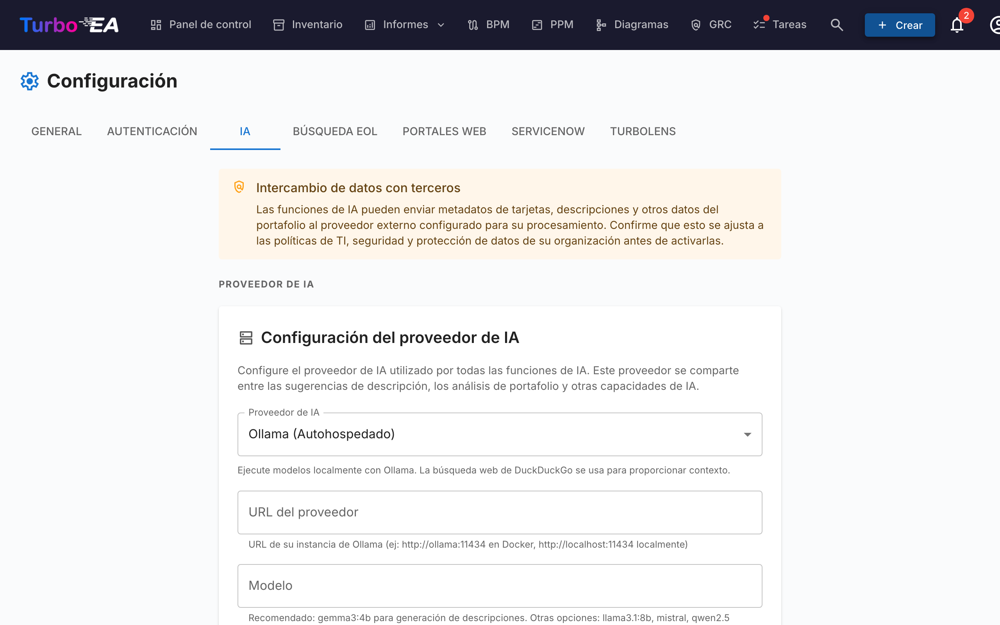
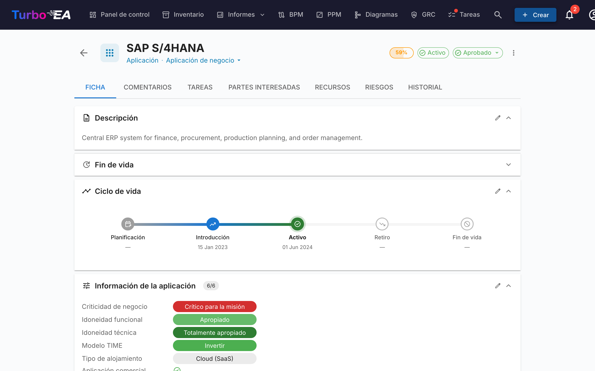

# Sugerencias de Descripción con IA



Turbo EA puede generar descripciones de fichas automáticamente usando una combinación de **búsqueda web** y un **Modelo de Lenguaje Grande (LLM)**. Cuando un usuario hace clic en el botón de sugerencia IA en una ficha, el sistema busca en la web información relevante sobre el componente, y luego utiliza un LLM para producir una descripción concisa y adaptada al tipo — con una puntuación de confianza y enlaces a las fuentes.

Esta funcionalidad es **opcional** y está **completamente controlada por el administrador**. Puede ejecutarse completamente en su propia infraestructura usando una instancia local de Ollama, o conectarse a proveedores comerciales de LLM.

---

## Cómo Funciona

El proceso de sugerencia de IA tiene dos pasos:

1. **Búsqueda web** — Turbo EA consulta un proveedor de búsqueda (DuckDuckGo, Google Custom Search o SearXNG) usando el nombre y tipo de la ficha como contexto. Por ejemplo, una ficha de tipo Aplicación llamada «SAP S/4HANA» genera una búsqueda de «SAP S/4HANA software application».

2. **Extracción con LLM** — Los resultados de búsqueda se envían al LLM configurado junto con un prompt del sistema adaptado al tipo. El modelo produce una descripción, una puntuación de confianza (0–100%) y lista las fuentes utilizadas.

El resultado se muestra al usuario con:

- Una **descripción editable** que puede revisar y modificar antes de aplicar
- Una **insignia de confianza** que muestra la fiabilidad de la sugerencia
- **Enlaces a las fuentes** para que el usuario pueda verificar la información

---

## Proveedores de LLM Soportados

| Proveedor | Tipo | Configuración |
|-----------|------|---------------|
| **Ollama** | Autoalojado | URL del proveedor (ej., `http://ollama:11434`) + nombre del modelo |
| **OpenAI** | Comercial | Clave API + nombre del modelo (ej., `gpt-4o`) |
| **Google Gemini** | Comercial | Clave API + nombre del modelo |
| **Azure OpenAI** | Comercial | Clave API + URL de despliegue |
| **OpenRouter** | Comercial | Clave API + nombre del modelo |
| **Anthropic Claude** | Comercial | Clave API + nombre del modelo |

Los proveedores comerciales requieren una clave API, que se almacena cifrada en la base de datos mediante cifrado simétrico Fernet.

---

## Proveedores de Búsqueda

| Proveedor | Configuración | Notas |
|-----------|---------------|-------|
| **DuckDuckGo** | No requiere configuración | Por defecto. Sin dependencias. No necesita clave API. |
| **Google Custom Search** | Requiere clave API e ID de Motor de Búsqueda Personalizado | Ingrese como `API_KEY:CX` en el campo de URL de búsqueda. Resultados de mayor calidad. |
| **SearXNG** | Requiere URL de una instancia autoalojada de SearXNG | Motor de meta-búsqueda enfocado en privacidad. API JSON. |

---

## Configuración

### Opción A: Ollama Incluido (Docker Compose)

La forma más sencilla de empezar. Turbo EA incluye un contenedor opcional de Ollama en su configuración de Docker Compose.

**1. Inicie con el perfil de IA:**

```bash
docker compose --profile ai up --build -d
```

**2. Habilite la auto-configuración** agregando estas variables a su `.env`:

```dotenv
AI_AUTO_CONFIGURE=true
AI_MODEL=gemma3:4b          # o mistral, llama3:8b, etc.
```

Al iniciar, el backend:

- Detectará el contenedor de Ollama
- Guardará la configuración de conexión en la base de datos
- Descargará el modelo configurado si no está presente (se ejecuta en segundo plano, puede tardar unos minutos)

**3. Verifique** en la interfaz de administración: vaya a **Configuración > Sugerencias IA** y confirme que el estado muestra conectado.

### Opción B: Instancia Externa de Ollama

Si ya ejecuta Ollama en un servidor separado:

1. Vaya a **Configuración > Sugerencias IA** en la interfaz de administración.
2. Seleccione **Ollama** como tipo de proveedor.
3. Ingrese la **URL del proveedor** (ej., `http://su-servidor:11434`).
4. Haga clic en **Probar Conexión** — el sistema mostrará los modelos disponibles.
5. Seleccione un **modelo** del menú desplegable.
6. Haga clic en **Guardar**.

### Opción C: Proveedor Comercial de LLM

1. Vaya a **Configuración > Sugerencias IA** en la interfaz de administración.
2. Seleccione su proveedor (OpenAI, Google Gemini, Azure OpenAI, OpenRouter o Anthropic Claude).
3. Ingrese su **clave API** — se cifrará antes de almacenarse.
4. Ingrese el **nombre del modelo** (ej., `gpt-4o`, `gemini-pro`, `claude-sonnet-4-20250514`).
5. Haga clic en **Probar Conexión** para verificar.
6. Haga clic en **Guardar**.

---

## Opciones de Configuración

Una vez conectado, puede ajustar la funcionalidad en **Configuración > Sugerencias IA**:

### Habilitar/Deshabilitar por Tipo de Ficha

No todos los tipos de ficha se benefician por igual de las sugerencias de IA. Puede habilitar o deshabilitar la IA para cada tipo individualmente. Por ejemplo, puede habilitarla para fichas de Aplicación y Componente TI, pero deshabilitarla para fichas de Organización donde las descripciones son específicas de la empresa.

### Proveedor de Búsqueda

Elija qué proveedor de búsqueda web usar para recopilar contexto antes de enviar al LLM. DuckDuckGo funciona sin configuración. Google Custom Search y SearXNG requieren configuración adicional (consulte la tabla de Proveedores de Búsqueda arriba).

### Selección de Modelo

Para Ollama, la interfaz de administración muestra todos los modelos descargados en la instancia. Para proveedores comerciales, ingrese el identificador del modelo directamente.

---

## Uso de las Sugerencias de IA



Una vez configurado por un administrador, los usuarios con el permiso `ai.suggest` (otorgado a los roles Admin, BPM Admin y Miembro por defecto) verán un botón con un destello en las páginas de detalle de fichas y en el diálogo de creación de fichas.

### En una Ficha Existente

1. Abra la vista de detalle de cualquier ficha.
2. Haga clic en el **botón de destello** (visible junto a la sección de descripción cuando la IA está habilitada para ese tipo de ficha).
3. Espere unos segundos mientras se realiza la búsqueda web y el procesamiento del LLM.
4. Revise la sugerencia: lea la descripción generada, verifique la puntuación de confianza y consulte los enlaces a las fuentes.
5. **Edite** el texto si es necesario — la sugerencia es completamente editable antes de aplicarla.
6. Haga clic en **Aplicar** para establecer la descripción, o **Descartar** para descartarla.

### Al Crear una Nueva Ficha

1. Abra el diálogo de **Crear Ficha**.
2. Después de ingresar el nombre de la ficha, el botón de sugerencia IA estará disponible.
3. Haga clic para pre-llenar la descripción antes de guardar.

!!! note
    Las sugerencias de IA solo generan el campo de **descripción**. No completan otros atributos como ciclo de vida, costo o campos personalizados.

---

## Permisos

| Rol | Acceso |
|-----|--------|
| **Admin** | Acceso completo: configurar ajustes de IA y usar sugerencias |
| **BPM Admin** | Usar sugerencias |
| **Miembro** | Usar sugerencias |
| **Visor** | Sin acceso a sugerencias de IA |

La clave de permiso es `ai.suggest`. Los roles personalizados pueden recibir este permiso a través de la página de administración de Roles.

---

## Privacidad y Seguridad

- **Opción autoalojada**: Al usar Ollama, todo el procesamiento de IA ocurre en su propia infraestructura. Ningún dato sale de su red.
- **Claves API cifradas**: Las claves API de proveedores comerciales se cifran con cifrado simétrico Fernet antes de almacenarse en la base de datos.
- **Solo contexto de búsqueda**: El LLM recibe resultados de búsqueda web y el nombre/tipo de la ficha — no sus datos internos, relaciones u otros metadatos sensibles.
- **Control del usuario**: Cada sugerencia debe ser revisada y aplicada explícitamente por un usuario. La IA nunca modifica fichas automáticamente.

---

## Solución de Problemas

| Problema | Solución |
|----------|----------|
| El botón de sugerencia IA no es visible | Verifique que la IA esté habilitada para el tipo de ficha en Configuración > Sugerencias IA, y que el usuario tenga el permiso `ai.suggest`. |
| Estado «IA no configurada» | Vaya a Configuración > Sugerencias IA y complete la configuración del proveedor. Haga clic en Probar Conexión para verificar. |
| El modelo no aparece en el menú desplegable | Para Ollama: asegúrese de que el modelo esté descargado (`ollama pull nombre-modelo`). Para proveedores comerciales: ingrese el nombre del modelo manualmente. |
| Sugerencias lentas | La velocidad de inferencia del LLM depende del hardware (para Ollama) o la latencia de red (para proveedores comerciales). Modelos más pequeños como `gemma3:4b` son más rápidos que los grandes. |
| Puntuaciones de confianza bajas | El LLM puede no encontrar suficiente información relevante mediante búsqueda web. Intente un nombre de ficha más específico, o considere usar Google Custom Search para mejores resultados. |
| La prueba de conexión falla | Verifique que la URL del proveedor sea accesible desde el contenedor del backend. Para configuraciones Docker, asegúrese de que ambos contenedores estén en la misma red. |

---

## Variables de Entorno

Estas variables de entorno proporcionan la configuración inicial de IA. Una vez guardados a través de la interfaz de administración, los ajustes de la base de datos tienen prioridad.

| Variable | Por Defecto | Descripción |
|----------|-------------|-------------|
| `AI_PROVIDER_URL` | *(vacío)* | URL del proveedor de LLM compatible con Ollama |
| `AI_MODEL` | *(vacío)* | Nombre del modelo LLM (ej., `gemma3:4b`, `mistral`) |
| `AI_SEARCH_PROVIDER` | `duckduckgo` | Proveedor de búsqueda web: `duckduckgo`, `google` o `searxng` |
| `AI_SEARCH_URL` | *(vacío)* | URL del proveedor de búsqueda o credenciales API |
| `AI_AUTO_CONFIGURE` | `false` | Auto-habilitar IA al iniciar si el proveedor es accesible |
