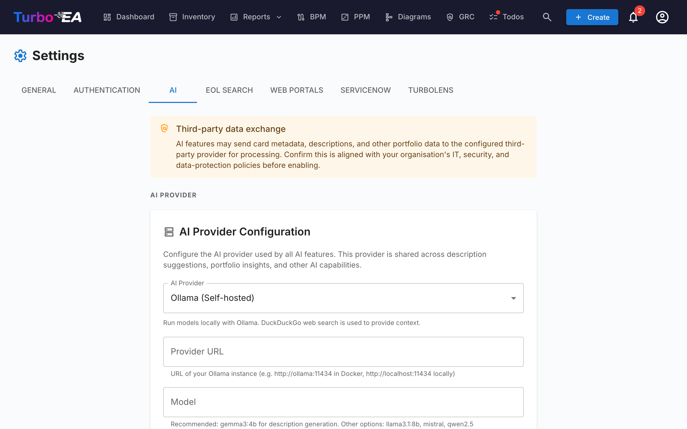

# Sugestões de Descrição com IA



O Turbo EA pode gerar descrições de cards automaticamente usando uma combinação de **busca na web** e um **Large Language Model (LLM)**. Quando um usuário clica no botão de sugestão de IA em um card, o sistema busca na web informações relevantes sobre o componente, então usa um LLM para produzir uma descrição concisa e contextualizada por tipo — completa com pontuação de confiança e links de fontes clicáveis.

Este recurso é **opcional** e **totalmente controlado pelo administrador**. Ele pode rodar inteiramente na sua própria infraestrutura usando uma instância local do Ollama, ou conectar-se a provedores comerciais de LLM.

---

## Como Funciona

O pipeline de sugestão de IA tem duas etapas:

1. **Busca na web** — O Turbo EA consulta um provedor de busca (DuckDuckGo, Google Custom Search ou SearXNG) usando o nome e tipo do card como contexto. Por exemplo, um card de Aplicação chamado "SAP S/4HANA" gera uma busca por "SAP S/4HANA software application".

2. **Extração por LLM** — Os resultados da busca são enviados ao LLM configurado junto com um prompt de sistema contextualizado por tipo. O modelo produz uma descrição, uma pontuação de confiança (0-100%) e lista as fontes utilizadas.

O resultado é exibido ao usuário com:

- Uma **descrição editável** que pode ser revisada e modificada antes de aplicar
- Um **badge de confiança** mostrando quão confiável a sugestão é
- **Links de fontes** para que o usuário possa verificar as informações

---

## Provedores de LLM Suportados

| Provedor | Tipo | Configuração |
|----------|------|--------------|
| **Ollama** | Auto-hospedado | URL do provedor (ex.: `http://ollama:11434`) + nome do modelo |
| **OpenAI** | Comercial | Chave API + nome do modelo (ex.: `gpt-4o`) |
| **Google Gemini** | Comercial | Chave API + nome do modelo |
| **Azure OpenAI** | Comercial | Chave API + URL de implantação |
| **OpenRouter** | Comercial | Chave API + nome do modelo |
| **Anthropic Claude** | Comercial | Chave API + nome do modelo |

Provedores comerciais requerem uma chave API, que é armazenada criptografada no banco de dados usando criptografia simétrica Fernet.

---

## Provedores de Busca

| Provedor | Configuração | Notas |
|----------|--------------|-------|
| **DuckDuckGo** | Nenhuma configuração necessária | Padrão. Scraping HTML sem dependências. Nenhuma chave API necessária. |
| **Google Custom Search** | Requer chave API e ID do Custom Search Engine | Insira como `API_KEY:CX` no campo de URL de busca. Resultados de maior qualidade. |
| **SearXNG** | Requer uma URL de instância SearXNG auto-hospedada | Motor de meta-busca focado em privacidade. API JSON. |

---

## Configuração

### Opção A: Ollama Incluído (Docker Compose)

A maneira mais simples de começar. O Turbo EA inclui um contêiner Ollama opcional na sua configuração Docker Compose.

**1. Inicie com o perfil de IA:**

```bash
docker compose --profile ai up --build -d
```

**2. Habilite a auto-configuração** adicionando estas variáveis ao seu `.env`:

```dotenv
AI_AUTO_CONFIGURE=true
AI_MODEL=gemma3:4b          # ou mistral, llama3:8b, etc.
```

Na inicialização, o backend irá:

- Detectar o contêiner Ollama
- Salvar as configurações de conexão no banco de dados
- Baixar o modelo configurado se ainda não estiver baixado (executa em segundo plano, pode levar alguns minutos)

**3. Verifique** na interface de admin: vá para **Configurações > Sugestões de IA** e confirme que o status mostra como conectado.

### Opção B: Instância Ollama Externa

Se você já executa Ollama em um servidor separado:

1. Vá para **Configurações > Sugestões de IA** na interface de admin.
2. Selecione **Ollama** como o tipo de provedor.
3. Insira a **URL do Provedor** (ex.: `http://your-server:11434`).
4. Clique em **Testar Conexão** — o sistema mostrará os modelos disponíveis.
5. Selecione um **modelo** no dropdown.
6. Clique em **Salvar**.

### Opção C: Provedor Comercial de LLM

1. Vá para **Configurações > Sugestões de IA** na interface de admin.
2. Selecione seu provedor (OpenAI, Google Gemini, Azure OpenAI, OpenRouter ou Anthropic Claude).
3. Insira sua **chave API** — ela será criptografada antes do armazenamento.
4. Insira o **nome do modelo** (ex.: `gpt-4o`, `gemini-pro`, `claude-sonnet-4-20250514`).
5. Clique em **Testar Conexão** para verificar.
6. Clique em **Salvar**.

---

## Opções de Configuração

Uma vez conectado, você pode ajustar o recurso em **Configurações > Sugestões de IA**:

### Habilitar/Desabilitar por Tipo de Card

Nem todo tipo de card se beneficia igualmente de sugestões de IA. Você pode habilitar ou desabilitar a IA para cada tipo individualmente. Por exemplo, você pode habilitá-la para cards de Aplicação e Componente de TI, mas desabilitá-la para cards de Organização onde as descrições são específicas da empresa.

### Provedor de Busca

Escolha qual provedor de busca web usar para coletar contexto antes de enviar ao LLM. O DuckDuckGo funciona sem nenhuma configuração. Google Custom Search e SearXNG requerem configuração adicional (veja a tabela de Provedores de Busca acima).

### Seleção de Modelo

Para Ollama, a interface de admin mostra todos os modelos atualmente baixados na instância Ollama. Para provedores comerciais, insira o identificador do modelo diretamente.

---

## Usando Sugestões de IA


Uma vez configurado por um admin, usuários com a permissão `ai.suggest` (concedida aos papéis Admin, BPM Admin e Membro por padrão) verão um botão de brilho nas páginas de detalhe de cards e no diálogo de criação de card.

### Em um Card Existente

1. Abra a visualização de detalhe de qualquer card.
2. Clique no **botão de brilho** (visível ao lado da seção de descrição quando a IA está habilitada para aquele tipo de card).
3. Aguarde alguns segundos para o processamento da busca web e do LLM.
4. Revise a sugestão: leia a descrição gerada, verifique a pontuação de confiança e valide os links de fontes.
5. **Edite** o texto se necessário — a sugestão é totalmente editável antes de aplicar.
6. Clique em **Aplicar** para definir a descrição, ou **Descartar** para ignorá-la.

### Ao Criar um Novo Card

1. Abra o diálogo **Criar Card**.
2. Após inserir o nome do card, o botão de sugestão de IA fica disponível.
3. Clique nele para pré-preencher a descrição antes de salvar.

!!! note
    Sugestões de IA geram apenas o campo **descrição**. Elas não preenchem outros atributos como ciclo de vida, custo ou campos personalizados.

---

## Permissões

| Papel | Acesso |
|-------|--------|
| **Admin** | Acesso total: gerenciar configurações de IA e usar sugestões |
| **BPM Admin** | Usar sugestões |
| **Membro** | Usar sugestões |
| **Visualizador** | Sem acesso a sugestões de IA |

A chave de permissão é `ai.suggest`. Papéis personalizados podem receber esta permissão através da página de administração de Papéis.

---

## Privacidade e Segurança

- **Opção auto-hospedada**: Ao usar Ollama, todo o processamento de IA acontece na sua própria infraestrutura. Nenhum dado sai da sua rede.
- **Chaves API criptografadas**: Chaves API de provedores comerciais são criptografadas com criptografia simétrica Fernet antes de serem armazenadas no banco de dados.
- **Contexto apenas de busca**: O LLM recebe resultados de busca web e o nome/tipo do card — não seus dados internos de cards, relacionamentos ou outros metadados sensíveis.
- **Controle do usuário**: Toda sugestão deve ser revisada e explicitamente aplicada por um usuário. A IA nunca modifica cards automaticamente.

---

## Solução de Problemas

| Problema | Solução |
|----------|---------|
| Botão de sugestão de IA não visível | Verifique se a IA está habilitada para o tipo de card em Configurações > Sugestões de IA, e se o usuário tem a permissão `ai.suggest`. |
| Status "IA não configurada" | Vá para Configurações > Sugestões de IA e complete a configuração do provedor. Clique em Testar Conexão para verificar. |
| Modelo não aparece no dropdown | Para Ollama: certifique-se de que o modelo está baixado (`ollama pull model-name`). Para provedores comerciais: insira o nome do modelo manualmente. |
| Sugestões lentas | A velocidade de inferência do LLM depende do hardware (para Ollama) ou da latência de rede (para provedores comerciais). Modelos menores como `gemma3:4b` são mais rápidos que modelos maiores. |
| Pontuações de confiança baixas | O LLM pode não encontrar informações relevantes suficientes via busca web. Tente um nome de card mais específico, ou considere usar Google Custom Search para melhores resultados. |
| Teste de conexão falha | Verifique se a URL do provedor é acessível a partir do contêiner do backend. Para configurações Docker, certifique-se de que ambos os contêineres estão na mesma rede. |

---

## Variáveis de Ambiente

Estas variáveis de ambiente fornecem configuração inicial de IA. Uma vez salvas pela interface de admin, as configurações do banco de dados têm precedência.

| Variável | Padrão | Descrição |
|----------|--------|-----------|
| `AI_PROVIDER_URL` | *(vazio)* | URL do provedor de LLM compatível com Ollama |
| `AI_MODEL` | *(vazio)* | Nome do modelo LLM (ex.: `gemma3:4b`, `mistral`) |
| `AI_SEARCH_PROVIDER` | `duckduckgo` | Provedor de busca web: `duckduckgo`, `google` ou `searxng` |
| `AI_SEARCH_URL` | *(vazio)* | URL do provedor de busca ou credenciais de API |
| `AI_AUTO_CONFIGURE` | `false` | Auto-habilitar IA na inicialização se o provedor estiver acessível |
