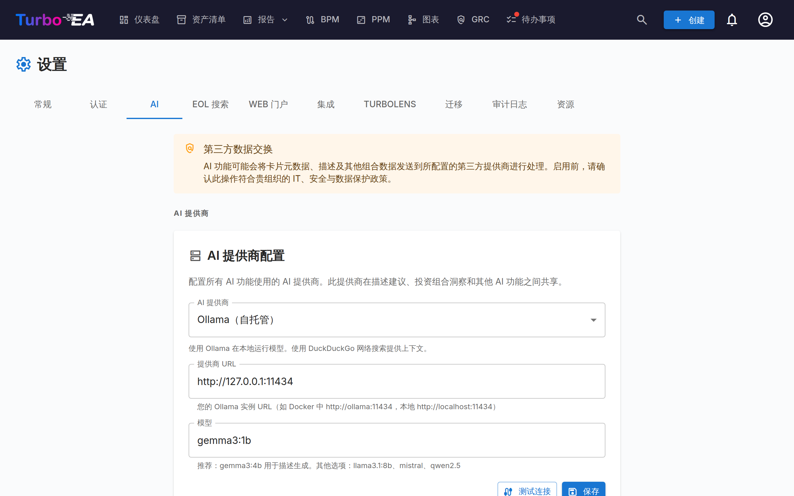
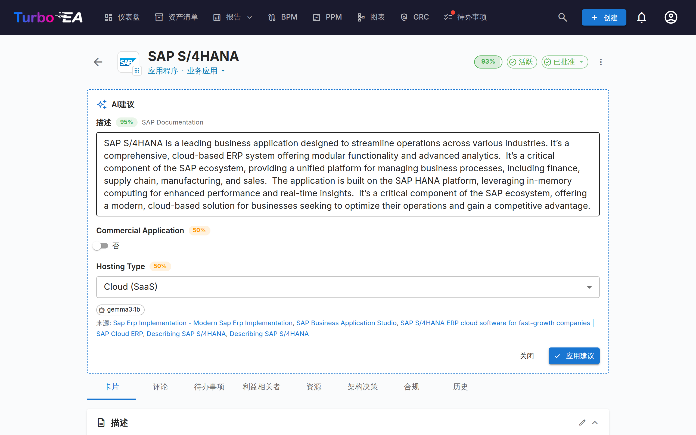

# AI 功能



Turbo EA 包含由 AI 驱动的功能，使用**大型语言模型（LLM）** 来协助用户。所有 AI 功能共享一个**AI 提供商配置** —— 一次设置，处处使用。

当前可用的 AI 功能：

- **描述建议** —— 使用网络搜索 + LLM 自动生成卡片描述
- **投资组合洞察** —— 按需生成应用投资组合的战略分析

这些功能是**可选的**且**完全由管理员控制**。它们可以使用本地 Ollama 实例完全在您自己的基础设施上运行，也可以连接到商业 LLM 提供商。

---

## 工作原理

AI 建议流程有两个步骤：

1. **网络搜索** —— Turbo EA 使用卡片的名称和类型作为上下文查询搜索提供商（DuckDuckGo、Google Custom Search 或 SearXNG）。例如，名为「SAP S/4HANA」的应用程序卡片会生成「SAP S/4HANA 软件应用程序」的搜索。

2. **LLM 提取** —— 搜索结果连同类型感知的系统提示一起发送给配置的 LLM。模型生成描述、置信度评分（0-100%）并列出使用的来源。

结果以以下形式展示给用户：

- 一个**可编辑的描述**，可以在应用前查看和修改
- 一个**置信度徽章**，显示建议的可靠程度
- **来源链接**，以便用户验证信息

---

## 支持的 LLM 提供商

| 提供商 | 类型 | 配置 |
|--------|------|------|
| **Ollama** | 自托管 | 提供商 URL（例如 `http://ollama:11434`）+ 模型名称 |
| **OpenAI** | 商业 | API 密钥 + 模型名称（例如 `gpt-4o`） |
| **Google Gemini** | 商业 | API 密钥 + 模型名称 |
| **Azure 托管的 OpenAI** | 商业 | API 密钥 + Azure 资源端点 + 部署名称 + API 版本（默认 `2025-01-01`） |
| **OpenRouter** | 商业 | API 密钥 + 模型名称 |
| **Anthropic Claude** | 商业 | API 密钥 + 模型名称 |
| **Amazon Bedrock** | 您的 AWS 账户 | AWS 区域 + 模型 ID 或推理配置文件 ID；IAM 角色，或可选的访问密钥 |

商业提供商需要 API 密钥，该密钥使用 Fernet 对称加密存储在数据库中。Amazon Bedrock 是例外：默认使用容器的 IAM 角色进行身份验证，因此无需存储或轮换密钥。

---

## 搜索提供商

| 提供商 | 设置 | 说明 |
|--------|------|------|
| **DuckDuckGo** | 无需配置 | 默认。零依赖 HTML 抓取。无需 API 密钥。 |
| **Google Custom Search** | 需要 API 密钥和自定义搜索引擎 ID | 在搜索 URL 字段中以 `API_KEY:CX` 格式输入。结果质量更高。 |
| **SearXNG** | 需要自托管的 SearXNG 实例 URL | 注重隐私的元搜索引擎。JSON API。 |

---

## 设置

### 选项 A：捆绑 Ollama（Docker Compose）

最简单的入门方式。Turbo EA 在其 Docker Compose 配置中包含一个可选的 Ollama 容器。

**1. 使用 AI 配置文件启动：**

```bash
docker compose --profile ai up --build -d
```

**2. 启用自动配置**，在 `.env` 中添加以下变量：

```dotenv
AI_AUTO_CONFIGURE=true
AI_MODEL=gemma3:4b          # 或 mistral、llama3:8b 等
```

启动时，后端将：

- 检测 Ollama 容器
- 将连接设置保存到数据库
- 如果配置的模型尚未下载，则拉取该模型（在后台运行，可能需要几分钟）

**3. 验证**：在管理 UI 中，前往**设置 > AI 建议**确认状态显示为已连接。

### 选项 B：外部 Ollama 实例

如果您已在独立服务器上运行 Ollama：

1. 在管理 UI 中前往**设置 > AI 建议**。
2. 选择 **Ollama** 作为提供商类型。
3. 输入**提供商 URL**（例如 `http://your-server:11434`）。
4. 点击**测试连接** —— 系统将显示可用模型。
5. 从下拉菜单中选择一个**模型**。
6. 点击**保存**。

### 选项 C：商业 LLM 提供商

1. 在管理 UI 中前往**设置 > AI 建议**。
2. 选择您的提供商（OpenAI、Google Gemini、Azure OpenAI、OpenRouter 或 Anthropic Claude）。关于 Amazon Bedrock，请参见下面的选项 D。
3. 输入您的 **API 密钥** —— 存储前将被加密。
4. 输入**模型名称**（例如 `gpt-4o`、`gemini-pro`、`claude-sonnet-4-20250514`）。
5. 点击**测试连接**进行验证。
6. 点击**保存**。


### 选项 D：Amazon Bedrock

模型在您自己的 AWS 账户中运行，因此提示词绝不会离开账户边界，也无需管理第三方 API 密钥。

**1. 启用模型访问权限**：在 AWS Bedrock 控制台的 **Model access** 中，为您打算使用的区域启用。访问权限按模型授予；部分供应商会要求一次性填写用例说明。

**2. 授予权限。** Turbo EA 使用容器的 IAM 角色（ECS 任务角色、EKS 服务账户或 EC2 实例配置文件）。为其附加以下策略：

```json
{
  "Version": "2012-10-17",
  "Statement": [
    {
      "Effect": "Allow",
      "Action": [
        "bedrock:InvokeModel",
        "bedrock:InvokeModelWithResponseStream",
        "bedrock:ListFoundationModels",
        "bedrock:ListInferenceProfiles"
      ],
      "Resource": "*"
    }
  ]
}
```

**3. 配置 Turbo EA：**

1. 在管理 UI 中前往**设置 > AI**。
2. 选择 **Amazon Bedrock** 作为提供商。
3. 输入 **AWS 区域** —— 例如 `eu-central-1`。此字段填写区域，而非 URL。
4. 将 **API 密钥**字段留空以使用 IAM 角色。在 AWS 之外，请改为输入 `ACCESS_KEY_ID:SECRET_ACCESS_KEY`；它会像其他提供商密钥一样在存储前加密。
5. 点击**测试连接**。将列出该区域提供的所有模型和推理配置文件。
6. 从列表中选择**模型**并点击**保存**。

!!! warning "较新的模型需要推理配置文件 ID"
    较新的模型（包括 Claude Sonnet 4）无法通过其普通模型 ID 调用。Bedrock 会返回 `ValidationException`，提示不支持按需吞吐量。请改用区域**推理配置文件 ID**，它带有 `eu.`、`us.` 或 `apac.` 等地理前缀：`eu.anthropic.claude-sonnet-4-20250514-v1:0`。因此测试连接会优先列出配置文件 ID。
---

## 配置选项

连接后，您可以在**设置 > AI 建议**中微调此功能：

### 按卡片类型启用/禁用

并非每种卡片类型都同样受益于 AI 建议。您可以为每种类型单独启用或禁用 AI。例如，您可以为应用程序和 IT 组件卡片启用它，但对组织卡片禁用，因为组织描述是公司特定的。

取消勾选**所有**卡片类型并不等于关闭该功能 —— 它表示*不按类型限制*，因此建议按钮会出现在所有卡片类型上。

### 搜索提供商

选择在发送给 LLM 之前使用哪个网络搜索提供商来收集上下文。DuckDuckGo 无需配置即可使用。Google Custom Search 和 SearXNG 需要额外设置（参见上方的搜索提供商表格）。

### 模型选择

对于 Ollama，管理 UI 显示 Ollama 实例上当前已下载的所有模型。对于商业提供商，直接输入模型标识符。

---

## 使用 AI 建议



管理员配置后，具有 `ai.suggest` 权限的用户（默认授予管理员、BPM 管理员和成员角色）将在卡片详情页面和创建卡片对话框中看到星光按钮。

### 在现有卡片上

1. 打开任何卡片的详情视图。
2. 点击**星光按钮**（当该卡片类型启用 AI 时，在描述分区旁边可见）。
3. 等待几秒钟完成网络搜索和 LLM 处理。
4. 查看建议：阅读生成的描述，检查置信度评分，验证来源链接。
5. 如需要可**编辑**文本 —— 建议在应用前完全可编辑。
6. 点击**应用**设置描述，或点击**取消**放弃。

### 创建新卡片时

1. 打开**创建卡片**对话框。
2. 输入卡片名称后，AI 建议按钮变为可用。
3. 点击它在保存前预填描述。

### 应用程序特定建议

对于**应用程序**卡片，当 AI 在网络搜索结果中找到证据时，还可以建议额外的字段：

- **商业应用程序** —— 如果找到定价、许可信息或销售联系页面，则会启用
- **托管类型** —— 根据产品的部署模型建议为 On-Premise、Cloud (SaaS)、Cloud (PaaS)、Cloud (IaaS) 或 Hybrid

这些字段仅在 AI 找到明确证据时才会被建议 —— 不会进行推测。用户可以在应用之前查看和调整这些值。

!!! note
    除了应用程序特定字段外，AI 建议主要生成**描述**字段。其他卡片类型的自定义字段尚未涵盖。

---

## 投资组合洞察

启用后，应用投资组合报告会显示一个 **AI 洞察** 按钮。点击该按钮会将当前投资组合视图的摘要（分组、属性分布和生命周期数据）发送给配置的 LLM，后者会返回 3-5 条可操作的洞察。

洞察关注以下方面：

- **集中风险** — 某个组或状态中的应用过多
- **现代化机会** — 基于生命周期和托管数据
- **投资组合平衡** — 子类型、组和属性的多样性
- **生命周期问题** — 即将到达生命周期终点的应用
- **成本或复杂性驱动因素** — 基于属性分布

### 启用投资组合洞察

1. 前往**设置 > AI > 投资组合洞察**。
2. 开启**投资组合洞察**。
3. 点击**保存**。

---

## 权限

| 角色 | 访问权限 |
|------|----------|
| **管理员** | 完全访问：配置 AI 设置、使用建议和投资组合洞察 |
| **BPM 管理员** | 使用建议和投资组合洞察 |
| **成员** | 使用建议和投资组合洞察 |
| **查看者** | 无权访问 AI 功能 |

权限键为 `ai.suggest` 和 `ai.portfolio_insights`。自定义角色可以通过角色管理页面获得这些权限。

---

## 隐私和安全

- **自托管选项**：使用 Ollama 时，所有 AI 处理都在您自己的基础设施上进行。数据不会离开您的网络。
- **加密 API 密钥**：商业提供商的 API 密钥在存储到数据库之前使用 Fernet 对称加密进行加密。
- **仅搜索上下文**：LLM 接收网络搜索结果和卡片的名称/类型 —— 不包括您的内部卡片数据、关系或其他敏感元数据。
- **用户控制**：每个建议都必须由用户审查并明确应用。AI 永远不会自动修改卡片。
- **您自己的 AWS 账户**：使用 Amazon Bedrock 时，推理在您的 AWS 账户内运行。提示词保留在账户边界内，并受您自己的服务控制策略管辖。

---

## 故障排除

| 问题 | 解决方案 |
|------|----------|
| AI 建议按钮不可见 | 检查是否在设置 > AI 建议中为该卡片类型启用了 AI，以及用户是否拥有 `ai.suggest` 权限。 |
| 「AI 未配置」状态 | 前往设置 > AI 建议完成提供商设置。点击测试连接进行验证。 |
| 模型未出现在下拉菜单中 | 对于 Ollama：确保模型已下载（`ollama pull model-name`）。对于商业提供商：手动输入模型名称。 |
| 建议缓慢 | LLM 推理速度取决于硬件（Ollama）或网络延迟（商业提供商）。较小的模型如 `gemma3:4b` 比较大的模型更快。 |
| 置信度评分低 | LLM 可能无法通过网络搜索找到足够的相关信息。尝试使用更具体的卡片名称，或考虑使用 Google Custom Search 获取更好的结果。 |
| 连接测试失败 | 验证提供商 URL 是否可从后端容器访问。对于 Docker 设置，确保两个容器在同一网络上。 |
| Bedrock 返回「AccessDeniedException」 | 有两种可能原因：IAM 角色缺少 `bedrock:InvokeModel` 权限，或未在 Bedrock 控制台中为该模型启用访问权限。请检查这两项。 |
| Bedrock 提示不支持按需吞吐量 | 该模型只能通过区域推理配置文件访问。运行测试连接，并选择前缀为 `eu.`、`us.` 或 `apac.` 的 ID。 |

---

## 环境变量

这些环境变量提供初始 AI 配置。通过管理 UI 保存后，数据库设置优先。

| 变量 | 默认值 | 描述 |
|------|--------|------|
| `AI_PROVIDER_URL` | *（空）* | 兼容 Ollama 的 LLM 提供商 URL |
| `AI_MODEL` | *（空）* | LLM 模型名称（例如 `gemma3:4b`、`mistral`） |
| `AI_SEARCH_PROVIDER` | `duckduckgo` | 网络搜索提供商：`duckduckgo`、`google` 或 `searxng` |
| `AI_SEARCH_URL` | *（空）* | 搜索提供商 URL 或 API 凭据 |
| `AI_AUTO_CONFIGURE` | `false` | 启动时如果提供商可达则自动启用 AI |
