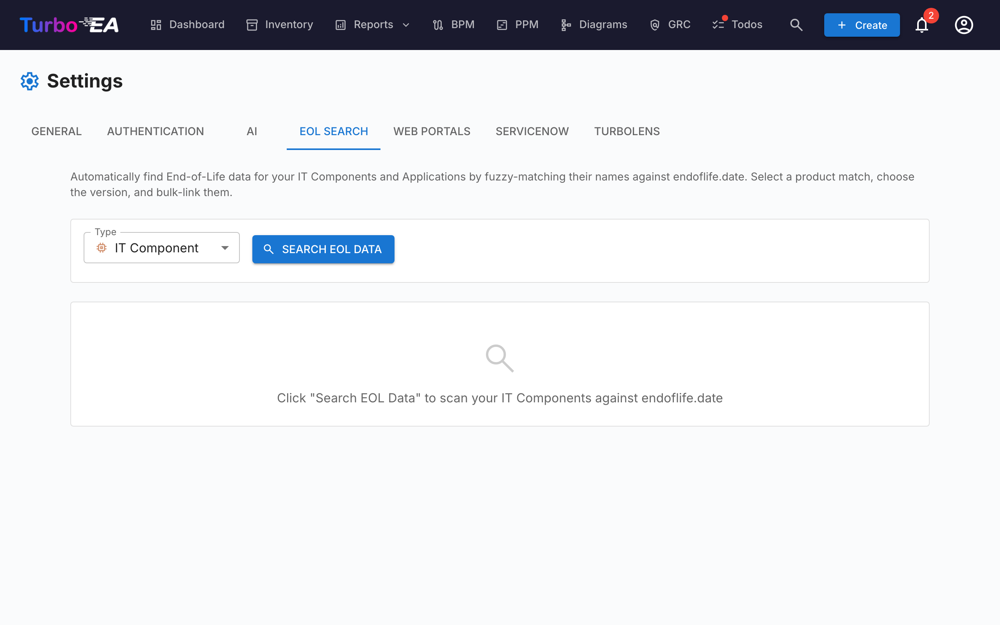

# End-of-Life (EOL)-administration

Administrationssiden **EOL** (**Admin > Indstillinger > EOL**) hjælper dig med at spore teknologi-produktlivscyklusser ved at tilknytte dine kort til den offentlige [endoflife.date](https://endoflife.date/)-database.

## Hvorfor spore EOL?

At vide, hvornår teknologiprodukter når udløb eller end-of-support, er kritisk for:

- **Risikohåndtering** — Ikke-understøttet software er et sikkerhedsansvar
- **Budgetplanlægning** — Planlæg migreringer og opgraderinger, før support slutter
- **Compliance** — Mange reguleringer kræver understøttet software

## Massesøgning

Massesøgningsfunktionen scanner dine **Application**- og **IT Component**-kort og finder automatisk matchende produkter i endoflife.date-databasen.

### Kørsel af en massesøgning

1. Naviger til **Admin > Indstillinger > EOL**
2. Vælg den korttype, der skal scannes (Application eller IT Component)
3. Klik på **Søg**
4. Systemet udfører **fuzzy matching** mod endoflife.date-produktkataloget

### Gennemgang af resultater

For hvert kort returnerer søgningen:

- **Match-score** (0-100%) — Hvor tæt kortnavnet matcher et kendt produkt
- **Produktnavn** — Det matchede endoflife.date-produkt
- **Tilgængelige versioner/cykler** — Produktets udgivelsesversioner med deres supportdatoer

### Filtrering af resultater

Brug filterkontrollerne til at fokusere på:

- **Alle elementer** — Hvert kort, der blev scannet
- **Kun ikke-tilknyttede** — Kort, der endnu ikke er tilknyttet et EOL-produkt
- **Allerede tilknyttede** — Kort, der allerede har et EOL-link

En statistikoversigt viser: total scannede kort, allerede tilknyttede, ikke-tilknyttede og fundne matches.

### Tilknytning af kort til produkter

1. Gennemgå det foreslåede match for hvert kort
2. Vælg den korrekte **produktversion/cyklus** fra dropdown
3. Klik på **Tilknyt** for at gemme associationen

Når det er tilknyttet, viser kortets detaljeside en **EOL-sektion** med:

- **Produktnavn og version**
- **Supportstatus** — Farvekodet: Supporteret (grøn), Nærmer sig EOL (orange), End of Life (rød)
- **Nøgledatoer** — Udgivelsesdato, aktiv supportafslutning, sikkerhedssupportafslutning, EOL-dato

## EOL-rapport

Tilknyttede EOL-data fødes ind i [EOL-rapporten](../guide/reports.md), som leverer en dashboard-visning af dit teknologilandskabs supportstatus på tværs af alle tilknyttede kort.
