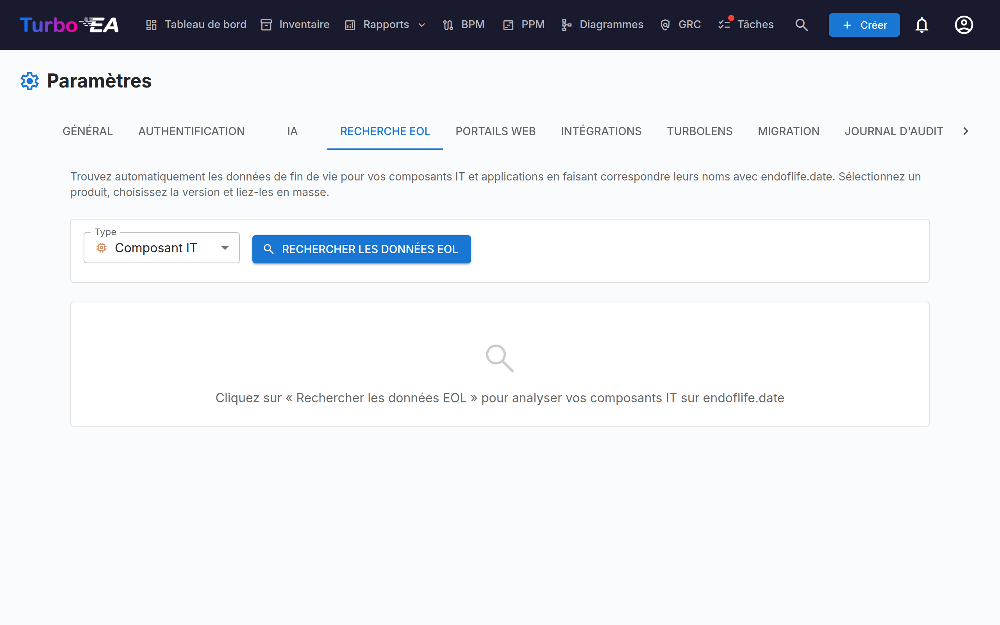

# Gestion de la fin de vie (EOL)

La page d'administration **EOL** (**Admin > Paramètres > EOL**) vous aide à suivre les cycles de vie des produits technologiques en liant vos fiches à la base de données publique [endoflife.date](https://endoflife.date/)

## Pourquoi suivre les EOL ?

Savoir quand les produits technologiques atteignent la fin de vie ou la fin de support est essentiel pour :

- **Gestion des risques** -- Les logiciels non supportés représentent un risque de sécurité
- **Planification budgétaire** -- Planifier les migrations et les mises à niveau avant la fin du support
- **Conformité** -- De nombreuses réglementations exigent des logiciels supportés

## Recherche en masse

La fonctionnalité de recherche en masse analyse vos fiches **Application** et **Composant IT** et trouve automatiquement les produits correspondants dans la base de données endoflife.date.

### Lancer une recherche en masse

1. Naviguez vers **Admin > Paramètres > EOL**
2. Sélectionnez le type de fiche à analyser (Application ou Composant IT)
3. Cliquez sur **Rechercher**
4. Le système effectue une **correspondance approximative** avec le catalogue de produits endoflife.date

### Examen des résultats

Pour chaque fiche, la recherche retourne :

- **Score de correspondance** (0-100%) -- À quel point le nom de la fiche correspond à un produit connu
- **Nom du produit** -- Le produit endoflife.date correspondant
- **Versions/cycles disponibles** -- Les versions du produit avec leurs dates de support

### Filtrage des résultats

Utilisez les contrôles de filtre pour vous concentrer sur :

- **Tous les éléments** -- Chaque fiche analysée
- **Non liés uniquement** -- Fiches pas encore liées à un produit EOL
- **Déjà liés** -- Fiches qui ont déjà un lien EOL

Un résumé statistique affiche : nombre total de fiches analysées, déjà liées, non liées et correspondances trouvées.

### Lier les fiches aux produits

1. Examinez la correspondance suggérée pour chaque fiche
2. Sélectionnez la bonne **version/cycle du produit** dans la liste déroulante
3. Cliquez sur **Lier** pour sauvegarder l'association

Une fois liée, la page de détail de la fiche affiche une **section EOL** avec :

- **Nom du produit et version**
- **Statut de support** -- Code couleur : Supporté (vert), Approchant la fin de vie (orange), Fin de vie (rouge)
- **Dates clés** -- Date de sortie, fin du support actif, fin du support sécurité, date de fin de vie

## Rapport EOL

Les données EOL liées alimentent le [Rapport EOL](../guide/reports.md), qui fournit une vue tableau de bord du statut de support de votre paysage technologique sur toutes les fiches liées.

## Trouver ce qui n'est pas encore lié

Deux endroits hors de cette page listent les fiches sans aucune information de fin de vie — ni lien ici, ni date de fin de vie propre :

- Le filtre **Fin de vie manquante** de l'[Inventaire](../guide/inventory.md), qui couvre applications et composants informatiques à la fois, ainsi que sa colonne **Fin de vie**.
- L'indicateur **Aucune donnée de fin de vie** du [Rapport EOL](../guide/reports.md) et la tuile **Fin de vie manquante** du rapport Qualité des données, qui mène au même filtre d'inventaire.
