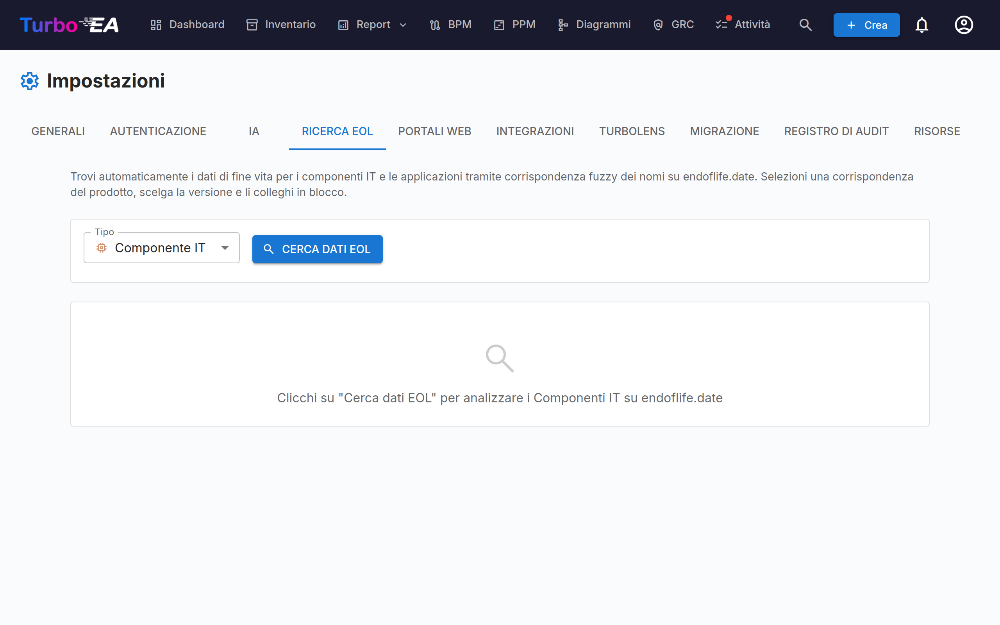

# Gestione End-of-Life (EOL)

La pagina di amministrazione **EOL** (**Admin > Impostazioni > EOL**) aiuta a tracciare il ciclo di vita dei prodotti tecnologici collegando le vostre card al database pubblico [endoflife.date](https://endoflife.date/)

## Perché tracciare l'EOL?

Sapere quando i prodotti tecnologici raggiungono l'end-of-life o la fine del supporto è fondamentale per:

- **Gestione del rischio** — Il software non supportato è una vulnerabilità di sicurezza
- **Pianificazione del budget** — Pianificate migrazioni e aggiornamenti prima che il supporto termini
- **Conformità** — Molte normative richiedono software supportato

## Ricerca massiva

La funzionalità di ricerca massiva analizza le vostre card **Application** e **IT Component** e trova automaticamente i prodotti corrispondenti nel database endoflife.date.

### Eseguire una ricerca massiva

1. Navigate su **Admin > Impostazioni > EOL**
2. Selezionate il tipo di card da analizzare (Application o IT Component)
3. Cliccate su **Cerca**
4. Il sistema esegue una **corrispondenza fuzzy** contro il catalogo prodotti endoflife.date

### Revisione dei risultati

Per ogni card, la ricerca restituisce:

- **Punteggio di corrispondenza** (0-100%) — Quanto il nome della card corrisponde a un prodotto noto
- **Nome del prodotto** — Il prodotto endoflife.date corrispondente
- **Versioni/cicli disponibili** — Le versioni di rilascio del prodotto con le rispettive date di supporto

### Filtro dei risultati

Utilizzate i controlli del filtro per concentrarvi su:

- **Tutti gli elementi** — Ogni card analizzata
- **Solo non collegati** — Card non ancora collegate a un prodotto EOL
- **Già collegati** — Card che hanno già un collegamento EOL

Un riepilogo delle statistiche mostra: card totali analizzate, già collegate, non collegate e corrispondenze trovate.

### Collegamento delle card ai prodotti

1. Revisionate la corrispondenza suggerita per ogni card
2. Selezionate la **versione/ciclo del prodotto** corretta dal menu a tendina
3. Cliccate su **Collega** per salvare l'associazione

Una volta collegata, la pagina di dettaglio della card mostra una **sezione EOL** con:

- **Nome del prodotto e versione**
- **Stato del supporto** — Con codice colore: Supportato (verde), In avvicinamento a EOL (arancione), End of Life (rosso)
- **Date chiave** — Data di rilascio, fine supporto attivo, fine supporto di sicurezza, data EOL

## Report EOL

I dati EOL collegati alimentano il [Report EOL](../guide/reports.md), che fornisce una vista dashboard dello stato di supporto del vostro panorama tecnologico su tutte le card collegate.

## Trovare ciò che non è ancora collegato

Due punti fuori da questa pagina elencano le schede senza alcuna informazione di fine vita — né un collegamento qui né una data di fine vita propria:

- Il filtro **Fine vita mancante** nell'[Inventario](../guide/inventory.md), che copre applicazioni e componenti IT insieme, e la sua colonna **Fine vita**.
- Il valore **Nessun dato di fine vita** nel [Report EOL](../guide/reports.md) e il riquadro **Fine vita mancante** nel report Qualità dei dati, che porta allo stesso filtro dell'inventario.
