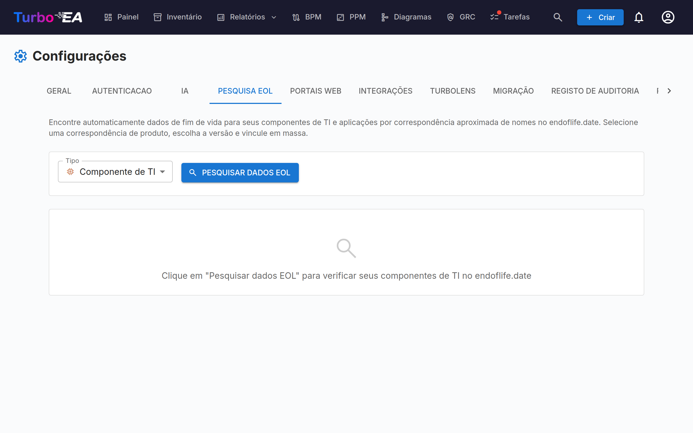

# Gestão de Fim de Vida (EOL)

A página de administração de **EOL** (**Admin > Configurações > EOL**) ajuda você a acompanhar os ciclos de vida de produtos tecnológicos vinculando seus cards ao banco de dados público [endoflife.date](https://endoflife.date/).

## Por que Rastrear EOL?

Saber quando produtos tecnológicos atingem o fim de vida ou fim de suporte é essencial para:

- **Gestão de risco** — Software sem suporte é uma vulnerabilidade de segurança
- **Planejamento orçamentário** — Planeje migrações e atualizações antes que o suporte termine
- **Conformidade** — Muitas regulamentações exigem software com suporte

## Busca em Massa

O recurso de busca em massa escaneia seus cards de **Aplicação** e **Componente de TI** e encontra automaticamente produtos correspondentes no banco de dados do endoflife.date.

### Executando uma Busca em Massa

1. Navegue até **Admin > Configurações > EOL**
2. Selecione o tipo de card a escanear (Aplicação ou Componente de TI)
3. Clique em **Buscar**
4. O sistema realiza **correspondência aproximada** contra o catálogo de produtos do endoflife.date

### Revisando Resultados

Para cada card, a busca retorna:

- **Pontuação de correspondência** (0-100%) — Quão próximo o nome do card corresponde a um produto conhecido
- **Nome do produto** — O produto correspondente no endoflife.date
- **Versões/ciclos disponíveis** — As versões de lançamento do produto com suas datas de suporte

### Filtrando Resultados

Use os controles de filtro para focar em:

- **Todos os itens** — Cada card que foi escaneado
- **Apenas não vinculados** — Cards ainda não vinculados a um produto EOL
- **Já vinculados** — Cards que já possuem um link EOL

Um resumo estatístico mostra: total de cards escaneados, já vinculados, não vinculados e correspondências encontradas.

### Vinculando Cards a Produtos

1. Revise a correspondência sugerida para cada card
2. Selecione a **versão/ciclo do produto** correto no dropdown
3. Clique em **Vincular** para salvar a associação

Uma vez vinculado, a página de detalhe do card mostra uma **seção EOL** com:

- **Nome do produto e versão**
- **Status de suporte** — Com código de cores: Suportado (verde), Aproximando-se do EOL (laranja), Fim de Vida (vermelho)
- **Datas importantes** — Data de lançamento, fim do suporte ativo, fim do suporte de segurança, data de EOL

## Relatório de EOL

Dados de EOL vinculados alimentam o [Relatório de EOL](../guide/reports.md), que fornece uma visualização em painel do status de suporte do seu cenário tecnológico em todos os cards vinculados.

## Encontrar o que ainda não está ligado

Dois locais fora desta página listam os cartões sem qualquer informação de fim de vida — nem uma ligação aqui nem uma data de fim de vida própria:

- O filtro e a coluna **Fim de vida** no [Inventário](../guide/inventory.md) — escolha um tipo de cartão e depois a opção **(vazio)**.
- O valor **Sem dados de fim de vida** no [Relatório de EOL](../guide/reports.md) e o gráfico **Cobertura de fim de vida** no final do relatório de Qualidade dos dados.
