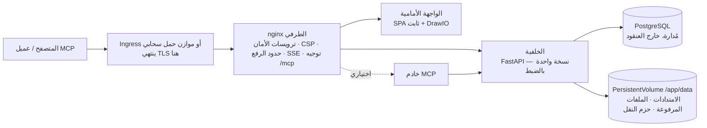

# Kubernetes والسحابة

يأتي Turbo EA مع مخطط Helm، لذا فإن تشغيله على Kubernetes — Amazon EKS أو Azure AKS أو Google GKE أو أي عنقود متوافق — هو أمر واحد فقط مع خادم PostgreSQL توفّره أنت. تشرح هذه الصفحة المخطط نفسه أولًا ثم تستعرض كلًا من السحابات الثلاث الكبرى. إذا كنت تشغّل مضيفًا واحدًا، يبقى [إعداد Docker Compose](../getting-started/setup.md) هو المسار الأبسط؛ وكل ما تذكره صفحة [العمليات والترقيات](operations.md) عن الترقيات والنسخ الاحتياطي وحفظ `SECRET_KEY` ينطبق هنا دون تغيير.

## ما الذي ينشره المخطط



- **nginx الطرفي هو الـ Service الوحيد الذي يستهدفه الـ Ingress.** فهو يملك كل ترويسات الأمان، وسياسة أمان المحتوى (CSP)، وحد 512 ميغابايت لرفع حزم نقل مساحة العمل، وإعدادات تدفق الأحداث طويل الأمد، وتوجيه `/mcp` و`/.well-known/oauth-*`. وجّه **المضيف بأكمله** (`/`) إليه ولا تضف أبدًا إعادة كتابة للمسارات.
- **تعمل الخلفية بنسخة واحدة بالضبط**، ويرفض المخطط أي قيمة لـ `backend.replicaCount`. فأحداث الوقت الفعلي تُوزَّع من ناقل داخل العملية، ومحدّد المعدل وذاكرة الصلاحيات المؤقتة داخل العملية أيضًا، وترحيلات قاعدة البيانات تعمل عند الإقلاع، و`/app/data` وحدة تخزين ReadWriteOnce. يستخدم الـ Deployment استراتيجية *Recreate* حتى لا تقوم خلفيتان أبدًا بترحيل المخطط أو ربط وحدة التخزين في الوقت نفسه. وسّع بدلًا من ذلك الـ Deployment الخاصين بـ `frontend` و`nginx` — فالخلفية ليست عنق الزجاجة في المشهد المعتاد.
- **PostgreSQL غير مضمّنة.** وجّه المخطط إلى قاعدة بيانات مُدارة ([الإعداد الموصى به](operations.md#managed-postgresql)) أو إلى عنقود يديره مشغّل مثل CloudNativePG. كما أن Ollama غير مضمّن: اضبط `ai.providerUrl` على نقطة نهاية خارجية إذا كنت تستخدم اقتراحات الذكاء الاصطناعي.
- **ينتهي TLS عند الـ Ingress أو موازن الحمل.** يستنتج nginx قيمة `X-Forwarded-Proto` من `publicUrl`، وهذا ما يجعل ملف تعريف ارتباط الجلسة `secure`.

## المتطلبات الأساسية

- Kubernetes 1.27 أو أحدث، وHelm 3.8 أو أحدث (دعم سجلات OCI).
- خادم PostgreSQL 14+ يمكن الوصول إليه من العنقود، مع قاعدة بيانات ودور لـ Turbo EA:
  ```sql
  CREATE USER turboea WITH PASSWORD 'your-password';
  CREATE DATABASE turboea OWNER turboea;
  ```
- متحكم ingress (أو تكامل مع موازن الحمل السحابي)، وشهادة من أجل HTTPS — cert-manager أو الشهادات المُدارة للسحابة.
- StorageClass توفّر وحدات تخزين ReadWriteOnce (كل الإعدادات السحابية الافتراضية تفعل ذلك).

## التثبيت

اكتب ملف `values.yaml`:

```yaml
publicUrl: https://ea.example.com          # الأصل الذي يفتحه المستخدمون — بلا مسار ولا شرطة مائلة في النهاية
postgresql:
  host: postgres.example.internal
  database: turboea
  username: turboea
  password: "…"                            # أو استخدم existingSecret أدناه
secretKey: "…"                             # openssl rand -base64 48
ingress:
  enabled: true
  className: nginx
  annotations:
    cert-manager.io/cluster-issuer: letsencrypt
    nginx.ingress.kubernetes.io/proxy-body-size: 512m
    nginx.ingress.kubernetes.io/proxy-read-timeout: "86400"
    nginx.ingress.kubernetes.io/proxy-send-timeout: "86400"
    nginx.ingress.kubernetes.io/proxy-buffering: "off"
  tls:
    - secretName: turbo-ea-tls
      hosts: [ea.example.com]
```

ثبّت مع تثبيت الإصدار — إصدار المخطط **هو** إصدار Turbo EA، لذا `--version 2.141.0` يثبّت صور `2.141.0`:

```bash
helm install turbo-ea oci://ghcr.io/vincentmakes/turbo-ea/charts/turbo-ea \
  --version 2.141.0 \
  --namespace turbo-ea --create-namespace \
  -f values.yaml --wait
```

يعود `--wait` بمجرد أن تُنهي الخلفية ترحيلاتها وتستجيب عبر nginx. ثم تحقّق وسجّل:

```bash
helm test turbo-ea -n turbo-ea            # يستدعي /api/health و / عبر nginx الطرفي
kubectl get ingress -n turbo-ea           # انتظر ظهور عنوان ثم افتح publicUrl
```

**أول مستخدم يسجّل يصبح المسؤول** — سجّل فورًا. من دون Ingress، نفّذ `kubectl port-forward -n turbo-ea svc/turbo-ea-nginx 8920:80` واضبط `publicUrl: http://localhost:8920`، لأن عنوان المتصفح يجب أن يطابق `publicUrl` من أجل ملفات تعريف الارتباط وCORS.

كل مخطط منشور موقّع بـ cosign مثل الصور: `cosign verify ghcr.io/vincentmakes/turbo-ea/charts/turbo-ea:2.141.0 --certificate-identity-regexp '^https://github.com/vincentmakes/turbo-ea/' --certificate-oidc-issuer https://token.actions.githubusercontent.com` (انظر [سلسلة التوريد](supply-chain.md)).

## القيم المهمة

القائمة الكاملة المشروحة موجودة في [`values.yaml`](https://github.com/vincentmakes/turbo-ea/blob/main/charts/turbo-ea/values.yaml) الخاص بالمخطط. القيم التي يضبطها المشغّل:

| القيمة | الغرض |
|---|---|
| `publicUrl` | **مطلوبة.** الأصل العام. تتحكم في `server_name` و`X-Forwarded-Proto` لـ nginx، وقائمة CORS للخلفية، وعناوين إعادة توجيه OAuth لـ MCP. |
| `postgresql.host` / `port` / `database` / `username` | **المضيف مطلوب.** خادم PostgreSQL الخارجي. |
| `existingSecret` | اسم Secret يحمل `SECRET_KEY` و`POSTGRES_PASSWORD` (أسماء المفاتيح قابلة للضبط عبر `existingSecretKeys`). يُفضَّل على `secretKey` / `postgresql.password` المضمّنين. |
| `postgresql.pool.size` / `maxOverflow` | ميزانية اتصالات الخلفية، 20 + 10 افتراضيًا — قلّلها مع خطة مُدارة ذات سقف منخفض ([ميزانية الاتصالات](operations.md#check-the-connection-limit)). |
| `allowedOrigins` | قائمة السماح لـ CORS؛ افتراضيًا أصل `publicUrl`. اضبطها عندما يكون للتطبيق عدة أسماء مضيفين. |
| `embedAllowedOrigins` | المواقع المسموح لها بتضمين مخطط منشور (Confluence، ويكي). |
| `backend.persistence.*` | وحدة التخزين `/app/data`: `size` و`storageClass`، أو `existingClaim` لإحضار وحدتك. تُحفَظ عند `helm uninstall`. |
| `backend.extraEnv` / `extraEnvFrom` | أي متغير للخلفية من إعداد Compose — `SMTP_*` و`TURBO_EA_PROXY_AUTH_*` و`NVD_API_KEY` و`EXTENSION_*`. |
| `ai.providerUrl` / `ai.model` | نقطة نهاية LLM خارجية لاقتراحات الذكاء الاصطناعي. |
| `mcp.enabled` | نشر خادم MCP على `<publicUrl>/mcp`. |
| `ingress.*` | الفئة والتعليقات التوضيحية وTLS. المضيفون افتراضيًا هم مضيف `publicUrl` بالمسار `/`. |
| `frontend.replicaCount` / `nginx.replicaCount` و`autoscaling` و`pdb` | توسيع الطبقات عديمة الحالة. |
| `networkPolicy.enabled` | سياسات الرفض الافتراضي بين الطبقات (الخروج معطّل افتراضيًا — انظر ملف القيم). |
| `global.imageRegistry` / `imagePullSecrets` | السحب من مرآة في عنقود معزول. |
| `seed.demo` | تحميل المشهد التجريبي NexaTech عند أول إقلاع. لا تفعل ذلك أبدًا على بيانات حقيقية. |

## الأسرار

يوقّع `SECRET_KEY` كل جلسة ويشفّر كل سر مخزّن (SSO وSMTP). وفقدانه يُبطل كل الجلسات وكل الإعدادات المشفّرة، لذا احتفظ بنسخة احتياطية منه مع قاعدة البيانات. هناك طريقتان لتوفيره مع كلمة مرور قاعدة البيانات:

- **مضمّن** (`secretKey` و`postgresql.password`): يكتب المخطط Secret يديره بنفسه. مناسب للتقييم؛ لكن القيم تبقى حينها في سجل Helm لديك.
- **`existingSecret`** (موصى به): Secret تنشئه أنت — يدويًا، أو عبر Sealed Secrets، أو مزامنةً من AWS Secrets Manager / Azure Key Vault / Google Secret Manager بواسطة [External Secrets Operator](https://external-secrets.io/). المخطط يشير إليه فقط:

```bash
kubectl create secret generic turbo-ea-credentials -n turbo-ea \
  --from-literal=SECRET_KEY="$(openssl rand -base64 48)" \
  --from-literal=POSTGRES_PASSWORD='…'
```

يمكن أن يُرفَق `ExternalSecret` مع الإصدار عبر `extraObjects`. تدوير كلمة مرور قاعدة البيانات يتطلب إعادة تشغيل الخلفية (`kubectl rollout restart deployment/turbo-ea-backend`)؛ وتدوير `SECRET_KEY` يُخرج الجميع من جلساتهم ويستلزم إعادة إدخال الإعدادات المشفّرة.

كلمات المرور التي تحتوي على أحرف محجوزة في عناوين URL (`@ / : # ? %`) تعمل بلا مشكلة — فالخلفية تُرمّزها بالنسبة المئوية.

## التخزين

يحتوي `/app/data` على الامتدادات المثبّتة، والملفات المرفوعة للامتدادات ولترحيل المنصات، وحزم نقل مساحة العمل؛ أما محتوى البطاقات والمخططات فيقيم في PostgreSQL. ينشئ المخطط PersistentVolumeClaim واحدًا من نوع ReadWriteOnce (`10Gi` افتراضيًا) مع التعليق التوضيحي `helm.sh/resource-policy: keep`، لذا يتركه `helm uninstall` في مكانه — احذفه يدويًا عندما تقصد ذلك فعلًا. استخدم `backend.persistence.existingClaim` لإحضار وحدة تخزين مستعادة، وStorageClass بنمط ربط `WaitForFirstConsumer` (الافتراضي في كل السحابات) حتى تُنشأ وحدة التخزين في المنطقة التي يحطّ فيها الـ pod.

انسخه احتياطيًا عبر VolumeSnapshots الخاصة بمشغّل CSI لديك بالوتيرة نفسها لقاعدة البيانات، واستعد الاثنين معًا — [قواعد التراجع](operations.md#rollback-and-recovery) تنطبق كما تنطبق على وحدة التخزين `backend_data` في Compose.

## Ingress وTLS

يولّد المخطط قاعدة Ingress واحدة — مضيف `publicUrl`، المسار `/`، `pathType: Prefix`، والخلفية = الـ Service الخاص بـ nginx. هذه القاعدة الوحيدة مقصودة: يجب أن تصل `/.well-known/oauth-*` و`/mcp` و`/embed/` إلى nginx الطرفي بمساراتها سليمة، لذا لا تضف أبدًا تعليقًا توضيحيًا من نوع rewrite-target ولا توزّع المسارات على عدة خدمات.

هناك حدّان مضبوطان على nginx الطرفي لكن يجب رفعهما **أيضًا** على المتحكم الذي يسبقه:

| المتحكم | حجم الرفع (استيراد مساحة عمل بحجم 512 ميغابايت) | تدفق الأحداث (SSE طويل الأمد) |
|---|---|---|
| ingress-nginx، توجيه تطبيقات AKS | `nginx.ingress.kubernetes.io/proxy-body-size: 512m` | `proxy-read-timeout: "86400"` و`proxy-send-timeout: "86400"` و`proxy-buffering: "off"` |
| AWS Load Balancer Controller (ALB) | بلا حد | `alb.ingress.kubernetes.io/load-balancer-attributes: idle_timeout.timeout_seconds=4000` (الحد الأقصى لـ ALB؛ يعيد المتصفح الاتصال) |
| Azure Application Gateway (AGIC) | وضع المنع في WAF يحدّ من حجم الجسم — ارفع حد رفع الملفات أو استثنِ مسار الاستيراد | `appgw.ingress.kubernetes.io/request-timeout: "86400"` |
| GKE (GCE) | بلا حد | `BackendConfig` مع `timeoutSec: 86400` (انظر قسم GCP) |

من أجل TLS، إما كتلة `tls:` من cert-manager على الـ Ingress، أو الشهادة المُدارة للسحابة (ACM، أو ManagedCertificate في GKE) مع إنهاء TLS على موازن الحمل. داخل العنقود، حركة المرور نحو nginx هي HTTP عادي؛ وما يجعل ملف تعريف الارتباط `secure` هو أن يبدأ `publicUrl` بـ `https://`.

## الترقيات

```bash
helm upgrade turbo-ea oci://ghcr.io/vincentmakes/turbo-ea/charts/turbo-ea \
  --version 2.142.0 -n turbo-ea -f values.yaml --wait
```

تعمل الترحيلات عند إقلاع pod الخلفية الجديد، تمامًا كما في Compose: يوقف *Recreate* الـ pod القديم، ويقوم الجديد بالترحيل وزرع إضافات النموذج الوصفي، وعندها فقط يستجيب على `/api/health`. يمنح مسبار الإقلاع خمس دقائق افتراضيًا (`backend.startupProbe.failureThreshold`)؛ ارفعه مع `--timeout` لقاعدة بيانات كبيرة جدًا. اقرأ ملاحظات الإصدار أولًا، وخذ نسخة احتياطية، ولا تشغّل أبدًا خلفية أقدم على مخطط أحدث — التراجع يعني *استعادة قاعدة البيانات ووحدة التخزين ثم إعادة تثبيت إصدار المخطط السابق*، وليس مجرد الرجوع إلى إصدار أقدم من المخطط. انظر [كيف تعمل الترقيات](operations.md#how-upgrades-work-alembic-migrations).

## التحصين

يعمل كل حاوٍ بمعرّف المستخدم 1000 مع نظام ملفات جذر للقراءة فقط، وبلا قدرات (capabilities)، وبلا تصعيد للامتيازات، وبملف تعريف seccomp من نوع `RuntimeDefault`؛ ولا يُحمَّل رمز ServiceAccount. هذا يستوفي معيار أمان الـ Pod *restricted* مباشرة. يضيف `networkPolicy.enabled: true` سياسات رفض افتراضي بين الطبقات (اضبط `networkPolicy.ingressController` على تسمية مساحة أسماء متحكمك)؛ وقواعد الخروج اختيارية لأن الخلفية تتواصل أيضًا مع متجر الامتدادات وendoflife.date وNVD وخادم SMTP لديك ونقطة نهاية LLM. يمكن لمتحكمات القبول التي تتحقق من التواقيع تثبيت الصور والمخطط على هوية cosign المذكورة أعلاه.

## AWS (EKS)

**قاعدة البيانات.** Amazon RDS for PostgreSQL أو Aurora PostgreSQL في VPC الخاصة بالعنقود. اسمح بالمنفذ 5432 من مجموعة أمان العُقد (أو مجموعة أمان الـ pods عند استخدام security groups for pods). يفرض RDS استخدام TLS افتراضيًا (`rds.force_ssl`)؛ وتتفاوض الخلفية عليه دون إعداد.

**التخزين.** إضافة EBS CSI مع StorageClass من نوع `gp3` (ربط `WaitForFirstConsumer`).

**Ingress.** ينشئ AWS Load Balancer Controller موازن حمل للتطبيقات من Ingress بالفئة `alb`. أنهِ TLS عليه بشهادة ACM، ووجّه فحص الصحة إلى `/api/health` (المسار الافتراضي `/` تقدّمه الواجهة الأمامية ولا يقول شيئًا عن الخلفية)، وارفع مهلة الخمول إلى الحد الأقصى 4000 ثانية من أجل تدفق الأحداث. لا يحدّ ALB من حجم الأجسام.

**الأسرار.** خزّن `SECRET_KEY` وكلمة مرور قاعدة البيانات في AWS Secrets Manager وزامنهما عبر External Secrets Operator (IRSA على ServiceAccount الخاص به)؛ ولا تحتاج pods الخاصة بـ Turbo EA نفسها إلى أي هوية AWS.

ابدأ من [`examples/values-aws.yaml`](https://github.com/vincentmakes/turbo-ea/blob/main/charts/turbo-ea/examples/values-aws.yaml):

```yaml
publicUrl: https://ea.example.com
existingSecret: turbo-ea-credentials
postgresql:
  host: turbo-ea.cluster-abc123.eu-central-1.rds.amazonaws.com
backend:
  persistence:
    storageClass: gp3
ingress:
  enabled: true
  className: alb
  annotations:
    alb.ingress.kubernetes.io/scheme: internet-facing
    alb.ingress.kubernetes.io/target-type: ip
    alb.ingress.kubernetes.io/listen-ports: '[{"HTTP": 80}, {"HTTPS": 443}]'
    alb.ingress.kubernetes.io/ssl-redirect: "443"
    alb.ingress.kubernetes.io/certificate-arn: arn:aws:acm:…
    alb.ingress.kubernetes.io/healthcheck-path: /api/health
    alb.ingress.kubernetes.io/load-balancer-attributes: idle_timeout.timeout_seconds=4000
```

## Azure (AKS)

**قاعدة البيانات.** Azure Database for PostgreSQL – Flexible Server بوصول خاص (تكامل VNet) إلى VNet الخاصة بالعنقود، أو بوصول عام مع قاعدة جدار حماية لعنوان IP الصادر من العنقود. TLS مطلوب (`require_secure_transport`) ويُتفاوض عليه تلقائيًا. اسم المستخدم هو اسم الدور المجرّد — فصيغة `user@server` كانت تخص Single Server المتوقف.

**التخزين.** مشغّل Azure Disk CSI مع StorageClass المدمجة `managed-csi`.

**Ingress.** تثبّت إضافة *توجيه التطبيقات* (`az aks approuting enable`) نسخة مُدارة من ingress-nginx تحت الفئة `webapprouting.kubernetes.azure.com`؛ استخدم تعليقات ingress-nginx التوضيحية من الجدول أعلاه مع مُصدر cert-manager أو شهادة Azure Key Vault. أما مع Application Gateway Ingress Controller فاضبط بدلًا من ذلك `appgw.ingress.kubernetes.io/request-timeout: "86400"`، وإذا كانت سياسة WAF تعمل في وضع المنع فارفع حد رفع الملفات فيها أو استثنِ مسار استيراد مساحة العمل.

**الهوية.** يُضبط تسجيل الدخول عبر Entra ID داخل Turbo EA ([SSO](sso.md)) وليس على العنقود. تُزامَن الأسرار من Key Vault عبر Secrets Store CSI Driver أو External Secrets Operator مع هوية أحمال العمل.

ابدأ من [`examples/values-azure.yaml`](https://github.com/vincentmakes/turbo-ea/blob/main/charts/turbo-ea/examples/values-azure.yaml):

```yaml
publicUrl: https://ea.example.com
existingSecret: turbo-ea-credentials
postgresql:
  host: turbo-ea.postgres.database.azure.com
backend:
  persistence:
    storageClass: managed-csi
ingress:
  enabled: true
  className: webapprouting.kubernetes.azure.com
  annotations:
    cert-manager.io/cluster-issuer: letsencrypt
    nginx.ingress.kubernetes.io/proxy-body-size: 512m
    nginx.ingress.kubernetes.io/proxy-read-timeout: "86400"
    nginx.ingress.kubernetes.io/proxy-send-timeout: "86400"
    nginx.ingress.kubernetes.io/proxy-buffering: "off"
  tls:
    - secretName: turbo-ea-tls
      hosts: [ea.example.com]
```

## Google Cloud (GKE)

**قاعدة البيانات.** Cloud SQL for PostgreSQL بعنوان **IP خاص** في VPC نفسها (الوصول إلى الخدمات الخاصة). يصل إليها عنقود VPC-native — GKE Standard أو Autopilot — مباشرة، فلا حاجة إلى sidecar وكيل ولا إلى Workload Identity: اضبط `postgresql.host` على العنوان الخاص للنسخة. إذا فرضت السياسة استخدام Cloud SQL Auth Proxy (مصادقة IAM، نسخة بعنوان IP عام)، فأضفه كـ sidecar عبر `backend.extraContainers`، واضبط `postgresql.host: 127.0.0.1`، واربط ServiceAccount الخاص بالإصدار بحساب خدمة Google عبر Workload Identity؛ ويحتوي ملف المثال على المقتطف.

**التخزين.** مشغّل Persistent Disk CSI مع StorageClass من نوع `standard-rwo` (قرص PD متوازن، `WaitForFirstConsumer`).

**Ingress.** يبني متحكم Ingress في GKE (الفئة `gce`) موازن حمل HTTPS خارجيًا عالميًا. مهلة الخلفية الافتراضية فيه البالغة 30 ثانية ستقطع تدفق الأحداث كل نصف دقيقة، لذا أرفق `BackendConfig` مع `timeoutSec: 86400` وفحص الصحة `/api/health` بالـ Service الخاص بـ nginx (`nginx.service.annotations`)، وفعّل موازنة الحمل الأصيلة للحاويات بتعليق NEG، واحجز عنوان IP ثابتًا عالميًا، واستخدم `ManagedCertificate` من أجل TLS. يُرفَق كلا الموردين المخصصين مع الإصدار عبر `extraObjects`.

ابدأ من [`examples/values-gcp.yaml`](https://github.com/vincentmakes/turbo-ea/blob/main/charts/turbo-ea/examples/values-gcp.yaml):

```yaml
publicUrl: https://ea.example.com
existingSecret: turbo-ea-credentials
postgresql:
  host: 10.20.0.3
backend:
  persistence:
    storageClass: standard-rwo
nginx:
  service:
    annotations:
      cloud.google.com/neg: '{"ingress": true}'
      cloud.google.com/backend-config: '{"default": "turbo-ea"}'
ingress:
  enabled: true
  className: gce
  annotations:
    kubernetes.io/ingress.global-static-ip-name: turbo-ea-ip
    networking.gke.io/managed-certificates: turbo-ea
    kubernetes.io/ingress.allow-http: "false"
extraObjects:
  - apiVersion: cloud.google.com/v1
    kind: BackendConfig
    metadata: {name: turbo-ea}
    spec:
      timeoutSec: 86400
      healthCheck: {type: HTTP, requestPath: /api/health, port: 8080}
  - apiVersion: networking.gke.io/v1
    kind: ManagedCertificate
    metadata: {name: turbo-ea}
    spec: {domains: [ea.example.com]}
```

## خدمات الحاويات المُدارة

تشغّل Azure Container Apps وGoogle Cloud Run وAWS ECS Fargate الصور نفسها من دون Kubernetes، كمجموعة حاويات واحدة تضم nginx الطرفي والواجهة الأمامية والخلفية كحاويات جانبية. القوالب الجاهزة للتعديل والإرشادات الخاصة بكل منصة — بما في ذلك ما لا تستطيع كل منصة فعله — موجودة في صفحة [خدمات الحاويات المُدارة](managed-containers.md).

## استكشاف الأخطاء وإصلاحها

| العرض | السبب والحل |
|---|---|
| pods الخاصة بـ nginx لا تصبح جاهزة أبدًا بينما سجلات الخلفية سليمة | يمرّ مسبار الجاهزية لـ nginx عبر الوكيل إلى `/api/health`. تحقّق من قيمة `NGINX_BACKEND_UPSTREAM` على pod الخاص بـ nginx ومن أن `clusterDomain` يطابق عنقودك (`cluster.local` افتراضيًا). |
| تسجيل الدخول يدور في حلقة أو تستجيب الواجهة البرمجية بـ 401 في المتصفح | `publicUrl` لا يطابق العنوان في شريط العناوين. ملفات تعريف الارتباط وCORS مرتبطة به؛ ومع عدة أسماء مضيفين اضبط `allowedOrigins`. |
| تنتهي مهلة `helm install --wait` عند الخلفية | استغرقت الترحيلات أو الزرع وقتًا أطول مما يسمح به مسبار الإقلاع — راجع `kubectl logs deployment/turbo-ea-backend` ثم ارفع `backend.startupProbe.failureThreshold` و`--timeout`. |
| تسجّل الخلفية `too many connections` | تحدّ الخطة المُدارة الاتصالات دون `pool.size + pool.maxOverflow`. قلّل المجمّع ([ميزانية الاتصالات](operations.md#check-the-connection-limit)). |
| يفشل استيراد مساحة العمل عند بضعة ميغابايتات | إنه حد حجم الجسم لدى متحكم ingress وليس لدى nginx — انظر الجدول تحت *Ingress وTLS*. |
| تتوقف التحديثات الفورية بعد فاصل زمني ثابت | تُغلق مهلة الخمول أو الطلب في موازن الحمل تدفق الأحداث؛ ارفعها وفق الجدول نفسه. يعيد المتصفح الاتصال ولا يُفقد شيء، لكن فاصل إعادة الاتصال يبدو كتأخير. |
| تختفي الامتدادات بعد إعادة التشغيل | `backend.persistence.enabled` تساوي `false`، أو حُذف الـ PVC. |
