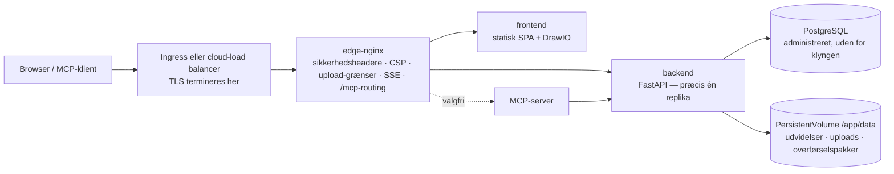

# Kubernetes og cloud

Turbo EA leveres med et Helm-chart, så drift på Kubernetes — Amazon EKS, Azure AKS, Google GKE eller enhver anden kompatibel klynge — er én kommando mod en PostgreSQL-server, du selv stiller til rådighed. Denne side beskriver først selve chartet og gennemgår derefter hver af de tre store clouds. Kører du på en enkelt vært, er [Docker Compose-opsætningen](../getting-started/setup.md) stadig den enkleste vej; alt på siden [Drift og opgraderinger](operations.md) om opgraderinger, backup og opbevaring af `SECRET_KEY` gælder her uændret.

## Hvad chartet udruller



- **Edge-nginx er den eneste Service, en Ingress peger på.** Den ejer alle sikkerhedsheadere, Content Security Policy, grænsen på 512 MB for uploads af arbejdsområdeoverførsler, indstillingerne for den langlivede hændelsesstrøm og routingen af `/mcp` og `/.well-known/oauth-*`. Send **hele værten** (`/`) til den, og tilføj aldrig en sti-omskrivning.
- **Backend kører med præcis én replika**, og chartet afviser enhver `backend.replicaCount`. Realtidshændelser udsendes fra en bus inde i processen, rate limiter og rettighedscache er i processen, databasemigreringer kører ved opstart, og `/app/data` er et ReadWriteOnce-volumen. Deploymentet bruger strategien *Recreate*, så to backends aldrig migrerer skemaet eller binder volumenet samtidig. Skalér i stedet Deploymentene `frontend` og `nginx` — backend er ikke flaskehalsen i et typisk landskab.
- **PostgreSQL er ikke inkluderet.** Peg chartet på en administreret database (den [anbefalede opsætning](operations.md#managed-postgresql)) eller på en operatorstyret klynge som CloudNativePG. Ollama er heller ikke inkluderet: sæt `ai.providerUrl` til et eksternt endpoint, hvis du bruger AI-forslag.
- **TLS termineres ved Ingress eller load balancer.** nginx udleder `X-Forwarded-Proto` fra `publicUrl`, og det er det, der markerer sessionscookien som `secure`.

## Forudsætninger

- Kubernetes 1.27 eller nyere og Helm 3.8 eller nyere (understøttelse af OCI-registre).
- En PostgreSQL 14+-server, der kan nås fra klyngen, med en database og en rolle til Turbo EA:
  ```sql
  CREATE USER turboea WITH PASSWORD 'dit-kodeord';
  CREATE DATABASE turboea OWNER turboea;
  ```
- En ingress-controller (eller en cloud-load balancer-integration) og til HTTPS et certifikat — cert-manager eller cloudens administrerede certifikater.
- En StorageClass, der leverer ReadWriteOnce-volumener (alle cloud-standarder gør).

## Installation

Skriv en `values.yaml`:

```yaml
publicUrl: https://ea.example.com          # den origin, brugerne åbner — ingen sti, ingen afsluttende skråstreg
postgresql:
  host: postgres.example.internal
  database: turboea
  username: turboea
  password: "…"                            # eller brug existingSecret, se nedenfor
secretKey: "…"                             # openssl rand -base64 48
ingress:
  enabled: true
  className: nginx
  annotations:
    cert-manager.io/cluster-issuer: letsencrypt
    nginx.ingress.kubernetes.io/proxy-body-size: 512m
    nginx.ingress.kubernetes.io/proxy-read-timeout: "86400"
    nginx.ingress.kubernetes.io/proxy-send-timeout: "86400"
    nginx.ingress.kubernetes.io/proxy-buffering: "off"
  tls:
    - secretName: turbo-ea-tls
      hosts: [ea.example.com]
```

Installér med fastlåst version — chart-versionen **er** Turbo EA-versionen, så `--version 2.141.0` installerer `2.141.0`-images:

```bash
helm install turbo-ea oci://ghcr.io/vincentmakes/turbo-ea/charts/turbo-ea \
  --version 2.141.0 \
  --namespace turbo-ea --create-namespace \
  -f values.yaml --wait
```

`--wait` vender tilbage, når backend har kørt sine migreringer og svarer gennem nginx. Verificér derefter og registrér dig:

```bash
helm test turbo-ea -n turbo-ea            # kalder /api/health og / gennem edge-nginx
kubectl get ingress -n turbo-ea           # vent på en adresse, og åbn så publicUrl
```

**Den første bruger, der registrerer sig, bliver administrator** — registrér dig med det samme. Uden Ingress: `kubectl port-forward -n turbo-ea svc/turbo-ea-nginx 8920:80` og sæt `publicUrl: http://localhost:8920`, da browserens URL skal matche `publicUrl` for cookies og CORS.

Hvert udgivet chart er signeret med cosign ligesom images: `cosign verify ghcr.io/vincentmakes/turbo-ea/charts/turbo-ea:2.141.0 --certificate-identity-regexp '^https://github.com/vincentmakes/turbo-ea/' --certificate-oidc-issuer https://token.actions.githubusercontent.com` (se [Forsyningskæde](supply-chain.md)).

## Værdier, der betyder noget

Den fulde, kommenterede liste findes i chartets [`values.yaml`](https://github.com/vincentmakes/turbo-ea/blob/main/charts/turbo-ea/values.yaml). Dem, en operatør sætter:

| Værdi | Formål |
|---|---|
| `publicUrl` | **Påkrævet.** Offentlig origin. Styrer nginx' `server_name` og `X-Forwarded-Proto`, backendens CORS-liste og MCP's OAuth-redirect-URI'er. |
| `postgresql.host` / `port` / `database` / `username` | **Vært påkrævet.** Den eksterne PostgreSQL-server. |
| `existingSecret` | Navn på en Secret med `SECRET_KEY` og `POSTGRES_PASSWORD` (nøglenavne kan konfigureres via `existingSecretKeys`). Foretrækkes frem for `secretKey` / `postgresql.password` inline. |
| `postgresql.pool.size` / `maxOverflow` | Backendens forbindelsesbudget, 20 + 10 som standard — skru ned for en administreret plan med lavt loft ([forbindelsesbudget](operations.md#check-the-connection-limit)). |
| `allowedOrigins` | CORS-tilladelsesliste; som standard origin af `publicUrl`. Sæt den, når appen har flere værtsnavne. |
| `embedAllowedOrigins` | Websteder, der må indlejre et udgivet diagram (Confluence, en wiki). |
| `backend.persistence.*` | Volumenet `/app/data`: `size`, `storageClass` eller `existingClaim` for at medbringe dit eget. Bevares ved `helm uninstall`. |
| `backend.extraEnv` / `extraEnvFrom` | Enhver backend-variabel fra Compose-opsætningen — `SMTP_*`, `TURBO_EA_PROXY_AUTH_*`, `NVD_API_KEY`, `EXTENSION_*`. |
| `ai.providerUrl` / `ai.model` | Eksternt LLM-endpoint til AI-forslag. |
| `mcp.enabled` | Udrul MCP-serveren på `<publicUrl>/mcp`. |
| `ingress.*` | Klasse, annotationer, TLS. Værter er som standard værten fra `publicUrl`, sti `/`. |
| `frontend.replicaCount` / `nginx.replicaCount`, `autoscaling`, `pdb` | Skalering af de tilstandsløse lag. |
| `networkPolicy.enabled` | Standard-afvisningspolitikker mellem lagene (udgående trafik slået fra som standard — se values-filen). |
| `global.imageRegistry` / `imagePullSecrets` | Hent fra et spejl i en isoleret klynge. |
| `seed.demo` | Indlæs NexaTech-demolandskabet ved første opstart. Aldrig på rigtige data. |

## Hemmeligheder

`SECRET_KEY` signerer hver session og krypterer hver gemt hemmelighed (SSO, SMTP). Mistes den, ugyldiggøres alle sessioner og alle krypterede indstillinger, så tag backup af den sammen med databasen. To måder at levere den og databasekodeordet på:

- **Inline** (`secretKey`, `postgresql.password`): chartet skriver en Secret, som det selv administrerer. Fint til evaluering; værdierne ligger så i din Helm-historik.
- **`existingSecret`** (anbefalet): en Secret, du selv opretter — manuelt, med Sealed Secrets eller synkroniseret fra AWS Secrets Manager / Azure Key Vault / Google Secret Manager af [External Secrets Operator](https://external-secrets.io/). Chartet refererer blot til den:

```bash
kubectl create secret generic turbo-ea-credentials -n turbo-ea \
  --from-literal=SECRET_KEY="$(openssl rand -base64 48)" \
  --from-literal=POSTGRES_PASSWORD='…'
```

En `ExternalSecret` kan følge med i releasen via `extraObjects`. Rotation af databasekodeordet kræver genstart af backend (`kubectl rollout restart deployment/turbo-ea-backend`); rotation af `SECRET_KEY` logger alle ud og kræver, at de krypterede indstillinger indtastes igen.

Kodeord med URL-reserverede tegn (`@ / : # ? %`) fungerer — backend procent-koder dem.

## Lager

`/app/data` rummer installerede udvidelser, uploads fra udvidelser og platformsmigreringer samt arbejdsområdeoverførselspakker; kort- og diagramindhold ligger i PostgreSQL. Chartet opretter ét ReadWriteOnce-PersistentVolumeClaim (`10Gi` som standard) annoteret med `helm.sh/resource-policy: keep`, så `helm uninstall` lader det stå — slet det manuelt, når du virkelig vil. Brug `backend.persistence.existingClaim` til at medbringe et gendannet volumen, og en StorageClass med `WaitForFirstConsumer`-binding (alle cloud-standarder), så volumenet oprettes i den zone, poden lander i.

Tag backup med din CSI-drivers VolumeSnapshots i samme takt som databasen, og gendan begge sammen — [rollback-reglerne](operations.md#rollback-and-recovery) gælder som for Compose-volumenet `backend_data`.

## Ingress og TLS

Chartet genererer én Ingress-regel — værten fra `publicUrl`, sti `/`, `pathType: Prefix`, backend = nginx-Servicen. Den ene regel er bevidst: `/.well-known/oauth-*`, `/mcp` og `/embed/` skal nå edge-nginx med stierne intakte, så tilføj aldrig en rewrite-target-annotation, og del ikke stier ud på flere services.

To grænser er sat på edge-nginx, men skal **også** hæves på controlleren foran den:

| Controller | Upload-størrelse (512 MB arbejdsområdeimport) | Hændelsesstrøm (langlivet SSE) |
|---|---|---|
| ingress-nginx, AKS application routing | `nginx.ingress.kubernetes.io/proxy-body-size: 512m` | `proxy-read-timeout: "86400"`, `proxy-send-timeout: "86400"`, `proxy-buffering: "off"` |
| AWS Load Balancer Controller (ALB) | ingen grænse | `alb.ingress.kubernetes.io/load-balancer-attributes: idle_timeout.timeout_seconds=4000` (ALB-maksimum; browseren genforbinder) |
| Azure Application Gateway (AGIC) | WAF-forebyggelsestilstand begrænser bodies — hæv filupload-grænsen eller undtag importstien | `appgw.ingress.kubernetes.io/request-timeout: "86400"` |
| GKE (GCE) | ingen grænse | `BackendConfig` med `timeoutSec: 86400` (se GCP-afsnittet) |

Til TLS enten en cert-manager-`tls:`-blok på Ingress eller cloudens administrerede certifikat (ACM, GKE ManagedCertificate) med TLS på load balanceren. Inde i klyngen er trafikken til nginx almindelig HTTP; det er en `publicUrl`, der begynder med `https://`, som gør cookien `secure`.

## Opgraderinger

```bash
helm upgrade turbo-ea oci://ghcr.io/vincentmakes/turbo-ea/charts/turbo-ea \
  --version 2.142.0 -n turbo-ea -f values.yaml --wait
```

Migreringer kører, når den nye backend-pod starter, præcis som i Compose: *Recreate* stopper den gamle pod, den nye migrerer, seeder metamodel-tilføjelser og svarer først derefter på `/api/health`. Opstartsproben giver fem minutter som standard (`backend.startupProbe.failureThreshold`); hæv den og `--timeout` ved en meget stor database. Læs releasenoterne først, tag en backup, og kør aldrig en ældre backend mod et nyere skema — en rollback er *gendan databasen og volumenet, og geninstallér derefter den forrige chart-version*, aldrig blot en chart-nedgradering. Se [Sådan fungerer opgraderinger](operations.md#how-upgrades-work-alembic-migrations).

## Hærdning

Hver container kører som uid 1000 med skrivebeskyttet rodfilsystem, uden capabilities, uden privilegieeskalering og med seccomp-profilen `RuntimeDefault`; ServiceAccount-tokenet monteres ikke. Det opfylder Pod Security Standard *restricted* fra start. `networkPolicy.enabled: true` tilføjer standard-afvisningspolitikker mellem lagene (sæt `networkPolicy.ingressController` til din controllers namespace-label); udgående regler er tilvalg, fordi backend også taler med udvidelsesbutikken, endoflife.date, NVD, din SMTP-server og dit LLM-endpoint. Admission-controllere, der verificerer signaturer, kan fastlåse images og chart til cosign-identiteten ovenfor.

## AWS (EKS)

**Database.** Amazon RDS for PostgreSQL eller Aurora PostgreSQL i klyngens VPC. Tillad port 5432 fra nodernes sikkerhedsgruppe (eller podernes med security groups for pods). RDS håndhæver TLS som standard (`rds.force_ssl`); backend forhandler det uden konfiguration.

**Lager.** EBS CSI-tilføjelsen med en `gp3`-StorageClass (`WaitForFirstConsumer`-binding).

**Ingress.** AWS Load Balancer Controller opretter en Application Load Balancer ud fra en Ingress af klassen `alb`. Terminér TLS der med et ACM-certifikat, peg sundhedstjekket på `/api/health` (standarden `/` serveres af frontend og siger intet om backend), og hæv idle-timeout til maksimum på 4000 sekunder af hensyn til hændelsesstrømmen. ALB begrænser ikke bodies.

**Hemmeligheder.** Gem `SECRET_KEY` og databasekodeordet i AWS Secrets Manager og synkronisér dem med External Secrets Operator (IRSA på dens ServiceAccount); Turbo EA-poderne selv behøver ingen AWS-identitet.

Tag udgangspunkt i [`examples/values-aws.yaml`](https://github.com/vincentmakes/turbo-ea/blob/main/charts/turbo-ea/examples/values-aws.yaml):

```yaml
publicUrl: https://ea.example.com
existingSecret: turbo-ea-credentials
postgresql:
  host: turbo-ea.cluster-abc123.eu-central-1.rds.amazonaws.com
backend:
  persistence:
    storageClass: gp3
ingress:
  enabled: true
  className: alb
  annotations:
    alb.ingress.kubernetes.io/scheme: internet-facing
    alb.ingress.kubernetes.io/target-type: ip
    alb.ingress.kubernetes.io/listen-ports: '[{"HTTP": 80}, {"HTTPS": 443}]'
    alb.ingress.kubernetes.io/ssl-redirect: "443"
    alb.ingress.kubernetes.io/certificate-arn: arn:aws:acm:…
    alb.ingress.kubernetes.io/healthcheck-path: /api/health
    alb.ingress.kubernetes.io/load-balancer-attributes: idle_timeout.timeout_seconds=4000
```

## Azure (AKS)

**Database.** Azure Database for PostgreSQL – Flexible Server med privat adgang (VNet-integration) til klyngens VNet eller offentlig adgang med en firewallregel for klyngens udgående IP. TLS er påkrævet (`require_secure_transport`) og forhandles automatisk. Brugernavnet er det rene rollenavn — formen `user@server` hørte til den udfasede Single Server.

**Lager.** Azure Disk CSI-driveren med den indbyggede StorageClass `managed-csi`.

**Ingress.** Tilføjelsen *application routing* (`az aks approuting enable`) installerer en administreret ingress-nginx under klassen `webapprouting.kubernetes.azure.com`; brug ingress-nginx-annotationerne fra tabellen ovenfor og en cert-manager-issuer eller et Azure Key Vault-certifikat. Med Application Gateway Ingress Controller sættes i stedet `appgw.ingress.kubernetes.io/request-timeout: "86400"`, og kører en WAF-politik i forebyggelsestilstand, hæves dens filupload-grænse, eller importstien undtages.

**Identitet.** Entra ID-login konfigureres inde i Turbo EA ([SSO](sso.md)), ikke på klyngen. Hemmeligheder synkroniseres fra Key Vault via Secrets Store CSI Driver eller External Secrets Operator med workload identity.

Tag udgangspunkt i [`examples/values-azure.yaml`](https://github.com/vincentmakes/turbo-ea/blob/main/charts/turbo-ea/examples/values-azure.yaml):

```yaml
publicUrl: https://ea.example.com
existingSecret: turbo-ea-credentials
postgresql:
  host: turbo-ea.postgres.database.azure.com
backend:
  persistence:
    storageClass: managed-csi
ingress:
  enabled: true
  className: webapprouting.kubernetes.azure.com
  annotations:
    cert-manager.io/cluster-issuer: letsencrypt
    nginx.ingress.kubernetes.io/proxy-body-size: 512m
    nginx.ingress.kubernetes.io/proxy-read-timeout: "86400"
    nginx.ingress.kubernetes.io/proxy-send-timeout: "86400"
    nginx.ingress.kubernetes.io/proxy-buffering: "off"
  tls:
    - secretName: turbo-ea-tls
      hosts: [ea.example.com]
```

## Google Cloud (GKE)

**Database.** Cloud SQL for PostgreSQL med **privat IP** i samme VPC (private services access). En VPC-native klynge — GKE Standard eller Autopilot — når den direkte, så hverken proxy-sidecar eller Workload Identity er nødvendig: sæt `postgresql.host` til instansens private adresse. Kræver politikken Cloud SQL Auth Proxy (IAM-godkendelse, instans med offentlig IP), tilføjes den som sidecar via `backend.extraContainers`, `postgresql.host: 127.0.0.1` sættes, og releasens ServiceAccount bindes til en Google-servicekonto med Workload Identity; eksempelfilen indeholder uddraget.

**Lager.** Persistent Disk CSI-driveren med StorageClass `standard-rwo` (balanceret PD, `WaitForFirstConsumer`).

**Ingress.** GKE's Ingress-controller (klasse `gce`) bygger en global ekstern HTTPS-load balancer. Dens standard-backend-timeout på 30 sekunder ville afbryde hændelsesstrømmen hvert halve minut, så tilknyt en `BackendConfig` med `timeoutSec: 86400` og sundhedstjekket `/api/health` til nginx-Servicen (`nginx.service.annotations`), slå container-native load balancing til med NEG-annotationen, reservér en global statisk IP, og brug et `ManagedCertificate` til TLS. Begge custom resources følger med i releasen via `extraObjects`.

Tag udgangspunkt i [`examples/values-gcp.yaml`](https://github.com/vincentmakes/turbo-ea/blob/main/charts/turbo-ea/examples/values-gcp.yaml):

```yaml
publicUrl: https://ea.example.com
existingSecret: turbo-ea-credentials
postgresql:
  host: 10.20.0.3
backend:
  persistence:
    storageClass: standard-rwo
nginx:
  service:
    annotations:
      cloud.google.com/neg: '{"ingress": true}'
      cloud.google.com/backend-config: '{"default": "turbo-ea"}'
ingress:
  enabled: true
  className: gce
  annotations:
    kubernetes.io/ingress.global-static-ip-name: turbo-ea-ip
    networking.gke.io/managed-certificates: turbo-ea
    kubernetes.io/ingress.allow-http: "false"
extraObjects:
  - apiVersion: cloud.google.com/v1
    kind: BackendConfig
    metadata: {name: turbo-ea}
    spec:
      timeoutSec: 86400
      healthCheck: {type: HTTP, requestPath: /api/health, port: 8080}
  - apiVersion: networking.gke.io/v1
    kind: ManagedCertificate
    metadata: {name: turbo-ea}
    spec: {domains: [ea.example.com]}
```

## Administrerede containertjenester

Azure Container Apps, AWS ECS / App Runner og Google Cloud Run kan køre de samme images, men de er ikke en understøttet installationsvej, og der findes ingen skabelon til dem. Hvad en sådan udrulning skal levere, og hvor hver tjeneste kommer til kort:

- **Præcis én backend-instans**, uden skalering til nul og uden rullende udskiftning (to backends må aldrig overlappe).
- **Et vedvarende, skrivbart `/app/data`** — Cloud Run har ingen vedvarende disk; Container Apps kræver et Azure Files-mount; ECS kræver EFS.
- **Langlivede svar** til hændelsesstrømmen og **uploads op til 512 MB**; flere tjenester begrænser anmodningsvarighed eller body-størrelse.
- **Edge-nginx foran**, konfigureret med `NGINX_BACKEND_UPSTREAM`, `NGINX_FRONTEND_UPSTREAM` og `NGINX_MCP_UPSTREAM` pegende på de andre tjenester, da Compose-servicenavnene ikke findes der.

Er Kubernetes ikke en mulighed, er [Docker Compose på en virtuel maskine](../getting-started/setup.md) med en administreret PostgreSQL den enklere, understøttede vej.

## Fejlfinding

| Symptom | Årsag og løsning |
|---|---|
| nginx-poder bliver aldrig Ready, backend-logs er sunde | nginx' readiness-probe går gennem proxyen til `/api/health`. Tjek værdien af `NGINX_BACKEND_UPSTREAM` på nginx-poden, og at `clusterDomain` matcher din klynge (`cluster.local` som standard). |
| Login går i ring, eller API'et svarer 401 i browseren | `publicUrl` matcher ikke URL'en i adresselinjen. Cookies og CORS er bundet til den; ved flere værtsnavne sættes `allowedOrigins`. |
| `helm install --wait` løber ud på backend | Migreringer eller seeding tog længere, end opstartsproben tillader — tjek `kubectl logs deployment/turbo-ea-backend`, og hæv så `backend.startupProbe.failureThreshold` og `--timeout`. |
| Backend logger `too many connections` | Den administrerede plan begrænser forbindelser under `pool.size + pool.maxOverflow`. Skru ned for poolen ([forbindelsesbudget](operations.md#check-the-connection-limit)). |
| Arbejdsområdeimport fejler ved få megabyte | Ingress-controllerens body-grænse, ikke nginx' — se tabellen under *Ingress og TLS*. |
| Realtidsopdateringer stopper efter et fast interval | Load balancerens idle- eller request-timeout lukker hændelsesstrømmen; hæv den efter samme tabel. Browseren genforbinder, intet går tabt, men genforbindelsesintervallet opleves som forsinkelse. |
| Udvidelser forsvinder efter en genstart | `backend.persistence.enabled` er `false`, eller PVC'en er slettet. |
