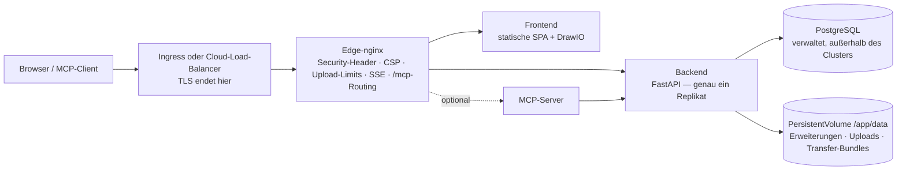

# Kubernetes & Cloud

Turbo EA liefert ein Helm-Chart mit. Der Betrieb auf Kubernetes — Amazon EKS, Azure AKS, Google GKE oder jedem anderen konformen Cluster — ist damit ein einziger Befehl gegen einen PostgreSQL-Server, den Sie bereitstellen. Diese Seite beschreibt zuerst das Chart und führt dann durch jede der drei großen Clouds. Für einen einzelnen Host bleibt das [Docker-Compose-Setup](../getting-started/setup.md) der einfachste Weg; alles auf der Seite [Betrieb & Upgrades](operations.md) zu Upgrades, Backups und der Verwahrung von `SECRET_KEY` gilt hier unverändert.

## Was das Chart bereitstellt



- **Der Edge-nginx ist der einzige Service, auf den ein Ingress zeigt.** Er besitzt jeden Security-Header, die Content Security Policy, das 512-MB-Limit für Workspace-Transfer-Uploads, die Einstellungen für den langlebigen Event-Stream und das Routing von `/mcp` und `/.well-known/oauth-*`. Leiten Sie den **gesamten Host** (`/`) dorthin und fügen Sie nie ein Pfad-Rewrite hinzu.
- **Das Backend läuft mit genau einem Replikat**, und das Chart lehnt ein `backend.replicaCount` ab. Echtzeit-Ereignisse werden über einen prozessinternen Bus verteilt, Rate-Limiter und Berechtigungs-Cache sind prozessintern, Datenbankmigrationen laufen beim Start, und `/app/data` ist ein ReadWriteOnce-Volume. Das Deployment nutzt die Strategie *Recreate*, damit nie zwei Backends gleichzeitig das Schema migrieren oder das Volume binden. Skalieren Sie stattdessen die Deployments `frontend` und `nginx` — das Backend ist für eine typische Landschaft nicht der Engpass.
- **PostgreSQL ist nicht enthalten.** Richten Sie das Chart auf eine verwaltete Datenbank (das [empfohlene Setup](operations.md#managed-postgresql)) oder auf einen operatorverwalteten Cluster wie CloudNativePG. Ollama ist ebenfalls nicht enthalten: Setzen Sie `ai.providerUrl` auf einen externen Endpunkt, wenn Sie KI-Vorschläge nutzen.
- **TLS endet am Ingress oder Load Balancer.** nginx leitet `X-Forwarded-Proto` aus `publicUrl` ab — das ist es, was das Sitzungs-Cookie als `secure` markiert.

## Voraussetzungen

- Kubernetes 1.27 oder neuer und Helm 3.8 oder neuer (Unterstützung für OCI-Registries).
- Ein aus dem Cluster erreichbarer PostgreSQL-14+-Server mit Datenbank und Rolle für Turbo EA:
  ```sql
  CREATE USER turboea WITH PASSWORD 'ihr-passwort';
  CREATE DATABASE turboea OWNER turboea;
  ```
- Ein Ingress-Controller (oder eine Cloud-Load-Balancer-Integration) und für HTTPS ein Zertifikat — cert-manager oder die verwalteten Zertifikate der Cloud.
- Eine StorageClass, die ReadWriteOnce-Volumes bereitstellt (jeder Cloud-Standard tut das).

## Installation

Schreiben Sie eine `values.yaml`:

```yaml
publicUrl: https://ea.example.com          # der Origin, den Nutzer öffnen — kein Pfad, kein Schrägstrich am Ende
postgresql:
  host: postgres.example.internal
  database: turboea
  username: turboea
  password: "…"                            # oder existingSecret verwenden, siehe unten
secretKey: "…"                             # openssl rand -base64 48
ingress:
  enabled: true
  className: nginx
  annotations:
    cert-manager.io/cluster-issuer: letsencrypt
    nginx.ingress.kubernetes.io/proxy-body-size: 512m
    nginx.ingress.kubernetes.io/proxy-read-timeout: "86400"
    nginx.ingress.kubernetes.io/proxy-send-timeout: "86400"
    nginx.ingress.kubernetes.io/proxy-buffering: "off"
  tls:
    - secretName: turbo-ea-tls
      hosts: [ea.example.com]
```

Installieren Sie mit gepinnter Version — die Chart-Version **ist** die Turbo-EA-Version, `--version 2.141.0` installiert also die Images `2.141.0`:

```bash
helm install turbo-ea oci://ghcr.io/vincentmakes/turbo-ea/charts/turbo-ea \
  --version 2.141.0 \
  --namespace turbo-ea --create-namespace \
  -f values.yaml --wait
```

`--wait` kehrt zurück, sobald das Backend seine Migrationen ausgeführt hat und über nginx antwortet. Dann prüfen und registrieren:

```bash
helm test turbo-ea -n turbo-ea            # ruft /api/health und / über den Edge-nginx ab
kubectl get ingress -n turbo-ea           # auf eine Adresse warten, dann publicUrl öffnen
```

**Der erste registrierte Benutzer wird Administrator** — registrieren Sie sich sofort. Ohne Ingress: `kubectl port-forward -n turbo-ea svc/turbo-ea-nginx 8920:80` und `publicUrl: http://localhost:8920` setzen, denn die Browser-URL muss für Cookies und CORS mit `publicUrl` übereinstimmen.

Jedes veröffentlichte Chart ist wie die Images mit cosign signiert: `cosign verify ghcr.io/vincentmakes/turbo-ea/charts/turbo-ea:2.141.0 --certificate-identity-regexp '^https://github.com/vincentmakes/turbo-ea/' --certificate-oidc-issuer https://token.actions.githubusercontent.com` (siehe [Lieferkette](supply-chain.md)).

## Wichtige Werte

Die vollständige, kommentierte Liste steht in der [`values.yaml`](https://github.com/vincentmakes/turbo-ea/blob/main/charts/turbo-ea/values.yaml) des Charts. Die Werte, die ein Betreiber setzt:

| Wert | Zweck |
|---|---|
| `publicUrl` | **Erforderlich.** Öffentlicher Origin. Steuert `server_name` und `X-Forwarded-Proto` von nginx, die CORS-Liste des Backends und die MCP-OAuth-Redirect-URIs. |
| `postgresql.host` / `port` / `database` / `username` | **Host erforderlich.** Der externe PostgreSQL-Server. |
| `existingSecret` | Name eines Secrets mit `SECRET_KEY` und `POSTGRES_PASSWORD` (Schlüsselnamen über `existingSecretKeys` konfigurierbar). Gegenüber `secretKey` / `postgresql.password` inline zu bevorzugen. |
| `postgresql.pool.size` / `maxOverflow` | Verbindungsbudget des Backends, standardmäßig 20 + 10 — für einen verwalteten Tarif mit niedriger Obergrenze verkleinern ([Verbindungsbudget](operations.md#check-the-connection-limit)). |
| `allowedOrigins` | CORS-Freigabeliste; standardmäßig der Origin von `publicUrl`. Setzen, wenn die App mehrere Hostnamen hat. |
| `embedAllowedOrigins` | Sites, die ein veröffentlichtes Diagramm einbetten dürfen (Confluence, ein Wiki). |
| `backend.persistence.*` | Das Volume `/app/data`: `size`, `storageClass` oder `existingClaim` für ein eigenes Volume. Bleibt bei `helm uninstall` erhalten. |
| `backend.extraEnv` / `extraEnvFrom` | Jede Backend-Variable aus dem Compose-Setup — `SMTP_*`, `TURBO_EA_PROXY_AUTH_*`, `NVD_API_KEY`, `EXTENSION_*`. |
| `ai.providerUrl` / `ai.model` | Externer LLM-Endpunkt für KI-Vorschläge. |
| `mcp.enabled` | Den MCP-Server unter `<publicUrl>/mcp` bereitstellen. |
| `ingress.*` | Klasse, Annotationen, TLS. Hosts standardmäßig der Host von `publicUrl`, Pfad `/`. |
| `frontend.replicaCount` / `nginx.replicaCount`, `autoscaling`, `pdb` | Skalierung der zustandslosen Schichten. |
| `networkPolicy.enabled` | Default-Deny-Richtlinien zwischen den Schichten (Egress standardmäßig aus — siehe values-Datei). |
| `global.imageRegistry` / `imagePullSecrets` | Pull von einem Spiegel in einem abgeschotteten Cluster. |
| `seed.demo` | Beim ersten Start die NexaTech-Demolandschaft laden. Nie auf echten Daten. |

## Secrets

`SECRET_KEY` signiert jede Sitzung und verschlüsselt jedes gespeicherte Geheimnis (SSO, SMTP). Geht er verloren, sind alle Sitzungen und alle verschlüsselten Einstellungen ungültig — sichern Sie ihn zusammen mit der Datenbank. Zwei Wege, ihn und das Datenbankpasswort bereitzustellen:

- **Inline** (`secretKey`, `postgresql.password`): Das Chart schreibt ein von ihm verwaltetes Secret. Für Evaluierungen in Ordnung; die Werte landen dann in Ihrer Helm-Historie.
- **`existingSecret`** (empfohlen): Ein Secret, das Sie anlegen — von Hand, mit Sealed Secrets oder per [External Secrets Operator](https://external-secrets.io/) aus AWS Secrets Manager / Azure Key Vault / Google Secret Manager synchronisiert. Das Chart referenziert es nur:

```bash
kubectl create secret generic turbo-ea-credentials -n turbo-ea \
  --from-literal=SECRET_KEY="$(openssl rand -base64 48)" \
  --from-literal=POSTGRES_PASSWORD='…'
```

Ein `ExternalSecret` kann über `extraObjects` mit dem Release ausgeliefert werden. Ein Wechsel des Datenbankpassworts erfordert einen Neustart des Backends (`kubectl rollout restart deployment/turbo-ea-backend`); ein Wechsel von `SECRET_KEY` meldet alle Nutzer ab und verlangt die erneute Eingabe der verschlüsselten Einstellungen.

Passwörter mit URL-reservierten Zeichen (`@ / : # ? %`) sind unproblematisch — das Backend kodiert sie prozentual.

## Speicher

`/app/data` enthält installierte Erweiterungen, Uploads von Erweiterungen und Plattform-Migrationen sowie Workspace-Transfer-Bundles; Karten- und Diagramminhalte liegen in PostgreSQL. Das Chart legt einen ReadWriteOnce-PersistentVolumeClaim an (standardmäßig `10Gi`), annotiert mit `helm.sh/resource-policy: keep`, sodass `helm uninstall` ihn stehen lässt — löschen Sie ihn von Hand, wenn Sie es wirklich wollen. Mit `backend.persistence.existingClaim` bringen Sie ein wiederhergestelltes Volume mit; nutzen Sie eine StorageClass mit `WaitForFirstConsumer`-Bindung (jeder Cloud-Standard), damit das Volume in der Zone entsteht, in der der Pod landet.

Sichern Sie es mit den VolumeSnapshots Ihres CSI-Treibers im gleichen Rhythmus wie die Datenbank und stellen Sie beides zusammen wieder her — die [Rollback-Regeln](operations.md#rollback-and-recovery) gelten wie für das Compose-Volume `backend_data`.

## Ingress und TLS

Das Chart rendert eine Ingress-Regel — der Host von `publicUrl`, Pfad `/`, `pathType: Prefix`, Backend = der nginx-Service. Diese eine Regel ist Absicht: `/.well-known/oauth-*`, `/mcp` und `/embed/` müssen den Edge-nginx mit unveränderten Pfaden erreichen; fügen Sie also nie eine Rewrite-Target-Annotation hinzu und verteilen Sie Pfade nicht auf mehrere Services.

Zwei Limits sind am Edge-nginx gesetzt, müssen aber **zusätzlich** am davorliegenden Controller erhöht werden:

| Controller | Upload-Größe (512 MB Workspace-Import) | Event-Stream (langlebiges SSE) |
|---|---|---|
| ingress-nginx, AKS Application Routing | `nginx.ingress.kubernetes.io/proxy-body-size: 512m` | `proxy-read-timeout: "86400"`, `proxy-send-timeout: "86400"`, `proxy-buffering: "off"` |
| AWS Load Balancer Controller (ALB) | kein Limit | `alb.ingress.kubernetes.io/load-balancer-attributes: idle_timeout.timeout_seconds=4000` (ALB-Maximum; der Browser verbindet sich neu) |
| Azure Application Gateway (AGIC) | WAF-Präventionsmodus begrenzt Bodies — Datei-Upload-Limit erhöhen oder Import-Pfad ausnehmen | `appgw.ingress.kubernetes.io/request-timeout: "86400"` |
| GKE (GCE) | kein Limit | `BackendConfig` mit `timeoutSec: 86400` (siehe GCP-Abschnitt) |

Für TLS entweder ein cert-manager-`tls:`-Block am Ingress oder das verwaltete Zertifikat der Cloud (ACM, GKE ManagedCertificate) mit TLS am Load Balancer. Im Cluster ist der Verkehr zu nginx reines HTTP; ein `publicUrl` mit `https://` macht das Cookie `secure`.

## Upgrades

```bash
helm upgrade turbo-ea oci://ghcr.io/vincentmakes/turbo-ea/charts/turbo-ea \
  --version 2.142.0 -n turbo-ea -f values.yaml --wait
```

Migrationen laufen beim Start des neuen Backend-Pods, genau wie in Compose: *Recreate* stoppt den alten Pod, der neue migriert, seedet Metamodell-Ergänzungen und antwortet erst dann auf `/api/health`. Die Startup-Probe erlaubt standardmäßig fünf Minuten (`backend.startupProbe.failureThreshold`); erhöhen Sie sie und `--timeout` für eine sehr große Datenbank. Lesen Sie zuerst die Release Notes, erstellen Sie ein Backup und betreiben Sie nie ein älteres Backend gegen ein neueres Schema — ein Rollback heißt *Datenbank und Volume wiederherstellen, dann die vorherige Chart-Version neu installieren*, nie nur ein Chart-Downgrade. Siehe [Wie Upgrades funktionieren](operations.md#how-upgrades-work-alembic-migrations).

## Härtung

Jeder Container läuft als uid 1000 mit schreibgeschütztem Root-Dateisystem, ohne Capabilities, ohne Privilegien-Eskalation und mit dem seccomp-Profil `RuntimeDefault`; das ServiceAccount-Token wird nicht eingehängt. Das erfüllt den Pod-Security-Standard *restricted* ohne weiteres Zutun. `networkPolicy.enabled: true` ergänzt Default-Deny-Richtlinien zwischen den Schichten (setzen Sie `networkPolicy.ingressController` auf das Namespace-Label Ihres Controllers); Egress-Regeln sind Opt-in, weil das Backend auch mit dem Extension Store, endoflife.date, der NVD, Ihrem SMTP-Server und Ihrem LLM-Endpunkt spricht. Admission-Controller, die Signaturen prüfen, können Images und Chart an die obige cosign-Identität binden.

## AWS (EKS)

**Datenbank.** Amazon RDS for PostgreSQL oder Aurora PostgreSQL in der VPC des Clusters. Port 5432 von der Node-Security-Group (oder der Pod-Security-Group bei Security Groups for Pods) erlauben. RDS erzwingt TLS standardmäßig (`rds.force_ssl`); das Backend handelt es ohne Konfiguration aus.

**Speicher.** Das EBS-CSI-Add-on mit einer `gp3`-StorageClass (`WaitForFirstConsumer`-Bindung).

**Ingress.** Der AWS Load Balancer Controller erstellt aus einem Ingress der Klasse `alb` einen Application Load Balancer. Beenden Sie TLS dort mit einem ACM-Zertifikat, richten Sie den Health Check auf `/api/health` (der Standard `/` wird vom Frontend beantwortet und sagt nichts über das Backend aus) und erhöhen Sie das Idle-Timeout für den Event-Stream auf das Maximum von 4000 Sekunden. Bodies werden vom ALB nicht begrenzt.

**Secrets.** Legen Sie `SECRET_KEY` und das Datenbankpasswort in AWS Secrets Manager ab und synchronisieren Sie sie mit dem External Secrets Operator (IRSA auf dessen ServiceAccount); die Turbo-EA-Pods selbst brauchen keine AWS-Identität.

Beginnen Sie mit [`examples/values-aws.yaml`](https://github.com/vincentmakes/turbo-ea/blob/main/charts/turbo-ea/examples/values-aws.yaml):

```yaml
publicUrl: https://ea.example.com
existingSecret: turbo-ea-credentials
postgresql:
  host: turbo-ea.cluster-abc123.eu-central-1.rds.amazonaws.com
backend:
  persistence:
    storageClass: gp3
ingress:
  enabled: true
  className: alb
  annotations:
    alb.ingress.kubernetes.io/scheme: internet-facing
    alb.ingress.kubernetes.io/target-type: ip
    alb.ingress.kubernetes.io/listen-ports: '[{"HTTP": 80}, {"HTTPS": 443}]'
    alb.ingress.kubernetes.io/ssl-redirect: "443"
    alb.ingress.kubernetes.io/certificate-arn: arn:aws:acm:…
    alb.ingress.kubernetes.io/healthcheck-path: /api/health
    alb.ingress.kubernetes.io/load-balancer-attributes: idle_timeout.timeout_seconds=4000
```

## Azure (AKS)

**Datenbank.** Azure Database for PostgreSQL – Flexible Server mit privatem Zugriff (VNet-Integration) in das VNet des Clusters oder mit öffentlichem Zugriff und einer Firewall-Regel für die ausgehende IP des Clusters. TLS ist Pflicht (`require_secure_transport`) und wird automatisch ausgehandelt. Der Benutzername ist der reine Rollenname — die Form `user@server` gehörte zum eingestellten Single Server.

**Speicher.** Der Azure-Disk-CSI-Treiber mit der eingebauten StorageClass `managed-csi`.

**Ingress.** Das Add-on *Application Routing* (`az aks approuting enable`) installiert einen verwalteten ingress-nginx unter der Klasse `webapprouting.kubernetes.azure.com`; verwenden Sie die ingress-nginx-Annotationen aus der obigen Tabelle und einen cert-manager-Issuer oder ein Azure-Key-Vault-Zertifikat. Mit dem Application Gateway Ingress Controller setzen Sie stattdessen `appgw.ingress.kubernetes.io/request-timeout: "86400"` und erhöhen bei einer WAF-Richtlinie im Präventionsmodus deren Datei-Upload-Limit oder nehmen den Workspace-Import-Pfad aus.

**Identität.** Die Entra-ID-Anmeldung wird in Turbo EA konfiguriert ([SSO](sso.md)), nicht am Cluster. Secrets werden aus Key Vault über den Secrets Store CSI Driver oder den External Secrets Operator mit Workload Identity synchronisiert.

Beginnen Sie mit [`examples/values-azure.yaml`](https://github.com/vincentmakes/turbo-ea/blob/main/charts/turbo-ea/examples/values-azure.yaml):

```yaml
publicUrl: https://ea.example.com
existingSecret: turbo-ea-credentials
postgresql:
  host: turbo-ea.postgres.database.azure.com
backend:
  persistence:
    storageClass: managed-csi
ingress:
  enabled: true
  className: webapprouting.kubernetes.azure.com
  annotations:
    cert-manager.io/cluster-issuer: letsencrypt
    nginx.ingress.kubernetes.io/proxy-body-size: 512m
    nginx.ingress.kubernetes.io/proxy-read-timeout: "86400"
    nginx.ingress.kubernetes.io/proxy-send-timeout: "86400"
    nginx.ingress.kubernetes.io/proxy-buffering: "off"
  tls:
    - secretName: turbo-ea-tls
      hosts: [ea.example.com]
```

## Google Cloud (GKE)

**Datenbank.** Cloud SQL for PostgreSQL mit **privater IP** in derselben VPC (Private Services Access). Ein VPC-nativer Cluster — GKE Standard oder Autopilot — erreicht sie direkt, sodass weder Proxy-Sidecar noch Workload Identity nötig sind: Setzen Sie `postgresql.host` auf die private Adresse der Instanz. Schreibt eine Richtlinie den Cloud SQL Auth Proxy vor (IAM-Authentifizierung, Instanz mit öffentlicher IP), fügen Sie ihn über `backend.extraContainers` als Sidecar hinzu, setzen `postgresql.host: 127.0.0.1` und binden den Release-ServiceAccount per Workload Identity an ein Google-Dienstkonto; die Beispieldatei enthält den Ausschnitt.

**Speicher.** Der Persistent-Disk-CSI-Treiber mit der StorageClass `standard-rwo` (Balanced PD, `WaitForFirstConsumer`).

**Ingress.** Der GKE-Ingress-Controller (Klasse `gce`) baut einen globalen externen HTTPS-Load-Balancer. Sein Standard-Backend-Timeout von 30 Sekunden würde den Event-Stream jede halbe Minute abbrechen; hängen Sie daher eine `BackendConfig` mit `timeoutSec: 86400` und dem Health Check `/api/health` an den nginx-Service (`nginx.service.annotations`), aktivieren Sie containernatives Load Balancing per NEG-Annotation, reservieren Sie eine globale statische IP und verwenden Sie ein `ManagedCertificate` für TLS. Beide Custom Resources werden über `extraObjects` mit dem Release ausgeliefert.

Beginnen Sie mit [`examples/values-gcp.yaml`](https://github.com/vincentmakes/turbo-ea/blob/main/charts/turbo-ea/examples/values-gcp.yaml):

```yaml
publicUrl: https://ea.example.com
existingSecret: turbo-ea-credentials
postgresql:
  host: 10.20.0.3
backend:
  persistence:
    storageClass: standard-rwo
nginx:
  service:
    annotations:
      cloud.google.com/neg: '{"ingress": true}'
      cloud.google.com/backend-config: '{"default": "turbo-ea"}'
ingress:
  enabled: true
  className: gce
  annotations:
    kubernetes.io/ingress.global-static-ip-name: turbo-ea-ip
    networking.gke.io/managed-certificates: turbo-ea
    kubernetes.io/ingress.allow-http: "false"
extraObjects:
  - apiVersion: cloud.google.com/v1
    kind: BackendConfig
    metadata: {name: turbo-ea}
    spec:
      timeoutSec: 86400
      healthCheck: {type: HTTP, requestPath: /api/health, port: 8080}
  - apiVersion: networking.gke.io/v1
    kind: ManagedCertificate
    metadata: {name: turbo-ea}
    spec: {domains: [ea.example.com]}
```

## Verwaltete Container-Dienste

Azure Container Apps, Google Cloud Run und AWS ECS Fargate führen dieselben Images ohne Kubernetes aus, als eine Container-Gruppe mit Edge-nginx, Frontend und Backend als Sidecars. Fertige Vorlagen und die Anleitungen je Plattform — einschließlich dessen, was jede Plattform nicht kann — stehen auf der Seite [Verwaltete Container-Dienste](managed-containers.md).

## Fehlerbehebung

| Symptom | Ursache und Abhilfe |
|---|---|
| nginx-Pods werden nie Ready, Backend-Logs sind gesund | Die Readiness-Probe von nginx geht über den Proxy an `/api/health`. Prüfen Sie den Wert `NGINX_BACKEND_UPSTREAM` am nginx-Pod und ob `clusterDomain` zu Ihrem Cluster passt (Standard `cluster.local`). |
| Anmeldung in Schleife oder API antwortet im Browser mit 401 | `publicUrl` stimmt nicht mit der URL in der Adressleiste überein. Cookies und CORS sind daran gebunden; bei mehreren Hostnamen `allowedOrigins` setzen. |
| `helm install --wait` läuft beim Backend in ein Timeout | Migrationen oder Seeding dauerten länger, als die Startup-Probe erlaubt — `kubectl logs deployment/turbo-ea-backend` prüfen, dann `backend.startupProbe.failureThreshold` und `--timeout` erhöhen. |
| Backend-Log meldet `too many connections` | Der verwaltete Tarif begrenzt Verbindungen unter `pool.size + pool.maxOverflow`. Pool verkleinern ([Verbindungsbudget](operations.md#check-the-connection-limit)). |
| Workspace-Import scheitert bei wenigen Megabyte | Das Body-Limit des Ingress-Controllers, nicht das von nginx — siehe Tabelle unter *Ingress und TLS*. |
| Echtzeit-Updates stoppen nach einem festen Intervall | Das Idle- oder Request-Timeout des Load Balancers schließt den Event-Stream; erhöhen Sie es laut derselben Tabelle. Der Browser verbindet sich neu, es geht nichts verloren, aber das Reconnect-Intervall wirkt wie eine Verzögerung. |
| Erweiterungen verschwinden nach einem Neustart | `backend.persistence.enabled` ist `false` oder der PVC wurde gelöscht. |
