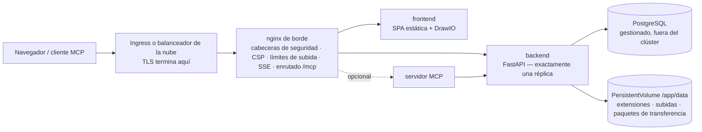

# Kubernetes y nube

Turbo EA incluye un chart de Helm, así que ejecutarlo en Kubernetes —Amazon EKS, Azure AKS, Google GKE o cualquier clúster conforme— es un solo comando contra un servidor PostgreSQL que usted proporciona. Esta página describe primero el chart y después recorre cada una de las tres grandes nubes. Si utiliza un único host, la [configuración con Docker Compose](../getting-started/setup.md) sigue siendo la vía más sencilla; todo lo que dice la página [Operaciones y actualizaciones](operations.md) sobre actualizaciones, copias de seguridad y la custodia de `SECRET_KEY` se aplica aquí sin cambios. ¿Prefiere Terraform? La página [Terraform](terraform.md) envuelve el chart en un módulo `helm_release`.

## Qué despliega el chart



- **El nginx de borde es el único Service al que apunta un Ingress.** Posee todas las cabeceras de seguridad, la Content Security Policy, el límite de 2 GB para las subidas de transferencia de espacio de trabajo, la configuración del flujo de eventos de larga duración y el enrutado de `/mcp` y `/.well-known/oauth-*`. Enrute **todo el host** (`/`) hacia él y nunca añada una reescritura de rutas.
- **El backend se ejecuta con exactamente una réplica**, y el chart rechaza cualquier `backend.replicaCount`. Los eventos en tiempo real se distribuyen desde un bus interno al proceso, el limitador de peticiones y la caché de permisos son internos, las migraciones se ejecutan al arrancar y `/app/data` es un volumen ReadWriteOnce. El Deployment usa la estrategia *Recreate* para que dos backends nunca migren el esquema ni monten el volumen a la vez. Escale en su lugar los Deployments `frontend` y `nginx`: el backend no es el cuello de botella de un panorama típico.
- **PostgreSQL no está incluido.** Apunte el chart a una base de datos gestionada (la [configuración recomendada](operations.md#managed-postgresql)) o a un clúster gestionado por un operador como CloudNativePG. Ollama tampoco está incluido: defina `ai.providerUrl` hacia un punto de conexión externo si usa las sugerencias de IA.
- **TLS termina en el Ingress o en el balanceador.** nginx deriva `X-Forwarded-Proto` de `publicUrl`, que es lo que marca la cookie de sesión como `secure`.

## Requisitos previos

- Kubernetes 1.27 o posterior y Helm 3.8 o posterior (compatibilidad con registros OCI).
- Un servidor PostgreSQL 14+ accesible desde el clúster, con una base de datos y un rol para Turbo EA:
  ```sql
  CREATE USER turboea WITH PASSWORD 'su-contraseña';
  CREATE DATABASE turboea OWNER turboea;
  ```
- Un controlador de ingress (o una integración con el balanceador de la nube) y, para HTTPS, un certificado: cert-manager o los certificados gestionados de la nube.
- Una StorageClass que aprovisione volúmenes ReadWriteOnce (todas las predeterminadas de las nubes lo hacen).

## Instalación

Escriba un `values.yaml`:

```yaml
publicUrl: https://ea.example.com          # el origen que abren los usuarios — sin ruta ni barra final
postgresql:
  host: postgres.example.internal
  database: turboea
  username: turboea
  password: "…"                            # o use existingSecret, más abajo
secretKey: "…"                             # openssl rand -base64 48
ingress:
  enabled: true
  className: nginx
  annotations:
    cert-manager.io/cluster-issuer: letsencrypt
    nginx.ingress.kubernetes.io/proxy-body-size: 2g
    nginx.ingress.kubernetes.io/proxy-read-timeout: "86400"
    nginx.ingress.kubernetes.io/proxy-send-timeout: "86400"
    nginx.ingress.kubernetes.io/proxy-buffering: "off"
    nginx.ingress.kubernetes.io/proxy-request-buffering: "off"
  tls:
    - secretName: turbo-ea-tls
      hosts: [ea.example.com]
```

Instale fijando la versión: la versión del chart **es** la versión de Turbo EA, así que `--version 2.141.0` instala las imágenes `2.141.0`:

```bash
helm install turbo-ea oci://ghcr.io/vincentmakes/turbo-ea/charts/turbo-ea \
  --version 2.141.0 \
  --namespace turbo-ea --create-namespace \
  -f values.yaml --wait
```

`--wait` devuelve el control cuando el backend ha ejecutado sus migraciones y responde a través de nginx. Después verifique y regístrese:

```bash
helm test turbo-ea -n turbo-ea            # consulta /api/health y / a través del nginx de borde
kubectl get ingress -n turbo-ea           # espere una dirección y abra publicUrl
```

**El primer usuario que se registra se convierte en administrador**: regístrese de inmediato. Sin Ingress, `kubectl port-forward -n turbo-ea svc/turbo-ea-nginx 8920:80` y `publicUrl: http://localhost:8920`, porque la URL del navegador debe coincidir con `publicUrl` para las cookies y CORS.

Cada chart publicado está firmado con cosign, igual que las imágenes: `cosign verify ghcr.io/vincentmakes/turbo-ea/charts/turbo-ea:<version> --certificate-identity-regexp '^https://github.com/vincentmakes/turbo-ea/' --certificate-oidc-issuer https://token.actions.githubusercontent.com` (véase [Cadena de suministro](supply-chain.md)).

## Valores que importan

La lista completa y comentada está en el [`values.yaml`](https://github.com/vincentmakes/turbo-ea/blob/main/charts/turbo-ea/values.yaml) del chart. Los que define un operador:

| Valor | Propósito |
|---|---|
| `publicUrl` | **Obligatorio.** Origen público. Gobierna el `server_name` y `X-Forwarded-Proto` de nginx, la lista CORS del backend y las URI de redirección OAuth del MCP. |
| `postgresql.host` / `port` / `database` / `username` | **Host obligatorio.** El servidor PostgreSQL externo. |
| `existingSecret` | Nombre de un Secret con `SECRET_KEY` y `POSTGRES_PASSWORD` (nombres de clave configurables mediante `existingSecretKeys`). Preferible a `secretKey` / `postgresql.password` en línea. |
| `postgresql.pool.size` / `maxOverflow` | Presupuesto de conexiones del backend, 20 + 10 por defecto; redúzcalo en un plan gestionado con un tope bajo ([presupuesto de conexiones](operations.md#check-the-connection-limit)). |
| `allowedOrigins` | Lista CORS; por defecto el origen de `publicUrl`. Defínala cuando la aplicación tenga varios nombres de host. |
| `embedAllowedOrigins` | Sitios autorizados a incrustar un diagrama publicado (Confluence, una wiki). |
| `backend.persistence.*` | El volumen `/app/data`: `size`, `storageClass` o `existingClaim` para aportar el suyo. Se conserva en `helm uninstall`. |
| `backend.extraEnv` / `extraEnvFrom` | Cualquier variable del backend de la configuración Compose: `SMTP_*`, `TURBO_EA_PROXY_AUTH_*`, `NVD_API_KEY`, `EXTENSION_*`. |
| `ai.providerUrl` / `ai.model` | Punto de conexión LLM externo para las sugerencias de IA. |
| `mcp.enabled` | Desplegar el servidor MCP en `<publicUrl>/mcp`. |
| `ingress.*` | Clase, anotaciones, TLS. Los hosts toman por defecto el host de `publicUrl`, ruta `/`. |
| `frontend.replicaCount` / `nginx.replicaCount`, `autoscaling`, `pdb` | Escalado de las capas sin estado. |
| `networkPolicy.enabled` | Políticas de denegación por defecto entre las capas (egress desactivado por defecto; véase el archivo de valores). |
| `global.imageRegistry` / `imagePullSecrets` | Descargar desde un espejo en un clúster aislado. |
| `seed.demo` | Cargar el panorama de demostración NexaTech en el primer arranque. Nunca sobre datos reales. |

## Secretos

`SECRET_KEY` firma cada sesión y cifra cada secreto almacenado (SSO, SMTP). Perderla invalida todas las sesiones y todos los ajustes cifrados, así que guárdela junto con la base de datos. Dos formas de proporcionarla junto con la contraseña de la base de datos:

- **En línea** (`secretKey`, `postgresql.password`): el chart escribe un Secret que gestiona él mismo. Vale para una evaluación; los valores quedan entonces en su historial de Helm.
- **`existingSecret`** (recomendado): un Secret que usted crea —a mano, con Sealed Secrets o sincronizado desde AWS Secrets Manager / Azure Key Vault / Google Secret Manager por el [External Secrets Operator](https://external-secrets.io/)—. El chart solo lo referencia:

```bash
kubectl create secret generic turbo-ea-credentials -n turbo-ea \
  --from-literal=SECRET_KEY="$(openssl rand -base64 48)" \
  --from-literal=POSTGRES_PASSWORD='…'
```

Un `ExternalSecret` puede viajar en la release mediante `extraObjects`. Rotar la contraseña de la base de datos implica reiniciar el backend (`kubectl rollout restart deployment/turbo-ea-backend`); rotar `SECRET_KEY` cierra la sesión de todos y obliga a reintroducir los ajustes cifrados.

Las contraseñas con caracteres reservados de URL (`@ / : # ? %`) funcionan: el backend las codifica en porcentaje.

## Almacenamiento

`/app/data` contiene las extensiones instaladas, las subidas de extensiones y de migración de plataforma y los paquetes de transferencia de espacio de trabajo; el contenido de fichas y diagramas vive en PostgreSQL. El chart crea un PersistentVolumeClaim ReadWriteOnce (`10Gi` por defecto) anotado con `helm.sh/resource-policy: keep`, de modo que `helm uninstall` lo deja en su sitio; bórrelo a mano cuando realmente lo desee. Use `backend.persistence.existingClaim` para aportar un volumen restaurado, y una StorageClass con enlace `WaitForFirstConsumer` (todas las predeterminadas de las nubes) para que el volumen se cree en la zona donde aterriza el pod.

Haga copias con los VolumeSnapshots de su controlador CSI con la misma cadencia que la base de datos y restaure ambos juntos: las [reglas de reversión](operations.md#rollback-and-recovery) se aplican igual que al volumen `backend_data` de Compose.

## Ingress y TLS

El chart genera una regla de Ingress: el host de `publicUrl`, ruta `/`, `pathType: Prefix`, backend = el Service de nginx. Esa única regla es deliberada: `/.well-known/oauth-*`, `/mcp` y `/embed/` deben llegar al nginx de borde con sus rutas intactas, así que nunca añada una anotación rewrite-target ni reparta rutas entre servicios.

Dos límites están fijados en el nginx de borde pero deben elevarse **también** en el controlador que lo precede:

| Controlador | Tamaño de subida (importación de 2 GB) | Flujo de eventos (SSE de larga duración) |
|---|---|---|
| ingress-nginx, enrutado de aplicaciones de AKS | `nginx.ingress.kubernetes.io/proxy-body-size: 2g` | `proxy-read-timeout: "86400"`, `proxy-send-timeout: "86400"`, `proxy-buffering: "off"`, `proxy-request-buffering: "off"` |
| AWS Load Balancer Controller (ALB) | sin límite | `alb.ingress.kubernetes.io/load-balancer-attributes: idle_timeout.timeout_seconds=4000` (máximo del ALB; el navegador se reconecta) |
| Azure Application Gateway (AGIC) | el modo de prevención del WAF limita los cuerpos: eleve el límite de subida o excluya la ruta de importación | `appgw.ingress.kubernetes.io/request-timeout: "86400"` |
| GKE (GCE) | sin límite | `BackendConfig` con `timeoutSec: 86400` (véase la sección de GCP) |

2 GB es lo que acepta el nginx perimetral; un balanceador de carga o un WAF por delante puede limitar más una solicitud, y el backend necesita aproximadamente el doble del tamaño del paquete en espacio temporal (la carga se escribe en `/tmp` y luego en `data/workspace_transfers/`). Pruebe una importación con el tamaño real de su paquete antes de confiar en ello.

Para TLS, o bien un bloque `tls:` de cert-manager en el Ingress, o bien el certificado gestionado de la nube (ACM, ManagedCertificate de GKE) con TLS en el balanceador. Dentro del clúster el tráfico hacia nginx es HTTP plano; un `publicUrl` que empiece por `https://` es lo que hace `secure` la cookie.

## Actualizaciones

```bash
helm upgrade turbo-ea oci://ghcr.io/vincentmakes/turbo-ea/charts/turbo-ea \
  --version 2.142.0 -n turbo-ea -f values.yaml --wait
```

Las migraciones se ejecutan cuando arranca el nuevo pod del backend, exactamente igual que en Compose: *Recreate* detiene el pod antiguo, el nuevo migra, siembra las adiciones del metamodelo y solo entonces responde en `/api/health`. La sonda de arranque concede cinco minutos por defecto (`backend.startupProbe.failureThreshold`); auméntela, junto con `--timeout`, para una base de datos muy grande. Lea antes las notas de la versión, haga una copia de seguridad y nunca ejecute un backend anterior contra un esquema más reciente: una reversión es *restaurar la base de datos y el volumen y reinstalar la versión anterior del chart*, nunca una simple degradación del chart. Véase [Cómo funcionan las actualizaciones](operations.md#how-upgrades-work-alembic-migrations).

## Refuerzo de seguridad

Cada contenedor se ejecuta como uid 1000 con sistema de archivos raíz de solo lectura, sin capabilities, sin escalada de privilegios y con el perfil seccomp `RuntimeDefault`; el token de la ServiceAccount no se monta. Eso cumple de entrada el Pod Security Standard *restricted*. `networkPolicy.enabled: true` añade políticas de denegación por defecto entre las capas (defina `networkPolicy.ingressController` con la etiqueta de espacio de nombres de su controlador); las reglas de egress son opcionales porque el backend también habla con la tienda de extensiones, endoflife.date, la NVD, su servidor SMTP y su punto de conexión LLM. Los controladores de admisión que verifican firmas pueden fijar las imágenes y el chart a la identidad cosign indicada arriba.

## AWS (EKS)

**Base de datos.** Amazon RDS for PostgreSQL o Aurora PostgreSQL en la VPC del clúster. Permita el puerto 5432 desde el grupo de seguridad de los nodos (o el de los pods con security groups for pods). RDS impone TLS por defecto (`rds.force_ssl`); el backend lo negocia sin configuración.

**Almacenamiento.** El complemento EBS CSI con una StorageClass `gp3` (enlace `WaitForFirstConsumer`).

**Ingress.** El AWS Load Balancer Controller crea un Application Load Balancer a partir de un Ingress de clase `alb`. Termine TLS en él con un certificado de ACM, apunte la comprobación de estado a `/api/health` (la `/` predeterminada la sirve el frontend y no dice nada del backend) y eleve el tiempo de inactividad al máximo de 4000 segundos para el flujo de eventos. El ALB no limita los cuerpos.

**Secretos.** Guarde `SECRET_KEY` y la contraseña de la base de datos en AWS Secrets Manager y sincronícelas con el External Secrets Operator (IRSA en su ServiceAccount); los pods de Turbo EA no necesitan identidad de AWS.

Parta de [`examples/values-aws.yaml`](https://github.com/vincentmakes/turbo-ea/blob/main/charts/turbo-ea/examples/values-aws.yaml):

```yaml
publicUrl: https://ea.example.com
existingSecret: turbo-ea-credentials
postgresql:
  host: turbo-ea.cluster-abc123.eu-central-1.rds.amazonaws.com
backend:
  persistence:
    storageClass: gp3
ingress:
  enabled: true
  className: alb
  annotations:
    alb.ingress.kubernetes.io/scheme: internet-facing
    alb.ingress.kubernetes.io/target-type: ip
    alb.ingress.kubernetes.io/listen-ports: '[{"HTTP": 80}, {"HTTPS": 443}]'
    alb.ingress.kubernetes.io/ssl-redirect: "443"
    alb.ingress.kubernetes.io/certificate-arn: arn:aws:acm:…
    alb.ingress.kubernetes.io/healthcheck-path: /api/health
    alb.ingress.kubernetes.io/load-balancer-attributes: idle_timeout.timeout_seconds=4000
```

## Azure (AKS)

**Base de datos.** Azure Database for PostgreSQL – Flexible Server con acceso privado (integración con la VNet) a la VNet del clúster, o con acceso público y una regla de firewall para la IP saliente del clúster. TLS es obligatorio (`require_secure_transport`) y se negocia automáticamente. El nombre de usuario es el nombre del rol sin más; la forma `user@server` pertenecía al retirado Single Server.

**Almacenamiento.** El controlador Azure Disk CSI con la StorageClass integrada `managed-csi`.

**Ingress.** El complemento de *enrutado de aplicaciones* (`az aks approuting enable`) instala un ingress-nginx gestionado bajo la clase `webapprouting.kubernetes.azure.com`; use las anotaciones de ingress-nginx de la tabla anterior y un emisor de cert-manager o un certificado de Azure Key Vault. Con el Application Gateway Ingress Controller, defina en su lugar `appgw.ingress.kubernetes.io/request-timeout: "86400"` y, si una política WAF está en modo prevención, eleve su límite de subida de archivos o excluya la ruta de importación del espacio de trabajo.

**Identidad.** El inicio de sesión con Entra ID se configura dentro de Turbo EA ([SSO](sso.md)), no en el clúster. Los secretos se sincronizan desde Key Vault mediante el Secrets Store CSI Driver o el External Secrets Operator con identidad de carga de trabajo.

Parta de [`examples/values-azure.yaml`](https://github.com/vincentmakes/turbo-ea/blob/main/charts/turbo-ea/examples/values-azure.yaml):

```yaml
publicUrl: https://ea.example.com
existingSecret: turbo-ea-credentials
postgresql:
  host: turbo-ea.postgres.database.azure.com
backend:
  persistence:
    storageClass: managed-csi
ingress:
  enabled: true
  className: webapprouting.kubernetes.azure.com
  annotations:
    cert-manager.io/cluster-issuer: letsencrypt
    nginx.ingress.kubernetes.io/proxy-body-size: 2g
    nginx.ingress.kubernetes.io/proxy-read-timeout: "86400"
    nginx.ingress.kubernetes.io/proxy-send-timeout: "86400"
    nginx.ingress.kubernetes.io/proxy-buffering: "off"
    nginx.ingress.kubernetes.io/proxy-request-buffering: "off"
  tls:
    - secretName: turbo-ea-tls
      hosts: [ea.example.com]
```

## Google Cloud (GKE)

**Base de datos.** Cloud SQL for PostgreSQL con **IP privada** en la misma VPC (acceso a servicios privados). Un clúster nativo de VPC —GKE Standard o Autopilot— la alcanza directamente, así que no hacen falta ni sidecar proxy ni Workload Identity: defina `postgresql.host` con la dirección privada de la instancia. Si una política exige el Cloud SQL Auth Proxy (autenticación IAM, instancia con IP pública), añádalo como sidecar mediante `backend.extraContainers`, defina `postgresql.host: 127.0.0.1` y vincule la ServiceAccount de la release a una cuenta de servicio de Google con Workload Identity; el archivo de ejemplo incluye el fragmento.

**Almacenamiento.** El controlador Persistent Disk CSI con la StorageClass `standard-rwo` (PD equilibrado, `WaitForFirstConsumer`).

**Ingress.** El controlador de Ingress de GKE (clase `gce`) construye un balanceador HTTPS externo global. Su tiempo de espera de backend por defecto, 30 segundos, cortaría el flujo de eventos cada medio minuto, así que adjunte una `BackendConfig` con `timeoutSec: 86400` y la comprobación de estado `/api/health` al Service de nginx (`nginx.service.annotations`), active el balanceo nativo de contenedores con la anotación NEG, reserve una IP estática global y use un `ManagedCertificate` para TLS. Ambos recursos personalizados viajan en la release mediante `extraObjects`.

Parta de [`examples/values-gcp.yaml`](https://github.com/vincentmakes/turbo-ea/blob/main/charts/turbo-ea/examples/values-gcp.yaml):

```yaml
publicUrl: https://ea.example.com
existingSecret: turbo-ea-credentials
postgresql:
  host: 10.20.0.3
backend:
  persistence:
    storageClass: standard-rwo
nginx:
  service:
    annotations:
      cloud.google.com/neg: '{"ingress": true}'
      cloud.google.com/backend-config: '{"default": "turbo-ea"}'
ingress:
  enabled: true
  className: gce
  annotations:
    kubernetes.io/ingress.global-static-ip-name: turbo-ea-ip
    networking.gke.io/managed-certificates: turbo-ea
    kubernetes.io/ingress.allow-http: "false"
extraObjects:
  - apiVersion: cloud.google.com/v1
    kind: BackendConfig
    metadata: {name: turbo-ea}
    spec:
      timeoutSec: 86400
      healthCheck: {type: HTTP, requestPath: /api/health, port: 8080}
  - apiVersion: networking.gke.io/v1
    kind: ManagedCertificate
    metadata: {name: turbo-ea}
    spec: {domains: [ea.example.com]}
```

## Servicios de contenedores gestionados

Azure Container Apps, Google Cloud Run y AWS ECS Fargate ejecutan las mismas imágenes sin Kubernetes, como un único grupo de contenedores con el nginx de borde, el frontend y el backend como sidecars. Las plantillas listas para editar y las guías por plataforma —incluido lo que cada plataforma no puede hacer— están en la página [Servicios de contenedores gestionados](managed-containers.md).

## Solución de problemas

| Síntoma | Causa y solución |
|---|---|
| Los pods de nginx nunca pasan a Ready y los registros del backend están sanos | La sonda de disponibilidad de nginx atraviesa el proxy hacia `/api/health`. Compruebe el valor de `NGINX_BACKEND_UPSTREAM` en el pod de nginx y que `clusterDomain` coincide con su clúster (`cluster.local` por defecto). |
| El inicio de sesión entra en bucle o la API responde 401 en el navegador | `publicUrl` no coincide con la URL de la barra de direcciones. Las cookies y CORS están ligadas a ella; con varios nombres de host, defina `allowedOrigins`. |
| `helm install --wait` agota el tiempo en el backend | Las migraciones o la siembra tardaron más de lo que permite la sonda de arranque: revise `kubectl logs deployment/turbo-ea-backend` y eleve `backend.startupProbe.failureThreshold` y `--timeout`. |
| El backend registra `too many connections` | El plan gestionado limita las conexiones por debajo de `pool.size + pool.maxOverflow`. Reduzca el pool ([presupuesto de conexiones](operations.md#check-the-connection-limit)). |
| La importación del espacio de trabajo falla con unos pocos megabytes | Es el límite de cuerpo del controlador de ingress, no el de nginx: véase la tabla en *Ingress y TLS*. |
| Las actualizaciones en tiempo real se detienen tras un intervalo fijo | El tiempo de inactividad o de petición del balanceador cierra el flujo de eventos; elévelo según la misma tabla. El navegador se reconecta, no se pierde nada, pero el intervalo de reconexión se percibe como retraso. |
| Las extensiones desaparecen tras un reinicio | `backend.persistence.enabled` es `false` o se eliminó el PVC. |
