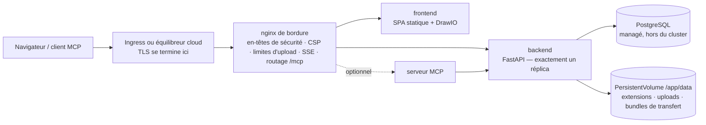

# Kubernetes et cloud

Turbo EA fournit un chart Helm : l'exécuter sur Kubernetes — Amazon EKS, Azure AKS, Google GKE ou tout cluster conforme — se résume à une commande, avec un serveur PostgreSQL que vous fournissez. Cette page décrit d'abord le chart, puis détaille chacun des trois grands clouds. Sur un hôte unique, la [configuration Docker Compose](../getting-started/setup.md) reste la voie la plus simple ; tout ce que la page [Exploitation et mises à niveau](operations.md) dit des mises à niveau, des sauvegardes et de la garde de `SECRET_KEY` s'applique ici sans changement. Vous préférez Terraform ? La page [Terraform](terraform.md) encapsule le chart dans un module `helm_release`.

## Ce que le chart déploie



- **Le nginx de bordure est le seul Service visé par un Ingress.** Il porte chaque en-tête de sécurité, la Content Security Policy, la limite de 512 Mo des imports de transfert d'espace de travail, les réglages du flux d'événements longue durée et le routage de `/mcp` et `/.well-known/oauth-*`. Routez **tout l'hôte** (`/`) vers lui et n'ajoutez jamais de réécriture de chemin.
- **Le backend tourne avec exactement un réplica**, et le chart refuse tout `backend.replicaCount`. Les événements temps réel sont diffusés par un bus interne au processus, le limiteur de débit et le cache des permissions sont internes, les migrations s'exécutent au démarrage et `/app/data` est un volume ReadWriteOnce. Le Deployment utilise la stratégie *Recreate* pour que deux backends ne migrent jamais le schéma ni ne montent le volume en même temps. Faites plutôt évoluer les Deployments `frontend` et `nginx` — le backend n'est pas le goulot d'étranglement d'un paysage typique.
- **PostgreSQL n'est pas inclus.** Pointez le chart vers une base managée (la [configuration recommandée](operations.md#managed-postgresql)) ou vers un cluster géré par un opérateur comme CloudNativePG. Ollama n'est pas inclus non plus : définissez `ai.providerUrl` vers un point de terminaison externe si vous utilisez les suggestions IA.
- **TLS se termine à l'Ingress ou à l'équilibreur.** nginx déduit `X-Forwarded-Proto` de `publicUrl`, ce qui marque le cookie de session `secure`.

## Prérequis

- Kubernetes 1.27 ou plus récent, et Helm 3.8 ou plus récent (prise en charge des registres OCI).
- Un serveur PostgreSQL 14+ joignable depuis le cluster, avec une base et un rôle pour Turbo EA :
  ```sql
  CREATE USER turboea WITH PASSWORD 'votre-mot-de-passe';
  CREATE DATABASE turboea OWNER turboea;
  ```
- Un contrôleur d'ingress (ou une intégration d'équilibreur cloud) et, pour HTTPS, un certificat — cert-manager ou les certificats managés du cloud.
- Une StorageClass qui provisionne des volumes ReadWriteOnce (toutes les valeurs par défaut des clouds le font).

## Installation

Rédigez un `values.yaml` :

```yaml
publicUrl: https://ea.example.com          # l'origine ouverte par les utilisateurs — sans chemin ni barre finale
postgresql:
  host: postgres.example.internal
  database: turboea
  username: turboea
  password: "…"                            # ou utilisez existingSecret, ci-dessous
secretKey: "…"                             # openssl rand -base64 48
ingress:
  enabled: true
  className: nginx
  annotations:
    cert-manager.io/cluster-issuer: letsencrypt
    nginx.ingress.kubernetes.io/proxy-body-size: 512m
    nginx.ingress.kubernetes.io/proxy-read-timeout: "86400"
    nginx.ingress.kubernetes.io/proxy-send-timeout: "86400"
    nginx.ingress.kubernetes.io/proxy-buffering: "off"
  tls:
    - secretName: turbo-ea-tls
      hosts: [ea.example.com]
```

Installez en épinglant la version — la version du chart **est** la version de Turbo EA, donc `--version 2.141.0` installe les images `2.141.0` :

```bash
helm install turbo-ea oci://ghcr.io/vincentmakes/turbo-ea/charts/turbo-ea \
  --version 2.141.0 \
  --namespace turbo-ea --create-namespace \
  -f values.yaml --wait
```

`--wait` rend la main une fois que le backend a exécuté ses migrations et répond à travers nginx. Vérifiez puis inscrivez-vous :

```bash
helm test turbo-ea -n turbo-ea            # appelle /api/health et / à travers le nginx de bordure
kubectl get ingress -n turbo-ea           # attendez une adresse, puis ouvrez publicUrl
```

**Le premier utilisateur inscrit devient administrateur** — inscrivez-vous sans attendre. Sans Ingress, `kubectl port-forward -n turbo-ea svc/turbo-ea-nginx 8920:80` et `publicUrl: http://localhost:8920`, car l'URL du navigateur doit correspondre à `publicUrl` pour les cookies et CORS.

Chaque chart publié est signé avec cosign, comme les images : `cosign verify ghcr.io/vincentmakes/turbo-ea/charts/turbo-ea:2.141.0 --certificate-identity-regexp '^https://github.com/vincentmakes/turbo-ea/' --certificate-oidc-issuer https://token.actions.githubusercontent.com` (voir [Chaîne d'approvisionnement](supply-chain.md)).

## Les valeurs qui comptent

La liste complète et commentée se trouve dans le [`values.yaml`](https://github.com/vincentmakes/turbo-ea/blob/main/charts/turbo-ea/values.yaml) du chart. Celles qu'un exploitant définit :

| Valeur | Rôle |
|---|---|
| `publicUrl` | **Obligatoire.** Origine publique. Pilote le `server_name` et `X-Forwarded-Proto` de nginx, la liste CORS du backend et les URI de redirection OAuth du MCP. |
| `postgresql.host` / `port` / `database` / `username` | **Hôte obligatoire.** Le serveur PostgreSQL externe. |
| `existingSecret` | Nom d'un Secret portant `SECRET_KEY` et `POSTGRES_PASSWORD` (noms de clés configurables via `existingSecretKeys`). À préférer à `secretKey` / `postgresql.password` en clair. |
| `postgresql.pool.size` / `maxOverflow` | Budget de connexions du backend, 20 + 10 par défaut — à réduire pour une offre managée plafonnée ([budget de connexions](operations.md#check-the-connection-limit)). |
| `allowedOrigins` | Liste CORS ; par défaut l'origine de `publicUrl`. À définir quand l'application a plusieurs noms d'hôte. |
| `embedAllowedOrigins` | Sites autorisés à encadrer un diagramme publié (Confluence, un wiki). |
| `backend.persistence.*` | Le volume `/app/data` : `size`, `storageClass`, ou `existingClaim` pour apporter le vôtre. Conservé au `helm uninstall`. |
| `backend.extraEnv` / `extraEnvFrom` | Toute variable backend de la configuration Compose — `SMTP_*`, `TURBO_EA_PROXY_AUTH_*`, `NVD_API_KEY`, `EXTENSION_*`. |
| `ai.providerUrl` / `ai.model` | Point de terminaison LLM externe pour les suggestions IA. |
| `mcp.enabled` | Déployer le serveur MCP sur `<publicUrl>/mcp`. |
| `ingress.*` | Classe, annotations, TLS. Les hôtes valent par défaut l'hôte de `publicUrl`, chemin `/`. |
| `frontend.replicaCount` / `nginx.replicaCount`, `autoscaling`, `pdb` | Montée en charge des couches sans état. |
| `networkPolicy.enabled` | Politiques de refus par défaut entre les couches (egress désactivé par défaut — voir le fichier de valeurs). |
| `global.imageRegistry` / `imagePullSecrets` | Tirer depuis un miroir sur un cluster isolé. |
| `seed.demo` | Charger le paysage de démonstration NexaTech au premier démarrage. Jamais sur des données réelles. |

## Secrets

`SECRET_KEY` signe chaque session et chiffre chaque secret stocké (SSO, SMTP). Le perdre invalide toutes les sessions et tous les réglages chiffrés : sauvegardez-le avec la base. Deux façons de le fournir, ainsi que le mot de passe de la base :

- **En clair** (`secretKey`, `postgresql.password`) : le chart écrit un Secret qu'il gère. Convient à une évaluation ; les valeurs vivent alors dans votre historique Helm.
- **`existingSecret`** (recommandé) : un Secret que vous créez — à la main, avec Sealed Secrets, ou synchronisé depuis AWS Secrets Manager / Azure Key Vault / Google Secret Manager par l'[External Secrets Operator](https://external-secrets.io/). Le chart ne fait que le référencer :

```bash
kubectl create secret generic turbo-ea-credentials -n turbo-ea \
  --from-literal=SECRET_KEY="$(openssl rand -base64 48)" \
  --from-literal=POSTGRES_PASSWORD='…'
```

Un `ExternalSecret` peut voyager dans la release via `extraObjects`. Changer le mot de passe de la base implique de redémarrer le backend (`kubectl rollout restart deployment/turbo-ea-backend`) ; changer `SECRET_KEY` déconnecte tout le monde et oblige à ressaisir les réglages chiffrés.

Les mots de passe contenant des caractères réservés des URL (`@ / : # ? %`) fonctionnent : le backend les encode en pourcentage.

## Stockage

`/app/data` contient les extensions installées, les uploads d'extensions et de migration de plateforme, et les bundles de transfert d'espace de travail ; le contenu des fiches et des diagrammes vit dans PostgreSQL. Le chart crée un PersistentVolumeClaim ReadWriteOnce (`10Gi` par défaut) annoté `helm.sh/resource-policy: keep`, si bien que `helm uninstall` le laisse en place — supprimez-le à la main quand vous le voulez vraiment. Utilisez `backend.persistence.existingClaim` pour apporter un volume restauré, et une StorageClass à liaison `WaitForFirstConsumer` (toutes les valeurs par défaut des clouds) pour que le volume soit créé dans la zone où atterrit le pod.

Sauvegardez-le avec les VolumeSnapshots de votre pilote CSI au même rythme que la base, et restaurez les deux ensemble — les [règles de retour arrière](operations.md#rollback-and-recovery) s'appliquent comme pour le volume Compose `backend_data`.

## Ingress et TLS

Le chart génère une règle d'Ingress — l'hôte de `publicUrl`, chemin `/`, `pathType: Prefix`, backend = le Service nginx. Cette règle unique est voulue : `/.well-known/oauth-*`, `/mcp` et `/embed/` doivent atteindre le nginx de bordure avec leurs chemins intacts ; n'ajoutez donc jamais d'annotation rewrite-target et ne répartissez pas les chemins entre plusieurs services.

Deux limites sont fixées sur le nginx de bordure mais doivent **aussi** être relevées sur le contrôleur en amont :

| Contrôleur | Taille d'upload (import d'espace de travail de 512 Mo) | Flux d'événements (SSE longue durée) |
|---|---|---|
| ingress-nginx, routage applicatif AKS | `nginx.ingress.kubernetes.io/proxy-body-size: 512m` | `proxy-read-timeout: "86400"`, `proxy-send-timeout: "86400"`, `proxy-buffering: "off"` |
| AWS Load Balancer Controller (ALB) | pas de limite | `alb.ingress.kubernetes.io/load-balancer-attributes: idle_timeout.timeout_seconds=4000` (maximum ALB ; le navigateur se reconnecte) |
| Azure Application Gateway (AGIC) | le mode prévention du WAF plafonne les corps — relevez la limite d'upload ou excluez le chemin d'import | `appgw.ingress.kubernetes.io/request-timeout: "86400"` |
| GKE (GCE) | pas de limite | `BackendConfig` avec `timeoutSec: 86400` (voir la section GCP) |

Pour TLS, soit un bloc `tls:` cert-manager sur l'Ingress, soit le certificat managé du cloud (ACM, ManagedCertificate GKE) avec TLS sur l'équilibreur. Dans le cluster, le trafic vers nginx est en HTTP simple ; c'est un `publicUrl` commençant par `https://` qui rend le cookie `secure`.

## Mises à niveau

```bash
helm upgrade turbo-ea oci://ghcr.io/vincentmakes/turbo-ea/charts/turbo-ea \
  --version 2.142.0 -n turbo-ea -f values.yaml --wait
```

Les migrations s'exécutent au démarrage du nouveau pod backend, exactement comme avec Compose : *Recreate* arrête l'ancien pod, le nouveau migre, alimente les ajouts du métamodèle et ne répond à `/api/health` qu'ensuite. La sonde de démarrage accorde cinq minutes par défaut (`backend.startupProbe.failureThreshold`) ; augmentez-la, ainsi que `--timeout`, pour une très grande base. Lisez d'abord les notes de version, faites une sauvegarde et n'exécutez jamais un backend plus ancien contre un schéma plus récent — un retour arrière, c'est *restaurer la base et le volume, puis réinstaller la version précédente du chart*, jamais une simple rétrogradation du chart. Voir [Fonctionnement des mises à niveau](operations.md#how-upgrades-work-alembic-migrations).

## Durcissement

Chaque conteneur tourne avec l'uid 1000, un système de fichiers racine en lecture seule, sans capabilities, sans élévation de privilèges et avec le profil seccomp `RuntimeDefault` ; le jeton du ServiceAccount n'est pas monté. Cela satisfait d'emblée le Pod Security Standard *restricted*. `networkPolicy.enabled: true` ajoute des politiques de refus par défaut entre les couches (définissez `networkPolicy.ingressController` sur le label d'espace de noms de votre contrôleur) ; les règles d'egress sont optionnelles car le backend parle aussi au magasin d'extensions, à endoflife.date, à la NVD, à votre serveur SMTP et à votre point de terminaison LLM. Les contrôleurs d'admission qui vérifient les signatures peuvent épingler les images et le chart à l'identité cosign ci-dessus.

## AWS (EKS)

**Base de données.** Amazon RDS for PostgreSQL ou Aurora PostgreSQL dans le VPC du cluster. Autorisez le port 5432 depuis le groupe de sécurité des nœuds (ou celui des pods avec les security groups for pods). RDS impose TLS par défaut (`rds.force_ssl`) ; le backend le négocie sans configuration.

**Stockage.** Le module EBS CSI avec une StorageClass `gp3` (liaison `WaitForFirstConsumer`).

**Ingress.** L'AWS Load Balancer Controller crée un Application Load Balancer à partir d'un Ingress de classe `alb`. Terminez-y TLS avec un certificat ACM, pointez le contrôle de santé vers `/api/health` (le `/` par défaut est servi par le frontend et ne dit rien du backend) et montez le délai d'inactivité au maximum de 4000 secondes pour le flux d'événements. L'ALB ne plafonne pas les corps.

**Secrets.** Stockez `SECRET_KEY` et le mot de passe de la base dans AWS Secrets Manager et synchronisez-les avec l'External Secrets Operator (IRSA sur son ServiceAccount) ; les pods Turbo EA eux-mêmes n'ont besoin d'aucune identité AWS.

Partez de [`examples/values-aws.yaml`](https://github.com/vincentmakes/turbo-ea/blob/main/charts/turbo-ea/examples/values-aws.yaml) :

```yaml
publicUrl: https://ea.example.com
existingSecret: turbo-ea-credentials
postgresql:
  host: turbo-ea.cluster-abc123.eu-central-1.rds.amazonaws.com
backend:
  persistence:
    storageClass: gp3
ingress:
  enabled: true
  className: alb
  annotations:
    alb.ingress.kubernetes.io/scheme: internet-facing
    alb.ingress.kubernetes.io/target-type: ip
    alb.ingress.kubernetes.io/listen-ports: '[{"HTTP": 80}, {"HTTPS": 443}]'
    alb.ingress.kubernetes.io/ssl-redirect: "443"
    alb.ingress.kubernetes.io/certificate-arn: arn:aws:acm:…
    alb.ingress.kubernetes.io/healthcheck-path: /api/health
    alb.ingress.kubernetes.io/load-balancer-attributes: idle_timeout.timeout_seconds=4000
```

## Azure (AKS)

**Base de données.** Azure Database for PostgreSQL – Flexible Server en accès privé (intégration VNet) au VNet du cluster, ou en accès public avec une règle de pare-feu pour l'IP sortante du cluster. TLS est obligatoire (`require_secure_transport`) et négocié automatiquement. Le nom d'utilisateur est le simple nom du rôle — la forme `user@server` appartenait au Single Server, retiré.

**Stockage.** Le pilote Azure Disk CSI avec la StorageClass intégrée `managed-csi`.

**Ingress.** Le module *routage applicatif* (`az aks approuting enable`) installe un ingress-nginx managé sous la classe `webapprouting.kubernetes.azure.com` ; utilisez les annotations ingress-nginx du tableau ci-dessus et un émetteur cert-manager ou un certificat Azure Key Vault. Avec l'Application Gateway Ingress Controller, définissez plutôt `appgw.ingress.kubernetes.io/request-timeout: "86400"` et, si une politique WAF est en mode prévention, relevez sa limite d'upload ou excluez le chemin d'import d'espace de travail.

**Identité.** La connexion Entra ID se configure dans Turbo EA ([SSO](sso.md)), pas sur le cluster. Les secrets se synchronisent depuis Key Vault via le Secrets Store CSI Driver ou l'External Secrets Operator avec l'identité de charge de travail.

Partez de [`examples/values-azure.yaml`](https://github.com/vincentmakes/turbo-ea/blob/main/charts/turbo-ea/examples/values-azure.yaml) :

```yaml
publicUrl: https://ea.example.com
existingSecret: turbo-ea-credentials
postgresql:
  host: turbo-ea.postgres.database.azure.com
backend:
  persistence:
    storageClass: managed-csi
ingress:
  enabled: true
  className: webapprouting.kubernetes.azure.com
  annotations:
    cert-manager.io/cluster-issuer: letsencrypt
    nginx.ingress.kubernetes.io/proxy-body-size: 512m
    nginx.ingress.kubernetes.io/proxy-read-timeout: "86400"
    nginx.ingress.kubernetes.io/proxy-send-timeout: "86400"
    nginx.ingress.kubernetes.io/proxy-buffering: "off"
  tls:
    - secretName: turbo-ea-tls
      hosts: [ea.example.com]
```

## Google Cloud (GKE)

**Base de données.** Cloud SQL for PostgreSQL avec une **IP privée** dans le même VPC (accès aux services privés). Un cluster VPC-native — GKE Standard ou Autopilot — l'atteint directement, donc ni sidecar proxy ni Workload Identity ne sont nécessaires : définissez `postgresql.host` sur l'adresse privée de l'instance. Si une politique impose le Cloud SQL Auth Proxy (authentification IAM, instance à IP publique), ajoutez-le comme sidecar via `backend.extraContainers`, définissez `postgresql.host: 127.0.0.1` et liez le ServiceAccount de la release à un compte de service Google avec Workload Identity ; le fichier d'exemple contient l'extrait.

**Stockage.** Le pilote Persistent Disk CSI avec la StorageClass `standard-rwo` (PD équilibré, `WaitForFirstConsumer`).

**Ingress.** Le contrôleur d'Ingress GKE (classe `gce`) construit un équilibreur HTTPS externe global. Son délai backend par défaut de 30 secondes couperait le flux d'événements toutes les demi-minutes : attachez donc une `BackendConfig` avec `timeoutSec: 86400` et le contrôle de santé `/api/health` au Service nginx (`nginx.service.annotations`), activez l'équilibrage natif conteneur avec l'annotation NEG, réservez une IP statique globale et utilisez un `ManagedCertificate` pour TLS. Les deux ressources personnalisées voyagent dans la release via `extraObjects`.

Partez de [`examples/values-gcp.yaml`](https://github.com/vincentmakes/turbo-ea/blob/main/charts/turbo-ea/examples/values-gcp.yaml) :

```yaml
publicUrl: https://ea.example.com
existingSecret: turbo-ea-credentials
postgresql:
  host: 10.20.0.3
backend:
  persistence:
    storageClass: standard-rwo
nginx:
  service:
    annotations:
      cloud.google.com/neg: '{"ingress": true}'
      cloud.google.com/backend-config: '{"default": "turbo-ea"}'
ingress:
  enabled: true
  className: gce
  annotations:
    kubernetes.io/ingress.global-static-ip-name: turbo-ea-ip
    networking.gke.io/managed-certificates: turbo-ea
    kubernetes.io/ingress.allow-http: "false"
extraObjects:
  - apiVersion: cloud.google.com/v1
    kind: BackendConfig
    metadata: {name: turbo-ea}
    spec:
      timeoutSec: 86400
      healthCheck: {type: HTTP, requestPath: /api/health, port: 8080}
  - apiVersion: networking.gke.io/v1
    kind: ManagedCertificate
    metadata: {name: turbo-ea}
    spec: {domains: [ea.example.com]}
```

## Services de conteneurs managés

Azure Container Apps, Google Cloud Run et AWS ECS Fargate exécutent les mêmes images sans Kubernetes, sous la forme d'un seul groupe de conteneurs avec le nginx de bordure, le frontend et le backend en sidecars. Les modèles prêts à l'emploi et les guides par plateforme — y compris ce que chaque plateforme ne sait pas faire — sont sur la page [Services de conteneurs managés](managed-containers.md).

## Dépannage

| Symptôme | Cause et remède |
|---|---|
| Les pods nginx ne passent jamais Ready, les journaux du backend sont sains | La sonde de disponibilité de nginx traverse le proxy vers `/api/health`. Vérifiez la valeur `NGINX_BACKEND_UPSTREAM` sur le pod nginx et que `clusterDomain` correspond à votre cluster (`cluster.local` par défaut). |
| La connexion boucle ou l'API répond 401 dans le navigateur | `publicUrl` ne correspond pas à l'URL de la barre d'adresse. Cookies et CORS y sont liés ; avec plusieurs noms d'hôte, définissez `allowedOrigins`. |
| `helm install --wait` expire sur le backend | Les migrations ou l'alimentation ont pris plus de temps que la sonde de démarrage n'en accorde — consultez `kubectl logs deployment/turbo-ea-backend`, puis augmentez `backend.startupProbe.failureThreshold` et `--timeout`. |
| Le backend journalise `too many connections` | L'offre managée plafonne les connexions sous `pool.size + pool.maxOverflow`. Réduisez le pool ([budget de connexions](operations.md#check-the-connection-limit)). |
| L'import d'espace de travail échoue à quelques mégaoctets | La limite de corps du contrôleur d'ingress, pas celle de nginx — voir le tableau sous *Ingress et TLS*. |
| Les mises à jour temps réel s'arrêtent après un intervalle fixe | Le délai d'inactivité ou de requête de l'équilibreur ferme le flux d'événements ; relevez-le selon le même tableau. Le navigateur se reconnecte, rien n'est perdu, mais l'intervalle de reconnexion apparaît comme une latence. |
| Les extensions disparaissent après un redémarrage | `backend.persistence.enabled` vaut `false`, ou le PVC a été supprimé. |
