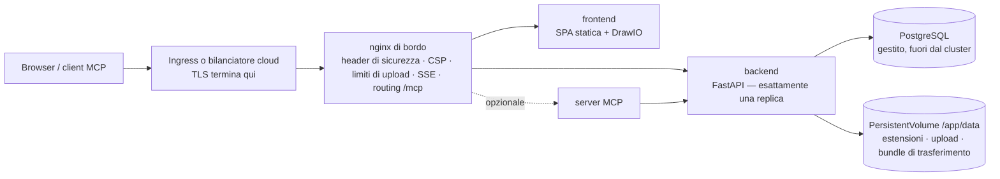

# Kubernetes e cloud

Turbo EA include un chart Helm: eseguirlo su Kubernetes — Amazon EKS, Azure AKS, Google GKE o qualsiasi cluster conforme — è un solo comando, con un server PostgreSQL fornito da voi. Questa pagina descrive prima il chart e poi illustra ciascuno dei tre grandi cloud. Su un singolo host, la [configurazione con Docker Compose](../getting-started/setup.md) resta la via più semplice; tutto ciò che la pagina [Operazioni e aggiornamenti](operations.md) dice su aggiornamenti, backup e custodia di `SECRET_KEY` vale qui senza modifiche. Preferisci Terraform? La pagina [Terraform](terraform.md) incapsula il chart in un modulo `helm_release`.

## Cosa distribuisce il chart



- **L'nginx di bordo è l'unico Service a cui punta un Ingress.** Possiede ogni header di sicurezza, la Content Security Policy, il limite di 512 MB per gli upload di trasferimento dell'area di lavoro, le impostazioni del flusso di eventi a lunga durata e il routing di `/mcp` e `/.well-known/oauth-*`. Instradate **l'intero host** (`/`) verso di esso e non aggiungete mai una riscrittura dei percorsi.
- **Il backend gira con esattamente una replica** e il chart rifiuta qualsiasi `backend.replicaCount`. Gli eventi in tempo reale sono distribuiti da un bus interno al processo, il limitatore di richieste e la cache dei permessi sono interni, le migrazioni girano all'avvio e `/app/data` è un volume ReadWriteOnce. Il Deployment usa la strategia *Recreate* perché due backend non migrino mai lo schema né montino il volume contemporaneamente. Scalate invece i Deployment `frontend` e `nginx`: il backend non è il collo di bottiglia di un panorama tipico.
- **PostgreSQL non è incluso.** Puntate il chart a un database gestito (la [configurazione consigliata](operations.md#managed-postgresql)) o a un cluster gestito da un operatore come CloudNativePG. Nemmeno Ollama è incluso: impostate `ai.providerUrl` su un endpoint esterno se usate i suggerimenti IA.
- **TLS termina sull'Ingress o sul bilanciatore.** nginx ricava `X-Forwarded-Proto` da `publicUrl`, ed è ciò che segna il cookie di sessione come `secure`.

## Prerequisiti

- Kubernetes 1.27 o successivo e Helm 3.8 o successivo (supporto dei registri OCI).
- Un server PostgreSQL 14+ raggiungibile dal cluster, con un database e un ruolo per Turbo EA:
  ```sql
  CREATE USER turboea WITH PASSWORD 'la-vostra-password';
  CREATE DATABASE turboea OWNER turboea;
  ```
- Un ingress controller (o un'integrazione con il bilanciatore cloud) e, per HTTPS, un certificato: cert-manager o i certificati gestiti del cloud.
- Una StorageClass che fornisca volumi ReadWriteOnce (tutte quelle predefinite dei cloud lo fanno).

## Installazione

Scrivete un `values.yaml`:

```yaml
publicUrl: https://ea.example.com          # l'origine aperta dagli utenti — senza percorso né barra finale
postgresql:
  host: postgres.example.internal
  database: turboea
  username: turboea
  password: "…"                            # oppure usate existingSecret, più sotto
secretKey: "…"                             # openssl rand -base64 48
ingress:
  enabled: true
  className: nginx
  annotations:
    cert-manager.io/cluster-issuer: letsencrypt
    nginx.ingress.kubernetes.io/proxy-body-size: 512m
    nginx.ingress.kubernetes.io/proxy-read-timeout: "86400"
    nginx.ingress.kubernetes.io/proxy-send-timeout: "86400"
    nginx.ingress.kubernetes.io/proxy-buffering: "off"
  tls:
    - secretName: turbo-ea-tls
      hosts: [ea.example.com]
```

Installate fissando la versione: la versione del chart **è** la versione di Turbo EA, quindi `--version 2.141.0` installa le immagini `2.141.0`:

```bash
helm install turbo-ea oci://ghcr.io/vincentmakes/turbo-ea/charts/turbo-ea \
  --version 2.141.0 \
  --namespace turbo-ea --create-namespace \
  -f values.yaml --wait
```

`--wait` ritorna quando il backend ha eseguito le migrazioni e risponde attraverso nginx. Poi verificate e registratevi:

```bash
helm test turbo-ea -n turbo-ea            # interroga /api/health e / attraverso l'nginx di bordo
kubectl get ingress -n turbo-ea           # attendete un indirizzo, poi aprite publicUrl
```

**Il primo utente che si registra diventa amministratore**: registratevi subito. Senza Ingress, `kubectl port-forward -n turbo-ea svc/turbo-ea-nginx 8920:80` e `publicUrl: http://localhost:8920`, perché l'URL del browser deve coincidere con `publicUrl` per cookie e CORS.

Ogni chart pubblicato è firmato con cosign, come le immagini: `cosign verify ghcr.io/vincentmakes/turbo-ea/charts/turbo-ea:2.141.0 --certificate-identity-regexp '^https://github.com/vincentmakes/turbo-ea/' --certificate-oidc-issuer https://token.actions.githubusercontent.com` (vedere [Catena di fornitura](supply-chain.md)).

## I valori che contano

L'elenco completo e commentato è nel [`values.yaml`](https://github.com/vincentmakes/turbo-ea/blob/main/charts/turbo-ea/values.yaml) del chart. Quelli che un operatore imposta:

| Valore | Scopo |
|---|---|
| `publicUrl` | **Obbligatorio.** Origine pubblica. Governa `server_name` e `X-Forwarded-Proto` di nginx, l'elenco CORS del backend e gli URI di reindirizzamento OAuth dell'MCP. |
| `postgresql.host` / `port` / `database` / `username` | **Host obbligatorio.** Il server PostgreSQL esterno. |
| `existingSecret` | Nome di un Secret con `SECRET_KEY` e `POSTGRES_PASSWORD` (nomi delle chiavi configurabili tramite `existingSecretKeys`). Da preferire a `secretKey` / `postgresql.password` in chiaro. |
| `postgresql.pool.size` / `maxOverflow` | Budget di connessioni del backend, 20 + 10 per impostazione predefinita; riducetelo con un piano gestito dal tetto basso ([budget di connessioni](operations.md#check-the-connection-limit)). |
| `allowedOrigins` | Elenco CORS; per impostazione predefinita l'origine di `publicUrl`. Impostatelo quando l'app ha più nomi host. |
| `embedAllowedOrigins` | Siti autorizzati a incorporare un diagramma pubblicato (Confluence, un wiki). |
| `backend.persistence.*` | Il volume `/app/data`: `size`, `storageClass` oppure `existingClaim` per portarne uno vostro. Conservato con `helm uninstall`. |
| `backend.extraEnv` / `extraEnvFrom` | Qualsiasi variabile backend della configurazione Compose: `SMTP_*`, `TURBO_EA_PROXY_AUTH_*`, `NVD_API_KEY`, `EXTENSION_*`. |
| `ai.providerUrl` / `ai.model` | Endpoint LLM esterno per i suggerimenti IA. |
| `mcp.enabled` | Distribuire il server MCP su `<publicUrl>/mcp`. |
| `ingress.*` | Classe, annotazioni, TLS. Gli host valgono per impostazione predefinita l'host di `publicUrl`, percorso `/`. |
| `frontend.replicaCount` / `nginx.replicaCount`, `autoscaling`, `pdb` | Scalabilità dei livelli senza stato. |
| `networkPolicy.enabled` | Policy di rifiuto predefinito tra i livelli (egress disattivato per impostazione predefinita; vedere il file dei valori). |
| `global.imageRegistry` / `imagePullSecrets` | Scaricare da un mirror in un cluster isolato. |
| `seed.demo` | Caricare il panorama demo NexaTech al primo avvio. Mai su dati reali. |

## Segreti

`SECRET_KEY` firma ogni sessione e cifra ogni segreto memorizzato (SSO, SMTP). Perderla invalida tutte le sessioni e tutte le impostazioni cifrate: conservatela insieme al database. Due modi per fornirla insieme alla password del database:

- **In chiaro** (`secretKey`, `postgresql.password`): il chart scrive un Secret che gestisce lui stesso. Va bene per una valutazione; i valori restano poi nella cronologia di Helm.
- **`existingSecret`** (consigliato): un Secret che create voi — a mano, con Sealed Secrets, o sincronizzato da AWS Secrets Manager / Azure Key Vault / Google Secret Manager tramite l'[External Secrets Operator](https://external-secrets.io/). Il chart lo referenzia soltanto:

```bash
kubectl create secret generic turbo-ea-credentials -n turbo-ea \
  --from-literal=SECRET_KEY="$(openssl rand -base64 48)" \
  --from-literal=POSTGRES_PASSWORD='…'
```

Un `ExternalSecret` può viaggiare nella release tramite `extraObjects`. Ruotare la password del database richiede il riavvio del backend (`kubectl rollout restart deployment/turbo-ea-backend`); ruotare `SECRET_KEY` disconnette tutti e obbliga a reinserire le impostazioni cifrate.

Le password con caratteri riservati degli URL (`@ / : # ? %`) funzionano: il backend le codifica in percentuale.

## Archiviazione

`/app/data` contiene le estensioni installate, gli upload di estensioni e di migrazione della piattaforma e i bundle di trasferimento dell'area di lavoro; il contenuto di schede e diagrammi risiede in PostgreSQL. Il chart crea un PersistentVolumeClaim ReadWriteOnce (`10Gi` per impostazione predefinita) annotato con `helm.sh/resource-policy: keep`, così `helm uninstall` lo lascia al suo posto: cancellatelo a mano quando lo volete davvero. Usate `backend.persistence.existingClaim` per portare un volume ripristinato e una StorageClass con binding `WaitForFirstConsumer` (tutte quelle predefinite dei cloud) perché il volume sia creato nella zona in cui atterra il pod.

Fate il backup con i VolumeSnapshot del vostro driver CSI con la stessa cadenza del database e ripristinate entrambi insieme: le [regole di rollback](operations.md#rollback-and-recovery) valgono come per il volume `backend_data` di Compose.

## Ingress e TLS

Il chart genera una regola di Ingress: l'host di `publicUrl`, percorso `/`, `pathType: Prefix`, backend = il Service di nginx. Questa singola regola è voluta: `/.well-known/oauth-*`, `/mcp` e `/embed/` devono raggiungere l'nginx di bordo con i percorsi intatti, quindi non aggiungete mai un'annotazione rewrite-target né dividete i percorsi tra più servizi.

Due limiti sono impostati sull'nginx di bordo ma vanno alzati **anche** sul controller che lo precede:

| Controller | Dimensione upload (importazione area di lavoro da 512 MB) | Flusso di eventi (SSE a lunga durata) |
|---|---|---|
| ingress-nginx, routing applicativo AKS | `nginx.ingress.kubernetes.io/proxy-body-size: 512m` | `proxy-read-timeout: "86400"`, `proxy-send-timeout: "86400"`, `proxy-buffering: "off"` |
| AWS Load Balancer Controller (ALB) | nessun limite | `alb.ingress.kubernetes.io/load-balancer-attributes: idle_timeout.timeout_seconds=4000` (massimo ALB; il browser si riconnette) |
| Azure Application Gateway (AGIC) | la modalità di prevenzione del WAF limita i body: alzate il limite di upload o escludete il percorso di importazione | `appgw.ingress.kubernetes.io/request-timeout: "86400"` |
| GKE (GCE) | nessun limite | `BackendConfig` con `timeoutSec: 86400` (vedere la sezione GCP) |

Per TLS, o un blocco `tls:` di cert-manager sull'Ingress, oppure il certificato gestito del cloud (ACM, ManagedCertificate di GKE) con TLS sul bilanciatore. Nel cluster il traffico verso nginx è HTTP semplice; è un `publicUrl` che inizia con `https://` a rendere `secure` il cookie.

## Aggiornamenti

```bash
helm upgrade turbo-ea oci://ghcr.io/vincentmakes/turbo-ea/charts/turbo-ea \
  --version 2.142.0 -n turbo-ea -f values.yaml --wait
```

Le migrazioni girano all'avvio del nuovo pod backend, esattamente come in Compose: *Recreate* ferma il pod vecchio, il nuovo migra, popola le aggiunte del metamodello e solo allora risponde su `/api/health`. La sonda di avvio concede cinque minuti per impostazione predefinita (`backend.startupProbe.failureThreshold`); alzatela, insieme a `--timeout`, per un database molto grande. Leggete prima le note di rilascio, fate un backup e non eseguite mai un backend più vecchio contro uno schema più nuovo: un rollback è *ripristinare database e volume, poi reinstallare la versione precedente del chart*, mai un semplice downgrade del chart. Vedere [Come funzionano gli aggiornamenti](operations.md#how-upgrades-work-alembic-migrations).

## Hardening

Ogni container gira come uid 1000 con file system radice in sola lettura, senza capability, senza escalation di privilegi e con il profilo seccomp `RuntimeDefault`; il token della ServiceAccount non viene montato. Ciò soddisfa da subito il Pod Security Standard *restricted*. `networkPolicy.enabled: true` aggiunge policy di rifiuto predefinito tra i livelli (impostate `networkPolicy.ingressController` sull'etichetta di namespace del vostro controller); le regole di egress sono opzionali perché il backend parla anche con lo store delle estensioni, endoflife.date, l'NVD, il vostro server SMTP e il vostro endpoint LLM. I controller di ammissione che verificano le firme possono vincolare immagini e chart all'identità cosign indicata sopra.

## AWS (EKS)

**Database.** Amazon RDS for PostgreSQL o Aurora PostgreSQL nella VPC del cluster. Consentite la porta 5432 dal gruppo di sicurezza dei nodi (o da quello dei pod con i security groups for pods). RDS impone TLS per impostazione predefinita (`rds.force_ssl`); il backend lo negozia senza configurazione.

**Archiviazione.** Il componente EBS CSI con una StorageClass `gp3` (binding `WaitForFirstConsumer`).

**Ingress.** L'AWS Load Balancer Controller crea un Application Load Balancer da un Ingress di classe `alb`. Terminate lì TLS con un certificato ACM, puntate il controllo di integrità a `/api/health` (la `/` predefinita è servita dal frontend e non dice nulla del backend) e alzate l'idle timeout al massimo di 4000 secondi per il flusso di eventi. L'ALB non limita i body.

**Segreti.** Conservate `SECRET_KEY` e la password del database in AWS Secrets Manager e sincronizzatele con l'External Secrets Operator (IRSA sulla sua ServiceAccount); i pod di Turbo EA non hanno bisogno di alcuna identità AWS.

Partite da [`examples/values-aws.yaml`](https://github.com/vincentmakes/turbo-ea/blob/main/charts/turbo-ea/examples/values-aws.yaml):

```yaml
publicUrl: https://ea.example.com
existingSecret: turbo-ea-credentials
postgresql:
  host: turbo-ea.cluster-abc123.eu-central-1.rds.amazonaws.com
backend:
  persistence:
    storageClass: gp3
ingress:
  enabled: true
  className: alb
  annotations:
    alb.ingress.kubernetes.io/scheme: internet-facing
    alb.ingress.kubernetes.io/target-type: ip
    alb.ingress.kubernetes.io/listen-ports: '[{"HTTP": 80}, {"HTTPS": 443}]'
    alb.ingress.kubernetes.io/ssl-redirect: "443"
    alb.ingress.kubernetes.io/certificate-arn: arn:aws:acm:…
    alb.ingress.kubernetes.io/healthcheck-path: /api/health
    alb.ingress.kubernetes.io/load-balancer-attributes: idle_timeout.timeout_seconds=4000
```

## Azure (AKS)

**Database.** Azure Database for PostgreSQL – Flexible Server con accesso privato (integrazione VNet) alla VNet del cluster, oppure con accesso pubblico e una regola firewall per l'IP in uscita del cluster. TLS è obbligatorio (`require_secure_transport`) e negoziato automaticamente. Il nome utente è il semplice nome del ruolo: la forma `user@server` apparteneva al ritirato Single Server.

**Archiviazione.** Il driver Azure Disk CSI con la StorageClass integrata `managed-csi`.

**Ingress.** Il componente *application routing* (`az aks approuting enable`) installa un ingress-nginx gestito con la classe `webapprouting.kubernetes.azure.com`; usate le annotazioni ingress-nginx della tabella sopra e un issuer cert-manager o un certificato di Azure Key Vault. Con l'Application Gateway Ingress Controller impostate invece `appgw.ingress.kubernetes.io/request-timeout: "86400"` e, se una policy WAF è in modalità prevenzione, alzate il limite di upload dei file o escludete il percorso di importazione dell'area di lavoro.

**Identità.** L'accesso con Entra ID si configura dentro Turbo EA ([SSO](sso.md)), non sul cluster. I segreti si sincronizzano da Key Vault tramite il Secrets Store CSI Driver o l'External Secrets Operator con workload identity.

Partite da [`examples/values-azure.yaml`](https://github.com/vincentmakes/turbo-ea/blob/main/charts/turbo-ea/examples/values-azure.yaml):

```yaml
publicUrl: https://ea.example.com
existingSecret: turbo-ea-credentials
postgresql:
  host: turbo-ea.postgres.database.azure.com
backend:
  persistence:
    storageClass: managed-csi
ingress:
  enabled: true
  className: webapprouting.kubernetes.azure.com
  annotations:
    cert-manager.io/cluster-issuer: letsencrypt
    nginx.ingress.kubernetes.io/proxy-body-size: 512m
    nginx.ingress.kubernetes.io/proxy-read-timeout: "86400"
    nginx.ingress.kubernetes.io/proxy-send-timeout: "86400"
    nginx.ingress.kubernetes.io/proxy-buffering: "off"
  tls:
    - secretName: turbo-ea-tls
      hosts: [ea.example.com]
```

## Google Cloud (GKE)

**Database.** Cloud SQL for PostgreSQL con **IP privato** nella stessa VPC (accesso ai servizi privati). Un cluster VPC-native — GKE Standard o Autopilot — lo raggiunge direttamente, quindi non servono né sidecar proxy né Workload Identity: impostate `postgresql.host` sull'indirizzo privato dell'istanza. Se una policy impone il Cloud SQL Auth Proxy (autenticazione IAM, istanza con IP pubblico), aggiungetelo come sidecar tramite `backend.extraContainers`, impostate `postgresql.host: 127.0.0.1` e associate la ServiceAccount della release a un account di servizio Google con Workload Identity; il file di esempio contiene il frammento.

**Archiviazione.** Il driver Persistent Disk CSI con la StorageClass `standard-rwo` (PD bilanciato, `WaitForFirstConsumer`).

**Ingress.** Il controller Ingress di GKE (classe `gce`) costruisce un bilanciatore HTTPS esterno globale. Il suo timeout di backend predefinito di 30 secondi taglierebbe il flusso di eventi ogni mezzo minuto: collegate quindi una `BackendConfig` con `timeoutSec: 86400` e il controllo di integrità `/api/health` al Service di nginx (`nginx.service.annotations`), attivate il bilanciamento container-native con l'annotazione NEG, riservate un IP statico globale e usate un `ManagedCertificate` per TLS. Entrambe le risorse personalizzate viaggiano nella release tramite `extraObjects`.

Partite da [`examples/values-gcp.yaml`](https://github.com/vincentmakes/turbo-ea/blob/main/charts/turbo-ea/examples/values-gcp.yaml):

```yaml
publicUrl: https://ea.example.com
existingSecret: turbo-ea-credentials
postgresql:
  host: 10.20.0.3
backend:
  persistence:
    storageClass: standard-rwo
nginx:
  service:
    annotations:
      cloud.google.com/neg: '{"ingress": true}'
      cloud.google.com/backend-config: '{"default": "turbo-ea"}'
ingress:
  enabled: true
  className: gce
  annotations:
    kubernetes.io/ingress.global-static-ip-name: turbo-ea-ip
    networking.gke.io/managed-certificates: turbo-ea
    kubernetes.io/ingress.allow-http: "false"
extraObjects:
  - apiVersion: cloud.google.com/v1
    kind: BackendConfig
    metadata: {name: turbo-ea}
    spec:
      timeoutSec: 86400
      healthCheck: {type: HTTP, requestPath: /api/health, port: 8080}
  - apiVersion: networking.gke.io/v1
    kind: ManagedCertificate
    metadata: {name: turbo-ea}
    spec: {domains: [ea.example.com]}
```

## Servizi di container gestiti

Azure Container Apps, Google Cloud Run e AWS ECS Fargate eseguono le stesse immagini senza Kubernetes, come un unico gruppo di container con l'nginx di bordo, il frontend e il backend come sidecar. I modelli pronti da modificare e le guide per piattaforma — compreso ciò che ogni piattaforma non può fare — sono nella pagina [Servizi di container gestiti](managed-containers.md).

## Risoluzione dei problemi

| Sintomo | Causa e rimedio |
|---|---|
| I pod nginx non diventano mai Ready, i log del backend sono sani | La sonda di readiness di nginx passa dal proxy verso `/api/health`. Controllate il valore di `NGINX_BACKEND_UPSTREAM` sul pod nginx e che `clusterDomain` corrisponda al vostro cluster (`cluster.local` per impostazione predefinita). |
| L'accesso va in loop o l'API risponde 401 nel browser | `publicUrl` non corrisponde all'URL nella barra degli indirizzi. Cookie e CORS vi sono legati; con più nomi host impostate `allowedOrigins`. |
| `helm install --wait` va in timeout sul backend | Migrazioni o popolamento hanno richiesto più tempo di quanto consenta la sonda di avvio: controllate `kubectl logs deployment/turbo-ea-backend`, poi alzate `backend.startupProbe.failureThreshold` e `--timeout`. |
| Il backend registra `too many connections` | Il piano gestito limita le connessioni sotto `pool.size + pool.maxOverflow`. Riducete il pool ([budget di connessioni](operations.md#check-the-connection-limit)). |
| L'importazione dell'area di lavoro fallisce a pochi megabyte | È il limite di body dell'ingress controller, non quello di nginx: vedere la tabella in *Ingress e TLS*. |
| Gli aggiornamenti in tempo reale si fermano dopo un intervallo fisso | L'idle o request timeout del bilanciatore chiude il flusso di eventi; alzatelo secondo la stessa tabella. Il browser si riconnette, nulla va perso, ma l'intervallo di riconnessione appare come un ritardo. |
| Le estensioni spariscono dopo un riavvio | `backend.persistence.enabled` è `false`, oppure il PVC è stato eliminato. |
