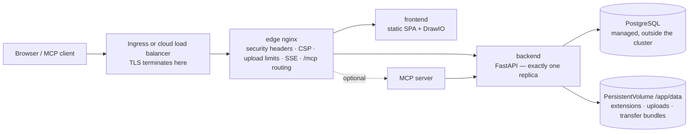

# Kubernetes & Cloud

Turbo EA ships a Helm chart, so running it on Kubernetes — Amazon EKS, Azure AKS, Google GKE or any conformant cluster — is one command against a PostgreSQL server you provide. This page covers the chart itself and then walks through each of the three big clouds. If you run a single host, the [Docker Compose setup](../getting-started/setup.md) remains the simplest path; everything on the [Operations & Upgrades](operations.md) page about upgrades, backups and `SECRET_KEY` custody applies here unchanged. Prefer Terraform? The [Terraform](terraform.md) page wraps the chart in a `helm_release` module.

## What the chart deploys



- **The edge nginx is the only Service an Ingress targets.** It owns every security header, the Content Security Policy, the 512 MB limit on workspace-transfer uploads, the long-lived event-stream settings and the routing of `/mcp` and `/.well-known/oauth-*`. Route the **whole host** (`/`) to it and never add a path rewrite.
- **The backend runs as exactly one replica**, and the chart refuses a `backend.replicaCount`. Real-time events fan out from an in-process bus, the rate limiter and permission cache are in-process, database migrations run at boot, and `/app/data` is a ReadWriteOnce volume. The Deployment uses the *Recreate* strategy so two backends never migrate the schema or bind the volume at once. Scale the `frontend` and `nginx` Deployments instead — the backend is not the bottleneck for a typical landscape.
- **PostgreSQL is not included.** Point the chart at a managed database (the [recommended setup](operations.md#managed-postgresql)) or at an operator-managed cluster such as CloudNativePG. Ollama is not included either: set `ai.providerUrl` to an external endpoint if you use AI suggestions.
- **TLS terminates at the Ingress or load balancer.** nginx derives `X-Forwarded-Proto` from `publicUrl`, which is what marks the session cookie `secure`.

## Prerequisites

- Kubernetes 1.27 or newer, and Helm 3.8 or newer (OCI registry support).
- A PostgreSQL 14+ server reachable from the cluster, with a database and a role for Turbo EA:
  ```sql
  CREATE USER turboea WITH PASSWORD 'your-password';
  CREATE DATABASE turboea OWNER turboea;
  ```
- An ingress controller (or a cloud load-balancer integration) and, for HTTPS, a certificate — cert-manager or the cloud's managed certificates.
- A StorageClass that provisions ReadWriteOnce volumes (every cloud default does).

## Install

Write a `values.yaml`:

```yaml
publicUrl: https://ea.example.com          # the origin users open — no path, no trailing slash
postgresql:
  host: postgres.example.internal
  database: turboea
  username: turboea
  password: "…"                            # or use existingSecret, below
secretKey: "…"                             # openssl rand -base64 48
ingress:
  enabled: true
  className: nginx
  annotations:
    cert-manager.io/cluster-issuer: letsencrypt
    nginx.ingress.kubernetes.io/proxy-body-size: 512m
    nginx.ingress.kubernetes.io/proxy-read-timeout: "86400"
    nginx.ingress.kubernetes.io/proxy-send-timeout: "86400"
    nginx.ingress.kubernetes.io/proxy-buffering: "off"
  tls:
    - secretName: turbo-ea-tls
      hosts: [ea.example.com]
```

Install, pinning the version — the chart version **is** the Turbo EA version, so `--version 2.141.0` installs the `2.141.0` images:

```bash
helm install turbo-ea oci://ghcr.io/vincentmakes/turbo-ea/charts/turbo-ea \
  --version 2.141.0 \
  --namespace turbo-ea --create-namespace \
  -f values.yaml --wait
```

`--wait` returns once the backend has run its migrations and answers through nginx. Then verify and register:

```bash
helm test turbo-ea -n turbo-ea            # curls /api/health and / through the edge nginx
kubectl get ingress -n turbo-ea           # wait for an address, then open publicUrl
```

**The first user to register becomes the administrator** — register straight away. Without an Ingress, `kubectl port-forward -n turbo-ea svc/turbo-ea-nginx 8920:80` and set `publicUrl: http://localhost:8920`, since the browser URL must match `publicUrl` for cookies and CORS.

Every published chart is signed with cosign, like the images: `cosign verify ghcr.io/vincentmakes/turbo-ea/charts/turbo-ea:2.141.0 --certificate-identity-regexp '^https://github.com/vincentmakes/turbo-ea/' --certificate-oidc-issuer https://token.actions.githubusercontent.com` (see [Supply chain](supply-chain.md)).

## Values that matter

The full, commented list is in the chart's [`values.yaml`](https://github.com/vincentmakes/turbo-ea/blob/main/charts/turbo-ea/values.yaml). The ones an operator sets:

| Value | Purpose |
|---|---|
| `publicUrl` | **Required.** Public origin. Drives nginx's `server_name` and `X-Forwarded-Proto`, the backend's CORS list and the MCP OAuth redirect URIs. |
| `postgresql.host` / `port` / `database` / `username` | **Required host.** The external PostgreSQL server. |
| `existingSecret` | Name of a Secret carrying `SECRET_KEY` and `POSTGRES_PASSWORD` (key names configurable via `existingSecretKeys`). Preferred over inline `secretKey` / `postgresql.password`. |
| `postgresql.pool.size` / `maxOverflow` | The backend's connection budget, 20 + 10 by default — shrink it for a managed plan with a low cap ([connection budget](operations.md#check-the-connection-limit)). |
| `allowedOrigins` | CORS allow-list; defaults to the origin of `publicUrl`. Set it when the app has several hostnames. |
| `embedAllowedOrigins` | Sites allowed to frame a published diagram (Confluence, a wiki). |
| `backend.persistence.*` | The `/app/data` volume: `size`, `storageClass`, or `existingClaim` to bring your own. Kept on `helm uninstall`. |
| `backend.extraEnv` / `extraEnvFrom` | Any backend variable from the Compose setup — `SMTP_*`, `TURBO_EA_PROXY_AUTH_*`, `NVD_API_KEY`, `EXTENSION_*`. |
| `ai.providerUrl` / `ai.model` | External LLM endpoint for AI suggestions. |
| `mcp.enabled` | Deploy the MCP server at `<publicUrl>/mcp`. |
| `ingress.*` | Class, annotations, TLS. Hosts default to the host of `publicUrl`, path `/`. |
| `frontend.replicaCount` / `nginx.replicaCount`, `autoscaling`, `pdb` | Scale-out for the stateless tiers. |
| `networkPolicy.enabled` | Default-deny policies between the tiers (egress off by default — see the values file). |
| `global.imageRegistry` / `imagePullSecrets` | Pull from a mirror on an air-gapped cluster. |
| `seed.demo` | Load the NexaTech demo landscape on first boot. Never on real data. |

## Secrets

`SECRET_KEY` signs every session and encrypts every stored secret (SSO, SMTP). Losing it invalidates all sessions and all encrypted settings, so back it up with the database. Two ways to supply it and the database password:

- **Inline** (`secretKey`, `postgresql.password`): the chart writes a Secret it manages. Fine for evaluation; the values then live in your Helm history.
- **`existingSecret`** (recommended): a Secret you create — by hand, with Sealed Secrets, or synced from AWS Secrets Manager / Azure Key Vault / Google Secret Manager by the [External Secrets Operator](https://external-secrets.io/). The chart only references it:

```bash
kubectl create secret generic turbo-ea-credentials -n turbo-ea \
  --from-literal=SECRET_KEY="$(openssl rand -base64 48)" \
  --from-literal=POSTGRES_PASSWORD='…'
```

An `ExternalSecret` can ride in the release through `extraObjects`. Rotating the database password means restarting the backend (`kubectl rollout restart deployment/turbo-ea-backend`); rotating `SECRET_KEY` logs everyone out and requires re-entering encrypted settings.

Passwords with URL-reserved characters (`@ / : # ? %`) are fine — the backend percent-encodes them.

## Storage

`/app/data` holds installed extensions, extension and platform-migration uploads and workspace-transfer bundles; card and diagram content lives in PostgreSQL. The chart creates one ReadWriteOnce PersistentVolumeClaim (`10Gi` by default) annotated `helm.sh/resource-policy: keep`, so `helm uninstall` leaves it in place — delete it by hand when you mean it. Use `backend.persistence.existingClaim` to bring a volume you restored, and a StorageClass with `WaitForFirstConsumer` binding (every cloud default) so the volume is created in the zone the pod lands in.

Back it up with your CSI driver's VolumeSnapshots on the same cadence as the database, and restore both together — the [rollback rules](operations.md#rollback-and-recovery) apply as they do to the Compose `backend_data` volume.

## Ingress and TLS

The chart renders one Ingress rule — the host of `publicUrl`, path `/`, `pathType: Prefix`, backend = the nginx Service. That single rule is deliberate: `/.well-known/oauth-*`, `/mcp` and `/embed/` must reach the edge nginx with their paths intact, so never add a rewrite-target annotation or split paths across services.

Two limits are set on the edge nginx but must **also** be raised on the controller in front of it:

| Controller | Upload size (512 MB workspace import) | Event stream (long-lived SSE) |
|---|---|---|
| ingress-nginx, AKS application routing | `nginx.ingress.kubernetes.io/proxy-body-size: 512m` | `proxy-read-timeout: "86400"`, `proxy-send-timeout: "86400"`, `proxy-buffering: "off"` |
| AWS Load Balancer Controller (ALB) | no limit | `alb.ingress.kubernetes.io/load-balancer-attributes: idle_timeout.timeout_seconds=4000` (the ALB maximum; the browser reconnects) |
| Azure Application Gateway (AGIC) | WAF prevention mode caps bodies — raise the file-upload limit or exclude the import path | `appgw.ingress.kubernetes.io/request-timeout: "86400"` |
| GKE (GCE) | no limit | `BackendConfig` with `timeoutSec: 86400` (see the GCP section) |

For TLS, either a cert-manager `tls:` block on the Ingress, or the cloud's managed certificate (ACM, GKE ManagedCertificate) with TLS on the load balancer. Inside the cluster, traffic to nginx is plain HTTP; `publicUrl` starting with `https://` is what makes the cookie `secure`.

## Upgrades

```bash
helm upgrade turbo-ea oci://ghcr.io/vincentmakes/turbo-ea/charts/turbo-ea \
  --version 2.142.0 -n turbo-ea -f values.yaml --wait
```

Migrations run when the new backend pod boots, exactly as in Compose: *Recreate* stops the old pod, the new one migrates, seeds any metamodel additions and only then answers `/api/health`. The startup probe allows five minutes by default (`backend.startupProbe.failureThreshold`); raise it, and `--timeout`, for a very large database. Read the release notes first, take a backup, and never run an older backend against a newer schema — a rollback is *restore the database and the volume, then reinstall the previous chart version*, never a chart downgrade alone. See [How upgrades work](operations.md#how-upgrades-work-alembic-migrations).

## Hardening

Every container runs as uid 1000 with a read-only root filesystem, no capabilities, no privilege escalation and the `RuntimeDefault` seccomp profile; the ServiceAccount token is not mounted. That satisfies the *restricted* Pod Security Standard out of the box. `networkPolicy.enabled: true` adds default-deny policies between the tiers (set `networkPolicy.ingressController` to your controller's namespace label); egress rules are opt-in because the backend also talks to the extension store, endoflife.date, the NVD, your SMTP server and your LLM endpoint. Admission controllers that verify signatures can pin the images and the chart to the cosign identity above.

## AWS (EKS)

**Database.** Amazon RDS for PostgreSQL or Aurora PostgreSQL in the cluster's VPC. Allow port 5432 from the node security group (or the pod security group with security groups for pods). RDS enforces TLS by default (`rds.force_ssl`); the backend negotiates it without configuration.

**Storage.** The EBS CSI add-on with a `gp3` StorageClass (`WaitForFirstConsumer` binding).

**Ingress.** The AWS Load Balancer Controller creates an Application Load Balancer from an Ingress of class `alb`. Terminate TLS on it with an ACM certificate, point the health check at `/api/health` (the default `/` is served by the frontend and says nothing about the backend), and raise the idle timeout to the 4000-second maximum for the event stream. Bodies are not capped by the ALB.

**Secrets.** Store `SECRET_KEY` and the database password in AWS Secrets Manager and sync them with the External Secrets Operator (IRSA on its ServiceAccount); the Turbo EA pods themselves need no AWS identity.

Start from [`examples/values-aws.yaml`](https://github.com/vincentmakes/turbo-ea/blob/main/charts/turbo-ea/examples/values-aws.yaml):

```yaml
publicUrl: https://ea.example.com
existingSecret: turbo-ea-credentials
postgresql:
  host: turbo-ea.cluster-abc123.eu-central-1.rds.amazonaws.com
backend:
  persistence:
    storageClass: gp3
ingress:
  enabled: true
  className: alb
  annotations:
    alb.ingress.kubernetes.io/scheme: internet-facing
    alb.ingress.kubernetes.io/target-type: ip
    alb.ingress.kubernetes.io/listen-ports: '[{"HTTP": 80}, {"HTTPS": 443}]'
    alb.ingress.kubernetes.io/ssl-redirect: "443"
    alb.ingress.kubernetes.io/certificate-arn: arn:aws:acm:…
    alb.ingress.kubernetes.io/healthcheck-path: /api/health
    alb.ingress.kubernetes.io/load-balancer-attributes: idle_timeout.timeout_seconds=4000
```

## Azure (AKS)

**Database.** Azure Database for PostgreSQL – Flexible Server with private access (VNet integration) to the cluster's VNet, or public access with a firewall rule for the cluster's outbound IP. TLS is required (`require_secure_transport`) and negotiated automatically. The username is the plain role name — the `user@server` form belonged to the retired Single Server.

**Storage.** The Azure Disk CSI driver with the built-in `managed-csi` StorageClass.

**Ingress.** The *application routing* add-on (`az aks approuting enable`) installs a managed ingress-nginx under the class `webapprouting.kubernetes.azure.com`; use the ingress-nginx annotations from the table above and a cert-manager issuer or an Azure Key Vault certificate. With the Application Gateway Ingress Controller instead, set `appgw.ingress.kubernetes.io/request-timeout: "86400"` and, if a WAF policy runs in prevention mode, raise its file-upload limit or exclude the workspace-import path.

**Identity.** Entra ID sign-in is configured inside Turbo EA ([SSO](sso.md)), not on the cluster. Secrets sync from Key Vault through the Secrets Store CSI driver or the External Secrets Operator with workload identity.

Start from [`examples/values-azure.yaml`](https://github.com/vincentmakes/turbo-ea/blob/main/charts/turbo-ea/examples/values-azure.yaml):

```yaml
publicUrl: https://ea.example.com
existingSecret: turbo-ea-credentials
postgresql:
  host: turbo-ea.postgres.database.azure.com
backend:
  persistence:
    storageClass: managed-csi
ingress:
  enabled: true
  className: webapprouting.kubernetes.azure.com
  annotations:
    cert-manager.io/cluster-issuer: letsencrypt
    nginx.ingress.kubernetes.io/proxy-body-size: 512m
    nginx.ingress.kubernetes.io/proxy-read-timeout: "86400"
    nginx.ingress.kubernetes.io/proxy-send-timeout: "86400"
    nginx.ingress.kubernetes.io/proxy-buffering: "off"
  tls:
    - secretName: turbo-ea-tls
      hosts: [ea.example.com]
```

## Google Cloud (GKE)

**Database.** Cloud SQL for PostgreSQL with a **private IP** in the same VPC (private services access). A VPC-native cluster — GKE Standard or Autopilot — reaches it directly, so no proxy sidecar and no Workload Identity are needed: set `postgresql.host` to the instance's private address. If policy mandates the Cloud SQL Auth Proxy (IAM authentication, a public-IP instance), add it as a sidecar through `backend.extraContainers`, set `postgresql.host: 127.0.0.1`, and bind the release ServiceAccount to a Google service account with Workload Identity; the example file carries the snippet.

**Storage.** The Persistent Disk CSI driver with the `standard-rwo` StorageClass (balanced PD, `WaitForFirstConsumer`).

**Ingress.** The GKE Ingress controller (class `gce`) builds a global external HTTPS load balancer. Its default backend timeout of 30 seconds would cut the event stream every half minute, so attach a `BackendConfig` with `timeoutSec: 86400` and the `/api/health` health check to the nginx Service (`nginx.service.annotations`), enable container-native load balancing with the NEG annotation, reserve a global static IP, and use a `ManagedCertificate` for TLS. Both custom resources ship in the release via `extraObjects`.

Start from [`examples/values-gcp.yaml`](https://github.com/vincentmakes/turbo-ea/blob/main/charts/turbo-ea/examples/values-gcp.yaml):

```yaml
publicUrl: https://ea.example.com
existingSecret: turbo-ea-credentials
postgresql:
  host: 10.20.0.3
backend:
  persistence:
    storageClass: standard-rwo
nginx:
  service:
    annotations:
      cloud.google.com/neg: '{"ingress": true}'
      cloud.google.com/backend-config: '{"default": "turbo-ea"}'
ingress:
  enabled: true
  className: gce
  annotations:
    kubernetes.io/ingress.global-static-ip-name: turbo-ea-ip
    networking.gke.io/managed-certificates: turbo-ea
    kubernetes.io/ingress.allow-http: "false"
extraObjects:
  - apiVersion: cloud.google.com/v1
    kind: BackendConfig
    metadata: {name: turbo-ea}
    spec:
      timeoutSec: 86400
      healthCheck: {type: HTTP, requestPath: /api/health, port: 8080}
  - apiVersion: networking.gke.io/v1
    kind: ManagedCertificate
    metadata: {name: turbo-ea}
    spec: {domains: [ea.example.com]}
```

## Managed container services

Azure Container Apps, Google Cloud Run and AWS ECS Fargate run the same images without Kubernetes, as one container group with the edge nginx, frontend and backend as sidecars. Ready-to-edit templates and the per-platform walkthroughs — including what each platform cannot do — are on the [Managed container services](managed-containers.md) page.

## Troubleshooting

| Symptom | Cause and fix |
|---|---|
| nginx pods never become Ready, backend logs are healthy | nginx's readiness probe goes through the proxy to `/api/health`. Check the `NGINX_BACKEND_UPSTREAM` value on the nginx pod and that `clusterDomain` matches your cluster (`cluster.local` by default). |
| Sign-in loops or the API answers 401 in the browser | `publicUrl` does not match the URL in the address bar. Cookies and CORS are bound to it; with several hostnames, set `allowedOrigins`. |
| `helm install --wait` times out on the backend | Migrations or seeding took longer than the startup probe allows — check `kubectl logs deployment/turbo-ea-backend`, then raise `backend.startupProbe.failureThreshold` and `--timeout`. |
| Backend logs `too many connections` | The managed plan caps connections below `pool.size + pool.maxOverflow`. Shrink the pool ([connection budget](operations.md#check-the-connection-limit)). |
| Workspace import fails at a few megabytes | The ingress controller's body limit, not nginx's — see the table under *Ingress and TLS*. |
| Real-time updates stop after a fixed interval | The load balancer's idle or request timeout closes the event stream; raise it per the same table. The browser reconnects, so nothing is lost, but the reconnect interval shows as a lag. |
| Extensions vanish after a restart | `backend.persistence.enabled` is `false`, or the PVC was deleted. |
