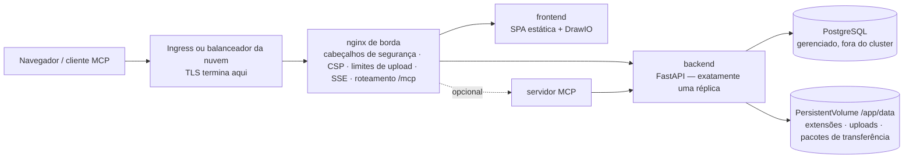

# Kubernetes e nuvem

O Turbo EA inclui um chart Helm, portanto executá-lo no Kubernetes — Amazon EKS, Azure AKS, Google GKE ou qualquer cluster conforme — é um único comando contra um servidor PostgreSQL fornecido por você. Esta página descreve primeiro o chart e depois percorre cada uma das três grandes nuvens. Em um único host, a [configuração com Docker Compose](../getting-started/setup.md) continua sendo o caminho mais simples; tudo o que a página [Operações e atualizações](operations.md) diz sobre atualizações, backups e a guarda de `SECRET_KEY` vale aqui sem alterações. Prefere Terraform? A página [Terraform](terraform.md) encapsula o chart em um módulo `helm_release`.

## O que o chart implanta



- **O nginx de borda é o único Service para o qual um Ingress aponta.** Ele detém todos os cabeçalhos de segurança, a Content Security Policy, o limite de 2 GB para uploads de transferência de espaço de trabalho, as configurações do fluxo de eventos de longa duração e o roteamento de `/mcp` e `/.well-known/oauth-*`. Roteie **todo o host** (`/`) para ele e nunca adicione uma reescrita de caminho.
- **O backend roda com exatamente uma réplica**, e o chart recusa qualquer `backend.replicaCount`. Os eventos em tempo real são distribuídos por um barramento interno ao processo, o limitador de requisições e o cache de permissões são internos, as migrações rodam na inicialização e `/app/data` é um volume ReadWriteOnce. O Deployment usa a estratégia *Recreate* para que dois backends nunca migrem o esquema nem montem o volume ao mesmo tempo. Escale, em vez disso, os Deployments `frontend` e `nginx` — o backend não é o gargalo de um panorama típico.
- **O PostgreSQL não está incluído.** Aponte o chart para um banco gerenciado (a [configuração recomendada](operations.md#managed-postgresql)) ou para um cluster gerenciado por um operador como o CloudNativePG. O Ollama também não está incluído: defina `ai.providerUrl` para um endpoint externo se usar as sugestões de IA.
- **O TLS termina no Ingress ou no balanceador.** O nginx deriva `X-Forwarded-Proto` de `publicUrl`, que é o que marca o cookie de sessão como `secure`.

## Pré-requisitos

- Kubernetes 1.27 ou mais recente e Helm 3.8 ou mais recente (suporte a registros OCI).
- Um servidor PostgreSQL 14+ acessível a partir do cluster, com um banco e um papel para o Turbo EA:
  ```sql
  CREATE USER turboea WITH PASSWORD 'sua-senha';
  CREATE DATABASE turboea OWNER turboea;
  ```
- Um controlador de ingress (ou uma integração com o balanceador da nuvem) e, para HTTPS, um certificado — cert-manager ou os certificados gerenciados da nuvem.
- Uma StorageClass que provisione volumes ReadWriteOnce (todas as padrão das nuvens fazem isso).

## Instalação

Escreva um `values.yaml`:

```yaml
publicUrl: https://ea.example.com          # a origem que os usuários abrem — sem caminho nem barra final
postgresql:
  host: postgres.example.internal
  database: turboea
  username: turboea
  password: "…"                            # ou use existingSecret, abaixo
secretKey: "…"                             # openssl rand -base64 48
ingress:
  enabled: true
  className: nginx
  annotations:
    cert-manager.io/cluster-issuer: letsencrypt
    nginx.ingress.kubernetes.io/proxy-body-size: 2g
    nginx.ingress.kubernetes.io/proxy-read-timeout: "86400"
    nginx.ingress.kubernetes.io/proxy-send-timeout: "86400"
    nginx.ingress.kubernetes.io/proxy-buffering: "off"
    nginx.ingress.kubernetes.io/proxy-request-buffering: "off"
  tls:
    - secretName: turbo-ea-tls
      hosts: [ea.example.com]
```

Instale fixando a versão — a versão do chart **é** a versão do Turbo EA, então `--version 2.141.0` instala as imagens `2.141.0`:

```bash
helm install turbo-ea oci://ghcr.io/vincentmakes/turbo-ea/charts/turbo-ea \
  --version 2.141.0 \
  --namespace turbo-ea --create-namespace \
  -f values.yaml --wait
```

`--wait` retorna quando o backend executou suas migrações e responde através do nginx. Depois verifique e registre-se:

```bash
helm test turbo-ea -n turbo-ea            # consulta /api/health e / através do nginx de borda
kubectl get ingress -n turbo-ea           # aguarde um endereço e abra publicUrl
```

**O primeiro usuário a se registrar torna-se administrador** — registre-se imediatamente. Sem Ingress, `kubectl port-forward -n turbo-ea svc/turbo-ea-nginx 8920:80` e `publicUrl: http://localhost:8920`, pois a URL do navegador precisa coincidir com `publicUrl` para cookies e CORS.

Todo chart publicado é assinado com cosign, como as imagens: `cosign verify ghcr.io/vincentmakes/turbo-ea/charts/turbo-ea:<version> --certificate-identity-regexp '^https://github.com/vincentmakes/turbo-ea/' --certificate-oidc-issuer https://token.actions.githubusercontent.com` (veja [Cadeia de suprimentos](supply-chain.md)).

## Valores que importam

A lista completa e comentada está no [`values.yaml`](https://github.com/vincentmakes/turbo-ea/blob/main/charts/turbo-ea/values.yaml) do chart. Os que um operador define:

| Valor | Finalidade |
|---|---|
| `publicUrl` | **Obrigatório.** Origem pública. Comanda o `server_name` e `X-Forwarded-Proto` do nginx, a lista CORS do backend e as URIs de redirecionamento OAuth do MCP. |
| `postgresql.host` / `port` / `database` / `username` | **Host obrigatório.** O servidor PostgreSQL externo. |
| `existingSecret` | Nome de um Secret com `SECRET_KEY` e `POSTGRES_PASSWORD` (nomes das chaves configuráveis via `existingSecretKeys`). Preferível a `secretKey` / `postgresql.password` em linha. |
| `postgresql.pool.size` / `maxOverflow` | Orçamento de conexões do backend, 20 + 10 por padrão — reduza em um plano gerenciado com teto baixo ([orçamento de conexões](operations.md#check-the-connection-limit)). |
| `allowedOrigins` | Lista CORS; por padrão a origem de `publicUrl`. Defina quando o aplicativo tiver vários nomes de host. |
| `embedAllowedOrigins` | Sites autorizados a incorporar um diagrama publicado (Confluence, uma wiki). |
| `backend.persistence.*` | O volume `/app/data`: `size`, `storageClass` ou `existingClaim` para trazer o seu. Mantido no `helm uninstall`. |
| `backend.extraEnv` / `extraEnvFrom` | Qualquer variável do backend da configuração Compose — `SMTP_*`, `TURBO_EA_PROXY_AUTH_*`, `NVD_API_KEY`, `EXTENSION_*`. |
| `ai.providerUrl` / `ai.model` | Endpoint LLM externo para sugestões de IA. |
| `mcp.enabled` | Implantar o servidor MCP em `<publicUrl>/mcp`. |
| `ingress.*` | Classe, anotações, TLS. Os hosts assumem por padrão o host de `publicUrl`, caminho `/`. |
| `frontend.replicaCount` / `nginx.replicaCount`, `autoscaling`, `pdb` | Escala das camadas sem estado. |
| `networkPolicy.enabled` | Políticas de negação padrão entre as camadas (egress desativado por padrão — veja o arquivo de valores). |
| `global.imageRegistry` / `imagePullSecrets` | Baixar de um espelho em um cluster isolado. |
| `seed.demo` | Carregar o panorama de demonstração NexaTech na primeira inicialização. Nunca sobre dados reais. |

## Segredos

`SECRET_KEY` assina cada sessão e cifra cada segredo armazenado (SSO, SMTP). Perdê-la invalida todas as sessões e todas as configurações cifradas, então faça backup dela junto com o banco de dados. Duas formas de fornecê-la, junto com a senha do banco:

- **Em linha** (`secretKey`, `postgresql.password`): o chart escreve um Secret que ele mesmo gerencia. Serve para avaliação; os valores ficam então no seu histórico do Helm.
- **`existingSecret`** (recomendado): um Secret que você cria — à mão, com Sealed Secrets, ou sincronizado do AWS Secrets Manager / Azure Key Vault / Google Secret Manager pelo [External Secrets Operator](https://external-secrets.io/). O chart apenas o referencia:

```bash
kubectl create secret generic turbo-ea-credentials -n turbo-ea \
  --from-literal=SECRET_KEY="$(openssl rand -base64 48)" \
  --from-literal=POSTGRES_PASSWORD='…'
```

Um `ExternalSecret` pode viajar na release por meio de `extraObjects`. Rotacionar a senha do banco exige reiniciar o backend (`kubectl rollout restart deployment/turbo-ea-backend`); rotacionar `SECRET_KEY` desconecta todos e obriga a reinserir as configurações cifradas.

Senhas com caracteres reservados de URL (`@ / : # ? %`) funcionam — o backend as codifica em porcentagem.

## Armazenamento

`/app/data` guarda as extensões instaladas, os uploads de extensões e de migração de plataforma e os pacotes de transferência de espaço de trabalho; o conteúdo de cartões e diagramas fica no PostgreSQL. O chart cria um PersistentVolumeClaim ReadWriteOnce (`10Gi` por padrão) anotado com `helm.sh/resource-policy: keep`, de modo que `helm uninstall` o deixa no lugar — apague-o à mão quando realmente quiser. Use `backend.persistence.existingClaim` para trazer um volume restaurado e uma StorageClass com vínculo `WaitForFirstConsumer` (todas as padrão das nuvens) para que o volume seja criado na zona em que o pod é agendado.

Faça backup com os VolumeSnapshots do seu driver CSI na mesma cadência do banco e restaure os dois juntos — as [regras de reversão](operations.md#rollback-and-recovery) valem como para o volume `backend_data` do Compose.

## Ingress e TLS

O chart gera uma regra de Ingress — o host de `publicUrl`, caminho `/`, `pathType: Prefix`, backend = o Service do nginx. Essa regra única é deliberada: `/.well-known/oauth-*`, `/mcp` e `/embed/` precisam chegar ao nginx de borda com seus caminhos intactos, portanto nunca adicione uma anotação rewrite-target nem divida caminhos entre serviços.

Dois limites são definidos no nginx de borda, mas precisam **também** ser elevados no controlador à frente dele:

| Controlador | Tamanho de upload (importação de 2 GB) | Fluxo de eventos (SSE de longa duração) |
|---|---|---|
| ingress-nginx, roteamento de aplicativos do AKS | `nginx.ingress.kubernetes.io/proxy-body-size: 2g` | `proxy-read-timeout: "86400"`, `proxy-send-timeout: "86400"`, `proxy-buffering: "off"`, `proxy-request-buffering: "off"` |
| AWS Load Balancer Controller (ALB) | sem limite | `alb.ingress.kubernetes.io/load-balancer-attributes: idle_timeout.timeout_seconds=4000` (máximo do ALB; o navegador reconecta) |
| Azure Application Gateway (AGIC) | o modo de prevenção do WAF limita corpos — eleve o limite de upload ou exclua o caminho de importação | `appgw.ingress.kubernetes.io/request-timeout: "86400"` |
| GKE (GCE) | sem limite | `BackendConfig` com `timeoutSec: 86400` (veja a seção do GCP) |

2 GB é o que o nginx de borda aceita; um balanceador de carga ou WAF à frente pode limitar mais uma solicitação, e o backend precisa de cerca do dobro do tamanho do pacote em espaço temporário (o upload é gravado em `/tmp` e depois em `data/workspace_transfers/`). Teste uma importação com o tamanho real do seu pacote antes de confiar nisso.

Para TLS, ou um bloco `tls:` do cert-manager no Ingress, ou o certificado gerenciado da nuvem (ACM, ManagedCertificate do GKE) com TLS no balanceador. Dentro do cluster o tráfego para o nginx é HTTP simples; um `publicUrl` começando com `https://` é o que torna o cookie `secure`.

## Atualizações

```bash
helm upgrade turbo-ea oci://ghcr.io/vincentmakes/turbo-ea/charts/turbo-ea \
  --version 2.142.0 -n turbo-ea -f values.yaml --wait
```

As migrações rodam quando o novo pod do backend inicia, exatamente como no Compose: *Recreate* para o pod antigo, o novo migra, semeia as adições do metamodelo e só então responde em `/api/health`. A sonda de inicialização concede cinco minutos por padrão (`backend.startupProbe.failureThreshold`); aumente-a, e `--timeout`, para um banco muito grande. Leia antes as notas de versão, faça um backup e nunca execute um backend mais antigo contra um esquema mais novo — uma reversão é *restaurar o banco e o volume e reinstalar a versão anterior do chart*, nunca um mero downgrade do chart. Veja [Como funcionam as atualizações](operations.md#how-upgrades-work-alembic-migrations).

## Reforço de segurança

Cada contêiner roda como uid 1000 com sistema de arquivos raiz somente leitura, sem capabilities, sem escalação de privilégios e com o perfil seccomp `RuntimeDefault`; o token da ServiceAccount não é montado. Isso atende de imediato ao Pod Security Standard *restricted*. `networkPolicy.enabled: true` adiciona políticas de negação padrão entre as camadas (defina `networkPolicy.ingressController` com o rótulo de namespace do seu controlador); as regras de egress são opcionais porque o backend também fala com a loja de extensões, o endoflife.date, o NVD, seu servidor SMTP e seu endpoint LLM. Controladores de admissão que verificam assinaturas podem fixar as imagens e o chart à identidade cosign acima.

## AWS (EKS)

**Banco de dados.** Amazon RDS for PostgreSQL ou Aurora PostgreSQL na VPC do cluster. Permita a porta 5432 a partir do grupo de segurança dos nós (ou do grupo dos pods com security groups for pods). O RDS impõe TLS por padrão (`rds.force_ssl`); o backend o negocia sem configuração.

**Armazenamento.** O complemento EBS CSI com uma StorageClass `gp3` (vínculo `WaitForFirstConsumer`).

**Ingress.** O AWS Load Balancer Controller cria um Application Load Balancer a partir de um Ingress de classe `alb`. Termine o TLS nele com um certificado do ACM, aponte a verificação de integridade para `/api/health` (o `/` padrão é servido pelo frontend e nada diz sobre o backend) e eleve o tempo ocioso ao máximo de 4000 segundos para o fluxo de eventos. O ALB não limita corpos.

**Segredos.** Guarde `SECRET_KEY` e a senha do banco no AWS Secrets Manager e sincronize-as com o External Secrets Operator (IRSA na ServiceAccount dele); os pods do Turbo EA não precisam de identidade AWS.

Comece por [`examples/values-aws.yaml`](https://github.com/vincentmakes/turbo-ea/blob/main/charts/turbo-ea/examples/values-aws.yaml):

```yaml
publicUrl: https://ea.example.com
existingSecret: turbo-ea-credentials
postgresql:
  host: turbo-ea.cluster-abc123.eu-central-1.rds.amazonaws.com
backend:
  persistence:
    storageClass: gp3
ingress:
  enabled: true
  className: alb
  annotations:
    alb.ingress.kubernetes.io/scheme: internet-facing
    alb.ingress.kubernetes.io/target-type: ip
    alb.ingress.kubernetes.io/listen-ports: '[{"HTTP": 80}, {"HTTPS": 443}]'
    alb.ingress.kubernetes.io/ssl-redirect: "443"
    alb.ingress.kubernetes.io/certificate-arn: arn:aws:acm:…
    alb.ingress.kubernetes.io/healthcheck-path: /api/health
    alb.ingress.kubernetes.io/load-balancer-attributes: idle_timeout.timeout_seconds=4000
```

## Azure (AKS)

**Banco de dados.** Azure Database for PostgreSQL – Flexible Server com acesso privado (integração com VNet) à VNet do cluster, ou com acesso público e uma regra de firewall para o IP de saída do cluster. O TLS é obrigatório (`require_secure_transport`) e negociado automaticamente. O nome de usuário é o nome simples do papel — a forma `user@server` pertencia ao descontinuado Single Server.

**Armazenamento.** O driver Azure Disk CSI com a StorageClass integrada `managed-csi`.

**Ingress.** O complemento de *roteamento de aplicativos* (`az aks approuting enable`) instala um ingress-nginx gerenciado sob a classe `webapprouting.kubernetes.azure.com`; use as anotações do ingress-nginx da tabela acima e um emissor do cert-manager ou um certificado do Azure Key Vault. Com o Application Gateway Ingress Controller, defina em vez disso `appgw.ingress.kubernetes.io/request-timeout: "86400"` e, se uma política WAF estiver em modo de prevenção, eleve seu limite de upload de arquivos ou exclua o caminho de importação do espaço de trabalho.

**Identidade.** O login com Entra ID é configurado dentro do Turbo EA ([SSO](sso.md)), não no cluster. Os segredos são sincronizados do Key Vault pelo Secrets Store CSI Driver ou pelo External Secrets Operator com identidade de carga de trabalho.

Comece por [`examples/values-azure.yaml`](https://github.com/vincentmakes/turbo-ea/blob/main/charts/turbo-ea/examples/values-azure.yaml):

```yaml
publicUrl: https://ea.example.com
existingSecret: turbo-ea-credentials
postgresql:
  host: turbo-ea.postgres.database.azure.com
backend:
  persistence:
    storageClass: managed-csi
ingress:
  enabled: true
  className: webapprouting.kubernetes.azure.com
  annotations:
    cert-manager.io/cluster-issuer: letsencrypt
    nginx.ingress.kubernetes.io/proxy-body-size: 2g
    nginx.ingress.kubernetes.io/proxy-read-timeout: "86400"
    nginx.ingress.kubernetes.io/proxy-send-timeout: "86400"
    nginx.ingress.kubernetes.io/proxy-buffering: "off"
    nginx.ingress.kubernetes.io/proxy-request-buffering: "off"
  tls:
    - secretName: turbo-ea-tls
      hosts: [ea.example.com]
```

## Google Cloud (GKE)

**Banco de dados.** Cloud SQL for PostgreSQL com **IP privado** na mesma VPC (acesso a serviços privados). Um cluster nativo de VPC — GKE Standard ou Autopilot — o alcança diretamente, portanto não são necessários nem sidecar proxy nem Workload Identity: defina `postgresql.host` com o endereço privado da instância. Se uma política exigir o Cloud SQL Auth Proxy (autenticação IAM, instância com IP público), adicione-o como sidecar via `backend.extraContainers`, defina `postgresql.host: 127.0.0.1` e vincule a ServiceAccount da release a uma conta de serviço do Google com Workload Identity; o arquivo de exemplo traz o trecho.

**Armazenamento.** O driver Persistent Disk CSI com a StorageClass `standard-rwo` (PD balanceado, `WaitForFirstConsumer`).

**Ingress.** O controlador de Ingress do GKE (classe `gce`) constrói um balanceador HTTPS externo global. Seu tempo limite de backend padrão de 30 segundos cortaria o fluxo de eventos a cada meio minuto, então anexe uma `BackendConfig` com `timeoutSec: 86400` e a verificação de integridade `/api/health` ao Service do nginx (`nginx.service.annotations`), ative o balanceamento nativo de contêineres com a anotação NEG, reserve um IP estático global e use um `ManagedCertificate` para TLS. Ambos os recursos personalizados viajam na release via `extraObjects`.

Comece por [`examples/values-gcp.yaml`](https://github.com/vincentmakes/turbo-ea/blob/main/charts/turbo-ea/examples/values-gcp.yaml):

```yaml
publicUrl: https://ea.example.com
existingSecret: turbo-ea-credentials
postgresql:
  host: 10.20.0.3
backend:
  persistence:
    storageClass: standard-rwo
nginx:
  service:
    annotations:
      cloud.google.com/neg: '{"ingress": true}'
      cloud.google.com/backend-config: '{"default": "turbo-ea"}'
ingress:
  enabled: true
  className: gce
  annotations:
    kubernetes.io/ingress.global-static-ip-name: turbo-ea-ip
    networking.gke.io/managed-certificates: turbo-ea
    kubernetes.io/ingress.allow-http: "false"
extraObjects:
  - apiVersion: cloud.google.com/v1
    kind: BackendConfig
    metadata: {name: turbo-ea}
    spec:
      timeoutSec: 86400
      healthCheck: {type: HTTP, requestPath: /api/health, port: 8080}
  - apiVersion: networking.gke.io/v1
    kind: ManagedCertificate
    metadata: {name: turbo-ea}
    spec: {domains: [ea.example.com]}
```

## Serviços de contêineres gerenciados

Azure Container Apps, Google Cloud Run e AWS ECS Fargate executam as mesmas imagens sem Kubernetes, como um único grupo de contêineres com o nginx de borda, o frontend e o backend como sidecars. Os modelos prontos para editar e os guias por plataforma — incluindo o que cada plataforma não consegue fazer — estão na página [Serviços de contêineres gerenciados](managed-containers.md).

## Solução de problemas

| Sintoma | Causa e correção |
|---|---|
| Os pods do nginx nunca ficam Ready e os logs do backend estão saudáveis | A sonda de prontidão do nginx passa pelo proxy até `/api/health`. Verifique o valor de `NGINX_BACKEND_UPSTREAM` no pod do nginx e se `clusterDomain` corresponde ao seu cluster (`cluster.local` por padrão). |
| O login entra em loop ou a API responde 401 no navegador | `publicUrl` não corresponde à URL na barra de endereços. Cookies e CORS estão vinculados a ela; com vários nomes de host, defina `allowedOrigins`. |
| `helm install --wait` expira no backend | Migrações ou semeadura levaram mais tempo do que a sonda de inicialização permite — verifique `kubectl logs deployment/turbo-ea-backend` e eleve `backend.startupProbe.failureThreshold` e `--timeout`. |
| O backend registra `too many connections` | O plano gerenciado limita as conexões abaixo de `pool.size + pool.maxOverflow`. Reduza o pool ([orçamento de conexões](operations.md#check-the-connection-limit)). |
| A importação do espaço de trabalho falha com poucos megabytes | É o limite de corpo do controlador de ingress, não o do nginx — veja a tabela em *Ingress e TLS*. |
| As atualizações em tempo real param após um intervalo fixo | O tempo ocioso ou de requisição do balanceador fecha o fluxo de eventos; eleve-o conforme a mesma tabela. O navegador reconecta e nada se perde, mas o intervalo de reconexão aparece como atraso. |
| As extensões somem após um reinício | `backend.persistence.enabled` é `false` ou o PVC foi excluído. |
