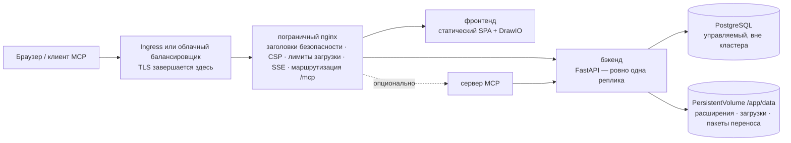

# Kubernetes и облако

Turbo EA поставляется с Helm-чартом, поэтому запуск в Kubernetes — Amazon EKS, Azure AKS, Google GKE или любом другом совместимом кластере — сводится к одной команде и серверу PostgreSQL, который вы предоставляете сами. Эта страница сначала описывает сам чарт, а затем проводит через каждое из трёх крупных облаков. Для одного хоста [установка через Docker Compose](../getting-started/setup.md) остаётся самым простым путём; всё, что сказано на странице [Эксплуатация и обновления](operations.md) об обновлениях, резервных копиях и хранении `SECRET_KEY`, здесь действует без изменений. Предпочитаете Terraform? Страница [Terraform](terraform.md) оборачивает chart в модуль `helm_release`.

## Что разворачивает чарт



- **Пограничный nginx — единственный Service, на который указывает Ingress.** Ему принадлежат все заголовки безопасности, Content Security Policy, лимит 512 МБ на загрузку пакетов переноса рабочего пространства, настройки долгоживущего потока событий и маршрутизация `/mcp` и `/.well-known/oauth-*`. Направляйте на него **весь хост** (`/`) и никогда не добавляйте переписывание путей.
- **Бэкенд работает ровно в одной реплике**, и чарт отвергает любое значение `backend.replicaCount`. События реального времени рассылаются через шину внутри процесса, ограничитель запросов и кэш прав — тоже внутри процесса, миграции базы выполняются при старте, а `/app/data` — том ReadWriteOnce. Deployment использует стратегию *Recreate*, чтобы два бэкенда никогда не мигрировали схему и не монтировали том одновременно. Масштабируйте вместо этого Deployment'ы `frontend` и `nginx` — для типичного ландшафта бэкенд не является узким местом.
- **PostgreSQL не входит в поставку.** Направьте чарт на управляемую базу ([рекомендуемая схема](operations.md#managed-postgresql)) или на кластер под управлением оператора, например CloudNativePG. Ollama тоже не входит: если вы пользуетесь ИИ-подсказками, укажите в `ai.providerUrl` внешнюю конечную точку.
- **TLS завершается на Ingress или балансировщике.** nginx выводит `X-Forwarded-Proto` из `publicUrl`, и именно это помечает сессионную cookie как `secure`.

## Предварительные требования

- Kubernetes 1.27 или новее и Helm 3.8 или новее (поддержка OCI-реестров).
- Сервер PostgreSQL 14+, доступный из кластера, с базой и ролью для Turbo EA:
  ```sql
  CREATE USER turboea WITH PASSWORD 'ваш-пароль';
  CREATE DATABASE turboea OWNER turboea;
  ```
- Ingress-контроллер (или интеграция с облачным балансировщиком) и для HTTPS сертификат — cert-manager либо управляемые сертификаты облака.
- StorageClass, выделяющий тома ReadWriteOnce (все облачные значения по умолчанию подходят).

## Установка

Напишите `values.yaml`:

```yaml
publicUrl: https://ea.example.com          # адрес, который открывают пользователи — без пути и завершающего слэша
postgresql:
  host: postgres.example.internal
  database: turboea
  username: turboea
  password: "…"                            # или используйте existingSecret, см. ниже
secretKey: "…"                             # openssl rand -base64 48
ingress:
  enabled: true
  className: nginx
  annotations:
    cert-manager.io/cluster-issuer: letsencrypt
    nginx.ingress.kubernetes.io/proxy-body-size: 512m
    nginx.ingress.kubernetes.io/proxy-read-timeout: "86400"
    nginx.ingress.kubernetes.io/proxy-send-timeout: "86400"
    nginx.ingress.kubernetes.io/proxy-buffering: "off"
  tls:
    - secretName: turbo-ea-tls
      hosts: [ea.example.com]
```

Устанавливайте с зафиксированной версией — версия чарта **и есть** версия Turbo EA, так что `--version 2.141.0` ставит образы `2.141.0`:

```bash
helm install turbo-ea oci://ghcr.io/vincentmakes/turbo-ea/charts/turbo-ea \
  --version 2.141.0 \
  --namespace turbo-ea --create-namespace \
  -f values.yaml --wait
```

`--wait` возвращает управление, когда бэкенд выполнил миграции и отвечает через nginx. Затем проверьте и зарегистрируйтесь:

```bash
helm test turbo-ea -n turbo-ea            # запрашивает /api/health и / через пограничный nginx
kubectl get ingress -n turbo-ea           # дождитесь адреса и откройте publicUrl
```

**Первый зарегистрировавшийся пользователь становится администратором** — регистрируйтесь сразу. Без Ingress выполните `kubectl port-forward -n turbo-ea svc/turbo-ea-nginx 8920:80` и задайте `publicUrl: http://localhost:8920`, поскольку адрес в браузере должен совпадать с `publicUrl` для cookie и CORS.

Каждый опубликованный чарт подписан cosign, как и образы: `cosign verify ghcr.io/vincentmakes/turbo-ea/charts/turbo-ea:<version> --certificate-identity-regexp '^https://github.com/vincentmakes/turbo-ea/' --certificate-oidc-issuer https://token.actions.githubusercontent.com` (см. [Цепочка поставок](supply-chain.md)).

## Значимые параметры

Полный список с комментариями — в [`values.yaml`](https://github.com/vincentmakes/turbo-ea/blob/main/charts/turbo-ea/values.yaml) чарта. То, что задаёт оператор:

| Параметр | Назначение |
|---|---|
| `publicUrl` | **Обязателен.** Публичный адрес. Определяет `server_name` и `X-Forwarded-Proto` для nginx, список CORS бэкенда и URI перенаправления OAuth для MCP. |
| `postgresql.host` / `port` / `database` / `username` | **Хост обязателен.** Внешний сервер PostgreSQL. |
| `existingSecret` | Имя Secret с `SECRET_KEY` и `POSTGRES_PASSWORD` (имена ключей настраиваются через `existingSecretKeys`). Предпочтительнее, чем `secretKey` / `postgresql.password` в открытом виде. |
| `postgresql.pool.size` / `maxOverflow` | Бюджет соединений бэкенда, по умолчанию 20 + 10 — уменьшите для управляемого тарифа с низким лимитом ([бюджет соединений](operations.md#check-the-connection-limit)). |
| `allowedOrigins` | Список CORS; по умолчанию — источник `publicUrl`. Задайте, если у приложения несколько имён хоста. |
| `embedAllowedOrigins` | Сайты, которым разрешено встраивать опубликованную диаграмму (Confluence, wiki). |
| `backend.persistence.*` | Том `/app/data`: `size`, `storageClass` или `existingClaim` для своего тома. Сохраняется при `helm uninstall`. |
| `backend.extraEnv` / `extraEnvFrom` | Любая переменная бэкенда из настройки Compose — `SMTP_*`, `TURBO_EA_PROXY_AUTH_*`, `NVD_API_KEY`, `EXTENSION_*`. |
| `ai.providerUrl` / `ai.model` | Внешняя конечная точка LLM для ИИ-подсказок. |
| `mcp.enabled` | Развернуть сервер MCP по адресу `<publicUrl>/mcp`. |
| `ingress.*` | Класс, аннотации, TLS. Хосты по умолчанию — хост из `publicUrl`, путь `/`. |
| `frontend.replicaCount` / `nginx.replicaCount`, `autoscaling`, `pdb` | Масштабирование слоёв без состояния. |
| `networkPolicy.enabled` | Политики запрета по умолчанию между слоями (исходящий трафик по умолчанию выключен — см. файл значений). |
| `global.imageRegistry` / `imagePullSecrets` | Загрузка из зеркала в изолированном кластере. |
| `seed.demo` | Загрузить демонстрационный ландшафт NexaTech при первом запуске. Никогда на реальных данных. |

## Секреты

`SECRET_KEY` подписывает каждую сессию и шифрует каждый сохранённый секрет (SSO, SMTP). Его потеря делает недействительными все сессии и все зашифрованные настройки, поэтому храните его резервную копию вместе с базой. Есть два способа передать его вместе с паролем базы:

- **В открытом виде** (`secretKey`, `postgresql.password`): чарт создаёт Secret, которым управляет сам. Подходит для оценки; значения при этом попадают в историю Helm.
- **`existingSecret`** (рекомендуется): Secret, который создаёте вы — вручную, через Sealed Secrets или синхронизацией из AWS Secrets Manager / Azure Key Vault / Google Secret Manager через [External Secrets Operator](https://external-secrets.io/). Чарт лишь ссылается на него:

```bash
kubectl create secret generic turbo-ea-credentials -n turbo-ea \
  --from-literal=SECRET_KEY="$(openssl rand -base64 48)" \
  --from-literal=POSTGRES_PASSWORD='…'
```

`ExternalSecret` можно передать в составе релиза через `extraObjects`. Смена пароля базы требует перезапуска бэкенда (`kubectl rollout restart deployment/turbo-ea-backend`); смена `SECRET_KEY` разлогинивает всех и требует заново ввести зашифрованные настройки.

Пароли с зарезервированными в URL символами (`@ / : # ? %`) работают — бэкенд кодирует их процентным кодированием.

## Хранилище

В `/app/data` лежат установленные расширения, загрузки расширений и миграций платформ, а также пакеты переноса рабочего пространства; содержимое карточек и диаграмм хранится в PostgreSQL. Чарт создаёт один PersistentVolumeClaim ReadWriteOnce (по умолчанию `10Gi`) с аннотацией `helm.sh/resource-policy: keep`, поэтому `helm uninstall` оставляет его на месте — удаляйте вручную, когда действительно хотите. Используйте `backend.persistence.existingClaim`, чтобы подключить восстановленный том, и StorageClass с привязкой `WaitForFirstConsumer` (все облачные значения по умолчанию), чтобы том создавался в той зоне, где размещён под.

Делайте резервные копии через VolumeSnapshot вашего CSI-драйвера с той же периодичностью, что и базу, и восстанавливайте их вместе — [правила отката](operations.md#rollback-and-recovery) действуют так же, как для тома `backend_data` в Compose.

## Ingress и TLS

Чарт формирует одно правило Ingress — хост из `publicUrl`, путь `/`, `pathType: Prefix`, бэкенд = Service nginx. Единственное правило — сознательное решение: `/.well-known/oauth-*`, `/mcp` и `/embed/` должны достигать пограничного nginx с нетронутыми путями, поэтому никогда не добавляйте аннотацию rewrite-target и не разносите пути по разным сервисам.

Два лимита заданы на пограничном nginx, но их нужно **также** поднять на контроллере перед ним:

| Контроллер | Размер загрузки (импорт рабочего пространства 512 МБ) | Поток событий (долгоживущий SSE) |
|---|---|---|
| ingress-nginx, маршрутизация приложений AKS | `nginx.ingress.kubernetes.io/proxy-body-size: 512m` | `proxy-read-timeout: "86400"`, `proxy-send-timeout: "86400"`, `proxy-buffering: "off"` |
| AWS Load Balancer Controller (ALB) | без ограничения | `alb.ingress.kubernetes.io/load-balancer-attributes: idle_timeout.timeout_seconds=4000` (максимум ALB; браузер переподключается) |
| Azure Application Gateway (AGIC) | режим предотвращения WAF ограничивает тело запроса — поднимите лимит загрузки файлов или исключите путь импорта | `appgw.ingress.kubernetes.io/request-timeout: "86400"` |
| GKE (GCE) | без ограничения | `BackendConfig` с `timeoutSec: 86400` (см. раздел GCP) |

Для TLS — либо блок `tls:` cert-manager на Ingress, либо управляемый сертификат облака (ACM, ManagedCertificate в GKE) с завершением TLS на балансировщике. Внутри кластера трафик к nginx идёт по обычному HTTP; cookie становится `secure` именно благодаря `publicUrl`, начинающемуся с `https://`.

## Обновления

```bash
helm upgrade turbo-ea oci://ghcr.io/vincentmakes/turbo-ea/charts/turbo-ea \
  --version 2.142.0 -n turbo-ea -f values.yaml --wait
```

Миграции выполняются при запуске нового пода бэкенда, точно как в Compose: *Recreate* останавливает старый под, новый мигрирует, добавляет новые элементы метамодели и только затем отвечает на `/api/health`. Стартовая проба по умолчанию даёт пять минут (`backend.startupProbe.failureThreshold`); для очень большой базы увеличьте её и `--timeout`. Сначала прочитайте примечания к выпуску, сделайте резервную копию и никогда не запускайте старый бэкенд с более новой схемой — откат означает *восстановить базу и том, затем переустановить предыдущую версию чарта*, а не просто понизить версию чарта. См. [Как работают обновления](operations.md#how-upgrades-work-alembic-migrations).

## Усиление защиты

Каждый контейнер работает от uid 1000 с корневой файловой системой только для чтения, без capabilities, без повышения привилегий и с профилем seccomp `RuntimeDefault`; токен ServiceAccount не монтируется. Это сразу удовлетворяет стандарту Pod Security *restricted*. `networkPolicy.enabled: true` добавляет политики запрета по умолчанию между слоями (укажите в `networkPolicy.ingressController` метку пространства имён вашего контроллера); правила исходящего трафика включаются отдельно, потому что бэкенд также обращается к магазину расширений, endoflife.date, NVD, вашему SMTP-серверу и конечной точке LLM. Контроллеры допуска, проверяющие подписи, могут привязать образы и чарт к указанной выше идентичности cosign.

## AWS (EKS)

**База данных.** Amazon RDS for PostgreSQL или Aurora PostgreSQL в VPC кластера. Разрешите порт 5432 из группы безопасности узлов (или группы безопасности подов при использовании security groups for pods). RDS по умолчанию требует TLS (`rds.force_ssl`); бэкенд согласует его без настройки.

**Хранилище.** Дополнение EBS CSI со StorageClass `gp3` (привязка `WaitForFirstConsumer`).

**Ingress.** AWS Load Balancer Controller создаёт Application Load Balancer из Ingress класса `alb`. Завершайте TLS на нём сертификатом ACM, направьте проверку работоспособности на `/api/health` (стандартный `/` обслуживает фронтенд и ничего не говорит о бэкенде) и поднимите тайм-аут простоя до максимума в 4000 секунд ради потока событий. ALB не ограничивает размер тела.

**Секреты.** Храните `SECRET_KEY` и пароль базы в AWS Secrets Manager и синхронизируйте их через External Secrets Operator (IRSA на его ServiceAccount); самим подам Turbo EA идентичность AWS не нужна.

Начните с [`examples/values-aws.yaml`](https://github.com/vincentmakes/turbo-ea/blob/main/charts/turbo-ea/examples/values-aws.yaml):

```yaml
publicUrl: https://ea.example.com
existingSecret: turbo-ea-credentials
postgresql:
  host: turbo-ea.cluster-abc123.eu-central-1.rds.amazonaws.com
backend:
  persistence:
    storageClass: gp3
ingress:
  enabled: true
  className: alb
  annotations:
    alb.ingress.kubernetes.io/scheme: internet-facing
    alb.ingress.kubernetes.io/target-type: ip
    alb.ingress.kubernetes.io/listen-ports: '[{"HTTP": 80}, {"HTTPS": 443}]'
    alb.ingress.kubernetes.io/ssl-redirect: "443"
    alb.ingress.kubernetes.io/certificate-arn: arn:aws:acm:…
    alb.ingress.kubernetes.io/healthcheck-path: /api/health
    alb.ingress.kubernetes.io/load-balancer-attributes: idle_timeout.timeout_seconds=4000
```

## Azure (AKS)

**База данных.** Azure Database for PostgreSQL – Flexible Server с приватным доступом (интеграция с VNet) к VNet кластера либо с публичным доступом и правилом брандмауэра для исходящего IP кластера. TLS обязателен (`require_secure_transport`) и согласуется автоматически. Имя пользователя — просто имя роли; форма `user@server` относилась к снятому с поддержки Single Server.

**Хранилище.** Драйвер Azure Disk CSI со встроенным StorageClass `managed-csi`.

**Ingress.** Дополнение *маршрутизация приложений* (`az aks approuting enable`) устанавливает управляемый ingress-nginx с классом `webapprouting.kubernetes.azure.com`; используйте аннотации ingress-nginx из таблицы выше и издателя cert-manager либо сертификат Azure Key Vault. С Application Gateway Ingress Controller вместо этого задайте `appgw.ingress.kubernetes.io/request-timeout: "86400"`, а если политика WAF работает в режиме предотвращения — поднимите её лимит загрузки файлов или исключите путь импорта рабочего пространства.

**Идентичность.** Вход через Entra ID настраивается внутри Turbo EA ([SSO](sso.md)), а не в кластере. Секреты синхронизируются из Key Vault через Secrets Store CSI Driver или External Secrets Operator с workload identity.

Начните с [`examples/values-azure.yaml`](https://github.com/vincentmakes/turbo-ea/blob/main/charts/turbo-ea/examples/values-azure.yaml):

```yaml
publicUrl: https://ea.example.com
existingSecret: turbo-ea-credentials
postgresql:
  host: turbo-ea.postgres.database.azure.com
backend:
  persistence:
    storageClass: managed-csi
ingress:
  enabled: true
  className: webapprouting.kubernetes.azure.com
  annotations:
    cert-manager.io/cluster-issuer: letsencrypt
    nginx.ingress.kubernetes.io/proxy-body-size: 512m
    nginx.ingress.kubernetes.io/proxy-read-timeout: "86400"
    nginx.ingress.kubernetes.io/proxy-send-timeout: "86400"
    nginx.ingress.kubernetes.io/proxy-buffering: "off"
  tls:
    - secretName: turbo-ea-tls
      hosts: [ea.example.com]
```

## Google Cloud (GKE)

**База данных.** Cloud SQL for PostgreSQL с **частным IP** в той же VPC (private services access). VPC-native кластер — GKE Standard или Autopilot — достигает его напрямую, поэтому ни sidecar-прокси, ни Workload Identity не нужны: укажите в `postgresql.host` частный адрес экземпляра. Если политика требует Cloud SQL Auth Proxy (аутентификация IAM, экземпляр с публичным IP), добавьте его как sidecar через `backend.extraContainers`, задайте `postgresql.host: 127.0.0.1` и привяжите ServiceAccount релиза к сервисному аккаунту Google через Workload Identity; фрагмент есть в файле примера.

**Хранилище.** Драйвер Persistent Disk CSI со StorageClass `standard-rwo` (сбалансированный PD, `WaitForFirstConsumer`).

**Ingress.** Ingress-контроллер GKE (класс `gce`) строит глобальный внешний HTTPS-балансировщик. Его стандартный тайм-аут бэкенда в 30 секунд обрывал бы поток событий каждые полминуты, поэтому прикрепите к Service nginx (`nginx.service.annotations`) `BackendConfig` с `timeoutSec: 86400` и проверкой `/api/health`, включите контейнерную балансировку аннотацией NEG, зарезервируйте глобальный статический IP и используйте `ManagedCertificate` для TLS. Оба пользовательских ресурса передаются в релизе через `extraObjects`.

Начните с [`examples/values-gcp.yaml`](https://github.com/vincentmakes/turbo-ea/blob/main/charts/turbo-ea/examples/values-gcp.yaml):

```yaml
publicUrl: https://ea.example.com
existingSecret: turbo-ea-credentials
postgresql:
  host: 10.20.0.3
backend:
  persistence:
    storageClass: standard-rwo
nginx:
  service:
    annotations:
      cloud.google.com/neg: '{"ingress": true}'
      cloud.google.com/backend-config: '{"default": "turbo-ea"}'
ingress:
  enabled: true
  className: gce
  annotations:
    kubernetes.io/ingress.global-static-ip-name: turbo-ea-ip
    networking.gke.io/managed-certificates: turbo-ea
    kubernetes.io/ingress.allow-http: "false"
extraObjects:
  - apiVersion: cloud.google.com/v1
    kind: BackendConfig
    metadata: {name: turbo-ea}
    spec:
      timeoutSec: 86400
      healthCheck: {type: HTTP, requestPath: /api/health, port: 8080}
  - apiVersion: networking.gke.io/v1
    kind: ManagedCertificate
    metadata: {name: turbo-ea}
    spec: {domains: [ea.example.com]}
```

## Управляемые контейнерные сервисы

Azure Container Apps, Google Cloud Run и AWS ECS Fargate запускают те же образы без Kubernetes — как одну группу контейнеров, где пограничный nginx, фронтенд и бэкенд работают как sidecar-контейнеры. Готовые шаблоны и пошаговые инструкции по каждой платформе, включая то, чего каждая платформа не умеет, находятся на странице [Управляемые контейнерные сервисы](managed-containers.md).

## Устранение неполадок

| Симптом | Причина и решение |
|---|---|
| Поды nginx не становятся Ready, а логи бэкенда в порядке | Проба готовности nginx идёт через прокси на `/api/health`. Проверьте значение `NGINX_BACKEND_UPSTREAM` в поде nginx и соответствие `clusterDomain` вашему кластеру (по умолчанию `cluster.local`). |
| Вход зацикливается или API отвечает 401 в браузере | `publicUrl` не совпадает с адресом в адресной строке. К нему привязаны cookie и CORS; при нескольких именах хоста задайте `allowedOrigins`. |
| `helm install --wait` истекает по тайм-ауту на бэкенде | Миграции или заполнение заняли больше, чем позволяет стартовая проба — посмотрите `kubectl logs deployment/turbo-ea-backend`, затем увеличьте `backend.startupProbe.failureThreshold` и `--timeout`. |
| Бэкенд пишет `too many connections` | Управляемый тариф ограничивает соединения ниже `pool.size + pool.maxOverflow`. Уменьшите пул ([бюджет соединений](operations.md#check-the-connection-limit)). |
| Импорт рабочего пространства падает на нескольких мегабайтах | Лимит тела запроса ingress-контроллера, а не nginx — см. таблицу в разделе *Ingress и TLS*. |
| Обновления в реальном времени прекращаются через фиксированный интервал | Тайм-аут простоя или запроса балансировщика закрывает поток событий; поднимите его по той же таблице. Браузер переподключается, ничего не теряется, но интервал переподключения выглядит как задержка. |
| Расширения исчезают после перезапуска | `backend.persistence.enabled` равно `false` либо PVC был удалён. |
