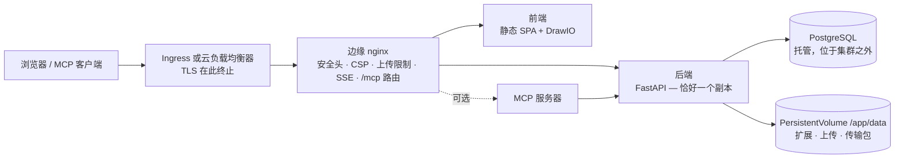

# Kubernetes 与云

Turbo EA 附带 Helm chart，因此在 Kubernetes 上运行它——Amazon EKS、Azure AKS、Google GKE 或任何符合规范的集群——只需一条命令，并连接到您自行提供的 PostgreSQL 服务器。本页先介绍 chart 本身，再逐一说明三大云平台。若只运行单台主机，[Docker Compose 安装](../getting-started/setup.md)仍是最简单的方式；[运维与升级](operations.md)页面中关于升级、备份和 `SECRET_KEY` 保管的所有内容在此同样适用。 更喜欢 Terraform？[Terraform](terraform.md) 页面将 chart 封装为一个 `helm_release` 模块。

## chart 部署的内容



- **边缘 nginx 是 Ingress 唯一指向的 Service。** 它掌管所有安全头、内容安全策略（CSP）、工作区传输上传的 2 GB 限制、长连接事件流的设置以及 `/mcp` 和 `/.well-known/oauth-*` 的路由。请把**整个主机**（`/`）路由到它，并且永远不要添加路径重写。
- **后端恰好运行一个副本**，chart 会拒绝任何 `backend.replicaCount`。实时事件由进程内总线分发，限流器和权限缓存都在进程内，数据库迁移在启动时运行，`/app/data` 是 ReadWriteOnce 卷。Deployment 使用 *Recreate* 策略，确保两个后端永远不会同时迁移模式或挂载卷。请改为扩展 `frontend` 和 `nginx` Deployment——对于典型的 IT 全景，后端并不是瓶颈。
- **不包含 PostgreSQL。** 请将 chart 指向托管数据库（[推荐方案](operations.md#managed-postgresql)）或由 CloudNativePG 之类的 Operator 管理的集群。同样不包含 Ollama：若使用 AI 建议，请把 `ai.providerUrl` 设为外部端点。
- **TLS 在 Ingress 或负载均衡器处终止。** nginx 依据 `publicUrl` 推导 `X-Forwarded-Proto`，正是它把会话 Cookie 标记为 `secure`。

## 前提条件

- Kubernetes 1.27 或更高版本，以及 Helm 3.8 或更高版本（支持 OCI 仓库）。
- 集群可访问的 PostgreSQL 14+ 服务器，并为 Turbo EA 建好数据库和角色：
  ```sql
  CREATE USER turboea WITH PASSWORD 'your-password';
  CREATE DATABASE turboea OWNER turboea;
  ```
- 一个 Ingress 控制器（或云负载均衡器集成），以及用于 HTTPS 的证书——cert-manager 或云平台的托管证书。
- 一个能提供 ReadWriteOnce 卷的 StorageClass（各云平台的默认值都可以）。

## 安装

编写 `values.yaml`：

```yaml
publicUrl: https://ea.example.com          # 用户打开的源地址——不含路径，不带结尾斜杠
postgresql:
  host: postgres.example.internal
  database: turboea
  username: turboea
  password: "…"                            # 或使用下文的 existingSecret
secretKey: "…"                             # openssl rand -base64 48
ingress:
  enabled: true
  className: nginx
  annotations:
    cert-manager.io/cluster-issuer: letsencrypt
    nginx.ingress.kubernetes.io/proxy-body-size: 2g
    nginx.ingress.kubernetes.io/proxy-read-timeout: "86400"
    nginx.ingress.kubernetes.io/proxy-send-timeout: "86400"
    nginx.ingress.kubernetes.io/proxy-buffering: "off"
    nginx.ingress.kubernetes.io/proxy-request-buffering: "off"
  tls:
    - secretName: turbo-ea-tls
      hosts: [ea.example.com]
```

安装时固定版本——chart 版本**就是** Turbo EA 版本，因此 `--version 2.141.0` 安装的是 `2.141.0` 镜像：

```bash
helm install turbo-ea oci://ghcr.io/vincentmakes/turbo-ea/charts/turbo-ea \
  --version 2.141.0 \
  --namespace turbo-ea --create-namespace \
  -f values.yaml --wait
```

`--wait` 会在后端完成迁移并通过 nginx 响应后返回。然后验证并注册：

```bash
helm test turbo-ea -n turbo-ea            # 通过边缘 nginx 请求 /api/health 和 /
kubectl get ingress -n turbo-ea           # 等待出现地址，然后打开 publicUrl
```

**第一个注册的用户即为管理员**——请立即注册。没有 Ingress 时，执行 `kubectl port-forward -n turbo-ea svc/turbo-ea-nginx 8920:80` 并设置 `publicUrl: http://localhost:8920`，因为浏览器地址必须与 `publicUrl` 一致，Cookie 和 CORS 才能正常工作。

每个发布的 chart 都像镜像一样用 cosign 签名：`cosign verify ghcr.io/vincentmakes/turbo-ea/charts/turbo-ea:<version> --certificate-identity-regexp '^https://github.com/vincentmakes/turbo-ea/' --certificate-oidc-issuer https://token.actions.githubusercontent.com`（参见[供应链](supply-chain.md)）。

## 重要的取值

完整且带注释的列表位于 chart 的 [`values.yaml`](https://github.com/vincentmakes/turbo-ea/blob/main/charts/turbo-ea/values.yaml)。运维人员通常需要设置的：

| 取值 | 用途 |
|---|---|
| `publicUrl` | **必填。** 公开源地址。决定 nginx 的 `server_name` 与 `X-Forwarded-Proto`、后端的 CORS 列表以及 MCP 的 OAuth 重定向 URI。 |
| `postgresql.host` / `port` / `database` / `username` | **主机必填。** 外部 PostgreSQL 服务器。 |
| `existingSecret` | 携带 `SECRET_KEY` 与 `POSTGRES_PASSWORD` 的 Secret 名称（键名可通过 `existingSecretKeys` 配置）。优于内联的 `secretKey` / `postgresql.password`。 |
| `postgresql.pool.size` / `maxOverflow` | 后端的连接预算，默认 20 + 10——托管套餐上限较低时请调小（[连接预算](operations.md#check-the-connection-limit)）。 |
| `allowedOrigins` | CORS 允许列表；默认为 `publicUrl` 的源。应用有多个主机名时请设置。 |
| `embedAllowedOrigins` | 允许嵌入已发布图表的站点（Confluence、wiki）。 |
| `backend.persistence.*` | `/app/data` 卷：`size`、`storageClass`，或用 `existingClaim` 自带卷。`helm uninstall` 时保留。 |
| `backend.extraEnv` / `extraEnvFrom` | Compose 配置中的任何后端变量——`SMTP_*`、`TURBO_EA_PROXY_AUTH_*`、`NVD_API_KEY`、`EXTENSION_*`。 |
| `ai.providerUrl` / `ai.model` | 用于 AI 建议的外部 LLM 端点。 |
| `mcp.enabled` | 在 `<publicUrl>/mcp` 部署 MCP 服务器。 |
| `ingress.*` | 类、注解、TLS。主机默认为 `publicUrl` 的主机，路径 `/`。 |
| `frontend.replicaCount` / `nginx.replicaCount`、`autoscaling`、`pdb` | 无状态层的横向扩展。 |
| `networkPolicy.enabled` | 各层之间的默认拒绝策略（出站默认关闭——见 values 文件）。 |
| `global.imageRegistry` / `imagePullSecrets` | 在隔离集群中从镜像仓库拉取。 |
| `seed.demo` | 首次启动时加载 NexaTech 演示全景。切勿用于真实数据。 |

## 密钥

`SECRET_KEY` 为每个会话签名并加密每个存储的密钥（SSO、SMTP）。丢失它会使所有会话和所有加密设置失效，因此请与数据库一起备份。提供它和数据库密码有两种方式：

- **内联**（`secretKey`、`postgresql.password`）：chart 写入并管理一个 Secret。适合评估；这些值会留在 Helm 历史中。
- **`existingSecret`**（推荐）：您自行创建的 Secret——手工创建、使用 Sealed Secrets，或由 [External Secrets Operator](https://external-secrets.io/) 从 AWS Secrets Manager / Azure Key Vault / Google Secret Manager 同步。chart 只引用它：

```bash
kubectl create secret generic turbo-ea-credentials -n turbo-ea \
  --from-literal=SECRET_KEY="$(openssl rand -base64 48)" \
  --from-literal=POSTGRES_PASSWORD='…'
```

`ExternalSecret` 可通过 `extraObjects` 随发布一起交付。轮换数据库密码需要重启后端（`kubectl rollout restart deployment/turbo-ea-backend`）；轮换 `SECRET_KEY` 会注销所有人并要求重新输入加密设置。

含有 URL 保留字符（`@ / : # ? %`）的密码没有问题——后端会对其进行百分号编码。

## 存储

`/app/data` 保存已安装的扩展、扩展与平台迁移的上传文件以及工作区传输包；卡片和图表内容存放在 PostgreSQL 中。chart 创建一个 ReadWriteOnce PersistentVolumeClaim（默认 `10Gi`），并加注解 `helm.sh/resource-policy: keep`，因此 `helm uninstall` 会保留它——确有需要时请手动删除。使用 `backend.persistence.existingClaim` 带入已恢复的卷，并使用绑定模式为 `WaitForFirstConsumer` 的 StorageClass（各云平台默认如此），以便卷在 Pod 所在的可用区创建。

使用 CSI 驱动的 VolumeSnapshot 以与数据库相同的节奏备份，并一起恢复——[回滚规则](operations.md#rollback-and-recovery)与 Compose 的 `backend_data` 卷相同。

## Ingress 与 TLS

chart 生成一条 Ingress 规则——`publicUrl` 的主机、路径 `/`、`pathType: Prefix`、后端为 nginx Service。只有这一条规则是有意为之：`/.well-known/oauth-*`、`/mcp` 和 `/embed/` 必须原样到达边缘 nginx，所以永远不要添加 rewrite-target 注解，也不要把路径拆分到多个服务。

有两个限制已在边缘 nginx 上设置，但**还必须**在其前方的控制器上放宽：

| 控制器 | 上传大小（2 GB 工作区导入） | 事件流（长连接 SSE） |
|---|---|---|
| ingress-nginx、AKS 应用路由 | `nginx.ingress.kubernetes.io/proxy-body-size: 2g` | `proxy-read-timeout: "86400"`、`proxy-send-timeout: "86400"`、`proxy-buffering: "off"`、`proxy-request-buffering: "off"` |
| AWS Load Balancer Controller（ALB） | 无限制 | `alb.ingress.kubernetes.io/load-balancer-attributes: idle_timeout.timeout_seconds=4000`（ALB 上限；浏览器会自动重连） |
| Azure Application Gateway（AGIC） | WAF 防护模式会限制请求体——提高文件上传限制或排除导入路径 | `appgw.ingress.kubernetes.io/request-timeout: "86400"` |
| GKE（GCE） | 无限制 | 使用 `timeoutSec: 86400` 的 `BackendConfig`（见 GCP 一节） |

2 GB 是边缘 nginx 接受的上限；前置的负载均衡器或 WAF 可能设置更低的请求限制，后端还需要约两倍于包大小的临时空间（上传先写入 `/tmp`，再写入 `data/workspace_transfers/`）。在依赖此功能前，请按实际包大小测试一次导入。

TLS 方面，要么在 Ingress 上使用 cert-manager 的 `tls:` 块，要么使用云平台的托管证书（ACM、GKE ManagedCertificate）并在负载均衡器上终止 TLS。集群内到 nginx 的流量是明文 HTTP；以 `https://` 开头的 `publicUrl` 才是让 Cookie 变为 `secure` 的关键。

## 升级

```bash
helm upgrade turbo-ea oci://ghcr.io/vincentmakes/turbo-ea/charts/turbo-ea \
  --version 2.142.0 -n turbo-ea -f values.yaml --wait
```

迁移在新的后端 Pod 启动时运行，与 Compose 完全一致：*Recreate* 先停止旧 Pod，新 Pod 执行迁移、填充元模型新增内容，之后才响应 `/api/health`。启动探针默认允许五分钟（`backend.startupProbe.failureThreshold`）；数据库非常大时请调高它和 `--timeout`。请先阅读发布说明、做好备份，并且永远不要用旧版后端连接新版模式——回滚意味着*恢复数据库和卷，再重新安装上一个 chart 版本*，绝不是单纯降级 chart。参见[升级如何工作](operations.md#how-upgrades-work-alembic-migrations)。

## 加固

每个容器以 uid 1000 运行，根文件系统只读、无 capability、禁止提权，并使用 `RuntimeDefault` seccomp 配置；不挂载 ServiceAccount 令牌。这开箱即满足 *restricted* Pod 安全标准。`networkPolicy.enabled: true` 会在各层之间添加默认拒绝策略（把 `networkPolicy.ingressController` 设为控制器所在命名空间的标签）；出站规则需要主动开启，因为后端还要访问扩展商店、endoflife.date、NVD、您的 SMTP 服务器和 LLM 端点。校验签名的准入控制器可以把镜像和 chart 固定到上述 cosign 身份。

## AWS（EKS）

**数据库。** 集群 VPC 内的 Amazon RDS for PostgreSQL 或 Aurora PostgreSQL。允许来自节点安全组（或使用 security groups for pods 时的 Pod 安全组）的 5432 端口。RDS 默认强制 TLS（`rds.force_ssl`）；后端无需配置即可协商。

**存储。** EBS CSI 插件配合 `gp3` StorageClass（`WaitForFirstConsumer` 绑定）。

**Ingress。** AWS Load Balancer Controller 根据类为 `alb` 的 Ingress 创建 Application Load Balancer。在其上用 ACM 证书终止 TLS，把健康检查指向 `/api/health`（默认的 `/` 由前端响应，无法反映后端状态），并把空闲超时提高到事件流所需的 4000 秒上限。ALB 不限制请求体大小。

**密钥。** 把 `SECRET_KEY` 和数据库密码存入 AWS Secrets Manager，并用 External Secrets Operator（其 ServiceAccount 使用 IRSA）同步；Turbo EA 的 Pod 本身不需要 AWS 身份。

从 [`examples/values-aws.yaml`](https://github.com/vincentmakes/turbo-ea/blob/main/charts/turbo-ea/examples/values-aws.yaml) 开始：

```yaml
publicUrl: https://ea.example.com
existingSecret: turbo-ea-credentials
postgresql:
  host: turbo-ea.cluster-abc123.eu-central-1.rds.amazonaws.com
backend:
  persistence:
    storageClass: gp3
ingress:
  enabled: true
  className: alb
  annotations:
    alb.ingress.kubernetes.io/scheme: internet-facing
    alb.ingress.kubernetes.io/target-type: ip
    alb.ingress.kubernetes.io/listen-ports: '[{"HTTP": 80}, {"HTTPS": 443}]'
    alb.ingress.kubernetes.io/ssl-redirect: "443"
    alb.ingress.kubernetes.io/certificate-arn: arn:aws:acm:…
    alb.ingress.kubernetes.io/healthcheck-path: /api/health
    alb.ingress.kubernetes.io/load-balancer-attributes: idle_timeout.timeout_seconds=4000
```

## Azure（AKS）

**数据库。** Azure Database for PostgreSQL 灵活服务器，通过专用访问（VNet 集成）接入集群 VNet，或使用公共访问并为集群出站 IP 添加防火墙规则。TLS 为必需（`require_secure_transport`）且自动协商。用户名就是角色名本身——`user@server` 形式属于已停用的单一服务器。

**存储。** Azure Disk CSI 驱动配合内置的 `managed-csi` StorageClass。

**Ingress。** *应用路由*插件（`az aks approuting enable`）会安装类为 `webapprouting.kubernetes.azure.com` 的托管 ingress-nginx；使用上表中的 ingress-nginx 注解，并搭配 cert-manager 颁发者或 Azure Key Vault 证书。若改用 Application Gateway Ingress Controller，请设置 `appgw.ingress.kubernetes.io/request-timeout: "86400"`；若 WAF 策略处于防护模式，请提高其文件上传限制或排除工作区导入路径。

**身份。** Entra ID 登录在 Turbo EA 内部配置（[SSO](sso.md)），而不是在集群上。密钥通过 Secrets Store CSI 驱动或使用工作负载标识的 External Secrets Operator 从 Key Vault 同步。

从 [`examples/values-azure.yaml`](https://github.com/vincentmakes/turbo-ea/blob/main/charts/turbo-ea/examples/values-azure.yaml) 开始：

```yaml
publicUrl: https://ea.example.com
existingSecret: turbo-ea-credentials
postgresql:
  host: turbo-ea.postgres.database.azure.com
backend:
  persistence:
    storageClass: managed-csi
ingress:
  enabled: true
  className: webapprouting.kubernetes.azure.com
  annotations:
    cert-manager.io/cluster-issuer: letsencrypt
    nginx.ingress.kubernetes.io/proxy-body-size: 2g
    nginx.ingress.kubernetes.io/proxy-read-timeout: "86400"
    nginx.ingress.kubernetes.io/proxy-send-timeout: "86400"
    nginx.ingress.kubernetes.io/proxy-buffering: "off"
    nginx.ingress.kubernetes.io/proxy-request-buffering: "off"
  tls:
    - secretName: turbo-ea-tls
      hosts: [ea.example.com]
```

## Google Cloud（GKE）

**数据库。** 同一 VPC 中使用**专用 IP** 的 Cloud SQL for PostgreSQL（专用服务访问）。VPC 原生集群——GKE Standard 或 Autopilot——可以直接访问，因此不需要代理 Sidecar 和 Workload Identity：把 `postgresql.host` 设为实例的专用地址即可。若策略要求使用 Cloud SQL Auth Proxy（IAM 认证、公共 IP 实例），请通过 `backend.extraContainers` 将其作为 Sidecar 添加，设置 `postgresql.host: 127.0.0.1`，并用 Workload Identity 把发布的 ServiceAccount 绑定到 Google 服务账号；示例文件中包含该片段。

**存储。** Persistent Disk CSI 驱动配合 `standard-rwo` StorageClass（均衡型 PD，`WaitForFirstConsumer`）。

**Ingress。** GKE Ingress 控制器（类 `gce`）构建全局外部 HTTPS 负载均衡器。其默认 30 秒的后端超时会每半分钟切断一次事件流，因此请通过 `nginx.service.annotations` 把带有 `timeoutSec: 86400` 和 `/api/health` 健康检查的 `BackendConfig` 附加到 nginx Service，用 NEG 注解启用容器原生负载均衡，预留全局静态 IP，并用 `ManagedCertificate` 提供 TLS。这两个自定义资源通过 `extraObjects` 随发布交付。

从 [`examples/values-gcp.yaml`](https://github.com/vincentmakes/turbo-ea/blob/main/charts/turbo-ea/examples/values-gcp.yaml) 开始：

```yaml
publicUrl: https://ea.example.com
existingSecret: turbo-ea-credentials
postgresql:
  host: 10.20.0.3
backend:
  persistence:
    storageClass: standard-rwo
nginx:
  service:
    annotations:
      cloud.google.com/neg: '{"ingress": true}'
      cloud.google.com/backend-config: '{"default": "turbo-ea"}'
ingress:
  enabled: true
  className: gce
  annotations:
    kubernetes.io/ingress.global-static-ip-name: turbo-ea-ip
    networking.gke.io/managed-certificates: turbo-ea
    kubernetes.io/ingress.allow-http: "false"
extraObjects:
  - apiVersion: cloud.google.com/v1
    kind: BackendConfig
    metadata: {name: turbo-ea}
    spec:
      timeoutSec: 86400
      healthCheck: {type: HTTP, requestPath: /api/health, port: 8080}
  - apiVersion: networking.gke.io/v1
    kind: ManagedCertificate
    metadata: {name: turbo-ea}
    spec: {domains: [ea.example.com]}
```

## 托管容器服务

Azure Container Apps、Google Cloud Run 和 AWS ECS Fargate 无需 Kubernetes 即可运行同样的镜像：一个容器组，边缘 nginx、前端和后端作为 Sidecar 运行。可直接修改的模板以及各平台的操作指南（包括每个平台做不到的事）见[托管容器服务](managed-containers.md)页面。

## 故障排查

| 现象 | 原因与处理 |
|---|---|
| nginx Pod 始终未就绪，而后端日志正常 | nginx 的就绪探针经代理访问 `/api/health`。检查 nginx Pod 上的 `NGINX_BACKEND_UPSTREAM` 值，以及 `clusterDomain` 是否与集群一致（默认 `cluster.local`）。 |
| 登录循环，或浏览器中 API 返回 401 | `publicUrl` 与地址栏中的 URL 不一致。Cookie 和 CORS 与之绑定；有多个主机名时请设置 `allowedOrigins`。 |
| `helm install --wait` 在后端处超时 | 迁移或数据填充耗时超过启动探针允许的时间——查看 `kubectl logs deployment/turbo-ea-backend`，然后提高 `backend.startupProbe.failureThreshold` 和 `--timeout`。 |
| 后端日志出现 `too many connections` | 托管套餐的连接上限低于 `pool.size + pool.maxOverflow`。请调小连接池（[连接预算](operations.md#check-the-connection-limit)）。 |
| 工作区导入在几 MB 时失败 | 是 Ingress 控制器的请求体限制，而非 nginx 的——见 *Ingress 与 TLS* 下的表格。 |
| 实时更新在固定间隔后停止 | 负载均衡器的空闲或请求超时关闭了事件流；按同一表格调高。浏览器会重连，不会丢失数据，但重连间隔会表现为延迟。 |
| 重启后扩展消失 | `backend.persistence.enabled` 为 `false`，或 PVC 已被删除。 |
