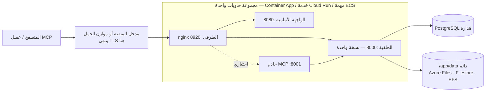

# خدمات الحاويات المُدارة

ليس كل فريق يشغّل Kubernetes، وليس كل فريق يريد صيانة آلة افتراضية. تشغّل **Azure Container Apps** و**Google Cloud Run** و**AWS ECS Fargate** صور Turbo EA نفسها من دون عنقود يجب إدارته، مع قاعدة PostgreSQL المُدارة في السحابة نفسها. تقدّم هذه الصفحة لكل منها قالبًا جاهزًا للتعديل ضمن [`deploy/`](https://github.com/vincentmakes/turbo-ea/tree/main/deploy) وتوضّح بصراحة ما تستطيع كل منصة فعله وما لا تستطيعه. إذا كان لديك عنقود، فصفحة [Kubernetes والسحابة](kubernetes.md) ومخطط Helm أنسب؛ وعلى مضيف واحد يبقى [Docker Compose](../getting-started/setup.md) هو المسار الأبسط. وكل ما تذكره صفحة [العمليات والترقيات](operations.md) عن النسخ الاحتياطي والترقيات وحفظ `SECRET_KEY` ينطبق هنا دون تغيير.

استُبعد AWS App Runner عمدًا: فقد توقف عن قبول عملاء جدد في أبريل 2026، ولم يدعم يومًا الحاويات الجانبية أو وحدات التخزين الدائمة.

## الشكل المشترك



تبني القوالب الثلاثة الشيء نفسه:

- **مجموعة حاويات واحدة، وحاويات جانبية على `localhost`.** يعمل nginx الطرفي والواجهة الأمامية والخلفية وخادم MCP الاختياري كحاويات جانبية تتشارك مساحة أسماء شبكية واحدة، لذا يوجّه الطرفي إلى `http://127.0.0.1:8000` و`:8080` و`:8001`. عنوان URL عام واحد، ودورة حياة واحدة، ونشر واحد.
- **يستمع الطرفي على المنفذ 8920.** منفذه الافتراضي هو 8080، لكن صورة الواجهة الأمامية تشغله بالفعل في مساحة الأسماء نفسها، لذا يضبط كل قالب `NGINX_HTTP_PORT=8920` ويوجّه مدخل المنصة إليه. ويظل الطرفي مالكًا لكل ترويسات الأمان، وحد 512 ميغابايت لرفع حزم نقل مساحة العمل، وإعدادات تدفق الأحداث، وتوجيه `/mcp` — ولا شيء على جانب المنصة يحل محله.
- **خلفية واحدة، لا تتوسع أبدًا، ولا تنزل إلى الصفر أبدًا.** تحتفظ الخلفية بحالة داخل العملية (ناقل الأحداث الفوري، ومحدّد المعدل، وذاكرة الصلاحيات المؤقتة) وتشغّل حلقات في الخلفية، لذا تعمل كنسخة واحدة بالضبط مع تخصيص المعالج طوال الوقت: الحد الأدنى والأقصى لعدد النسخ هو واحد على كل منصة.
- **تتداخل عمليات النشر على منصتين من ثلاث.** تُبقي Container Apps وCloud Run النسخة القديمة تعمل حتى تجهز الجديدة، فتعمل خلفيتان جنبًا إلى جنب لثوانٍ أو دقائق مع كل نشر. لذلك تأخذ الخلفية قفلًا استشاريًا في PostgreSQL حول ترحيلاتها وزرع بياناتها عند الإقلاع: تنتظر النسخة الثانية، وتجد المخطط محدّثًا بالفعل، ثم تتابع. وتظل حلقات الخلفية مكرّرة خلال تلك النافذة؛ وهي عمليات لا تتأثر بالتكرار. أما ECS فيوقف المهمة القديمة قبل بدء الجديدة (توقف لدقيقة أو دقيقتين مع كل نشر) ولا يحتاج إلى هذا الاحتياط.
- **`/app/data` دائم**، يملكه المستخدم uid 1000، ويضم الامتدادات المثبّتة والملفات المرفوعة وحزم نقل مساحة العمل. أما البطاقات والمخططات فتقيم في PostgreSQL.
- **ينتهي TLS عند حافة المنصة.** يبقى `TURBO_EA_TLS_ENABLED` على `false`؛ و`publicUrl` الذي يبدأ بـ `https://` هو ما يجعل ملف تعريف ارتباط الجلسة `secure` ويغذّي CORS.
- **تأتي الأسرار من مخزن أسرار المنصة** — أسرار Container Apps أو Key Vault، أو Secret Manager، أو Secrets Manager — ولا تُكتب أبدًا كقيم حرفية في القالب.
- **وسوم الصور هي رقم الإصدار.** يشغّل `2.141.0` صور `2.141.0` على كل منصة.

## ما تستطيع كل منصة فعله وما لا تستطيعه

| | Azure Container Apps | Google Cloud Run | AWS ECS Fargate |
|---|---|---|---|
| `/app/data` دائم | Azure Files (SMB) مثبّت بـ `uid=1000` | **Filestore عبر NFS فقط** — 100 غيبيبايت إقليميًا (منطقتان) أو 1 تيبيبايت في غيرهما؛ Cloud Storage FUSE لا يتوافق مع POSIX، للتقييم فقط | EFS عبر نقطة وصول (uid/gid 1000) |
| إيقاف النسخة القديمة قبل الجديدة | لا في وضع المراجعة الواحدة؛ نعم مع مراجعات متعددة وتعطيل يدوي | **لا** — تتداخل المراجعات دائمًا | **نعم** (`minimumHealthyPercent 0`، `maximumPercent 100`) |
| تدفق الأحداث (SSE طويل الأمد) | يقطعه المدخل كل 240 ثانية؛ ويعيد المتصفح الاتصال | حتى 3600 ثانية لكل طلب ثم إعادة اتصال | مهلة خمول موازن الحمل حتى 4000 ثانية |
| أكبر رفع (استيراد مساحة العمل يصل إلى 512 ميغابايت) | لم توثّقه Microsoft — اختبر استيراد 512 ميغابايت قبل الاعتماد عليه | **32 ميبيبايت لكل طلب عبر HTTP/1** | لا حد من المنصة |
| TLS والنطاق المخصص | شهادة مُدارة على التطبيق | موازن حمل خارجي عالمي + NEG بلا خادم + شهادة تديرها Google | شهادة ACM على ALB |
| الأسرار | أسرار التطبيق أو مراجع Key Vault | Secret Manager | Secrets Manager |
| صدفة داخل حاوية | `az containerapp exec` | لا يوجد | ECS Exec |
| نظام ملفات جذر للقراءة فقط | غير متاح | ليس إعدادًا | ممكن، لكنه يعطّل ECS Exec (مُطفأ في القالب) |

## Azure Container Apps

**المتطلبات الأساسية.**

- مجموعة موارد وخادم Azure Database for PostgreSQL **Flexible Server** يمكن للبيئة الوصول إليه: إما مدمجًا في VNet (بشبكة فرعية مفوّضة خاصة به في VNet نفسها) أو متاحًا عبر نقطة نهاية خاصة. يفرض الخادم TLS ويتفاوض عليه تلقائيًا؛ واسم المستخدم هو اسم الدور المجرّد.
- للوصول الخاص إلى قاعدة البيانات، شبكة فرعية بحجم `/27` على الأقل **مفوّضة إلى `Microsoft.App/environments`**، تُمرَّر كـ `infrastructureSubnetId`. اتركها فارغة فقط لتقييم مقابل خادم متاح للعموم.
- حساب تخزين مع مشاركة ملفات لـ `/app/data`:
  ```bash
  az storage account create -g turbo-ea -n turboeadata -l westeurope --sku Standard_LRS
  az storage share-rm create --storage-account turboeadata --name turbo-ea-data --quota 50
  ```
- سرّان — `SECRET_KEY` (`openssl rand -base64 48`) وكلمة مرور قاعدة البيانات — يُمرَّران كمعاملات آمنة أو يُشار إليهما من Key Vault (انظر التعليق في القالب).

**النشر.** عدّل [`deploy/azure-container-apps/main.bicepparam`](https://github.com/vincentmakes/turbo-ea/blob/main/deploy/azure-container-apps/main.bicepparam)، وصدّر الأسرار الثلاثة التي يقرؤها من البيئة، ثم نفّذ:

```bash
export TURBO_EA_SECRET_KEY="$(openssl rand -base64 48)"
export TURBO_EA_POSTGRES_PASSWORD='…'
export TURBO_EA_STORAGE_KEY="$(az storage account keys list -n turboeadata --query '[0].value' -o tsv)"
az deployment group create -g turbo-ea \
  -f deploy/azure-container-apps/main.bicep -p deploy/azure-container-apps/main.bicepparam
```

يُخرج النشر اسم FQDN الافتراضي للتطبيق. في التشغيل الأول اضبط `publicUrl` على `https://<ذلك الـ FQDN>`؛ وبعد ربط نطاق مخصص بشهادة مُدارة (`az containerapp hostname add` ثم `az containerapp hostname bind --validation-method CNAME`)، اضبط `publicUrl` عليه وانشر مجددًا — يجب أن يطابق عنوان المتصفح `publicUrl` من أجل ملفات تعريف الارتباط وCORS. **أول مستخدم يسجّل يصبح المسؤول.**

**الترقيات.** غيّر `imageTag` وانشر مجددًا. في وضع المراجعة الواحدة (الافتراضي في القالب) تتداخل النسخة القديمة والجديدة للحظة؛ ويجعل قفل الإقلاع في الخلفية ذلك آمنًا. وللحصول على دلالات صارمة «أوقف ثم ابدأ»، حوّل التطبيق إلى وضع المراجعات المتعددة، وعطّل المراجعة العاملة، ثم انشر:

```bash
az containerapp revision set-mode -g turbo-ea -n turbo-ea --mode Multiple
az containerapp revision deactivate -g turbo-ea -n turbo-ea --revision <الحالية>
az deployment group create …   # ثم فعّل المراجعة الجديدة ووجّه حركة المرور إليها
```

**حدود يجب معرفتها.** يغلق المدخل كل طلب بعد 240 ثانية، لذا يعيد تدفق الأحداث الاتصال كل أربع دقائق — يتحمل التطبيق ذلك، لكنه يظهر كتأخير قصير بعد كل إعادة اتصال. لا توثّق Microsoft حدًا لحجم الطلب؛ اختبر استيراد مساحة عمل بحجم واقعي قبل الاعتماد عليه. لا تملك Container Apps نظام ملفات جذر للقراءة فقط ولا إعدادات سياق أمان؛ والصور تعمل أصلًا بمستخدم غير جذر. وتحدّ المسابير `failureThreshold` بعشرة، ولذلك يستطلع مسبار إقلاع الخلفية كل 30 ثانية ليمنح مهلة خمس دقائق.

## Google Cloud Run

**المتطلبات الأساسية.**

- شبكة VPC وشبكة فرعية من أجل **الخروج المباشر عبر VPC**؛ تصل الخدمة عبرها إلى Cloud SQL وFilestore.
- نسخة Cloud SQL for PostgreSQL بعنوان **IP خاص** في تلك الـ VPC (الوصول إلى الخدمات الخاصة). يتصل القالب عبر `host:port` من دون وكيل.
- نسخة **Filestore** لـ `/app/data` — الخيار الدائم الوحيد المتوافق كليًا مع POSIX على Cloud Run. تكون مشاركتها مملوكة للجذر عند الإنشاء، لذا شغّل مرة واحدة مهمة تجعلها قابلة للكتابة للمستخدم uid 1000 قبل أول نشر:
  ```bash
  gcloud filestore instances create turbo-ea-data --zone=europe-west1-b --tier=BASIC_HDD \
    --file-share=name=share,capacity=1TB --network=name=default
  gcloud run jobs create chown-data --image=alpine --region=europe-west1 \
    --network=default --subnet=default --add-volume=name=data,type=nfs,location=FILESTORE_IP:/share \
    --add-volume-mount=volume=data,mount-path=/data --command=chown --args=-R,1000:1000,/data
  gcloud run jobs execute chown-data --region=europe-west1 --wait
  ```
- سرّان في Secret Manager هما `turbo-ea-secret-key` و`turbo-ea-postgres-password`، وحساب خدمة لوقت التشغيل يحمل `roles/secretmanager.secretAccessor` و`roles/cloudsql.client`.
- لا يستطيع Cloud Run السحب مباشرة من `ghcr.io`. أنشئ مرة واحدة **مستودعًا بعيدًا** في Artifact Registry له، ثم أشر إلى الصور عبره كما يفعل القالب:
  ```bash
  gcloud artifacts repositories create ghcr --repository-format=docker --location=europe-west1 \
    --mode=remote-repository --remote-docker-repo=https://ghcr.io
  ```

**النشر.** استبدل كل عنصر نائب بصيغة `UPPER_CASE` في [`deploy/cloud-run/service.yaml`](https://github.com/vincentmakes/turbo-ea/blob/main/deploy/cloud-run/service.yaml) — المشروع، والمنطقة، والشبكة، وعنوان Filestore، وعنوان Cloud SQL الخاص، وعنوان URL العام — ثم طبّقه:

```bash
gcloud run services replace deploy/cloud-run/service.yaml --region europe-west1
```

من أجل اسم المضيف العام، ضع أمام الخدمة موازن حمل تطبيقات خارجيًا عالميًا مع NEG بلا خادم وشهادة تديرها Google (`gcloud compute network-endpoint-groups create … --network-endpoint-type=serverless --cloud-run-service=turbo-ea`)، ووجّه DNS إليه، واضبط `TURBO_EA_PUBLIC_URL` و`ALLOWED_ORIGINS` و`MCP_PUBLIC_URL` في البيان على ذلك الاسم، وطبّق مجددًا، ثم غيّر تعليق المدخل إلى `internal-and-cloud-load-balancing` حتى يتوقف عنوان `run.app` عن الاستجابة. ولا تزال تعيينات النطاقات في Cloud Run في مرحلة المعاينة ولا يُنصح بها للإنتاج.

**الترقيات.** غيّر وسوم الصور وطبّق البيان مجددًا. تبدأ المراجعة الجديدة بينما لا تزال القديمة تخدم؛ ويمنع قفل الإقلاع في الخلفية ترحيل الاثنتين معًا، ولا يملك Cloud Run خيار إيقاف القديمة أولًا.

**حدود يجب معرفتها.** يرفض Cloud Run أجسام الطلبات التي تتجاوز **32 ميبيبايت عبر HTTP/1**، لذا يفشل استيراد نقل مساحة عمل أكبر من ذلك على Cloud Run؛ نفّذ عمليات الاستيراد الكبيرة على Kubernetes أو على آلة افتراضية. ويُغلق تدفق الأحداث بعد 3600 ثانية ثم يعيد الاتصال. والحجم الأدنى لـ Filestore هو التكلفة المهيمنة في هذا الإعداد؛ أما حاوية Cloud Storage المثبّتة عبر FUSE فرخيصة لكنها لا تتوافق مع POSIX (لا قفل، والكتابة الأخيرة تفوز)، فهي مناسبة لتجربة وغير مناسبة للامتدادات المثبّتة في الإنتاج؛ ووحدة التخزين في الذاكرة تفقد `/app/data` مع كل مراجعة.

## AWS ECS Fargate

**المتطلبات الأساسية.**

- شبكة VPC بشبكتين فرعيتين عامتين (موازن الحمل) وشبكتين فرعيتين خاصتين (المهمة، وأهداف تحميل EFS) لديهما وصول NAT لسحب الصور من `ghcr.io`.
- نسخة RDS for PostgreSQL في الشبكات الفرعية الخاصة. مرّر مجموعة أمانها كـ `DbSecurityGroupId` فيفتح المكدس المنفذ 5432 من المهمة؛ وإلا فافتحه بنفسك باستخدام المخرج `TaskSecurityGroupId`.
- شهادة ACM لاسم المضيف العام في المنطقة نفسها.
- سرّان في Secrets Manager يحملان `SECRET_KEY` وكلمة مرور قاعدة البيانات كسلاسل نصية مجرّدة (لسر JSON يديره RDS، ألحق `:password::` بمعرّف ARN في المعامل).

**النشر.**

```bash
aws cloudformation deploy --template-file deploy/ecs-fargate/template.yaml \
  --stack-name turbo-ea --capabilities CAPABILITY_IAM \
  --parameter-overrides VpcId=vpc-… PublicSubnetIds=subnet-a,subnet-b PrivateSubnetIds=subnet-c,subnet-d \
    PublicUrl=https://ea.example.com ImageTag=2.141.0 DbHost=turbo-ea.abc.eu-central-1.rds.amazonaws.com \
    DbPasswordSecretArn=arn:aws:secretsmanager:… SecretKeySecretArn=arn:aws:secretsmanager:… \
    CertificateArn=arn:aws:acm:… DbSecurityGroupId=sg-…
```

وجّه اسم المضيف إلى المخرج `AlbDnsName` (سجل CNAME أو اسم مستعار في Route 53) وافتحه. ينشئ المكدس العنقود، ونظام ملفات EFS مشفّرًا مع نقطة وصول يملكها uid 1000، وموازن الحمل بمستمع HTTPS وإعادة توجيه HTTP، وخدمة تشغّل مهمة واحدة.

**الترقيات.** انشر مجددًا بقيمة `ImageTag` جديدة. توقف الخدمة المهمة العاملة قبل بدء البديلة — «أوقف ثم ابدأ» حقيقي، فلا تتكرر الخلفية أبدًا، مقابل دقيقة أو دقيقتين من التوقف مع كل نشر.

**التشغيل.** يُنسخ EFS احتياطيًا بواسطة AWS Backup (يفعّل القالب السياسة الافتراضية)؛ اقرن نقاط استعادته بلقطات RDS لديك. يفتح الأمر `aws ecs execute-command --cluster turbo-ea --task <id> --container backend --interactive --command sh` صدفة في أي حاوية. ورُفعت مهلة خمول موازن الحمل إلى 4000 ثانية من أجل تدفق الأحداث، ولا يفرض أي حد لحجم الجسم.

## استكشاف الأخطاء وإصلاحها

| العرض | السبب والحل |
|---|---|
| لا يصبح nginx الطرفي سليمًا أبدًا بينما سجلات الخلفية سليمة | في تخطيط الحاويات الجانبية يجب أن تشير متغيرات upstream إلى `127.0.0.1`، ويجب أن يطابق `NGINX_HTTP_PORT` المنفذ الذي يستهدفه مدخل المنصة (8920 في كل قالب). |
| تسجّل الخلفية *another Turbo EA instance holds the startup lock — waiting* | متوقع للحظة أثناء النشر على Container Apps أو Cloud Run. إذا لم يزل أبدًا، فالمراجعة القديمة عالقة: عطّلها (Container Apps) أو احذفها (Cloud Run). |
| `Permission denied` تحت `/app/data` | وحدة التخزين ليست مملوكة لـ uid 1000: تحقق من خيارات تثبيت Azure Files، أو شغّل مهمة chown الخاصة بـ Filestore، أو تحقق من مستخدم POSIX لنقطة وصول EFS. |
| تسجيل الدخول يدور في حلقة أو تستجيب الواجهة البرمجية بـ 401 في المتصفح | لا يطابق `publicUrl` (والقيم المشتقة منه `TURBO_EA_PUBLIC_URL` / `ALLOWED_ORIGINS`) العنوان في شريط العناوين. |
| تتوقف التحديثات الفورية كل أربع دقائق على Container Apps | مهلة الطلب في المدخل؛ يعيد المتصفح الاتصال ولا يُفقد شيء. |
| يفشل استيراد مساحة العمل عند 32 ميبيبايت على Cloud Run | حد المنصة لجسم الطلب عبر HTTP/1؛ نفّذ عمليات الاستيراد الكبيرة على Kubernetes أو على آلة افتراضية. |
| تسجّل الخلفية `too many connections` | تحدّ الخطة المُدارة الاتصالات دون `DB_POOL_SIZE + DB_MAX_OVERFLOW`؛ قلّل المجمّع ([ميزانية الاتصالات](operations.md#check-the-connection-limit)). |
