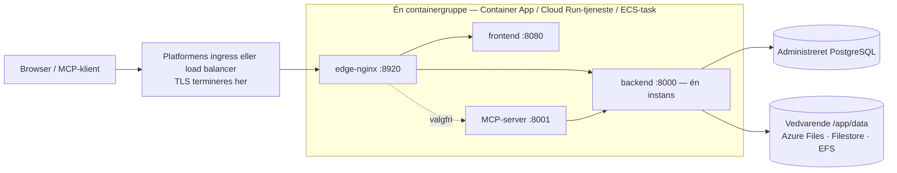

# Administrerede containertjenester

Ikke alle teams driver Kubernetes, og ikke alle teams vil patche en virtuel maskine. **Azure Container Apps**, **Google Cloud Run** og **AWS ECS Fargate** kører de samme Turbo EA-images uden en klynge at drive, mod den administrerede PostgreSQL i samme cloud. Denne side giver hver af dem en færdig skabelon under [`deploy/`](https://github.com/vincentmakes/turbo-ea/tree/main/deploy) og siger ligeud, hvad hver platform kan og ikke kan. Har du en klynge, passer siden [Kubernetes og cloud](kubernetes.md) og Helm-chartet bedre; på en enkelt vært er [Docker Compose](../getting-started/setup.md) stadig den enkleste vej. Alt på [Drift og opgraderinger](operations.md) om backup, opgraderinger og opbevaring af `SECRET_KEY` gælder her uændret. Hver af de tre platforme har også et Terraform-modul, der opretter den samme containergruppe samt den administrerede database — se [Terraform](terraform.md).

AWS App Runner er bevidst udeladt: den tager ikke imod nye kunder siden april 2026 og har aldrig understøttet sidecars eller vedvarende volumener.

## Den fælles form



Alle tre skabeloner bygger det samme:

- **Én containergruppe, sidecars på `localhost`.** Edge-nginx, frontend, backend og den valgfrie MCP-server kører som sidecars i ét netværksnavnerum, så edge'en proxyer til `http://127.0.0.1:8000`, `:8080` og `:8001`. Én offentlig URL, én livscyklus, ét deploy.
- **Edge'en lytter på 8920.** Dens standardport er 8080, som frontend-imaget allerede ejer i samme navnerum, så hver skabelon sætter `NGINX_HTTP_PORT=8920` og peger platformens ingress på den. Edge'en ejer stadig alle sikkerhedsheadere, grænsen på 2 GB for upload af arbejdsområdeoverførsler, indstillingerne for hændelsesstrømmen og `/mcp`-routingen — intet på platformssiden erstatter den.
- **Én backend, aldrig skaleret, aldrig nul.** Backend holder tilstand i processen (hændelsesbussen i realtid, rate limiteren, rettighedscachen) og kører baggrundsløkker, så den kører som præcis én instans med CPU tildelt hele tiden: mindste og største antal instanser er én på alle platforme.
- **Deploys overlapper på to af de tre platforme.** Container Apps og Cloud Run lader den gamle instans betjene, indtil den nye er klar, så i nogle sekunder til minutter kører to backends side om side ved hvert deploy. Backend tager derfor en PostgreSQL advisory lock omkring sine migreringer og seeding ved opstart: den anden instans venter, finder skemaet allerede opdateret og fortsætter. Baggrundsløkkerne kører stadig dobbelt i det vindue; de er idempotente. ECS stopper den gamle task, før den starter den nye (et til to minutters nedetid pr. deploy), og har ikke brug for den forholdsregel.
- **Vedvarende `/app/data`**, ejet af uid 1000, rummer installerede udvidelser, uploads og arbejdsområdeoverførselspakker. Kort og diagrammer ligger i PostgreSQL.
- **TLS termineres ved platformens kant.** `TURBO_EA_TLS_ENABLED` forbliver `false`; en `publicUrl`, der begynder med `https://`, markerer sessionscookien `secure` og styrer CORS.
- **Hemmeligheder kommer fra platformens hemmelighedslager** — Container Apps-hemmeligheder eller Key Vault, Secret Manager, Secrets Manager — aldrig som klartekst i skabelonen.
- **Image-tags er udgivelsesnummeret.** `2.141.0` kører `2.141.0`-images på alle platforme.

## Hvad hver platform kan og ikke kan

| | Azure Container Apps | Google Cloud Run | AWS ECS Fargate |
|---|---|---|---|
| Vedvarende `/app/data` | Azure Files (SMB) monteret med `uid=1000` | **Kun Filestore over NFS** — 100 GiB regionalt (to regioner) eller 1 TiB andre steder; Cloud Storage FUSE er ikke POSIX, kun til evaluering | EFS gennem et access point (uid/gid 1000) |
| Stop den gamle instans før den nye | Ikke i single-revision-tilstand; ja med flere revisioner og manuel deaktivering | **Nej** — revisioner overlapper altid | **Ja** (`minimumHealthyPercent 0`, `maximumPercent 100`) |
| Hændelsesstrøm (langlivet SSE) | Afbrydes hvert 240 s af ingress; browseren genforbinder | Op til 3600 s pr. anmodning, derefter genforbindelse | Load balancerens idle-timeout op til 4000 s |
| Største upload (arbejdsområdeimport op til 2 GB) | Ikke dokumenteret af Microsoft — test en import på 2 GB, før du stoler på det | **32 MiB pr. anmodning over HTTP/1** | Ingen platformsgrænse |
| TLS og eget domæne | Administreret certifikat på appen | Global ekstern load balancer + serverless NEG + Google-administreret certifikat | ACM-certifikat på ALB |
| Hemmeligheder | App-hemmeligheder eller Key Vault-referencer | Secret Manager | Secrets Manager |
| Shell ind i en container | `az containerapp exec` | ingen | ECS Exec |
| Skrivebeskyttet rodfilsystem | ikke tilgængeligt | ikke en indstilling | muligt, men slår ECS Exec fra (slået fra i skabelonen) |

## Azure Container Apps

**Forudsætninger.**

- En ressourcegruppe og en Azure Database for PostgreSQL **Flexible Server**, miljøet kan nå: enten VNet-integreret (eget delegeret undernet i samme VNet) eller nåelig gennem et privat endpoint. Serveren kræver TLS og forhandler det automatisk; brugernavnet er det rene rollenavn.
- Til privat databaseadgang et undernet på mindst `/27`, **delegeret til `Microsoft.App/environments`**, givet som `infrastructureSubnetId`. Lad det kun være tomt til en evaluering mod en offentligt tilgængelig server.
- En storage-konto med en fildeling til `/app/data`:
  ```bash
  az storage account create -g turbo-ea -n turboeadata -l westeurope --sku Standard_LRS
  az storage share-rm create --storage-account turboeadata --name turbo-ea-data --quota 50
  ```
- To hemmeligheder — `SECRET_KEY` (`openssl rand -base64 48`) og databasekodeordet — givet som sikre parametre eller refereret fra Key Vault (se kommentaren i skabelonen).

**Udrul.** Redigér [`deploy/azure-container-apps/main.bicepparam`](https://github.com/vincentmakes/turbo-ea/blob/main/deploy/azure-container-apps/main.bicepparam), eksportér de tre hemmeligheder, den læser fra miljøet, og kør:

```bash
export TURBO_EA_SECRET_KEY="$(openssl rand -base64 48)"
export TURBO_EA_POSTGRES_PASSWORD='…'
export TURBO_EA_STORAGE_KEY="$(az storage account keys list -n turboeadata --query '[0].value' -o tsv)"
az deployment group create -g turbo-ea \
  -f deploy/azure-container-apps/main.bicep -p deploy/azure-container-apps/main.bicepparam
```

Udrulningen udskriver appens standard-FQDN. Sæt `publicUrl` til `https://<dette FQDN>` ved første kørsel; når du binder et eget domæne med administreret certifikat (`az containerapp hostname add` og derefter `az containerapp hostname bind --validation-method CNAME`), sætter du `publicUrl` til det og udruller igen — browserens URL skal matche `publicUrl` for cookies og CORS. **Den første bruger, der registrerer sig, bliver administrator.**

**Opgraderinger.** Ændr `imageTag`, og udrul igen. I single-revision-tilstand (skabelonens standard) overlapper den gamle og den nye replika et øjeblik; backendens opstartslås gør det sikkert. For streng stop-så-start-semantik skifter du appen til tilstanden med flere revisioner, deaktiverer den kørende revision og udruller derefter:

```bash
az containerapp revision set-mode -g turbo-ea -n turbo-ea --mode Multiple
az containerapp revision deactivate -g turbo-ea -n turbo-ea --revision <nuværende>
az deployment group create …   # aktivér derefter den nye revision, og send trafikken derhen
```

**Begrænsninger, du skal kende.** Ingress lukker hver anmodning efter 240 sekunder, så hændelsesstrømmen genforbinder hvert fjerde minut — appen tåler det, men det ses som en kort forsinkelse efter hver genforbindelse. Microsoft dokumenterer ingen grænse for anmodningsstørrelse; test en arbejdsområdeimport i realistisk størrelse, før du stoler på det. Container Apps har hverken skrivebeskyttet rodfilsystem eller security-context-indstillinger; imagesne kører allerede som en ikke-root-bruger. Prober begrænser `failureThreshold` til 10, hvilket er grunden til, at backendens opstartsprobe spørger hvert 30. sekund for et budget på fem minutter.

## Google Cloud Run

**Forudsætninger.**

- Et VPC og et undernet til **direkte VPC-udgang**; tjenesten når Cloud SQL og Filestore gennem det.
- En Cloud SQL for PostgreSQL-instans med **privat IP** i det VPC (private services access). Skabelonen forbinder på `host:port`, uden proxy.
- En **Filestore**-instans til `/app/data` — den eneste vedvarende, fuldt POSIX-kompatible mulighed på Cloud Run. Delingen ejes af root ved oprettelsen, så kør et engangsjob, der gør den skrivbar for uid 1000, før første deploy:
  ```bash
  gcloud filestore instances create turbo-ea-data --zone=europe-west1-b --tier=BASIC_HDD \
    --file-share=name=share,capacity=1TB --network=name=default
  gcloud run jobs create chown-data --image=alpine --region=europe-west1 \
    --network=default --subnet=default --add-volume=name=data,type=nfs,location=FILESTORE_IP:/share \
    --add-volume-mount=volume=data,mount-path=/data --command=chown --args=-R,1000:1000,/data
  gcloud run jobs execute chown-data --region=europe-west1 --wait
  ```
- To Secret Manager-hemmeligheder, `turbo-ea-secret-key` og `turbo-ea-postgres-password`, og en runtime-servicekonto med `roles/secretmanager.secretAccessor` og `roles/cloudsql.client`.
- Cloud Run kan ikke hente direkte fra `ghcr.io`. Opret én gang et Artifact Registry-**remote repository** til det, og referér til imagesne gennem det, som skabelonen gør:
  ```bash
  gcloud artifacts repositories create ghcr --repository-format=docker --location=europe-west1 \
    --mode=remote-repository --remote-docker-repo=https://ghcr.io
  ```

**Udrul.** Erstat hver `UPPER_CASE`-pladsholder i [`deploy/cloud-run/service.yaml`](https://github.com/vincentmakes/turbo-ea/blob/main/deploy/cloud-run/service.yaml) — projekt, region, netværk, Filestore-IP, privat Cloud SQL-IP, offentlig URL — og anvend den:

```bash
gcloud run services replace deploy/cloud-run/service.yaml --region europe-west1
```

Til det offentlige værtsnavn sætter du en global ekstern application load balancer foran tjenesten med en serverless NEG og et Google-administreret certifikat (`gcloud compute network-endpoint-groups create … --network-endpoint-type=serverless --cloud-run-service=turbo-ea`), peger DNS på den, sætter `TURBO_EA_PUBLIC_URL`, `ALLOWED_ORIGINS` og `MCP_PUBLIC_URL` i manifestet til det værtsnavn, anvender igen og ændrer derefter ingress-annotationen til `internal-and-cloud-load-balancing`, så `run.app`-URL'en holder op med at svare. Domænekortlægninger på Cloud Run er stadig preview og anbefales ikke til produktion.

**Opgraderinger.** Ændr image-tags, og anvend manifestet igen. Den nye revision starter, mens den gamle stadig betjener; backendens opstartslås holder de to fra at migrere samtidig, og Cloud Run har ingen mulighed for at stoppe den gamle først.

**Begrænsninger, du skal kende.** Cloud Run afviser anmodningskroppe over **32 MiB over HTTP/1**, så en større import af en arbejdsområdeoverførsel fejler på Cloud Run; kør store importer på Kubernetes eller en VM i stedet. Hændelsesstrømmen lukkes efter 3600 sekunder og genforbinder. Filestores minimumsstørrelse er den dominerende omkostning i denne opsætning; en Cloud Storage-bucket monteret gennem FUSE er billig, men ikke POSIX (ingen låsning, sidste skrivning vinder), så den er fin til en prøve og forkert til installerede udvidelser i produktion, og et in-memory-volumen mister `/app/data` ved hver revision.

## AWS ECS Fargate

**Forudsætninger.**

- Et VPC med to offentlige undernet (load balancer) og to private undernet (task, EFS-mount targets), som har NAT-adgang til at hente images fra `ghcr.io`.
- En RDS for PostgreSQL-instans i de private undernet. Giv dens sikkerhedsgruppe som `DbSecurityGroupId`, så åbner stakken port 5432 fra tasken; ellers åbner du den selv med outputtet `TaskSecurityGroupId`.
- Et ACM-certifikat til det offentlige værtsnavn i samme region.
- To Secrets Manager-hemmeligheder med `SECRET_KEY` og databasekodeordet som rene strenge (for en RDS-administreret JSON-hemmelighed tilføjes `:password::` til dens ARN i parameteren).

**Udrul.**

```bash
aws cloudformation deploy --template-file deploy/ecs-fargate/template.yaml \
  --stack-name turbo-ea --capabilities CAPABILITY_IAM \
  --parameter-overrides VpcId=vpc-… PublicSubnetIds=subnet-a,subnet-b PrivateSubnetIds=subnet-c,subnet-d \
    PublicUrl=https://ea.example.com ImageTag=2.141.0 DbHost=turbo-ea.abc.eu-central-1.rds.amazonaws.com \
    DbPasswordSecretArn=arn:aws:secretsmanager:… SecretKeySecretArn=arn:aws:secretsmanager:… \
    CertificateArn=arn:aws:acm:… DbSecurityGroupId=sg-…
```

Peg værtsnavnet på outputtet `AlbDnsName` (CNAME eller Route 53-alias), og åbn det. Stakken opretter klyngen, et krypteret EFS-filsystem med et access point ejet af uid 1000, load balanceren med en HTTPS-listener og en HTTP-omdirigering samt en tjeneste, der kører én task.

**Opgraderinger.** Udrul igen med et nyt `ImageTag`. Tjenesten stopper den kørende task, før den starter erstatningen — et ægte stop-så-start, så backend fordobles aldrig, til prisen af et til to minutters nedetid pr. deploy.

**Drift.** EFS sikkerhedskopieres af AWS Backup (skabelonen slår standardpolitikken til); parrér dens gendannelsespunkter med dine RDS-snapshots. `aws ecs execute-command --cluster turbo-ea --task <id> --container backend --interactive --command sh` åbner en shell i enhver container. Load balancerens idle-timeout er hævet til 4000 sekunder af hensyn til hændelsesstrømmen, og den sætter ingen grænse for kropsstørrelse.

**Amazon Bedrock.** For at bruge Bedrock som AI-udbyder skal du tilknytte IAM-politikken fra [AI-funktioner](ai.md) til stackens task-rolle; Turbo EA godkendes derefter med den rolle og har ikke brug for nogen API-nøgle.

## Fejlfinding

| Symptom | Årsag og løsning |
|---|---|
| Edge-nginx bliver aldrig sund, selv om backend-loggene er fine | I et sidecar-layout skal upstream-variablerne pege på `127.0.0.1`, og `NGINX_HTTP_PORT` skal matche den port, platformens ingress peger på (8920 i alle skabeloner). |
| Backend logger *another Turbo EA instance holds the startup lock — waiting* | Forventet et øjeblik under et deploy på Container Apps eller Cloud Run. Forsvinder det aldrig, hænger den gamle revision: deaktivér den (Container Apps) eller slet den (Cloud Run). |
| `Permission denied` under `/app/data` | Volumenet ejes ikke af uid 1000: tjek Azure Files-mountindstillingerne, kør Filestore-chown-jobbet, eller kontrollér EFS-access pointets POSIX-bruger. |
| Login går i ring, eller API'et svarer 401 i browseren | `publicUrl` (og værdierne `TURBO_EA_PUBLIC_URL` / `ALLOWED_ORIGINS`, der afledes af den) matcher ikke URL'en i adresselinjen. |
| Realtidsopdateringer pauser hvert fjerde minut på Container Apps | Ingress' anmodningstimeout; browseren genforbinder, og intet går tabt. |
| En arbejdsområdeimport fejler ved 32 MiB på Cloud Run | Platformens HTTP/1-grænse for anmodningskroppe; kør store importer på Kubernetes eller en VM. |
| Backend logger `too many connections` | Den administrerede plan begrænser forbindelser under `DB_POOL_SIZE + DB_MAX_OVERFLOW`; skru ned for poolen ([forbindelsesbudget](operations.md#check-the-connection-limit)). |
