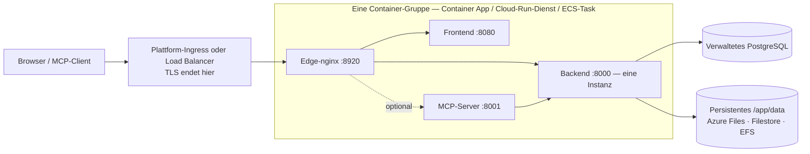

# Verwaltete Container-Dienste

Nicht jedes Team betreibt Kubernetes, und nicht jedes Team möchte eine virtuelle Maschine patchen. **Azure Container Apps**, **Google Cloud Run** und **AWS ECS Fargate** führen dieselben Turbo-EA-Images ohne einen zu betreibenden Cluster aus, gegen das verwaltete PostgreSQL derselben Cloud. Diese Seite liefert für jede Plattform eine fertige Vorlage unter [`deploy/`](https://github.com/vincentmakes/turbo-ea/tree/main/deploy) und sagt klar, was jede Plattform kann und was nicht. Wer einen Cluster hat, ist mit der Seite [Kubernetes & Cloud](kubernetes.md) und dem Helm-Chart besser bedient; auf einem einzelnen Host bleibt [Docker Compose](../getting-started/setup.md) der einfachste Weg. Alles auf [Betrieb & Upgrades](operations.md) zu Backups, Upgrades und der Verwahrung von `SECRET_KEY` gilt hier unverändert.

AWS App Runner wird bewusst nicht behandelt: Er nimmt seit April 2026 keine neuen Kunden mehr auf und hat Sidecars oder persistente Volumes nie unterstützt.

## Der gemeinsame Aufbau



Alle drei Vorlagen bauen dasselbe:

- **Eine Container-Gruppe, Sidecars auf `localhost`.** Edge-nginx, Frontend, Backend und der optionale MCP-Server laufen als Sidecars in einem Netzwerk-Namespace; der Edge leitet an `http://127.0.0.1:8000`, `:8080` und `:8001` weiter. Eine öffentliche URL, ein Lebenszyklus, ein Deploy.
- **Der Edge lauscht auf 8920.** Sein Standardport ist 8080, den das Frontend-Image im selben Namespace bereits belegt; daher setzt jede Vorlage `NGINX_HTTP_PORT=8920` und richtet den Plattform-Ingress darauf. Der Edge besitzt weiterhin jeden Security-Header, das 512-MB-Upload-Limit für Workspace-Transfers, die Event-Stream-Einstellungen und das `/mcp`-Routing — nichts auf Plattformseite ersetzt ihn.
- **Ein Backend, nie skaliert, nie null.** Das Backend hält prozessinternen Zustand (Echtzeit-Event-Bus, Rate-Limiter, Berechtigungs-Cache) und führt Hintergrundschleifen aus; es läuft daher als genau eine Instanz mit jederzeit zugewiesener CPU: minimale und maximale Instanzanzahl eins auf jeder Plattform.
- **Deploys überlappen auf zwei der drei Plattformen.** Container Apps und Cloud Run lassen die alte Instanz weiterlaufen, bis die neue bereit ist; für einige Sekunden bis Minuten laufen bei jedem Deploy also zwei Backends nebeneinander. Das Backend nimmt deshalb um seine Migrationen und das Seeding beim Start einen PostgreSQL-Advisory-Lock: Die zweite Instanz wartet, findet das Schema bereits auf dem neuesten Stand und fährt fort. Hintergrundschleifen laufen in diesem Fenster weiterhin doppelt; sie sind idempotent. ECS stoppt den alten Task, bevor es den neuen startet (ein bis zwei Minuten Ausfall je Deploy), und braucht keine solche Vorsicht.
- **Persistentes `/app/data`**, im Besitz von uid 1000, enthält installierte Erweiterungen, Uploads und Workspace-Transfer-Bundles. Karten und Diagramme liegen in PostgreSQL.
- **TLS endet am Plattformrand.** `TURBO_EA_TLS_ENABLED` bleibt `false`; ein `publicUrl` mit `https://` markiert das Sitzungs-Cookie als `secure` und speist CORS.
- **Secrets kommen aus dem Secret-Store der Plattform** — Container-Apps-Secrets oder Key Vault, Secret Manager, Secrets Manager — nie als Literale in der Vorlage.
- **Image-Tags sind die Release-Nummer.** `2.141.0` führt auf jeder Plattform die Images `2.141.0` aus.

## Was jede Plattform kann und was nicht

| | Azure Container Apps | Google Cloud Run | AWS ECS Fargate |
|---|---|---|---|
| Persistentes `/app/data` | Azure Files (SMB), gemountet mit `uid=1000` | **Nur Filestore über NFS** — 100 GiB regional (zwei Regionen) oder sonst 1 TiB; Cloud Storage FUSE ist nicht POSIX, nur zur Evaluierung | EFS über einen Access Point (uid/gid 1000) |
| Alte Instanz vor der neuen stoppen | Nicht im Single-Revision-Modus; ja mit mehreren Revisionen und manuellem Deaktivieren | **Nein** — Revisionen überlappen immer | **Ja** (`minimumHealthyPercent 0`, `maximumPercent 100`) |
| Event-Stream (langlebiges SSE) | Alle 240 s vom Ingress getrennt; der Browser verbindet sich neu | Bis 3600 s je Anfrage, dann Neuverbindung | Idle-Timeout des Load Balancers bis 4000 s |
| Größter Upload (Workspace-Import bis 512 MB) | Von Microsoft nicht dokumentiert — einen 512-MB-Import testen, bevor man sich darauf verlässt | **32 MiB je Anfrage über HTTP/1** | Kein Plattformlimit |
| TLS und eigene Domain | Verwaltetes Zertifikat an der App | Globaler externer Load Balancer + serverlose NEG + von Google verwaltetes Zertifikat | ACM-Zertifikat am ALB |
| Secrets | App-Secrets oder Key-Vault-Referenzen | Secret Manager | Secrets Manager |
| Shell in einen Container | `az containerapp exec` | keine | ECS Exec |
| Schreibgeschütztes Root-Dateisystem | nicht verfügbar | keine Einstellung | möglich, deaktiviert aber ECS Exec (in der Vorlage aus) |

## Azure Container Apps

**Voraussetzungen.**

- Eine Ressourcengruppe und ein Azure Database for PostgreSQL **Flexible Server**, den die Umgebung erreicht: entweder VNet-integriert (eigenes delegiertes Subnetz im selben VNet) oder über einen privaten Endpunkt erreichbar. TLS ist serverseitig Pflicht und wird automatisch ausgehandelt; der Benutzername ist der reine Rollenname.
- Für privaten Datenbankzugriff ein Subnetz von mindestens `/27`, **an `Microsoft.App/environments` delegiert**, übergeben als `infrastructureSubnetId`. Nur für eine Evaluierung gegen einen öffentlich erreichbaren Server leer lassen.
- Ein Storage-Konto mit einer Dateifreigabe für `/app/data`:
  ```bash
  az storage account create -g turbo-ea -n turboeadata -l westeurope --sku Standard_LRS
  az storage share-rm create --storage-account turboeadata --name turbo-ea-data --quota 50
  ```
- Zwei Secrets — `SECRET_KEY` (`openssl rand -base64 48`) und das Datenbankpasswort — als sichere Parameter übergeben oder aus Key Vault referenziert (siehe Kommentar in der Vorlage).

**Bereitstellen.** Bearbeiten Sie [`deploy/azure-container-apps/main.bicepparam`](https://github.com/vincentmakes/turbo-ea/blob/main/deploy/azure-container-apps/main.bicepparam), exportieren Sie die drei Secrets, die die Datei aus der Umgebung liest, und führen Sie aus:

```bash
export TURBO_EA_SECRET_KEY="$(openssl rand -base64 48)"
export TURBO_EA_POSTGRES_PASSWORD='…'
export TURBO_EA_STORAGE_KEY="$(az storage account keys list -n turboeadata --query '[0].value' -o tsv)"
az deployment group create -g turbo-ea \
  -f deploy/azure-container-apps/main.bicep -p deploy/azure-container-apps/main.bicepparam
```

Die Bereitstellung gibt den Standard-FQDN der App aus. Setzen Sie `publicUrl` beim ersten Lauf auf `https://<dieser FQDN>`; sobald Sie eine eigene Domain mit verwaltetem Zertifikat binden (`az containerapp hostname add`, dann `az containerapp hostname bind --validation-method CNAME`), setzen Sie `publicUrl` darauf und stellen erneut bereit — die Browser-URL muss für Cookies und CORS mit `publicUrl` übereinstimmen. **Der erste registrierte Benutzer wird Administrator.**

**Upgrades.** `imageTag` ändern und erneut bereitstellen. Im Single-Revision-Modus (Standard der Vorlage) überlappen alte und neue Replik kurz; der Startup-Lock des Backends macht das sicher. Für striktes Stoppen-dann-Starten schalten Sie die App in den Modus mit mehreren Revisionen, deaktivieren die laufende Revision und stellen dann bereit:

```bash
az containerapp revision set-mode -g turbo-ea -n turbo-ea --mode Multiple
az containerapp revision deactivate -g turbo-ea -n turbo-ea --revision <aktuell>
az deployment group create …   # danach die neue Revision aktivieren und den Verkehr dorthin leiten
```

**Grenzen, die man kennen sollte.** Der Ingress beendet jede Anfrage nach 240 Sekunden, der Event-Stream verbindet sich also alle vier Minuten neu — die App verträgt das, sichtbar ist nur eine kurze Verzögerung nach jeder Neuverbindung. Microsoft dokumentiert kein Limit für die Anfragegröße; testen Sie einen Workspace-Import realistischer Größe, bevor Sie sich darauf verlassen. Container Apps kennt weder ein schreibgeschütztes Root-Dateisystem noch Security-Context-Einstellungen; die Images laufen ohnehin als Nicht-Root-Benutzer. Probes begrenzen `failureThreshold` auf 10, weshalb die Startup-Probe des Backends alle 30 Sekunden für ein Fünf-Minuten-Budget abfragt.

## Google Cloud Run

**Voraussetzungen.**

- Ein VPC und ein Subnetz für **Direct VPC Egress**; darüber erreicht der Dienst Cloud SQL und Filestore.
- Eine Cloud-SQL-for-PostgreSQL-Instanz mit **privater IP** in diesem VPC (Private Services Access). Die Vorlage verbindet über `host:port`, ohne Proxy.
- Eine **Filestore**-Instanz für `/app/data` — die einzige persistente, vollständig POSIX-konforme Option auf Cloud Run. Ihre Freigabe gehört bei der Erstellung root; führen Sie vor dem ersten Deploy einmalig einen Job aus, der sie für uid 1000 beschreibbar macht:
  ```bash
  gcloud filestore instances create turbo-ea-data --zone=europe-west1-b --tier=BASIC_HDD \
    --file-share=name=share,capacity=1TB --network=name=default
  gcloud run jobs create chown-data --image=alpine --region=europe-west1 \
    --network=default --subnet=default --add-volume=name=data,type=nfs,location=FILESTORE_IP:/share \
    --add-volume-mount=volume=data,mount-path=/data --command=chown --args=-R,1000:1000,/data
  gcloud run jobs execute chown-data --region=europe-west1 --wait
  ```
- Zwei Secret-Manager-Secrets, `turbo-ea-secret-key` und `turbo-ea-postgres-password`, sowie ein Laufzeit-Dienstkonto mit `roles/secretmanager.secretAccessor` und `roles/cloudsql.client`.
- Cloud Run kann nicht direkt von `ghcr.io` ziehen. Legen Sie einmalig ein Artifact-Registry-**Remote-Repository** dafür an und referenzieren Sie die Images darüber, wie es die Vorlage tut:
  ```bash
  gcloud artifacts repositories create ghcr --repository-format=docker --location=europe-west1 \
    --mode=remote-repository --remote-docker-repo=https://ghcr.io
  ```

**Bereitstellen.** Ersetzen Sie jeden `UPPER_CASE`-Platzhalter in [`deploy/cloud-run/service.yaml`](https://github.com/vincentmakes/turbo-ea/blob/main/deploy/cloud-run/service.yaml) — Projekt, Region, Netzwerk, Filestore-IP, private Cloud-SQL-IP, öffentliche URL — und wenden Sie die Datei an:

```bash
gcloud run services replace deploy/cloud-run/service.yaml --region europe-west1
```

Für den öffentlichen Hostnamen stellen Sie einen globalen externen Application Load Balancer mit serverloser NEG und von Google verwaltetem Zertifikat vor den Dienst (`gcloud compute network-endpoint-groups create … --network-endpoint-type=serverless --cloud-run-service=turbo-ea`), richten DNS darauf, setzen `TURBO_EA_PUBLIC_URL`, `ALLOWED_ORIGINS` und `MCP_PUBLIC_URL` im Manifest auf diesen Hostnamen, wenden es erneut an und ändern dann die Ingress-Annotation auf `internal-and-cloud-load-balancing`, damit die `run.app`-URL nicht mehr antwortet. Domain-Mappings auf Cloud Run sind weiterhin Vorschau und für die Produktion nicht empfohlen.

**Upgrades.** Image-Tags ändern und das Manifest erneut anwenden. Die neue Revision startet, während die alte noch bedient; der Startup-Lock des Backends verhindert, dass beide gleichzeitig migrieren, und Cloud Run hat keine Option, die alte zuerst zu stoppen.

**Grenzen, die man kennen sollte.** Cloud Run weist Anfragekörper über **32 MiB bei HTTP/1** ab; ein größerer Workspace-Transfer-Import scheitert auf Cloud Run — führen Sie große Importe stattdessen auf Kubernetes oder einer VM aus. Der Event-Stream wird nach 3600 Sekunden geschlossen und neu verbunden. Die Mindestgröße von Filestore ist der größte Kostenposten dieses Setups; ein per FUSE eingehängter Cloud-Storage-Bucket ist günstig, aber nicht POSIX (kein Locking, letzter Schreibvorgang gewinnt) — gut für einen Test, falsch für installierte Erweiterungen in der Produktion; ein In-Memory-Volume verliert `/app/data` bei jeder Revision.

## AWS ECS Fargate

**Voraussetzungen.**

- Ein VPC mit zwei öffentlichen Subnetzen (Load Balancer) und zwei privaten Subnetzen (Task, EFS-Mount-Targets) mit NAT-Zugang für Image-Pulls von `ghcr.io`.
- Eine RDS-for-PostgreSQL-Instanz in den privaten Subnetzen. Übergeben Sie deren Sicherheitsgruppe als `DbSecurityGroupId`, dann öffnet der Stack Port 5432 vom Task; andernfalls öffnen Sie ihn selbst mit der Ausgabe `TaskSecurityGroupId`.
- Ein ACM-Zertifikat für den öffentlichen Hostnamen in derselben Region.
- Zwei Secrets-Manager-Secrets mit `SECRET_KEY` und dem Datenbankpasswort als reine Zeichenketten (bei einem von RDS verwalteten JSON-Secret hängen Sie im Parameter `:password::` an die ARN an).

**Bereitstellen.**

```bash
aws cloudformation deploy --template-file deploy/ecs-fargate/template.yaml \
  --stack-name turbo-ea --capabilities CAPABILITY_IAM \
  --parameter-overrides VpcId=vpc-… PublicSubnetIds=subnet-a,subnet-b PrivateSubnetIds=subnet-c,subnet-d \
    PublicUrl=https://ea.example.com ImageTag=2.141.0 DbHost=turbo-ea.abc.eu-central-1.rds.amazonaws.com \
    DbPasswordSecretArn=arn:aws:secretsmanager:… SecretKeySecretArn=arn:aws:secretsmanager:… \
    CertificateArn=arn:aws:acm:… DbSecurityGroupId=sg-…
```

Richten Sie den Hostnamen auf die Ausgabe `AlbDnsName` (CNAME oder Route-53-Alias) und öffnen Sie ihn. Der Stack erstellt den Cluster, ein verschlüsseltes EFS-Dateisystem mit einem Access Point im Besitz von uid 1000, den Load Balancer mit HTTPS-Listener und HTTP-Umleitung sowie einen Dienst mit einem Task.

**Upgrades.** Mit neuem `ImageTag` erneut bereitstellen. Der Dienst stoppt den laufenden Task, bevor er den Ersatz startet — echtes Stoppen-dann-Starten, das Backend läuft also nie doppelt, um den Preis von ein bis zwei Minuten Ausfall je Deploy.

**Betrieb.** EFS wird von AWS Backup gesichert (die Vorlage aktiviert die Standardrichtlinie); kombinieren Sie die Wiederherstellungspunkte mit Ihren RDS-Snapshots. `aws ecs execute-command --cluster turbo-ea --task <id> --container backend --interactive --command sh` öffnet eine Shell in jedem Container. Das Idle-Timeout des Load Balancers ist für den Event-Stream auf 4000 Sekunden erhöht, ein Limit für die Anfragegröße gibt es nicht.

## Fehlerbehebung

| Symptom | Ursache und Abhilfe |
|---|---|
| Der Edge-nginx wird nie gesund, obwohl die Backend-Logs in Ordnung sind | In einem Sidecar-Layout müssen die Upstream-Variablen auf `127.0.0.1` zeigen, und `NGINX_HTTP_PORT` muss dem Port entsprechen, den der Plattform-Ingress anspricht (8920 in jeder Vorlage). |
| Backend-Log: *another Turbo EA instance holds the startup lock — waiting* | Während eines Deploys auf Container Apps oder Cloud Run kurz erwartbar. Verschwindet es nie, hängt die alte Revision: deaktivieren (Container Apps) oder löschen (Cloud Run). |
| `Permission denied` unter `/app/data` | Das Volume gehört nicht uid 1000: Azure-Files-Mount-Optionen prüfen, den Filestore-chown-Job ausführen oder den POSIX-Benutzer des EFS-Access-Points prüfen. |
| Anmeldung in Schleife oder API antwortet im Browser mit 401 | `publicUrl` (und die daraus abgeleiteten Werte `TURBO_EA_PUBLIC_URL` / `ALLOWED_ORIGINS`) stimmt nicht mit der URL in der Adressleiste überein. |
| Echtzeit-Updates pausieren auf Container Apps alle vier Minuten | Das Anfrage-Timeout des Ingress; der Browser verbindet sich neu, es geht nichts verloren. |
| Ein Workspace-Import scheitert auf Cloud Run bei 32 MiB | Das HTTP/1-Limit der Plattform für Anfragekörper; große Importe auf Kubernetes oder einer VM ausführen. |
| Backend-Log meldet `too many connections` | Der verwaltete Tarif begrenzt Verbindungen unter `DB_POOL_SIZE + DB_MAX_OVERFLOW`; Pool verkleinern ([Verbindungsbudget](operations.md#check-the-connection-limit)). |
