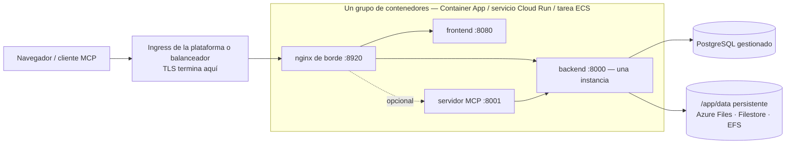

# Servicios de contenedores gestionados

No todos los equipos operan Kubernetes, y no todos quieren mantener una máquina virtual. **Azure Container Apps**, **Google Cloud Run** y **AWS ECS Fargate** ejecutan las mismas imágenes de Turbo EA sin un clúster que administrar, contra el PostgreSQL gestionado de la misma nube. Esta página ofrece para cada uno una plantilla lista para editar en [`deploy/`](https://github.com/vincentmakes/turbo-ea/tree/main/deploy) y dice con claridad qué puede y qué no puede hacer cada plataforma. Si tiene un clúster, la página [Kubernetes y nube](kubernetes.md) y el chart de Helm encajan mejor; en un único host, [Docker Compose](../getting-started/setup.md) sigue siendo la vía más sencilla. Todo lo que dice [Operaciones y actualizaciones](operations.md) sobre copias de seguridad, actualizaciones y la custodia de `SECRET_KEY` se aplica aquí sin cambios. Cada una de las tres plataformas dispone además de un módulo de Terraform que crea el mismo grupo de contenedores junto con la base de datos gestionada — consulte [Terraform](terraform.md).

AWS App Runner queda fuera a propósito: dejó de aceptar clientes nuevos en abril de 2026 y nunca admitió sidecars ni volúmenes persistentes.

## La forma común



Las tres plantillas construyen lo mismo:

- **Un grupo de contenedores, sidecars en `localhost`.** El nginx de borde, el frontend, el backend y el servidor MCP opcional se ejecutan como sidecars que comparten un espacio de nombres de red, así que el borde reenvía a `http://127.0.0.1:8000`, `:8080` y `:8001`. Una URL pública, un ciclo de vida, un despliegue.
- **El borde escucha en 8920.** Su puerto por defecto es 8080, que la imagen del frontend ya ocupa en el mismo espacio de nombres; por eso cada plantilla define `NGINX_HTTP_PORT=8920` y apunta el ingress de la plataforma a él. El borde sigue siendo dueño de todas las cabeceras de seguridad, del límite de 512 MB para las importaciones de espacio de trabajo, de la configuración del flujo de eventos y del enrutado `/mcp`: nada en la plataforma lo sustituye.
- **Un backend, nunca escalado, nunca a cero.** El backend guarda estado interno al proceso (el bus de eventos en tiempo real, el limitador de peticiones, la caché de permisos) y ejecuta bucles en segundo plano, así que corre como exactamente una instancia con CPU asignada en todo momento: número mínimo y máximo de instancias igual a uno en todas las plataformas.
- **Los despliegues se solapan en dos de las tres plataformas.** Container Apps y Cloud Run mantienen la instancia antigua sirviendo hasta que la nueva está lista, de modo que durante unos segundos o minutos dos backends corren en paralelo en cada despliegue. Por eso el backend toma un bloqueo consultivo de PostgreSQL alrededor de sus migraciones y siembra de arranque: la segunda instancia espera, encuentra el esquema ya actualizado y continúa. Los bucles en segundo plano siguen duplicándose en esa ventana; son idempotentes. ECS detiene la tarea antigua antes de iniciar la nueva (uno o dos minutos de indisponibilidad por despliegue) y no necesita esta precaución.
- **Un `/app/data` persistente**, propiedad del uid 1000, contiene las extensiones instaladas, las subidas y los paquetes de transferencia de espacio de trabajo. Las fichas y los diagramas viven en PostgreSQL.
- **TLS termina en el borde de la plataforma.** `TURBO_EA_TLS_ENABLED` queda en `false`; un `publicUrl` que empieza por `https://` marca la cookie de sesión como `secure` y alimenta CORS.
- **Los secretos vienen del almacén de secretos de la plataforma** —secretos de Container Apps o Key Vault, Secret Manager, Secrets Manager— nunca como literales en la plantilla.
- **Las etiquetas de imagen son el número de versión.** `2.141.0` ejecuta las imágenes `2.141.0` en todas las plataformas.

## Qué puede y qué no puede hacer cada plataforma

| | Azure Container Apps | Google Cloud Run | AWS ECS Fargate |
|---|---|---|---|
| `/app/data` persistente | Azure Files (SMB) montado con `uid=1000` | **Solo Filestore por NFS** — 100 GiB regional (dos regiones) o 1 TiB en el resto; Cloud Storage FUSE no es POSIX, solo para evaluación | EFS a través de un punto de acceso (uid/gid 1000) |
| Detener la instancia antigua antes de la nueva | No en modo de revisión única; sí con varias revisiones y una desactivación manual | **No**: las revisiones siempre se solapan | **Sí** (`minimumHealthyPercent 0`, `maximumPercent 100`) |
| Flujo de eventos (SSE de larga duración) | Cortado cada 240 s por el ingress; el navegador se reconecta | Hasta 3600 s por petición, luego se reconecta | Tiempo de inactividad del balanceador hasta 4000 s |
| Subida máxima (la importación de espacio de trabajo llega a 512 MB) | No documentado por Microsoft: pruebe una importación de 512 MB antes de confiar en ello | **32 MiB por petición sobre HTTP/1** | Sin límite de plataforma |
| TLS y dominio propio | Certificado gestionado en la app | Balanceador externo global + NEG serverless + certificado gestionado por Google | Certificado de ACM en el ALB |
| Secretos | Secretos de la app o referencias a Key Vault | Secret Manager | Secrets Manager |
| Shell en un contenedor | `az containerapp exec` | ninguno | ECS Exec |
| Sistema de archivos raíz de solo lectura | no disponible | no es un ajuste | posible, pero desactiva ECS Exec (apagado en la plantilla) |

## Azure Container Apps

**Requisitos previos.**

- Un grupo de recursos y un Azure Database for PostgreSQL **Flexible Server** alcanzable desde el entorno: integrado en la VNet (con su propia subred delegada en la misma VNet) o accesible mediante un punto de conexión privado. El servidor exige TLS y lo negocia automáticamente; el nombre de usuario es el nombre del rol sin más.
- Para el acceso privado a la base de datos, una subred de al menos `/27` **delegada a `Microsoft.App/environments`**, pasada como `infrastructureSubnetId`. Déjela vacía solo para una evaluación contra un servidor accesible públicamente.
- Una cuenta de almacenamiento con un recurso compartido de archivos para `/app/data`:
  ```bash
  az storage account create -g turbo-ea -n turboeadata -l westeurope --sku Standard_LRS
  az storage share-rm create --storage-account turboeadata --name turbo-ea-data --quota 50
  ```
- Dos secretos —`SECRET_KEY` (`openssl rand -base64 48`) y la contraseña de la base de datos— pasados como parámetros seguros o referenciados desde Key Vault (véase el comentario en la plantilla).

**Desplegar.** Edite [`deploy/azure-container-apps/main.bicepparam`](https://github.com/vincentmakes/turbo-ea/blob/main/deploy/azure-container-apps/main.bicepparam), exporte los tres secretos que lee del entorno y ejecute:

```bash
export TURBO_EA_SECRET_KEY="$(openssl rand -base64 48)"
export TURBO_EA_POSTGRES_PASSWORD='…'
export TURBO_EA_STORAGE_KEY="$(az storage account keys list -n turboeadata --query '[0].value' -o tsv)"
az deployment group create -g turbo-ea \
  -f deploy/azure-container-apps/main.bicep -p deploy/azure-container-apps/main.bicepparam
```

El despliegue devuelve el FQDN por defecto de la app. En la primera ejecución ponga `publicUrl` en `https://<ese FQDN>`; cuando vincule un dominio propio con certificado gestionado (`az containerapp hostname add` y después `az containerapp hostname bind --validation-method CNAME`), ponga `publicUrl` en ese dominio y vuelva a desplegar: la URL del navegador debe coincidir con `publicUrl` para las cookies y CORS. **El primer usuario que se registra se convierte en administrador.**

**Actualizaciones.** Cambie `imageTag` y vuelva a desplegar. En modo de revisión única (el predeterminado de la plantilla) la réplica antigua y la nueva se solapan un instante; el bloqueo de arranque del backend lo hace seguro. Para una semántica estricta de detener y luego arrancar, cambie la app al modo de varias revisiones, desactive la revisión en ejecución y despliegue después:

```bash
az containerapp revision set-mode -g turbo-ea -n turbo-ea --mode Multiple
az containerapp revision deactivate -g turbo-ea -n turbo-ea --revision <actual>
az deployment group create …   # luego active la nueva revisión y dirija el tráfico a ella
```

**Límites que conviene conocer.** El ingress cierra cada petición a los 240 segundos, así que el flujo de eventos se reconecta cada cuatro minutos; la aplicación lo tolera, pero se nota como un breve retraso tras cada reconexión. Microsoft no documenta un límite de tamaño de petición; pruebe una importación de espacio de trabajo de tamaño realista antes de confiar en ello. Container Apps no tiene sistema de archivos raíz de solo lectura ni ajustes de contexto de seguridad; las imágenes ya se ejecutan con un usuario no root. Las sondas limitan `failureThreshold` a 10, por eso la sonda de arranque del backend consulta cada 30 segundos para un presupuesto de cinco minutos.

## Google Cloud Run

**Requisitos previos.**

- Una VPC y una subred para la **salida directa a la VPC**; a través de ella el servicio llega a Cloud SQL y Filestore.
- Una instancia de Cloud SQL para PostgreSQL con **IP privada** en esa VPC (acceso a servicios privados). La plantilla se conecta por `host:port`, sin proxy.
- Una instancia de **Filestore** para `/app/data`: la única opción persistente y totalmente POSIX en Cloud Run. Su recurso compartido pertenece a root al crearse, así que ejecute una vez un job que lo haga escribible para el uid 1000 antes del primer despliegue:
  ```bash
  gcloud filestore instances create turbo-ea-data --zone=europe-west1-b --tier=BASIC_HDD \
    --file-share=name=share,capacity=1TB --network=name=default
  gcloud run jobs create chown-data --image=alpine --region=europe-west1 \
    --network=default --subnet=default --add-volume=name=data,type=nfs,location=FILESTORE_IP:/share \
    --add-volume-mount=volume=data,mount-path=/data --command=chown --args=-R,1000:1000,/data
  gcloud run jobs execute chown-data --region=europe-west1 --wait
  ```
- Dos secretos de Secret Manager, `turbo-ea-secret-key` y `turbo-ea-postgres-password`, y una cuenta de servicio de ejecución con `roles/secretmanager.secretAccessor` y `roles/cloudsql.client`.
- Cloud Run no puede descargar directamente de `ghcr.io`. Cree una vez un **repositorio remoto** de Artifact Registry para él y referencie las imágenes a través de él como hace la plantilla:
  ```bash
  gcloud artifacts repositories create ghcr --repository-format=docker --location=europe-west1 \
    --mode=remote-repository --remote-docker-repo=https://ghcr.io
  ```

**Desplegar.** Sustituya cada marcador `UPPER_CASE` de [`deploy/cloud-run/service.yaml`](https://github.com/vincentmakes/turbo-ea/blob/main/deploy/cloud-run/service.yaml) —proyecto, región, red, IP de Filestore, IP privada de Cloud SQL, URL pública— y aplíquelo:

```bash
gcloud run services replace deploy/cloud-run/service.yaml --region europe-west1
```

Para el nombre de host público, coloque delante del servicio un balanceador de carga de aplicaciones externo global con un NEG serverless y un certificado gestionado por Google (`gcloud compute network-endpoint-groups create … --network-endpoint-type=serverless --cloud-run-service=turbo-ea`), apunte el DNS a él, ponga `TURBO_EA_PUBLIC_URL`, `ALLOWED_ORIGINS` y `MCP_PUBLIC_URL` del manifiesto en ese nombre de host, aplique de nuevo y cambie después la anotación de ingress a `internal-and-cloud-load-balancing` para que la URL `run.app` deje de responder. Las asignaciones de dominio en Cloud Run siguen en versión preliminar y no se recomiendan en producción.

**Actualizaciones.** Cambie las etiquetas de imagen y aplique de nuevo el manifiesto. La nueva revisión arranca mientras la antigua sigue sirviendo; el bloqueo de arranque del backend impide que las dos migren a la vez, y Cloud Run no ofrece la opción de detener primero la antigua.

**Límites que conviene conocer.** Cloud Run rechaza cuerpos de petición de más de **32 MiB sobre HTTP/1**, así que una importación de transferencia de espacio de trabajo mayor falla en Cloud Run; ejecute las importaciones grandes en Kubernetes o en una VM. El flujo de eventos se cierra a los 3600 segundos y se reconecta. El tamaño mínimo de Filestore es el coste dominante de esta configuración; un bucket de Cloud Storage montado por FUSE es barato pero no es POSIX (sin bloqueos, gana la última escritura), así que sirve para una prueba y no para extensiones instaladas en producción, y un volumen en memoria pierde `/app/data` en cada revisión.

## AWS ECS Fargate

**Requisitos previos.**

- Una VPC con dos subredes públicas (balanceador) y dos privadas (tarea, destinos de montaje de EFS) con acceso NAT para descargar imágenes de `ghcr.io`.
- Una instancia de RDS para PostgreSQL en las subredes privadas. Pase su grupo de seguridad como `DbSecurityGroupId` y la pila abre el puerto 5432 desde la tarea; si no, ábralo usted con la salida `TaskSecurityGroupId`.
- Un certificado de ACM para el nombre de host público, en la misma región.
- Dos secretos de Secrets Manager con `SECRET_KEY` y la contraseña de la base de datos como cadenas simples (para un secreto JSON gestionado por RDS, añada `:password::` a su ARN en el parámetro).

**Desplegar.**

```bash
aws cloudformation deploy --template-file deploy/ecs-fargate/template.yaml \
  --stack-name turbo-ea --capabilities CAPABILITY_IAM \
  --parameter-overrides VpcId=vpc-… PublicSubnetIds=subnet-a,subnet-b PrivateSubnetIds=subnet-c,subnet-d \
    PublicUrl=https://ea.example.com ImageTag=2.141.0 DbHost=turbo-ea.abc.eu-central-1.rds.amazonaws.com \
    DbPasswordSecretArn=arn:aws:secretsmanager:… SecretKeySecretArn=arn:aws:secretsmanager:… \
    CertificateArn=arn:aws:acm:… DbSecurityGroupId=sg-…
```

Apunte el nombre de host a la salida `AlbDnsName` (CNAME o alias de Route 53) y ábralo. La pila crea el clúster, un sistema de archivos EFS cifrado con un punto de acceso propiedad del uid 1000, el balanceador con un listener HTTPS y una redirección HTTP, y un servicio que ejecuta una tarea.

**Actualizaciones.** Vuelva a desplegar con un nuevo `ImageTag`. El servicio detiene la tarea en ejecución antes de iniciar la sustituta: un detener-y-arrancar real, así que el backend nunca se duplica, a costa de uno o dos minutos de indisponibilidad por despliegue.

**Operación.** AWS Backup respalda EFS (la plantilla activa la política predeterminada); combine sus puntos de restauración con las instantáneas de RDS. `aws ecs execute-command --cluster turbo-ea --task <id> --container backend --interactive --command sh` abre un shell en cualquier contenedor. El tiempo de inactividad del balanceador se eleva a 4000 segundos para el flujo de eventos, y no impone ningún límite de tamaño de cuerpo.

## Solución de problemas

| Síntoma | Causa y solución |
|---|---|
| El nginx de borde nunca pasa a sano aunque los registros del backend están bien | En una disposición con sidecars las variables de upstream deben apuntar a `127.0.0.1`, y `NGINX_HTTP_PORT` debe coincidir con el puerto al que apunta el ingress de la plataforma (8920 en todas las plantillas). |
| El backend registra *another Turbo EA instance holds the startup lock — waiting* | Esperable un instante durante un despliegue en Container Apps o Cloud Run. Si nunca desaparece, la revisión antigua está atascada: desactívela (Container Apps) o elimínela (Cloud Run). |
| `Permission denied` bajo `/app/data` | El volumen no pertenece al uid 1000: revise las opciones de montaje de Azure Files, ejecute el job chown de Filestore o compruebe el usuario POSIX del punto de acceso de EFS. |
| El inicio de sesión entra en bucle o la API responde 401 en el navegador | `publicUrl` (y los valores `TURBO_EA_PUBLIC_URL` / `ALLOWED_ORIGINS` derivados) no coincide con la URL de la barra de direcciones. |
| Las actualizaciones en tiempo real se pausan cada cuatro minutos en Container Apps | El tiempo de espera de petición del ingress; el navegador se reconecta y no se pierde nada. |
| Una importación de espacio de trabajo falla a los 32 MiB en Cloud Run | El límite HTTP/1 de la plataforma para cuerpos de petición; ejecute las importaciones grandes en Kubernetes o en una VM. |
| El backend registra `too many connections` | El plan gestionado limita las conexiones por debajo de `DB_POOL_SIZE + DB_MAX_OVERFLOW`; reduzca el pool ([presupuesto de conexiones](operations.md#check-the-connection-limit)). |
