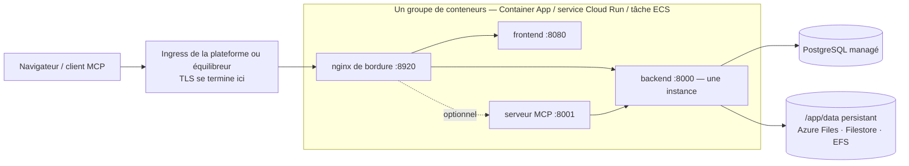

# Services de conteneurs managés

Toutes les équipes n'exploitent pas Kubernetes, et toutes ne veulent pas maintenir une machine virtuelle. **Azure Container Apps**, **Google Cloud Run** et **AWS ECS Fargate** exécutent les mêmes images Turbo EA sans cluster à opérer, avec le PostgreSQL managé du même cloud. Cette page fournit pour chacun un modèle prêt à l'emploi sous [`deploy/`](https://github.com/vincentmakes/turbo-ea/tree/main/deploy) et dit clairement ce que chaque plateforme sait et ne sait pas faire. Si vous avez un cluster, la page [Kubernetes et cloud](kubernetes.md) et le chart Helm conviennent mieux ; sur un hôte unique, [Docker Compose](../getting-started/setup.md) reste la voie la plus simple. Tout ce que dit [Exploitation et mises à niveau](operations.md) des sauvegardes, des mises à niveau et de la garde de `SECRET_KEY` s'applique ici sans changement. Chacune des trois plateformes dispose aussi d'un module Terraform qui crée le même groupe de conteneurs ainsi que la base de données managée — voir [Terraform](terraform.md).

AWS App Runner est volontairement écarté : il n'accepte plus de nouveaux clients depuis avril 2026 et n'a jamais pris en charge les sidecars ni les volumes persistants.

## La forme commune



Les trois modèles construisent la même chose :

- **Un groupe de conteneurs, des sidecars sur `localhost`.** Le nginx de bordure, le frontend, le backend et le serveur MCP optionnel tournent en sidecars dans un même espace de noms réseau ; la bordure relaie vers `http://127.0.0.1:8000`, `:8080` et `:8001`. Une URL publique, un cycle de vie, un déploiement.
- **La bordure écoute sur 8920.** Son port par défaut est 8080, que l'image du frontend occupe déjà dans le même espace de noms ; chaque modèle définit donc `NGINX_HTTP_PORT=8920` et y dirige l'ingress de la plateforme. La bordure conserve tous les en-têtes de sécurité, la limite de 2 Go pour les imports d'espace de travail, les réglages du flux d'événements et le routage `/mcp` — rien côté plateforme ne la remplace.
- **Un backend, jamais mis à l'échelle, jamais à zéro.** Le backend porte un état interne au processus (le bus d'événements temps réel, le limiteur de débit, le cache des permissions) et exécute des boucles d'arrière-plan ; il tourne donc en exactement une instance avec le CPU alloué en permanence : nombre d'instances minimal et maximal de un sur chaque plateforme.
- **Les déploiements se chevauchent sur deux des trois plateformes.** Container Apps et Cloud Run gardent l'ancienne instance en service jusqu'à ce que la nouvelle soit prête : pendant quelques secondes à quelques minutes, deux backends tournent côte à côte à chaque déploiement. Le backend prend donc un verrou consultatif PostgreSQL autour de ses migrations et de son amorçage au démarrage : la seconde instance attend, constate que le schéma est déjà à jour et continue. Les boucles d'arrière-plan tournent encore en double pendant cette fenêtre ; elles sont idempotentes. ECS arrête l'ancienne tâche avant de lancer la nouvelle (une à deux minutes d'indisponibilité par déploiement) et n'a pas besoin de cette précaution.
- **Un `/app/data` persistant**, détenu par l'uid 1000, contient les extensions installées, les fichiers envoyés et les bundles de transfert d'espace de travail. Les fiches et les diagrammes vivent dans PostgreSQL.
- **TLS se termine à la bordure de la plateforme.** `TURBO_EA_TLS_ENABLED` reste `false` ; un `publicUrl` commençant par `https://` marque le cookie de session `secure` et alimente CORS.
- **Les secrets viennent du coffre de la plateforme** — secrets Container Apps ou Key Vault, Secret Manager, Secrets Manager — jamais en clair dans le modèle.
- **Les tags d'image sont le numéro de version.** `2.141.0` exécute les images `2.141.0` sur chaque plateforme.

## Ce que chaque plateforme sait et ne sait pas faire

| | Azure Container Apps | Google Cloud Run | AWS ECS Fargate |
|---|---|---|---|
| `/app/data` persistant | Azure Files (SMB) monté avec `uid=1000` | **Filestore via NFS uniquement** — 100 Gio en régional (deux régions) ou 1 Tio ailleurs ; Cloud Storage FUSE n'est pas POSIX, évaluation seulement | EFS via un point d'accès (uid/gid 1000) |
| Arrêter l'ancienne instance avant la nouvelle | Non en mode révision unique ; oui avec plusieurs révisions et une désactivation manuelle | **Non** — les révisions se chevauchent toujours | **Oui** (`minimumHealthyPercent 0`, `maximumPercent 100`) |
| Flux d'événements (SSE longue durée) | Coupé toutes les 240 s par l'ingress ; le navigateur se reconnecte | Jusqu'à 3600 s par requête, puis reconnexion | Délai d'inactivité de l'équilibreur jusqu'à 4000 s |
| Plus gros envoi (l'import d'espace de travail va jusqu'à 2 Go) | Non documenté par Microsoft — testez un import de 2 Go avant de compter dessus | **32 Mio par requête en HTTP/1** | Aucune limite de plateforme |
| TLS et domaine personnalisé | Certificat managé sur l'app | Équilibreur externe global + NEG serverless + certificat géré par Google | Certificat ACM sur l'ALB |
| Secrets | Secrets de l'app ou références Key Vault | Secret Manager | Secrets Manager |
| Shell dans un conteneur | `az containerapp exec` | aucun | ECS Exec |
| Système de fichiers racine en lecture seule | indisponible | pas un réglage | possible, mais désactive ECS Exec (désactivé dans le modèle) |

## Azure Container Apps

**Prérequis.**

- Un groupe de ressources et un Azure Database for PostgreSQL **Flexible Server** joignable depuis l'environnement : intégré au VNet (son propre sous-réseau délégué dans le même VNet) ou joignable via un point de terminaison privé. TLS est exigé par le serveur et négocié automatiquement ; le nom d'utilisateur est le simple nom du rôle.
- Pour un accès privé à la base, un sous-réseau d'au moins `/27` **délégué à `Microsoft.App/environments`**, passé en `infrastructureSubnetId`. Ne le laissez vide que pour une évaluation contre un serveur joignable publiquement.
- Un compte de stockage avec un partage de fichiers pour `/app/data` :
  ```bash
  az storage account create -g turbo-ea -n turboeadata -l westeurope --sku Standard_LRS
  az storage share-rm create --storage-account turboeadata --name turbo-ea-data --quota 50
  ```
- Deux secrets — `SECRET_KEY` (`openssl rand -base64 48`) et le mot de passe de la base — passés en paramètres sécurisés, ou référencés depuis Key Vault (voir le commentaire dans le modèle).

**Déployer.** Modifiez [`deploy/azure-container-apps/main.bicepparam`](https://github.com/vincentmakes/turbo-ea/blob/main/deploy/azure-container-apps/main.bicepparam), exportez les trois secrets qu'il lit dans l'environnement, puis lancez :

```bash
export TURBO_EA_SECRET_KEY="$(openssl rand -base64 48)"
export TURBO_EA_POSTGRES_PASSWORD='…'
export TURBO_EA_STORAGE_KEY="$(az storage account keys list -n turboeadata --query '[0].value' -o tsv)"
az deployment group create -g turbo-ea \
  -f deploy/azure-container-apps/main.bicep -p deploy/azure-container-apps/main.bicepparam
```

Le déploiement renvoie le FQDN par défaut de l'app. Au premier lancement, mettez `publicUrl` à `https://<ce FQDN>` ; une fois un domaine personnalisé lié avec un certificat managé (`az containerapp hostname add` puis `az containerapp hostname bind --validation-method CNAME`), mettez `publicUrl` à ce domaine et redéployez — l'URL du navigateur doit correspondre à `publicUrl` pour les cookies et CORS. **Le premier utilisateur inscrit devient administrateur.**

**Mises à niveau.** Changez `imageTag` et redéployez. En mode révision unique (défaut du modèle), l'ancienne et la nouvelle réplique se chevauchent un instant ; le verrou de démarrage du backend rend cela sûr. Pour un arrêt-puis-démarrage strict, passez l'app en mode révisions multiples, désactivez la révision en cours, puis déployez :

```bash
az containerapp revision set-mode -g turbo-ea -n turbo-ea --mode Multiple
az containerapp revision deactivate -g turbo-ea -n turbo-ea --revision <actuelle>
az deployment group create …   # puis activez la nouvelle révision et dirigez-y le trafic
```

**Limites à connaître.** L'ingress ferme chaque requête après 240 secondes : le flux d'événements se reconnecte toutes les quatre minutes — l'application le tolère, cela se voit comme un court délai après chaque reconnexion. Microsoft ne documente aucune limite de taille de requête ; testez un import d'espace de travail de taille réaliste avant de compter dessus. Container Apps n'offre ni système de fichiers racine en lecture seule ni réglages de contexte de sécurité ; les images tournent déjà avec un utilisateur non root. Les sondes plafonnent `failureThreshold` à 10, d'où la sonde de démarrage du backend toutes les 30 secondes pour un budget de cinq minutes.

## Google Cloud Run

**Prérequis.**

- Un VPC et un sous-réseau pour la **sortie VPC directe** ; le service atteint Cloud SQL et Filestore par ce biais.
- Une instance Cloud SQL pour PostgreSQL avec une **IP privée** dans ce VPC (accès aux services privés). Le modèle se connecte en `host:port`, sans proxy.
- Une instance **Filestore** pour `/app/data` — la seule option persistante et pleinement POSIX sur Cloud Run. Son partage appartient à root à la création ; lancez une fois un job qui le rend accessible en écriture à l'uid 1000 avant le premier déploiement :
  ```bash
  gcloud filestore instances create turbo-ea-data --zone=europe-west1-b --tier=BASIC_HDD \
    --file-share=name=share,capacity=1TB --network=name=default
  gcloud run jobs create chown-data --image=alpine --region=europe-west1 \
    --network=default --subnet=default --add-volume=name=data,type=nfs,location=FILESTORE_IP:/share \
    --add-volume-mount=volume=data,mount-path=/data --command=chown --args=-R,1000:1000,/data
  gcloud run jobs execute chown-data --region=europe-west1 --wait
  ```
- Deux secrets Secret Manager, `turbo-ea-secret-key` et `turbo-ea-postgres-password`, et un compte de service d'exécution avec `roles/secretmanager.secretAccessor` et `roles/cloudsql.client`.
- Cloud Run ne peut pas tirer directement depuis `ghcr.io`. Créez une fois un **dépôt distant** Artifact Registry, puis référencez les images à travers lui comme le fait le modèle :
  ```bash
  gcloud artifacts repositories create ghcr --repository-format=docker --location=europe-west1 \
    --mode=remote-repository --remote-docker-repo=https://ghcr.io
  ```

**Déployer.** Remplacez chaque espace réservé `UPPER_CASE` dans [`deploy/cloud-run/service.yaml`](https://github.com/vincentmakes/turbo-ea/blob/main/deploy/cloud-run/service.yaml) — projet, région, réseau, IP Filestore, IP privée Cloud SQL, URL publique — et appliquez-le :

```bash
gcloud run services replace deploy/cloud-run/service.yaml --region europe-west1
```

Pour le nom d'hôte public, placez un équilibreur de charge d'application externe global devant le service avec un NEG serverless et un certificat géré par Google (`gcloud compute network-endpoint-groups create … --network-endpoint-type=serverless --cloud-run-service=turbo-ea`), pointez le DNS dessus, mettez `TURBO_EA_PUBLIC_URL`, `ALLOWED_ORIGINS` et `MCP_PUBLIC_URL` dans le manifeste à ce nom d'hôte, appliquez à nouveau, puis passez l'annotation d'ingress à `internal-and-cloud-load-balancing` pour que l'URL `run.app` cesse de répondre. Les mappages de domaine sur Cloud Run sont encore en aperçu et déconseillés en production.

**Mises à niveau.** Changez les tags d'image et appliquez à nouveau le manifeste. La nouvelle révision démarre pendant que l'ancienne sert encore ; le verrou de démarrage du backend empêche les deux de migrer en même temps, et Cloud Run n'offre pas d'option « arrêter l'ancienne d'abord ».

**Limites à connaître.** Cloud Run rejette les corps de requête au-delà de **32 Mio en HTTP/1** : un import de transfert d'espace de travail plus grand échoue sur Cloud Run — faites les gros imports sur Kubernetes ou une VM. Le flux d'événements est fermé après 3600 secondes puis reconnecté. La taille minimale de Filestore est le principal poste de coût de cette configuration ; un bucket Cloud Storage monté via FUSE est bon marché mais pas POSIX (pas de verrouillage, la dernière écriture gagne) : correct pour un essai, mauvais pour des extensions installées en production ; un volume en mémoire perd `/app/data` à chaque révision.

## AWS ECS Fargate

**Prérequis.**

- Un VPC avec deux sous-réseaux publics (équilibreur) et deux sous-réseaux privés (tâche, cibles de montage EFS) disposant d'un accès NAT pour tirer les images depuis `ghcr.io`.
- Une instance RDS pour PostgreSQL dans les sous-réseaux privés. Passez son groupe de sécurité en `DbSecurityGroupId` et la pile ouvre le port 5432 depuis la tâche ; sinon ouvrez-le vous-même avec la sortie `TaskSecurityGroupId`.
- Un certificat ACM pour le nom d'hôte public, dans la même région.
- Deux secrets Secrets Manager contenant `SECRET_KEY` et le mot de passe de la base en chaînes brutes (pour un secret JSON géré par RDS, ajoutez `:password::` à son ARN dans le paramètre).

**Déployer.**

```bash
aws cloudformation deploy --template-file deploy/ecs-fargate/template.yaml \
  --stack-name turbo-ea --capabilities CAPABILITY_IAM \
  --parameter-overrides VpcId=vpc-… PublicSubnetIds=subnet-a,subnet-b PrivateSubnetIds=subnet-c,subnet-d \
    PublicUrl=https://ea.example.com ImageTag=2.141.0 DbHost=turbo-ea.abc.eu-central-1.rds.amazonaws.com \
    DbPasswordSecretArn=arn:aws:secretsmanager:… SecretKeySecretArn=arn:aws:secretsmanager:… \
    CertificateArn=arn:aws:acm:… DbSecurityGroupId=sg-…
```

Pointez le nom d'hôte sur la sortie `AlbDnsName` (CNAME ou alias Route 53) et ouvrez-le. La pile crée le cluster, un système de fichiers EFS chiffré avec un point d'accès détenu par l'uid 1000, l'équilibreur avec un écouteur HTTPS et une redirection HTTP, et un service qui exécute une tâche.

**Mises à niveau.** Redéployez avec un nouvel `ImageTag`. Le service arrête la tâche en cours avant de lancer la remplaçante — un vrai arrêt-puis-démarrage, le backend n'est donc jamais dupliqué, au prix d'une à deux minutes d'indisponibilité par déploiement.

**Exploitation.** EFS est sauvegardé par AWS Backup (le modèle active la politique par défaut) ; associez ses points de restauration à vos instantanés RDS. `aws ecs execute-command --cluster turbo-ea --task <id> --container backend --interactive --command sh` ouvre un shell dans n'importe quel conteneur. Le délai d'inactivité de l'équilibreur est porté à 4000 secondes pour le flux d'événements, et il n'impose aucune limite de taille de corps.

**Amazon Bedrock.** Pour utiliser Bedrock comme fournisseur d'IA, attachez la politique IAM décrite dans [Fonctionnalités IA](ai.md) au rôle de tâche de la stack ; Turbo EA s'authentifie alors avec ce rôle et n'a besoin d'aucune clé API.

## Dépannage

| Symptôme | Cause et remède |
|---|---|
| Le nginx de bordure ne devient jamais sain alors que les journaux du backend sont bons | Dans une disposition en sidecars, les variables d'upstream doivent pointer sur `127.0.0.1`, et `NGINX_HTTP_PORT` doit correspondre au port visé par l'ingress de la plateforme (8920 dans chaque modèle). |
| Le backend journalise *another Turbo EA instance holds the startup lock — waiting* | Attendu un instant pendant un déploiement sur Container Apps ou Cloud Run. Si cela ne disparaît jamais, l'ancienne révision est bloquée : désactivez-la (Container Apps) ou supprimez-la (Cloud Run). |
| `Permission denied` sous `/app/data` | Le volume n'appartient pas à l'uid 1000 : vérifiez les options de montage Azure Files, lancez le job chown Filestore ou contrôlez l'utilisateur POSIX du point d'accès EFS. |
| La connexion boucle ou l'API répond 401 dans le navigateur | `publicUrl` (et les valeurs `TURBO_EA_PUBLIC_URL` / `ALLOWED_ORIGINS` qui en découlent) ne correspond pas à l'URL de la barre d'adresse. |
| Les mises à jour temps réel marquent une pause toutes les quatre minutes sur Container Apps | Le délai de requête de l'ingress ; le navigateur se reconnecte et rien n'est perdu. |
| Un import d'espace de travail échoue à 32 Mio sur Cloud Run | La limite HTTP/1 de la plateforme sur les corps de requête ; faites les gros imports sur Kubernetes ou une VM. |
| Le backend journalise `too many connections` | L'offre managée plafonne les connexions sous `DB_POOL_SIZE + DB_MAX_OVERFLOW` ; réduisez le pool ([budget de connexions](operations.md#check-the-connection-limit)). |
