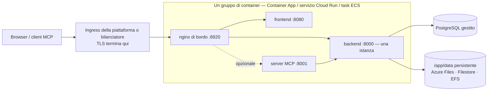

# Servizi di container gestiti

Non tutti i team gestiscono Kubernetes, e non tutti vogliono mantenere una macchina virtuale. **Azure Container Apps**, **Google Cloud Run** e **AWS ECS Fargate** eseguono le stesse immagini di Turbo EA senza un cluster da amministrare, con il PostgreSQL gestito dello stesso cloud. Questa pagina fornisce per ciascuno un modello pronto da modificare in [`deploy/`](https://github.com/vincentmakes/turbo-ea/tree/main/deploy) e dice chiaramente cosa ogni piattaforma può e non può fare. Se avete un cluster, la pagina [Kubernetes e cloud](kubernetes.md) e il chart Helm sono la scelta migliore; su un singolo host, [Docker Compose](../getting-started/setup.md) resta la via più semplice. Tutto ciò che [Operazioni e aggiornamenti](operations.md) dice su backup, aggiornamenti e custodia di `SECRET_KEY` vale qui senza modifiche.

AWS App Runner è escluso di proposito: da aprile 2026 non accetta più nuovi clienti e non ha mai supportato sidecar né volumi persistenti.

## La forma comune



I tre modelli costruiscono la stessa cosa:

- **Un gruppo di container, sidecar su `localhost`.** L'nginx di bordo, il frontend, il backend e il server MCP opzionale girano come sidecar in un unico namespace di rete, quindi il bordo inoltra a `http://127.0.0.1:8000`, `:8080` e `:8001`. Un URL pubblico, un ciclo di vita, un deploy.
- **Il bordo ascolta sulla 8920.** La sua porta predefinita è la 8080, già occupata dall'immagine del frontend nello stesso namespace; ogni modello imposta quindi `NGINX_HTTP_PORT=8920` e vi punta l'ingress della piattaforma. Il bordo continua a possedere ogni header di sicurezza, il limite di 512 MB per le importazioni dell'area di lavoro, le impostazioni del flusso di eventi e il routing `/mcp`: nulla lato piattaforma lo sostituisce.
- **Un backend, mai scalato, mai a zero.** Il backend mantiene stato interno al processo (il bus di eventi in tempo reale, il limitatore di richieste, la cache dei permessi) ed esegue cicli in background, quindi gira come esattamente un'istanza con CPU sempre allocata: numero minimo e massimo di istanze pari a uno su ogni piattaforma.
- **I deploy si sovrappongono su due piattaforme su tre.** Container Apps e Cloud Run tengono in servizio la vecchia istanza finché la nuova non è pronta, quindi per qualche secondo o minuto due backend girano fianco a fianco a ogni deploy. Il backend prende perciò un advisory lock di PostgreSQL attorno alle migrazioni e al popolamento all'avvio: la seconda istanza attende, trova lo schema già aggiornato e prosegue. I cicli in background si duplicano ancora in quella finestra; sono idempotenti. ECS ferma il vecchio task prima di avviare il nuovo (uno o due minuti di indisponibilità per deploy) e non ha bisogno di questa cautela.
- **Un `/app/data` persistente**, di proprietà dell'uid 1000, contiene le estensioni installate, gli upload e i bundle di trasferimento dell'area di lavoro. Schede e diagrammi risiedono in PostgreSQL.
- **TLS termina al bordo della piattaforma.** `TURBO_EA_TLS_ENABLED` resta `false`; un `publicUrl` che inizia con `https://` segna il cookie di sessione come `secure` e alimenta CORS.
- **I segreti vengono dall'archivio segreti della piattaforma** — segreti di Container Apps o Key Vault, Secret Manager, Secrets Manager — mai come letterali nel modello.
- **I tag delle immagini sono il numero di versione.** `2.141.0` esegue le immagini `2.141.0` su ogni piattaforma.

## Cosa ogni piattaforma può e non può fare

| | Azure Container Apps | Google Cloud Run | AWS ECS Fargate |
|---|---|---|---|
| `/app/data` persistente | Azure Files (SMB) montato con `uid=1000` | **Solo Filestore via NFS** — 100 GiB regionale (due regioni) o 1 TiB altrove; Cloud Storage FUSE non è POSIX, solo per valutazione | EFS tramite un access point (uid/gid 1000) |
| Fermare la vecchia istanza prima della nuova | No in modalità revisione singola; sì con più revisioni e una disattivazione manuale | **No**: le revisioni si sovrappongono sempre | **Sì** (`minimumHealthyPercent 0`, `maximumPercent 100`) |
| Flusso di eventi (SSE a lunga durata) | Interrotto ogni 240 s dall'ingress; il browser si riconnette | Fino a 3600 s per richiesta, poi riconnessione | Timeout di inattività del bilanciatore fino a 4000 s |
| Upload massimo (l'importazione dell'area di lavoro arriva a 512 MB) | Non documentato da Microsoft: provate un'importazione da 512 MB prima di farci affidamento | **32 MiB per richiesta su HTTP/1** | Nessun limite di piattaforma |
| TLS e dominio personalizzato | Certificato gestito sull'app | Bilanciatore esterno globale + NEG serverless + certificato gestito da Google | Certificato ACM sull'ALB |
| Segreti | Segreti dell'app o riferimenti a Key Vault | Secret Manager | Secrets Manager |
| Shell in un container | `az containerapp exec` | nessuna | ECS Exec |
| File system radice in sola lettura | non disponibile | non è un'impostazione | possibile, ma disabilita ECS Exec (spento nel modello) |

## Azure Container Apps

**Prerequisiti.**

- Un gruppo di risorse e un Azure Database for PostgreSQL **Flexible Server** raggiungibile dall'ambiente: integrato nella VNet (con una propria subnet delegata nella stessa VNet) oppure raggiungibile tramite endpoint privato. Il server richiede TLS e lo negozia automaticamente; il nome utente è il semplice nome del ruolo.
- Per l'accesso privato al database, una subnet di almeno `/27` **delegata a `Microsoft.App/environments`**, passata come `infrastructureSubnetId`. Lasciatela vuota solo per una valutazione con un server raggiungibile pubblicamente.
- Un account di archiviazione con una condivisione file per `/app/data`:
  ```bash
  az storage account create -g turbo-ea -n turboeadata -l westeurope --sku Standard_LRS
  az storage share-rm create --storage-account turboeadata --name turbo-ea-data --quota 50
  ```
- Due segreti — `SECRET_KEY` (`openssl rand -base64 48`) e la password del database — passati come parametri sicuri o referenziati da Key Vault (vedere il commento nel modello).

**Distribuire.** Modificate [`deploy/azure-container-apps/main.bicepparam`](https://github.com/vincentmakes/turbo-ea/blob/main/deploy/azure-container-apps/main.bicepparam), esportate i tre segreti che legge dall'ambiente ed eseguite:

```bash
export TURBO_EA_SECRET_KEY="$(openssl rand -base64 48)"
export TURBO_EA_POSTGRES_PASSWORD='…'
export TURBO_EA_STORAGE_KEY="$(az storage account keys list -n turboeadata --query '[0].value' -o tsv)"
az deployment group create -g turbo-ea \
  -f deploy/azure-container-apps/main.bicep -p deploy/azure-container-apps/main.bicepparam
```

La distribuzione restituisce l'FQDN predefinito dell'app. Alla prima esecuzione impostate `publicUrl` su `https://<quell'FQDN>`; una volta associato un dominio personalizzato con certificato gestito (`az containerapp hostname add` e poi `az containerapp hostname bind --validation-method CNAME`), impostate `publicUrl` su quel dominio e distribuite di nuovo: l'URL del browser deve coincidere con `publicUrl` per cookie e CORS. **Il primo utente che si registra diventa amministratore.**

**Aggiornamenti.** Cambiate `imageTag` e distribuite di nuovo. In modalità revisione singola (predefinita nel modello) la vecchia e la nuova replica si sovrappongono per un istante; il lock di avvio del backend lo rende sicuro. Per una semantica rigorosa di arresto-poi-avvio, passate l'app alla modalità a più revisioni, disattivate la revisione in esecuzione e poi distribuite:

```bash
az containerapp revision set-mode -g turbo-ea -n turbo-ea --mode Multiple
az containerapp revision deactivate -g turbo-ea -n turbo-ea --revision <corrente>
az deployment group create …   # poi attivate la nuova revisione e indirizzatevi il traffico
```

**Limiti da conoscere.** L'ingress chiude ogni richiesta dopo 240 secondi, quindi il flusso di eventi si riconnette ogni quattro minuti: l'applicazione lo tollera, ma si nota come un breve ritardo dopo ogni riconnessione. Microsoft non documenta un limite alla dimensione delle richieste; provate un'importazione dell'area di lavoro di dimensioni realistiche prima di farci affidamento. Container Apps non offre file system radice in sola lettura né impostazioni di security context; le immagini girano già con un utente non root. Le sonde limitano `failureThreshold` a 10, per questo la sonda di avvio del backend interroga ogni 30 secondi per un budget di cinque minuti.

## Google Cloud Run

**Prerequisiti.**

- Una VPC e una subnet per l'**uscita VPC diretta**; attraverso di essa il servizio raggiunge Cloud SQL e Filestore.
- Un'istanza Cloud SQL per PostgreSQL con **IP privato** in quella VPC (accesso ai servizi privati). Il modello si connette con `host:port`, senza proxy.
- Un'istanza **Filestore** per `/app/data`: l'unica opzione persistente e pienamente POSIX su Cloud Run. Alla creazione la condivisione appartiene a root, quindi prima del primo deploy eseguite una volta un job che la renda scrivibile per l'uid 1000:
  ```bash
  gcloud filestore instances create turbo-ea-data --zone=europe-west1-b --tier=BASIC_HDD \
    --file-share=name=share,capacity=1TB --network=name=default
  gcloud run jobs create chown-data --image=alpine --region=europe-west1 \
    --network=default --subnet=default --add-volume=name=data,type=nfs,location=FILESTORE_IP:/share \
    --add-volume-mount=volume=data,mount-path=/data --command=chown --args=-R,1000:1000,/data
  gcloud run jobs execute chown-data --region=europe-west1 --wait
  ```
- Due segreti di Secret Manager, `turbo-ea-secret-key` e `turbo-ea-postgres-password`, e un account di servizio di esecuzione con `roles/secretmanager.secretAccessor` e `roles/cloudsql.client`.
- Cloud Run non può scaricare direttamente da `ghcr.io`. Create una volta un **repository remoto** di Artifact Registry e referenziate le immagini attraverso di esso come fa il modello:
  ```bash
  gcloud artifacts repositories create ghcr --repository-format=docker --location=europe-west1 \
    --mode=remote-repository --remote-docker-repo=https://ghcr.io
  ```

**Distribuire.** Sostituite ogni segnaposto `UPPER_CASE` in [`deploy/cloud-run/service.yaml`](https://github.com/vincentmakes/turbo-ea/blob/main/deploy/cloud-run/service.yaml) — progetto, regione, rete, IP di Filestore, IP privato di Cloud SQL, URL pubblico — e applicatelo:

```bash
gcloud run services replace deploy/cloud-run/service.yaml --region europe-west1
```

Per l'hostname pubblico, mettete davanti al servizio un bilanciatore di carico delle applicazioni esterno globale con un NEG serverless e un certificato gestito da Google (`gcloud compute network-endpoint-groups create … --network-endpoint-type=serverless --cloud-run-service=turbo-ea`), puntate il DNS su di esso, impostate `TURBO_EA_PUBLIC_URL`, `ALLOWED_ORIGINS` e `MCP_PUBLIC_URL` nel manifesto su quell'hostname, applicate di nuovo, quindi cambiate l'annotazione di ingress in `internal-and-cloud-load-balancing` così che l'URL `run.app` smetta di rispondere. Le mappature di dominio su Cloud Run sono ancora in anteprima e non consigliate in produzione.

**Aggiornamenti.** Cambiate i tag delle immagini e applicate di nuovo il manifesto. La nuova revisione parte mentre la vecchia serve ancora; il lock di avvio del backend impedisce che le due migrino insieme, e Cloud Run non offre l'opzione di fermare prima la vecchia.

**Limiti da conoscere.** Cloud Run rifiuta corpi di richiesta oltre **32 MiB su HTTP/1**, quindi un'importazione di trasferimento dell'area di lavoro più grande fallisce su Cloud Run; eseguite le importazioni grandi su Kubernetes o su una VM. Il flusso di eventi viene chiuso dopo 3600 secondi e riconnesso. La dimensione minima di Filestore è il costo dominante di questa configurazione; un bucket Cloud Storage montato tramite FUSE è economico ma non POSIX (nessun lock, vince l'ultima scrittura): va bene per una prova, sbagliato per estensioni installate in produzione; un volume in memoria perde `/app/data` a ogni revisione.

## AWS ECS Fargate

**Prerequisiti.**

- Una VPC con due subnet pubbliche (bilanciatore) e due private (task, mount target EFS) con accesso NAT per scaricare le immagini da `ghcr.io`.
- Un'istanza RDS per PostgreSQL nelle subnet private. Passate il suo gruppo di sicurezza come `DbSecurityGroupId` e lo stack apre la porta 5432 dal task; altrimenti apritela voi con l'output `TaskSecurityGroupId`.
- Un certificato ACM per l'hostname pubblico, nella stessa Regione.
- Due segreti di Secrets Manager con `SECRET_KEY` e la password del database come stringhe semplici (per un segreto JSON gestito da RDS, aggiungete `:password::` al suo ARN nel parametro).

**Distribuire.**

```bash
aws cloudformation deploy --template-file deploy/ecs-fargate/template.yaml \
  --stack-name turbo-ea --capabilities CAPABILITY_IAM \
  --parameter-overrides VpcId=vpc-… PublicSubnetIds=subnet-a,subnet-b PrivateSubnetIds=subnet-c,subnet-d \
    PublicUrl=https://ea.example.com ImageTag=2.141.0 DbHost=turbo-ea.abc.eu-central-1.rds.amazonaws.com \
    DbPasswordSecretArn=arn:aws:secretsmanager:… SecretKeySecretArn=arn:aws:secretsmanager:… \
    CertificateArn=arn:aws:acm:… DbSecurityGroupId=sg-…
```

Puntate l'hostname all'output `AlbDnsName` (CNAME o alias Route 53) e apritelo. Lo stack crea il cluster, un file system EFS cifrato con un access point di proprietà dell'uid 1000, il bilanciatore con un listener HTTPS e un redirect HTTP, e un servizio che esegue un task.

**Aggiornamenti.** Distribuite di nuovo con un nuovo `ImageTag`. Il servizio ferma il task in esecuzione prima di avviare il sostituto: un vero arresto-poi-avvio, quindi il backend non è mai duplicato, al costo di uno o due minuti di indisponibilità per deploy.

**Operazioni.** EFS è salvato da AWS Backup (il modello attiva la policy predefinita); abbinate i suoi punti di ripristino agli snapshot RDS. `aws ecs execute-command --cluster turbo-ea --task <id> --container backend --interactive --command sh` apre una shell in qualsiasi container. Il timeout di inattività del bilanciatore è alzato a 4000 secondi per il flusso di eventi, e non impone alcun limite alla dimensione del corpo.

## Risoluzione dei problemi

| Sintomo | Causa e rimedio |
|---|---|
| L'nginx di bordo non diventa mai sano mentre i log del backend sono a posto | In un layout a sidecar le variabili di upstream devono puntare a `127.0.0.1`, e `NGINX_HTTP_PORT` deve coincidere con la porta a cui punta l'ingress della piattaforma (8920 in ogni modello). |
| Il backend registra *another Turbo EA instance holds the startup lock — waiting* | Atteso per un istante durante un deploy su Container Apps o Cloud Run. Se non sparisce mai, la vecchia revisione è bloccata: disattivatela (Container Apps) o eliminatela (Cloud Run). |
| `Permission denied` sotto `/app/data` | Il volume non appartiene all'uid 1000: controllate le opzioni di mount di Azure Files, eseguite il job chown di Filestore o verificate l'utente POSIX dell'access point EFS. |
| L'accesso va in loop o l'API risponde 401 nel browser | `publicUrl` (e i valori `TURBO_EA_PUBLIC_URL` / `ALLOWED_ORIGINS` derivati) non coincide con l'URL nella barra degli indirizzi. |
| Gli aggiornamenti in tempo reale si fermano ogni quattro minuti su Container Apps | Il timeout di richiesta dell'ingress; il browser si riconnette e nulla va perso. |
| Un'importazione dell'area di lavoro fallisce a 32 MiB su Cloud Run | Il limite HTTP/1 della piattaforma sui corpi di richiesta; eseguite le importazioni grandi su Kubernetes o su una VM. |
| Il backend registra `too many connections` | Il piano gestito limita le connessioni sotto `DB_POOL_SIZE + DB_MAX_OVERFLOW`; riducete il pool ([budget di connessioni](operations.md#check-the-connection-limit)). |
