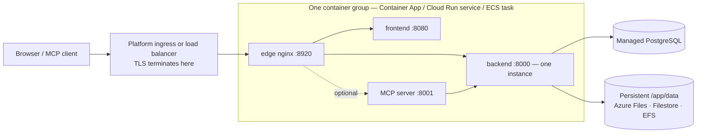

# Managed container services

Not every team runs Kubernetes, and not every team wants to patch a virtual machine. **Azure Container Apps**, **Google Cloud Run** and **AWS ECS Fargate** run the same Turbo EA images without a cluster to operate, against the managed PostgreSQL of the same cloud. This page gives each of them a ready-to-edit template under [`deploy/`](https://github.com/vincentmakes/turbo-ea/tree/main/deploy) and says plainly what each platform can and cannot do. If you have a cluster, the [Kubernetes & Cloud](kubernetes.md) page and the Helm chart are the better fit; on a single host, [Docker Compose](../getting-started/setup.md) stays the simplest path. Everything on [Operations & Upgrades](operations.md) about backups, upgrades and `SECRET_KEY` custody applies here unchanged. Each of the three platforms also has a Terraform module that creates the same container group plus the managed database — see [Terraform](terraform.md).

AWS App Runner is deliberately not covered: it stopped accepting new customers in April 2026 and never supported sidecars or persistent volumes.

## The shared shape



All three templates build the same thing:

- **One container group, sidecars on `localhost`.** The edge nginx, the frontend, the backend and the optional MCP server run as sidecars sharing one network namespace, so the edge proxies to `http://127.0.0.1:8000`, `:8080` and `:8001`. One public URL, one lifecycle, one deploy.
- **The edge listens on 8920.** Its default port is 8080, which the frontend image already owns inside the same namespace, so every template sets `NGINX_HTTP_PORT=8920` and points the platform ingress at it. The edge still owns every security header, the 2 GB upload limit for workspace transfers, the event-stream settings and the `/mcp` routing — nothing on the platform side replaces it.
- **One backend, never scaled, never zero.** The backend holds in-process state (the real-time event bus, the rate limiter, the permission cache) and runs background loops, so it runs as exactly one instance with CPU allocated at all times: minimum and maximum instance count of one on every platform.
- **Deploys overlap on two of the three platforms.** Container Apps and Cloud Run keep the old instance serving until the new one is ready, so for a few seconds to a few minutes two backends run side by side on every deploy. The backend therefore takes a PostgreSQL advisory lock around its boot-time migrations and seeding: the second instance waits, finds the schema already at head and continues. Background loops still double for that window; they are idempotent. ECS stops the old task before starting the new one (one to two minutes of downtime per deploy) and needs no such care.
- **Persistent `/app/data`**, owned by uid 1000, holds installed extensions, uploads and workspace-transfer bundles. Cards and diagrams live in PostgreSQL.
- **TLS terminates at the platform edge.** `TURBO_EA_TLS_ENABLED` stays `false`; `publicUrl` starting with `https://` is what marks the session cookie `secure` and feeds CORS.
- **Secrets come from the platform's secret store** — Container Apps secrets or Key Vault, Secret Manager, Secrets Manager — never as literals in the template.
- **Image tags are the release number.** `2.141.0` runs the `2.141.0` images on every platform.

## What each platform can and cannot do

| | Azure Container Apps | Google Cloud Run | AWS ECS Fargate |
|---|---|---|---|
| Persistent `/app/data` | Azure Files (SMB) mounted with `uid=1000` | **Filestore over NFS only** — 100 GiB regional (two regions) or 1 TiB elsewhere; Cloud Storage FUSE is not POSIX, evaluation only | EFS through an access point (uid/gid 1000) |
| Stop the old instance before the new one | Not in single-revision mode; yes with multiple revisions and a manual deactivate | **No** — revisions always overlap | **Yes** (`minimumHealthyPercent 0`, `maximumPercent 100`) |
| Event stream (long-lived SSE) | Cut every 240 s by the ingress; the browser reconnects | Up to 3600 s per request, then reconnects | Load-balancer idle timeout up to 4000 s |
| Largest upload (workspace import is up to 2 GB) | Not documented by Microsoft — test a 2 GB import before relying on it | **32 MiB per request over HTTP/1** | No platform limit |
| TLS and custom domain | Managed certificate on the app | Global external load balancer + serverless NEG + Google-managed certificate | ACM certificate on the ALB |
| Secrets | App secrets or Key Vault references | Secret Manager | Secrets Manager |
| Shell into a container | `az containerapp exec` | none | ECS Exec |
| Read-only root filesystem | not available | not a setting | possible, but disables ECS Exec (off in the template) |

## Azure Container Apps

**Prerequisites.**

- A resource group and an Azure Database for PostgreSQL **Flexible Server** the environment can reach: either VNet-integrated (its own delegated subnet in the same VNet) or reachable through a private endpoint. TLS is required by the server and negotiated automatically; the username is the plain role name.
- For private database access, a subnet of at least `/27` **delegated to `Microsoft.App/environments`**, passed as `infrastructureSubnetId`. Leave it empty only for an evaluation against a publicly reachable server.
- A storage account with a file share for `/app/data`:
  ```bash
  az storage account create -g turbo-ea -n turboeadata -l westeurope --sku Standard_LRS
  az storage share-rm create --storage-account turboeadata --name turbo-ea-data --quota 50
  ```
- Two secrets — `SECRET_KEY` (`openssl rand -base64 48`) and the database password — passed as secure parameters, or referenced from Key Vault (see the comment in the template).

**Deploy.** Edit [`deploy/azure-container-apps/main.bicepparam`](https://github.com/vincentmakes/turbo-ea/blob/main/deploy/azure-container-apps/main.bicepparam), export the three secrets it reads from the environment, and run:

```bash
export TURBO_EA_SECRET_KEY="$(openssl rand -base64 48)"
export TURBO_EA_POSTGRES_PASSWORD='…'
export TURBO_EA_STORAGE_KEY="$(az storage account keys list -n turboeadata --query '[0].value' -o tsv)"
az deployment group create -g turbo-ea \
  -f deploy/azure-container-apps/main.bicep -p deploy/azure-container-apps/main.bicepparam
```

The deployment outputs the app's default FQDN. On the first run set `publicUrl` to `https://<that FQDN>`; once you bind a custom domain with a managed certificate (`az containerapp hostname add` then `az containerapp hostname bind --validation-method CNAME`), set `publicUrl` to it and deploy again — the browser URL must match `publicUrl` for cookies and CORS. **The first user to register becomes the administrator.**

**Upgrades.** Change `imageTag` and deploy again. In single-revision mode (the template's default) the old and new replica overlap for a moment; the backend's startup lock makes that safe. For strict stop-then-start semantics, switch the app to multiple-revision mode, deactivate the running revision, then deploy:

```bash
az containerapp revision set-mode -g turbo-ea -n turbo-ea --mode Multiple
az containerapp revision deactivate -g turbo-ea -n turbo-ea --revision <current>
az deployment group create …   # then activate the new revision and route traffic to it
```

**Limits to know.** The ingress closes every request after 240 seconds, so the event stream reconnects every four minutes — the app tolerates that, but it is visible as a short delay after each reconnect. Microsoft does not document a request-body limit; test a workspace import of realistic size before relying on it. Container Apps has no read-only root filesystem or security-context settings; the images already run as a non-root user. Probes cap `failureThreshold` at 10, which is why the backend's startup probe polls every 30 seconds for a five-minute budget.

## Google Cloud Run

**Prerequisites.**

- A VPC and subnet for **Direct VPC egress**; the service reaches Cloud SQL and Filestore through it.
- A Cloud SQL for PostgreSQL instance with a **private IP** in that VPC (private services access). The template connects on `host:port`, no proxy.
- A **Filestore** instance for `/app/data` — the only persistent, fully POSIX option on Cloud Run. Its share is root-owned at creation, so run a one-off job that makes it writable for uid 1000 before the first deploy:
  ```bash
  gcloud filestore instances create turbo-ea-data --zone=europe-west1-b --tier=BASIC_HDD \
    --file-share=name=share,capacity=1TB --network=name=default
  gcloud run jobs create chown-data --image=alpine --region=europe-west1 \
    --network=default --subnet=default --add-volume=name=data,type=nfs,location=FILESTORE_IP:/share \
    --add-volume-mount=volume=data,mount-path=/data --command=chown --args=-R,1000:1000,/data
  gcloud run jobs execute chown-data --region=europe-west1 --wait
  ```
- Two Secret Manager secrets, `turbo-ea-secret-key` and `turbo-ea-postgres-password`, and a runtime service account with `roles/secretmanager.secretAccessor` and `roles/cloudsql.client`.
- Cloud Run cannot pull from `ghcr.io` directly. Create an Artifact Registry **remote repository** for it once, then reference the images through it as the template does:
  ```bash
  gcloud artifacts repositories create ghcr --repository-format=docker --location=europe-west1 \
    --mode=remote-repository --remote-docker-repo=https://ghcr.io
  ```

**Deploy.** Replace every `UPPER_CASE` placeholder in [`deploy/cloud-run/service.yaml`](https://github.com/vincentmakes/turbo-ea/blob/main/deploy/cloud-run/service.yaml) — project, region, network, Filestore IP, Cloud SQL private IP, public URL — and apply it:

```bash
gcloud run services replace deploy/cloud-run/service.yaml --region europe-west1
```

For the public hostname, put a global external Application Load Balancer in front of the service with a serverless NEG and a Google-managed certificate (`gcloud compute network-endpoint-groups create … --network-endpoint-type=serverless --cloud-run-service=turbo-ea`), point DNS at it, set `TURBO_EA_PUBLIC_URL`, `ALLOWED_ORIGINS` and `MCP_PUBLIC_URL` in the manifest to that hostname, apply again, then change the ingress annotation to `internal-and-cloud-load-balancing` so the `run.app` URL stops answering. Domain mappings on Cloud Run are still preview and not recommended for production.

**Upgrades.** Change the image tags and apply the manifest again. The new revision starts while the old one still serves; the backend's startup lock keeps the two from migrating at once, and Cloud Run has no stop-old-first option.

**Limits to know.** Cloud Run rejects request bodies over **32 MiB on HTTP/1**, so a workspace-transfer import larger than that fails on Cloud Run; run large imports on Kubernetes or a VM instead. The event stream is closed after 3600 seconds and reconnects. Filestore's minimum size is the dominant cost of this setup; a Cloud Storage bucket mounted through FUSE is cheap but not POSIX (no locking, last write wins), so it is fine for a trial and wrong for installed extensions in production, and an in-memory volume loses `/app/data` on every revision.

## AWS ECS Fargate

**Prerequisites.**

- A VPC with two public subnets (load balancer) and two private subnets (task, EFS mount targets) that have NAT access for image pulls from `ghcr.io`.
- An RDS for PostgreSQL instance in the private subnets. Pass its security group as `DbSecurityGroupId` and the stack opens port 5432 from the task; otherwise open it yourself using the `TaskSecurityGroupId` output.
- An ACM certificate for the public hostname, in the same Region.
- Two Secrets Manager secrets holding `SECRET_KEY` and the database password as plain strings (for an RDS-managed JSON secret, append `:password::` to its ARN in the parameter).

**Deploy.**

```bash
aws cloudformation deploy --template-file deploy/ecs-fargate/template.yaml \
  --stack-name turbo-ea --capabilities CAPABILITY_IAM \
  --parameter-overrides VpcId=vpc-… PublicSubnetIds=subnet-a,subnet-b PrivateSubnetIds=subnet-c,subnet-d \
    PublicUrl=https://ea.example.com ImageTag=2.141.0 DbHost=turbo-ea.abc.eu-central-1.rds.amazonaws.com \
    DbPasswordSecretArn=arn:aws:secretsmanager:… SecretKeySecretArn=arn:aws:secretsmanager:… \
    CertificateArn=arn:aws:acm:… DbSecurityGroupId=sg-…
```

Point the hostname at the `AlbDnsName` output (CNAME or Route 53 alias) and open it. The stack creates the cluster, an encrypted EFS file system with an access point owned by uid 1000, the load balancer with an HTTPS listener and an HTTP redirect, and a service that runs one task.

**Upgrades.** Deploy again with a new `ImageTag`. The service stops the running task before it starts the replacement — a true stop-then-start, so the backend is never duplicated, at the cost of one to two minutes of downtime per deploy.

**Operations.** EFS is backed up by AWS Backup (the template enables the default policy); pair its restore points with your RDS snapshots. `aws ecs execute-command --cluster turbo-ea --task <id> --container backend --interactive --command sh` opens a shell in any container. The load balancer's idle timeout is raised to 4000 seconds for the event stream, and it imposes no body-size limit.

**Amazon Bedrock.** To use Bedrock as the AI provider, attach the IAM policy from [AI Features](ai.md) to the stack's task role; Turbo EA then authenticates with that role and needs no API key.

## Troubleshooting

| Symptom | Cause and fix |
|---|---|
| The edge nginx never becomes healthy while the backend logs are fine | The upstream variables must point at `127.0.0.1` in a sidecar layout, and `NGINX_HTTP_PORT` must match the port the platform ingress targets (8920 in every template). |
| Backend logs *another Turbo EA instance holds the startup lock — waiting* | Expected for a moment during a deploy on Container Apps or Cloud Run. If it never clears, the old revision is stuck: deactivate it (Container Apps) or delete it (Cloud Run). |
| `Permission denied` under `/app/data` | The volume is not owned by uid 1000: check the Azure Files mount options, run the Filestore chown job, or verify the EFS access point's POSIX user. |
| Sign-in loops or the API answers 401 in the browser | `publicUrl` (and the `TURBO_EA_PUBLIC_URL` / `ALLOWED_ORIGINS` values derived from it) does not match the URL in the address bar. |
| Real-time updates pause every four minutes on Container Apps | The ingress request timeout; the browser reconnects and nothing is lost. |
| A workspace import fails at 32 MiB on Cloud Run | The platform's HTTP/1 request-body limit; run large imports on Kubernetes or a VM. |
| Backend logs `too many connections` | The managed plan caps connections below `DB_POOL_SIZE + DB_MAX_OVERFLOW`; shrink the pool ([connection budget](operations.md#check-the-connection-limit)). |
