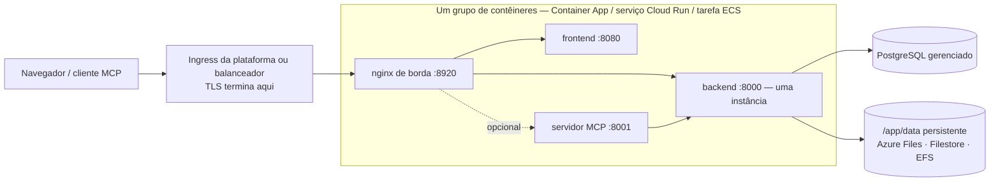

# Serviços de contêineres gerenciados

Nem toda equipe opera Kubernetes, e nem toda equipe quer manter uma máquina virtual. **Azure Container Apps**, **Google Cloud Run** e **AWS ECS Fargate** executam as mesmas imagens do Turbo EA sem um cluster para administrar, com o PostgreSQL gerenciado da mesma nuvem. Esta página oferece para cada um deles um modelo pronto para editar em [`deploy/`](https://github.com/vincentmakes/turbo-ea/tree/main/deploy) e diz com clareza o que cada plataforma consegue e não consegue fazer. Se você tem um cluster, a página [Kubernetes e nuvem](kubernetes.md) e o chart Helm são a melhor escolha; em um único host, o [Docker Compose](../getting-started/setup.md) continua sendo o caminho mais simples. Tudo o que [Operações e atualizações](operations.md) diz sobre backups, atualizações e a guarda de `SECRET_KEY` vale aqui sem alterações. Cada uma das três plataformas tem também um módulo Terraform que cria o mesmo grupo de contêineres junto com o banco de dados gerenciado — consulte [Terraform](terraform.md).

O AWS App Runner fica de fora de propósito: deixou de aceitar novos clientes em abril de 2026 e nunca deu suporte a sidecars nem a volumes persistentes.

## O formato comum



Os três modelos constroem a mesma coisa:

- **Um grupo de contêineres, sidecars em `localhost`.** O nginx de borda, o frontend, o backend e o servidor MCP opcional rodam como sidecars compartilhando um namespace de rede, então a borda encaminha para `http://127.0.0.1:8000`, `:8080` e `:8001`. Uma URL pública, um ciclo de vida, um deploy.
- **A borda escuta na 8920.** Sua porta padrão é a 8080, que a imagem do frontend já ocupa no mesmo namespace; por isso cada modelo define `NGINX_HTTP_PORT=8920` e aponta o ingress da plataforma para ela. A borda continua dona de todos os cabeçalhos de segurança, do limite de 512 MB para importações de espaço de trabalho, das configurações do fluxo de eventos e do roteamento `/mcp` — nada do lado da plataforma a substitui.
- **Um backend, nunca escalado, nunca a zero.** O backend guarda estado interno ao processo (o barramento de eventos em tempo real, o limitador de requisições, o cache de permissões) e executa loops em segundo plano, portanto roda como exatamente uma instância com CPU alocada o tempo todo: número mínimo e máximo de instâncias igual a um em todas as plataformas.
- **Os deploys se sobrepõem em duas das três plataformas.** Container Apps e Cloud Run mantêm a instância antiga servindo até a nova ficar pronta, então por alguns segundos ou minutos dois backends rodam lado a lado em cada deploy. Por isso o backend toma um advisory lock do PostgreSQL em torno das migrações e da semeadura na inicialização: a segunda instância espera, encontra o esquema já atualizado e continua. Os loops em segundo plano ainda se duplicam nessa janela; eles são idempotentes. O ECS para a tarefa antiga antes de iniciar a nova (um ou dois minutos de indisponibilidade por deploy) e não precisa desse cuidado.
- **Um `/app/data` persistente**, de propriedade do uid 1000, guarda as extensões instaladas, os uploads e os pacotes de transferência de espaço de trabalho. Cartões e diagramas ficam no PostgreSQL.
- **O TLS termina na borda da plataforma.** `TURBO_EA_TLS_ENABLED` permanece `false`; um `publicUrl` começando com `https://` é o que marca o cookie de sessão como `secure` e alimenta o CORS.
- **Os segredos vêm do cofre da plataforma** — segredos do Container Apps ou Key Vault, Secret Manager, Secrets Manager — nunca como literais no modelo.
- **As tags de imagem são o número da versão.** `2.141.0` executa as imagens `2.141.0` em todas as plataformas.

## O que cada plataforma consegue e não consegue fazer

| | Azure Container Apps | Google Cloud Run | AWS ECS Fargate |
|---|---|---|---|
| `/app/data` persistente | Azure Files (SMB) montado com `uid=1000` | **Somente Filestore via NFS** — 100 GiB regional (duas regiões) ou 1 TiB nas demais; Cloud Storage FUSE não é POSIX, só para avaliação | EFS por meio de um ponto de acesso (uid/gid 1000) |
| Parar a instância antiga antes da nova | Não no modo de revisão única; sim com várias revisões e uma desativação manual | **Não** — as revisões sempre se sobrepõem | **Sim** (`minimumHealthyPercent 0`, `maximumPercent 100`) |
| Fluxo de eventos (SSE de longa duração) | Cortado a cada 240 s pelo ingress; o navegador reconecta | Até 3600 s por requisição, depois reconecta | Tempo ocioso do balanceador até 4000 s |
| Maior upload (a importação de espaço de trabalho chega a 512 MB) | Não documentado pela Microsoft — teste uma importação de 512 MB antes de confiar nisso | **32 MiB por requisição em HTTP/1** | Sem limite da plataforma |
| TLS e domínio próprio | Certificado gerenciado no app | Balanceador externo global + NEG serverless + certificado gerenciado pelo Google | Certificado ACM no ALB |
| Segredos | Segredos do app ou referências ao Key Vault | Secret Manager | Secrets Manager |
| Shell em um contêiner | `az containerapp exec` | nenhum | ECS Exec |
| Sistema de arquivos raiz somente leitura | indisponível | não é uma configuração | possível, mas desativa o ECS Exec (desligado no modelo) |

## Azure Container Apps

**Pré-requisitos.**

- Um grupo de recursos e um Azure Database for PostgreSQL **Flexible Server** alcançável a partir do ambiente: integrado à VNet (com sua própria sub-rede delegada na mesma VNet) ou acessível por um ponto de extremidade privado. O servidor exige TLS e o negocia automaticamente; o nome de usuário é o nome simples do papel.
- Para acesso privado ao banco, uma sub-rede de pelo menos `/27` **delegada a `Microsoft.App/environments`**, passada como `infrastructureSubnetId`. Deixe-a vazia apenas para uma avaliação contra um servidor acessível publicamente.
- Uma conta de armazenamento com um compartilhamento de arquivos para `/app/data`:
  ```bash
  az storage account create -g turbo-ea -n turboeadata -l westeurope --sku Standard_LRS
  az storage share-rm create --storage-account turboeadata --name turbo-ea-data --quota 50
  ```
- Dois segredos — `SECRET_KEY` (`openssl rand -base64 48`) e a senha do banco — passados como parâmetros seguros ou referenciados do Key Vault (veja o comentário no modelo).

**Implantar.** Edite [`deploy/azure-container-apps/main.bicepparam`](https://github.com/vincentmakes/turbo-ea/blob/main/deploy/azure-container-apps/main.bicepparam), exporte os três segredos que ele lê do ambiente e execute:

```bash
export TURBO_EA_SECRET_KEY="$(openssl rand -base64 48)"
export TURBO_EA_POSTGRES_PASSWORD='…'
export TURBO_EA_STORAGE_KEY="$(az storage account keys list -n turboeadata --query '[0].value' -o tsv)"
az deployment group create -g turbo-ea \
  -f deploy/azure-container-apps/main.bicep -p deploy/azure-container-apps/main.bicepparam
```

A implantação devolve o FQDN padrão do app. Na primeira execução, defina `publicUrl` como `https://<esse FQDN>`; quando vincular um domínio próprio com certificado gerenciado (`az containerapp hostname add` e depois `az containerapp hostname bind --validation-method CNAME`), defina `publicUrl` como esse domínio e implante de novo — a URL do navegador precisa coincidir com `publicUrl` para cookies e CORS. **O primeiro usuário a se registrar torna-se administrador.**

**Atualizações.** Altere `imageTag` e implante de novo. No modo de revisão única (padrão do modelo) a réplica antiga e a nova se sobrepõem por um instante; o lock de inicialização do backend torna isso seguro. Para uma semântica estrita de parar-e-depois-iniciar, mude o app para o modo de várias revisões, desative a revisão em execução e então implante:

```bash
az containerapp revision set-mode -g turbo-ea -n turbo-ea --mode Multiple
az containerapp revision deactivate -g turbo-ea -n turbo-ea --revision <atual>
az deployment group create …   # depois ative a nova revisão e direcione o tráfego para ela
```

**Limites a conhecer.** O ingress encerra toda requisição após 240 segundos, então o fluxo de eventos reconecta a cada quatro minutos — o aplicativo tolera isso, mas aparece como um breve atraso após cada reconexão. A Microsoft não documenta um limite de tamanho de requisição; teste uma importação de espaço de trabalho de tamanho realista antes de confiar nisso. O Container Apps não tem sistema de arquivos raiz somente leitura nem configurações de contexto de segurança; as imagens já rodam com um usuário não root. As sondas limitam `failureThreshold` a 10, por isso a sonda de inicialização do backend consulta a cada 30 segundos para um orçamento de cinco minutos.

## Google Cloud Run

**Pré-requisitos.**

- Uma VPC e uma sub-rede para a **saída direta de VPC**; por ela o serviço alcança o Cloud SQL e o Filestore.
- Uma instância do Cloud SQL para PostgreSQL com **IP privado** nessa VPC (acesso a serviços privados). O modelo conecta por `host:port`, sem proxy.
- Uma instância do **Filestore** para `/app/data` — a única opção persistente e totalmente POSIX no Cloud Run. Seu compartilhamento pertence ao root na criação, então execute uma vez um job que o torne gravável pelo uid 1000 antes do primeiro deploy:
  ```bash
  gcloud filestore instances create turbo-ea-data --zone=europe-west1-b --tier=BASIC_HDD \
    --file-share=name=share,capacity=1TB --network=name=default
  gcloud run jobs create chown-data --image=alpine --region=europe-west1 \
    --network=default --subnet=default --add-volume=name=data,type=nfs,location=FILESTORE_IP:/share \
    --add-volume-mount=volume=data,mount-path=/data --command=chown --args=-R,1000:1000,/data
  gcloud run jobs execute chown-data --region=europe-west1 --wait
  ```
- Dois segredos do Secret Manager, `turbo-ea-secret-key` e `turbo-ea-postgres-password`, e uma conta de serviço de execução com `roles/secretmanager.secretAccessor` e `roles/cloudsql.client`.
- O Cloud Run não consegue baixar diretamente do `ghcr.io`. Crie uma vez um **repositório remoto** do Artifact Registry e referencie as imagens por ele, como faz o modelo:
  ```bash
  gcloud artifacts repositories create ghcr --repository-format=docker --location=europe-west1 \
    --mode=remote-repository --remote-docker-repo=https://ghcr.io
  ```

**Implantar.** Substitua cada marcador `UPPER_CASE` em [`deploy/cloud-run/service.yaml`](https://github.com/vincentmakes/turbo-ea/blob/main/deploy/cloud-run/service.yaml) — projeto, região, rede, IP do Filestore, IP privado do Cloud SQL, URL pública — e aplique:

```bash
gcloud run services replace deploy/cloud-run/service.yaml --region europe-west1
```

Para o nome de host público, coloque na frente do serviço um balanceador de carga de aplicativo externo global com um NEG serverless e um certificado gerenciado pelo Google (`gcloud compute network-endpoint-groups create … --network-endpoint-type=serverless --cloud-run-service=turbo-ea`), aponte o DNS para ele, defina `TURBO_EA_PUBLIC_URL`, `ALLOWED_ORIGINS` e `MCP_PUBLIC_URL` no manifesto para esse nome de host, aplique de novo e então mude a anotação de ingress para `internal-and-cloud-load-balancing`, para que a URL `run.app` pare de responder. Os mapeamentos de domínio no Cloud Run ainda estão em prévia e não são recomendados para produção.

**Atualizações.** Altere as tags de imagem e aplique o manifesto de novo. A nova revisão inicia enquanto a antiga ainda serve; o lock de inicialização do backend impede que as duas migrem ao mesmo tempo, e o Cloud Run não tem opção de parar a antiga primeiro.

**Limites a conhecer.** O Cloud Run rejeita corpos de requisição acima de **32 MiB em HTTP/1**, então uma importação de transferência de espaço de trabalho maior falha no Cloud Run; execute importações grandes no Kubernetes ou em uma VM. O fluxo de eventos é encerrado após 3600 segundos e reconecta. O tamanho mínimo do Filestore é o custo dominante dessa configuração; um bucket do Cloud Storage montado via FUSE é barato mas não é POSIX (sem bloqueios, a última gravação vence), então serve para um teste e não para extensões instaladas em produção, e um volume em memória perde `/app/data` a cada revisão.

## AWS ECS Fargate

**Pré-requisitos.**

- Uma VPC com duas sub-redes públicas (balanceador) e duas privadas (tarefa, destinos de montagem do EFS) com acesso NAT para baixar imagens do `ghcr.io`.
- Uma instância do RDS para PostgreSQL nas sub-redes privadas. Passe seu grupo de segurança como `DbSecurityGroupId` e a pilha abre a porta 5432 a partir da tarefa; caso contrário, abra você mesmo usando a saída `TaskSecurityGroupId`.
- Um certificado do ACM para o nome de host público, na mesma Região.
- Dois segredos do Secrets Manager com `SECRET_KEY` e a senha do banco como strings simples (para um segredo JSON gerenciado pelo RDS, acrescente `:password::` ao ARN no parâmetro).

**Implantar.**

```bash
aws cloudformation deploy --template-file deploy/ecs-fargate/template.yaml \
  --stack-name turbo-ea --capabilities CAPABILITY_IAM \
  --parameter-overrides VpcId=vpc-… PublicSubnetIds=subnet-a,subnet-b PrivateSubnetIds=subnet-c,subnet-d \
    PublicUrl=https://ea.example.com ImageTag=2.141.0 DbHost=turbo-ea.abc.eu-central-1.rds.amazonaws.com \
    DbPasswordSecretArn=arn:aws:secretsmanager:… SecretKeySecretArn=arn:aws:secretsmanager:… \
    CertificateArn=arn:aws:acm:… DbSecurityGroupId=sg-…
```

Aponte o nome de host para a saída `AlbDnsName` (CNAME ou alias do Route 53) e abra-o. A pilha cria o cluster, um sistema de arquivos EFS criptografado com um ponto de acesso de propriedade do uid 1000, o balanceador com um listener HTTPS e um redirecionamento HTTP, e um serviço que executa uma tarefa.

**Atualizações.** Implante de novo com um novo `ImageTag`. O serviço para a tarefa em execução antes de iniciar a substituta — um parar-e-depois-iniciar de verdade, então o backend nunca é duplicado, ao custo de um ou dois minutos de indisponibilidade por deploy.

**Operação.** O EFS é protegido pelo AWS Backup (o modelo ativa a política padrão); combine seus pontos de restauração com os snapshots do RDS. `aws ecs execute-command --cluster turbo-ea --task <id> --container backend --interactive --command sh` abre um shell em qualquer contêiner. O tempo ocioso do balanceador é elevado a 4000 segundos para o fluxo de eventos, e ele não impõe limite de tamanho de corpo.

## Solução de problemas

| Sintoma | Causa e correção |
|---|---|
| O nginx de borda nunca fica saudável, embora os logs do backend estejam bons | Em um layout com sidecars as variáveis de upstream precisam apontar para `127.0.0.1`, e `NGINX_HTTP_PORT` precisa coincidir com a porta que o ingress da plataforma aponta (8920 em todos os modelos). |
| O backend registra *another Turbo EA instance holds the startup lock — waiting* | Esperado por um instante durante um deploy no Container Apps ou no Cloud Run. Se nunca desaparecer, a revisão antiga está travada: desative-a (Container Apps) ou exclua-a (Cloud Run). |
| `Permission denied` em `/app/data` | O volume não pertence ao uid 1000: confira as opções de montagem do Azure Files, execute o job chown do Filestore ou verifique o usuário POSIX do ponto de acesso do EFS. |
| O login entra em loop ou a API responde 401 no navegador | `publicUrl` (e os valores `TURBO_EA_PUBLIC_URL` / `ALLOWED_ORIGINS` derivados dele) não corresponde à URL na barra de endereços. |
| As atualizações em tempo real pausam a cada quatro minutos no Container Apps | O tempo limite de requisição do ingress; o navegador reconecta e nada se perde. |
| Uma importação de espaço de trabalho falha em 32 MiB no Cloud Run | O limite HTTP/1 da plataforma para corpos de requisição; execute importações grandes no Kubernetes ou em uma VM. |
| O backend registra `too many connections` | O plano gerenciado limita as conexões abaixo de `DB_POOL_SIZE + DB_MAX_OVERFLOW`; reduza o pool ([orçamento de conexões](operations.md#check-the-connection-limit)). |
