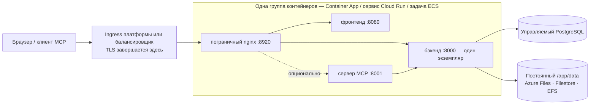

# Управляемые контейнерные сервисы

Не каждая команда эксплуатирует Kubernetes, и не каждая хочет обслуживать виртуальную машину. **Azure Container Apps**, **Google Cloud Run** и **AWS ECS Fargate** запускают те же образы Turbo EA без кластера, которым нужно управлять, с управляемым PostgreSQL того же облака. На этой странице для каждого из них есть готовый шаблон в каталоге [`deploy/`](https://github.com/vincentmakes/turbo-ea/tree/main/deploy) и прямо сказано, что каждая платформа умеет, а чего нет. Если у вас есть кластер, страница [Kubernetes и облако](kubernetes.md) и Helm-чарт подойдут лучше; на одном хосте [Docker Compose](../getting-started/setup.md) остаётся самым простым путём. Всё, что сказано на странице [Эксплуатация и обновления](operations.md) о резервных копиях, обновлениях и хранении `SECRET_KEY`, действует здесь без изменений. Для каждой из трёх платформ есть также модуль Terraform, создающий ту же группу контейнеров вместе с управляемой базой данных — см. [Terraform](terraform.md).

AWS App Runner намеренно не рассматривается: с апреля 2026 года он не принимает новых клиентов и никогда не поддерживал sidecar-контейнеры и постоянные тома.

## Общая схема



Все три шаблона собирают одно и то же:

- **Одна группа контейнеров, sidecar-контейнеры на `localhost`.** Пограничный nginx, фронтенд, бэкенд и опциональный сервер MCP работают как sidecar-контейнеры в одном сетевом пространстве имён, поэтому пограничный nginx проксирует на `http://127.0.0.1:8000`, `:8080` и `:8001`. Один публичный URL, один жизненный цикл, одно развёртывание.
- **Пограничный nginx слушает порт 8920.** Его порт по умолчанию — 8080, но его в том же пространстве имён уже занимает образ фронтенда, поэтому каждый шаблон задаёт `NGINX_HTTP_PORT=8920` и направляет на него ingress платформы. Пограничный nginx по-прежнему отвечает за все заголовки безопасности, лимит 512 МБ на загрузку пакетов переноса рабочего пространства, настройки потока событий и маршрутизацию `/mcp` — ничто на стороне платформы его не заменяет.
- **Один бэкенд, никогда не масштабируется, никогда не уходит в ноль.** Бэкенд хранит состояние внутри процесса (шина событий реального времени, ограничитель запросов, кэш прав) и выполняет фоновые циклы, поэтому работает ровно в одном экземпляре с постоянно выделенным CPU: минимальное и максимальное число экземпляров равно единице на каждой платформе.
- **На двух платформах из трёх развёртывания перекрываются.** Container Apps и Cloud Run держат старый экземпляр в работе, пока новый не будет готов, поэтому при каждом развёртывании от нескольких секунд до нескольких минут два бэкенда работают одновременно. Поэтому бэкенд берёт рекомендательную блокировку PostgreSQL на время миграций и первоначального заполнения при старте: второй экземпляр ждёт, обнаруживает, что схема уже актуальна, и продолжает работу. Фоновые циклы в этом окне всё же дублируются; они идемпотентны. ECS останавливает старую задачу до запуска новой (одна-две минуты простоя на развёртывание) и в такой защите не нуждается.
- **Постоянный `/app/data`**, принадлежащий uid 1000, хранит установленные расширения, загрузки и пакеты переноса рабочего пространства. Карточки и диаграммы живут в PostgreSQL.
- **TLS завершается на границе платформы.** `TURBO_EA_TLS_ENABLED` остаётся `false`; `publicUrl`, начинающийся с `https://`, помечает cookie сессии как `secure` и задаёт CORS.
- **Секреты берутся из хранилища секретов платформы** — секреты Container Apps или Key Vault, Secret Manager, Secrets Manager — и никогда не пишутся литералами в шаблон.
- **Теги образов — это номер выпуска.** `2.141.0` запускает образы `2.141.0` на каждой платформе.

## Что каждая платформа умеет, а чего нет

| | Azure Container Apps | Google Cloud Run | AWS ECS Fargate |
|---|---|---|---|
| Постоянный `/app/data` | Azure Files (SMB), смонтированный с `uid=1000` | **Только Filestore по NFS** — 100 ГиБ региональный (два региона) или 1 ТиБ в остальных; Cloud Storage FUSE не соответствует POSIX, только для оценки | EFS через точку доступа (uid/gid 1000) |
| Остановить старый экземпляр до запуска нового | Нет в режиме одной ревизии; да при нескольких ревизиях и ручной деактивации | **Нет** — ревизии всегда перекрываются | **Да** (`minimumHealthyPercent 0`, `maximumPercent 100`) |
| Поток событий (долгоживущий SSE) | Обрывается ingress каждые 240 с; браузер переподключается | До 3600 с на запрос, затем переподключение | Тайм-аут простоя балансировщика до 4000 с |
| Максимальная загрузка (импорт рабочего пространства до 512 МБ) | Microsoft не документирует — проверьте импорт на 512 МБ, прежде чем полагаться на него | **32 МиБ на запрос по HTTP/1** | Ограничения платформы нет |
| TLS и собственный домен | Управляемый сертификат на приложении | Глобальный внешний балансировщик + бессерверная NEG + сертификат, управляемый Google | Сертификат ACM на ALB |
| Секреты | Секреты приложения или ссылки на Key Vault | Secret Manager | Secrets Manager |
| Оболочка внутри контейнера | `az containerapp exec` | нет | ECS Exec |
| Корневая ФС только для чтения | недоступно | не является настройкой | возможно, но отключает ECS Exec (в шаблоне выключено) |

## Azure Container Apps

**Предварительные требования.**

- Группа ресурсов и Azure Database for PostgreSQL **Flexible Server**, доступный из среды: либо интегрированный в VNet (собственная делегированная подсеть в той же VNet), либо доступный через приватную конечную точку. Сервер требует TLS и согласует его автоматически; имя пользователя — просто имя роли.
- Для приватного доступа к базе — подсеть не меньше `/27`, **делегированная `Microsoft.App/environments`**, передаваемая как `infrastructureSubnetId`. Оставляйте пустой только для оценки с публично доступным сервером.
- Учётная запись хранения с файловым ресурсом для `/app/data`:
  ```bash
  az storage account create -g turbo-ea -n turboeadata -l westeurope --sku Standard_LRS
  az storage share-rm create --storage-account turboeadata --name turbo-ea-data --quota 50
  ```
- Два секрета — `SECRET_KEY` (`openssl rand -base64 48`) и пароль базы данных — передаются защищёнными параметрами или берутся из Key Vault (см. комментарий в шаблоне).

**Развёртывание.** Отредактируйте [`deploy/azure-container-apps/main.bicepparam`](https://github.com/vincentmakes/turbo-ea/blob/main/deploy/azure-container-apps/main.bicepparam), экспортируйте три секрета, которые он читает из окружения, и выполните:

```bash
export TURBO_EA_SECRET_KEY="$(openssl rand -base64 48)"
export TURBO_EA_POSTGRES_PASSWORD='…'
export TURBO_EA_STORAGE_KEY="$(az storage account keys list -n turboeadata --query '[0].value' -o tsv)"
az deployment group create -g turbo-ea \
  -f deploy/azure-container-apps/main.bicep -p deploy/azure-container-apps/main.bicepparam
```

Развёртывание выводит FQDN приложения по умолчанию. При первом запуске задайте `publicUrl` равным `https://<этот FQDN>`; после привязки собственного домена с управляемым сертификатом (`az containerapp hostname add`, затем `az containerapp hostname bind --validation-method CNAME`) задайте `publicUrl` равным этому домену и разверните снова — адрес в браузере должен совпадать с `publicUrl` для cookie и CORS. **Первый зарегистрировавшийся пользователь становится администратором.**

**Обновления.** Измените `imageTag` и разверните снова. В режиме одной ревизии (по умолчанию в шаблоне) старая и новая реплики на мгновение перекрываются; блокировка старта бэкенда делает это безопасным. Для строгой семантики «остановить, затем запустить» переключите приложение в режим нескольких ревизий, деактивируйте работающую ревизию и затем разверните:

```bash
az containerapp revision set-mode -g turbo-ea -n turbo-ea --mode Multiple
az containerapp revision deactivate -g turbo-ea -n turbo-ea --revision <текущая>
az deployment group create …   # затем активируйте новую ревизию и направьте на неё трафик
```

**Ограничения, о которых нужно знать.** Ingress закрывает каждый запрос через 240 секунд, поэтому поток событий переподключается каждые четыре минуты — приложение это переносит, но после каждого переподключения заметна короткая задержка. Microsoft не документирует лимит размера запроса; проверьте импорт рабочего пространства реалистичного размера, прежде чем на него полагаться. В Container Apps нет корневой файловой системы только для чтения и настроек контекста безопасности; образы и так работают от имени пользователя без прав root. Пробы ограничивают `failureThreshold` значением 10, поэтому стартовая проба бэкенда опрашивает его каждые 30 секунд, что даёт пятиминутный запас.

## Google Cloud Run

**Предварительные требования.**

- VPC и подсеть для **прямого выхода в VPC**; через неё сервис достигает Cloud SQL и Filestore.
- Экземпляр Cloud SQL for PostgreSQL с **частным IP** в этой VPC (private services access). Шаблон подключается по `host:port`, без прокси.
- Экземпляр **Filestore** для `/app/data` — единственный постоянный и полностью POSIX-совместимый вариант в Cloud Run. При создании ресурс принадлежит root, поэтому перед первым развёртыванием один раз выполните задание, делающее его записываемым для uid 1000:
  ```bash
  gcloud filestore instances create turbo-ea-data --zone=europe-west1-b --tier=BASIC_HDD \
    --file-share=name=share,capacity=1TB --network=name=default
  gcloud run jobs create chown-data --image=alpine --region=europe-west1 \
    --network=default --subnet=default --add-volume=name=data,type=nfs,location=FILESTORE_IP:/share \
    --add-volume-mount=volume=data,mount-path=/data --command=chown --args=-R,1000:1000,/data
  gcloud run jobs execute chown-data --region=europe-west1 --wait
  ```
- Два секрета Secret Manager, `turbo-ea-secret-key` и `turbo-ea-postgres-password`, и сервисный аккаунт среды выполнения с ролями `roles/secretmanager.secretAccessor` и `roles/cloudsql.client`.
- Cloud Run не может скачивать образы напрямую из `ghcr.io`. Один раз создайте **удалённый репозиторий** Artifact Registry и ссылайтесь на образы через него, как делает шаблон:
  ```bash
  gcloud artifacts repositories create ghcr --repository-format=docker --location=europe-west1 \
    --mode=remote-repository --remote-docker-repo=https://ghcr.io
  ```

**Развёртывание.** Замените каждый заполнитель `UPPER_CASE` в [`deploy/cloud-run/service.yaml`](https://github.com/vincentmakes/turbo-ea/blob/main/deploy/cloud-run/service.yaml) — проект, регион, сеть, IP Filestore, частный IP Cloud SQL, публичный URL — и примените его:

```bash
gcloud run services replace deploy/cloud-run/service.yaml --region europe-west1
```

Для публичного имени хоста поставьте перед сервисом глобальный внешний балансировщик нагрузки приложений с бессерверной NEG и сертификатом, управляемым Google (`gcloud compute network-endpoint-groups create … --network-endpoint-type=serverless --cloud-run-service=turbo-ea`), направьте на него DNS, задайте в манифесте `TURBO_EA_PUBLIC_URL`, `ALLOWED_ORIGINS` и `MCP_PUBLIC_URL` равными этому имени хоста, примените снова, а затем измените аннотацию ingress на `internal-and-cloud-load-balancing`, чтобы URL `run.app` перестал отвечать. Сопоставления доменов в Cloud Run всё ещё в предварительной версии и не рекомендуются для продакшена.

**Обновления.** Измените теги образов и примените манифест снова. Новая ревизия запускается, пока старая ещё обслуживает запросы; блокировка старта бэкенда не даёт им мигрировать одновременно, а опции «сначала остановить старую» в Cloud Run нет.

**Ограничения, о которых нужно знать.** Cloud Run отклоняет тела запросов больше **32 МиБ по HTTP/1**, поэтому импорт пакета переноса рабочего пространства большего размера в Cloud Run завершится ошибкой; выполняйте крупные импорты в Kubernetes или на виртуальной машине. Поток событий закрывается через 3600 секунд и переподключается. Минимальный размер Filestore — основная статья расходов этой схемы; бакет Cloud Storage, смонтированный через FUSE, дёшев, но не соответствует POSIX (нет блокировок, побеждает последняя запись) — годится для пробы и не годится для установленных расширений в продакшене; том в памяти теряет `/app/data` при каждой новой ревизии.

## AWS ECS Fargate

**Предварительные требования.**

- VPC с двумя публичными подсетями (балансировщик) и двумя приватными (задача, точки монтирования EFS), у которых есть NAT для загрузки образов из `ghcr.io`.
- Экземпляр RDS for PostgreSQL в приватных подсетях. Передайте его группу безопасности как `DbSecurityGroupId`, и стек откроет порт 5432 со стороны задачи; иначе откройте его сами, используя вывод `TaskSecurityGroupId`.
- Сертификат ACM для публичного имени хоста в том же регионе.
- Два секрета Secrets Manager с `SECRET_KEY` и паролем базы в виде простых строк (для JSON-секрета, управляемого RDS, добавьте `:password::` к его ARN в параметре).

**Развёртывание.**

```bash
aws cloudformation deploy --template-file deploy/ecs-fargate/template.yaml \
  --stack-name turbo-ea --capabilities CAPABILITY_IAM \
  --parameter-overrides VpcId=vpc-… PublicSubnetIds=subnet-a,subnet-b PrivateSubnetIds=subnet-c,subnet-d \
    PublicUrl=https://ea.example.com ImageTag=2.141.0 DbHost=turbo-ea.abc.eu-central-1.rds.amazonaws.com \
    DbPasswordSecretArn=arn:aws:secretsmanager:… SecretKeySecretArn=arn:aws:secretsmanager:… \
    CertificateArn=arn:aws:acm:… DbSecurityGroupId=sg-…
```

Направьте имя хоста на вывод `AlbDnsName` (CNAME или алиас Route 53) и откройте его. Стек создаёт кластер, зашифрованную файловую систему EFS с точкой доступа, принадлежащей uid 1000, балансировщик с HTTPS-слушателем и HTTP-перенаправлением и сервис, выполняющий одну задачу.

**Обновления.** Разверните снова с новым `ImageTag`. Сервис останавливает работающую задачу до запуска замены — настоящее «остановить, затем запустить», так что бэкенд никогда не дублируется, ценой одной-двух минут простоя на развёртывание.

**Эксплуатация.** EFS резервируется AWS Backup (шаблон включает политику по умолчанию); сопоставляйте его точки восстановления со снимками RDS. `aws ecs execute-command --cluster turbo-ea --task <id> --container backend --interactive --command sh` открывает оболочку в любом контейнере. Тайм-аут простоя балансировщика поднят до 4000 секунд ради потока событий, а ограничений на размер тела запроса у него нет.

## Устранение неполадок

| Симптом | Причина и решение |
|---|---|
| Пограничный nginx не становится работоспособным, хотя логи бэкенда в порядке | В схеме с sidecar-контейнерами переменные upstream должны указывать на `127.0.0.1`, а `NGINX_HTTP_PORT` — совпадать с портом, на который нацелен ingress платформы (8920 во всех шаблонах). |
| Бэкенд пишет *another Turbo EA instance holds the startup lock — waiting* | Ожидаемо на короткое время во время развёртывания в Container Apps или Cloud Run. Если не проходит, старая ревизия зависла: деактивируйте её (Container Apps) или удалите (Cloud Run). |
| `Permission denied` в `/app/data` | Том принадлежит не uid 1000: проверьте опции монтирования Azure Files, выполните задание chown для Filestore или проверьте POSIX-пользователя точки доступа EFS. |
| Вход зацикливается или API отвечает 401 в браузере | `publicUrl` (и производные `TURBO_EA_PUBLIC_URL` / `ALLOWED_ORIGINS`) не совпадает с адресом в адресной строке. |
| Обновления в реальном времени в Container Apps замирают каждые четыре минуты | Тайм-аут запроса ingress; браузер переподключается, ничего не теряется. |
| Импорт рабочего пространства в Cloud Run падает на 32 МиБ | Лимит платформы на тело запроса по HTTP/1; выполняйте крупные импорты в Kubernetes или на виртуальной машине. |
| Бэкенд пишет `too many connections` | Управляемый тариф ограничивает соединения ниже `DB_POOL_SIZE + DB_MAX_OVERFLOW`; уменьшите пул ([бюджет соединений](operations.md#check-the-connection-limit)). |
