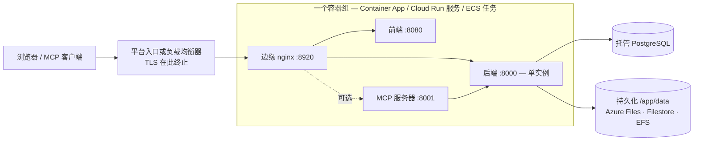

# 托管容器服务

并非每个团队都运行 Kubernetes，也并非每个团队都愿意维护一台虚拟机。**Azure Container Apps**、**Google Cloud Run** 和 **AWS ECS Fargate** 无需运维集群即可运行同样的 Turbo EA 镜像，并连接同一家云的托管 PostgreSQL。本页为每个平台提供位于 [`deploy/`](https://github.com/vincentmakes/turbo-ea/tree/main/deploy) 的可直接修改的模板，并明确说明每个平台能做什么、不能做什么。如果您已有集群，[Kubernetes 与云](kubernetes.md)页面和 Helm chart 更合适；在单台主机上，[Docker Compose](../getting-started/setup.md) 仍是最简单的路径。[运维与升级](operations.md)中关于备份、升级和 `SECRET_KEY` 保管的所有内容在此同样适用。 这三个平台各自还提供一个 Terraform 模块，用于创建相同的容器组以及托管数据库——参见 [Terraform](terraform.md)。

本页刻意不涉及 AWS App Runner：它自 2026 年 4 月起不再接受新客户，而且从未支持 Sidecar 或持久卷。

## 共同的部署形态



三个模板构建的都是同一样东西：

- **一个容器组，Sidecar 共享 `localhost`。** 边缘 nginx、前端、后端和可选的 MCP 服务器作为 Sidecar 运行在同一个网络命名空间中，因此边缘代理到 `http://127.0.0.1:8000`、`:8080` 和 `:8001`。一个公开 URL，一个生命周期，一次部署。
- **边缘监听 8920。** 它的默认端口是 8080，而前端镜像在同一命名空间内已经占用了 8080，因此每个模板都设置 `NGINX_HTTP_PORT=8920` 并把平台入口指向它。边缘仍然掌管所有安全头、工作区传输 2 GB 的上传限制、事件流设置和 `/mcp` 路由——平台侧没有任何东西能替代它。
- **一个后端，从不扩缩，从不归零。** 后端持有进程内状态（实时事件总线、限流器、权限缓存）并运行后台循环，因此它恰好以一个实例运行，且 CPU 始终分配：每个平台上的最小与最大实例数均为 1。
- **三个平台中有两个在部署时会重叠。** Container Apps 和 Cloud Run 在新实例就绪前会让旧实例继续提供服务，因此每次部署都会有几秒到几分钟两个后端并行运行。为此，后端在启动时的迁移和数据填充周围获取一个 PostgreSQL 咨询锁：第二个实例等待，发现模式已是最新，然后继续。在这一窗口内后台循环仍会重复运行；它们是幂等的。ECS 会先停止旧任务再启动新任务（每次部署有一到两分钟的停机），无需这种保护。
- **持久化的 `/app/data`**，属主为 uid 1000，存放已安装的扩展、上传文件和工作区传输包。卡片和图表存放在 PostgreSQL 中。
- **TLS 在平台边缘终止。** `TURBO_EA_TLS_ENABLED` 保持为 `false`；以 `https://` 开头的 `publicUrl` 会将会话 Cookie 标记为 `secure`，并驱动 CORS。
- **密钥来自平台的密钥存储**——Container Apps 密钥或 Key Vault、Secret Manager、Secrets Manager——绝不以字面量写在模板中。
- **镜像标签就是发布版本号。** `2.141.0` 在每个平台上运行 `2.141.0` 镜像。

## 各平台能做什么、不能做什么

| | Azure Container Apps | Google Cloud Run | AWS ECS Fargate |
|---|---|---|---|
| 持久化 `/app/data` | 以 `uid=1000` 挂载的 Azure Files（SMB） | **仅 Filestore（NFS）**——区域级 100 GiB（仅两个区域）或其他区域 1 TiB；Cloud Storage FUSE 不符合 POSIX，仅供评估 | 通过接入点的 EFS（uid/gid 1000） |
| 先停旧实例再启新实例 | 单修订版模式下不行；多修订版加手动停用可以 | **不行**——修订版总会重叠 | **可以**（`minimumHealthyPercent 0`、`maximumPercent 100`） |
| 事件流（长连接 SSE） | 入口每 240 秒切断一次；浏览器自动重连 | 每个请求最长 3600 秒，然后重连 | 负载均衡器空闲超时最长 4000 秒 |
| 最大上传（工作区导入最高 2 GB） | Microsoft 未记录——依赖前请先测试 2 GB 导入 | **HTTP/1 下每个请求 32 MiB** | 平台无限制 |
| TLS 与自定义域名 | 应用上的托管证书 | 全局外部负载均衡器 + 无服务器 NEG + Google 托管证书 | ALB 上的 ACM 证书 |
| 密钥 | 应用密钥或 Key Vault 引用 | Secret Manager | Secrets Manager |
| 进入容器的 Shell | `az containerapp exec` | 无 | ECS Exec |
| 只读根文件系统 | 不可用 | 不是可配置项 | 可以，但会禁用 ECS Exec（模板中关闭） |

## Azure Container Apps

**前提条件。**

- 一个资源组，以及环境可以访问的 Azure Database for PostgreSQL **灵活服务器**：要么集成到 VNet（在同一 VNet 中有自己的委派子网），要么通过专用终结点可达。服务器强制 TLS 且自动协商；用户名就是角色名本身。
- 若需私有访问数据库，需要一个至少 `/27` 且**委派给 `Microsoft.App/environments`** 的子网，作为 `infrastructureSubnetId` 传入。只有针对可公网访问的服务器做评估时才留空。
- 一个存储账户及用于 `/app/data` 的文件共享：
  ```bash
  az storage account create -g turbo-ea -n turboeadata -l westeurope --sku Standard_LRS
  az storage share-rm create --storage-account turboeadata --name turbo-ea-data --quota 50
  ```
- 两个密钥——`SECRET_KEY`（`openssl rand -base64 48`）和数据库密码——以安全参数传入，或从 Key Vault 引用（见模板中的注释）。

**部署。** 编辑 [`deploy/azure-container-apps/main.bicepparam`](https://github.com/vincentmakes/turbo-ea/blob/main/deploy/azure-container-apps/main.bicepparam)，导出它从环境读取的三个密钥，然后运行：

```bash
export TURBO_EA_SECRET_KEY="$(openssl rand -base64 48)"
export TURBO_EA_POSTGRES_PASSWORD='…'
export TURBO_EA_STORAGE_KEY="$(az storage account keys list -n turboeadata --query '[0].value' -o tsv)"
az deployment group create -g turbo-ea \
  -f deploy/azure-container-apps/main.bicep -p deploy/azure-container-apps/main.bicepparam
```

部署会输出应用的默认 FQDN。首次运行时把 `publicUrl` 设为 `https://<该 FQDN>`；绑定带托管证书的自定义域名后（先 `az containerapp hostname add`，再 `az containerapp hostname bind --validation-method CNAME`），把 `publicUrl` 改为该域名并再次部署——浏览器地址必须与 `publicUrl` 一致，Cookie 和 CORS 才能正常工作。**第一个注册的用户即为管理员。**

**升级。** 修改 `imageTag` 并再次部署。在单修订版模式（模板默认）下，新旧副本会短暂重叠；后端的启动锁保证了这一点的安全性。若需要严格的"先停后启"，请把应用切换到多修订版模式，先停用正在运行的修订版，再部署：

```bash
az containerapp revision set-mode -g turbo-ea -n turbo-ea --mode Multiple
az containerapp revision deactivate -g turbo-ea -n turbo-ea --revision <当前修订版>
az deployment group create …   # 然后激活新修订版并把流量切过去
```

**需要了解的限制。** 入口会在 240 秒后关闭每个请求，因此事件流每四分钟重连一次——应用可以承受，但每次重连后会有短暂延迟。Microsoft 未记录请求体大小限制；在依赖之前请先测试一个真实大小的工作区导入。Container Apps 没有只读根文件系统或安全上下文设置；镜像本身已经以非 root 用户运行。探针的 `failureThreshold` 上限为 10，因此后端的启动探针每 30 秒轮询一次，以获得五分钟的预算。

## Google Cloud Run

**前提条件。**

- 用于**直接 VPC 出站**的 VPC 和子网；服务通过它访问 Cloud SQL 和 Filestore。
- 位于该 VPC 中、具有**专用 IP** 的 Cloud SQL for PostgreSQL 实例（专用服务访问）。模板通过 `host:port` 连接，不使用代理。
- 用于 `/app/data` 的 **Filestore** 实例——Cloud Run 上唯一持久且完全符合 POSIX 的选项。共享在创建时归 root 所有，因此首次部署前需运行一次性作业，使其对 uid 1000 可写：
  ```bash
  gcloud filestore instances create turbo-ea-data --zone=europe-west1-b --tier=BASIC_HDD \
    --file-share=name=share,capacity=1TB --network=name=default
  gcloud run jobs create chown-data --image=alpine --region=europe-west1 \
    --network=default --subnet=default --add-volume=name=data,type=nfs,location=FILESTORE_IP:/share \
    --add-volume-mount=volume=data,mount-path=/data --command=chown --args=-R,1000:1000,/data
  gcloud run jobs execute chown-data --region=europe-west1 --wait
  ```
- 两个 Secret Manager 密钥 `turbo-ea-secret-key` 和 `turbo-ea-postgres-password`，以及具有 `roles/secretmanager.secretAccessor` 和 `roles/cloudsql.client` 的运行时服务账号。
- Cloud Run 无法直接从 `ghcr.io` 拉取镜像。请一次性创建一个 Artifact Registry **远程仓库**，然后像模板那样通过它引用镜像：
  ```bash
  gcloud artifacts repositories create ghcr --repository-format=docker --location=europe-west1 \
    --mode=remote-repository --remote-docker-repo=https://ghcr.io
  ```

**部署。** 替换 [`deploy/cloud-run/service.yaml`](https://github.com/vincentmakes/turbo-ea/blob/main/deploy/cloud-run/service.yaml) 中的每个 `UPPER_CASE` 占位符——项目、区域、网络、Filestore IP、Cloud SQL 专用 IP、公开 URL——然后应用：

```bash
gcloud run services replace deploy/cloud-run/service.yaml --region europe-west1
```

对于公开主机名，请在服务前放置一个全局外部应用负载均衡器，配合无服务器 NEG 和 Google 托管证书（`gcloud compute network-endpoint-groups create … --network-endpoint-type=serverless --cloud-run-service=turbo-ea`），把 DNS 指向它，在清单中将 `TURBO_EA_PUBLIC_URL`、`ALLOWED_ORIGINS` 和 `MCP_PUBLIC_URL` 设为该主机名，再次应用，然后把入口注解改为 `internal-and-cloud-load-balancing`，使 `run.app` URL 不再响应。Cloud Run 的域名映射仍处于预览阶段，不建议用于生产。

**升级。** 修改镜像标签并再次应用清单。新修订版启动时旧修订版仍在提供服务；后端的启动锁防止两者同时迁移，而 Cloud Run 没有"先停旧实例"的选项。

**需要了解的限制。** Cloud Run 拒绝 **HTTP/1 下超过 32 MiB** 的请求体，因此更大的工作区传输导入在 Cloud Run 上会失败；请改在 Kubernetes 或虚拟机上执行大型导入。事件流会在 3600 秒后关闭并重连。Filestore 的最小容量是这套方案的主要成本；通过 FUSE 挂载的 Cloud Storage 存储桶便宜但不符合 POSIX（无锁，后写覆盖先写），适合试用，不适合生产环境中已安装的扩展；内存卷则在每次新修订版时丢失 `/app/data`。

## AWS ECS Fargate

**前提条件。**

- 一个 VPC，包含两个公有子网（负载均衡器）和两个私有子网（任务、EFS 挂载目标），私有子网需有 NAT 以便从 `ghcr.io` 拉取镜像。
- 位于私有子网中的 RDS for PostgreSQL 实例。把它的安全组作为 `DbSecurityGroupId` 传入，堆栈会从任务开放 5432 端口；否则请使用 `TaskSecurityGroupId` 输出自行开放。
- 同一区域中用于公开主机名的 ACM 证书。
- 两个 Secrets Manager 密钥，以纯字符串保存 `SECRET_KEY` 和数据库密码（对于 RDS 托管的 JSON 密钥，在参数中的 ARN 后追加 `:password::`）。

**部署。**

```bash
aws cloudformation deploy --template-file deploy/ecs-fargate/template.yaml \
  --stack-name turbo-ea --capabilities CAPABILITY_IAM \
  --parameter-overrides VpcId=vpc-… PublicSubnetIds=subnet-a,subnet-b PrivateSubnetIds=subnet-c,subnet-d \
    PublicUrl=https://ea.example.com ImageTag=2.141.0 DbHost=turbo-ea.abc.eu-central-1.rds.amazonaws.com \
    DbPasswordSecretArn=arn:aws:secretsmanager:… SecretKeySecretArn=arn:aws:secretsmanager:… \
    CertificateArn=arn:aws:acm:… DbSecurityGroupId=sg-…
```

把主机名指向 `AlbDnsName` 输出（CNAME 或 Route 53 别名）并打开它。堆栈会创建集群、一个带有 uid 1000 属主接入点的加密 EFS 文件系统、带 HTTPS 监听器和 HTTP 重定向的负载均衡器，以及一个运行单个任务的服务。

**升级。** 使用新的 `ImageTag` 再次部署。服务会先停止正在运行的任务，再启动替代任务——真正的"先停后启"，后端永远不会重复，代价是每次部署一到两分钟的停机。

**运维。** EFS 由 AWS Backup 备份（模板启用了默认策略）；请把它的恢复点与 RDS 快照配对使用。`aws ecs execute-command --cluster turbo-ea --task <id> --container backend --interactive --command sh` 可在任意容器中打开 Shell。负载均衡器的空闲超时已为事件流提高到 4000 秒，且不限制请求体大小。

**Amazon Bedrock。** 若要使用 Bedrock 作为 AI 提供商，请将 [AI 功能](ai.md) 中的 IAM 策略附加到该堆栈的任务角色；Turbo EA 随后会使用该角色进行身份验证，无需 API 密钥。

## 故障排查

| 现象 | 原因与处理 |
|---|---|
| 边缘 nginx 始终不健康，而后端日志正常 | 在 Sidecar 布局中，上游变量必须指向 `127.0.0.1`，且 `NGINX_HTTP_PORT` 必须与平台入口指向的端口一致（每个模板中为 8920）。 |
| 后端日志出现 *another Turbo EA instance holds the startup lock — waiting* | 在 Container Apps 或 Cloud Run 上部署期间短暂出现属正常。若一直不消失，说明旧修订版卡住了：停用它（Container Apps）或删除它（Cloud Run）。 |
| `/app/data` 下出现 `Permission denied` | 卷的属主不是 uid 1000：检查 Azure Files 挂载选项，运行 Filestore 的 chown 作业，或核对 EFS 接入点的 POSIX 用户。 |
| 登录循环，或浏览器中 API 返回 401 | `publicUrl`（以及由它派生的 `TURBO_EA_PUBLIC_URL` / `ALLOWED_ORIGINS`）与地址栏中的 URL 不一致。 |
| Container Apps 上实时更新每四分钟暂停一次 | 入口的请求超时；浏览器会重连，不会丢失任何内容。 |
| Cloud Run 上工作区导入在 32 MiB 时失败 | 平台对 HTTP/1 请求体的限制；请在 Kubernetes 或虚拟机上执行大型导入。 |
| 后端日志出现 `too many connections` | 托管套餐的连接上限低于 `DB_POOL_SIZE + DB_MAX_OVERFLOW`；请调小连接池（[连接预算](operations.md#check-the-connection-limit)）。 |
