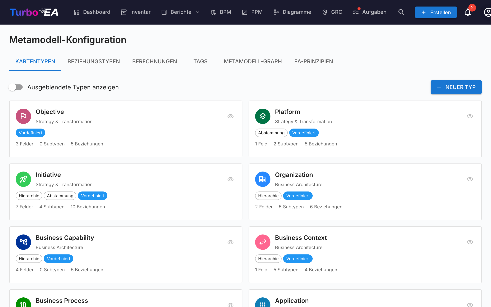
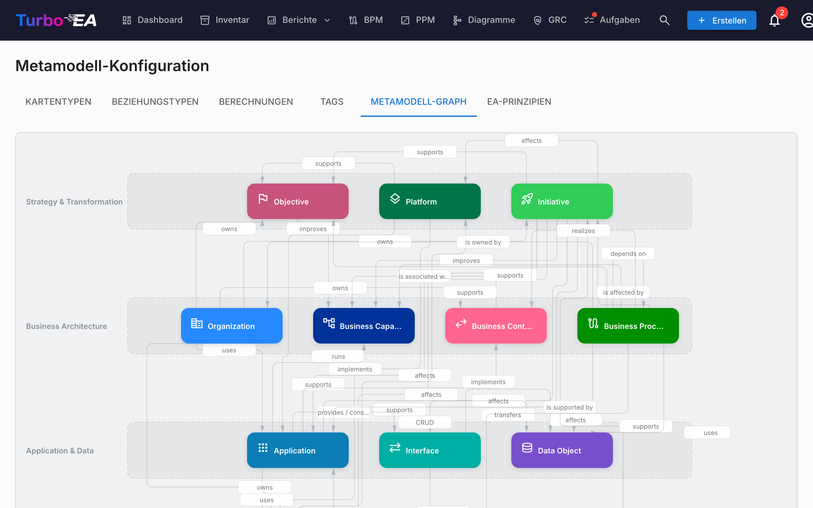

# Metamodell

Das **Metamodell** definiert die gesamte Datenstruktur Ihrer Plattform — welche Kartentypen existieren, welche Felder sie haben, wie sie zueinander in Beziehung stehen und wie Kartendetailseiten aufgebaut sind. Alles ist **datengesteuert**: Sie konfigurieren das Metamodell über die Administrator-Oberfläche, nicht durch Codeänderungen.

Navigieren Sie zu **Admin > Metamodell**, um auf den Metamodell-Editor zuzugreifen. Er hat sieben Tabs: **Kartentypen**, **Beziehungstypen**, **Berechnungen**, **Tags**, **Metamodell-Graph**, **EA-Prinzipien** und **Compliance-Regulierungen**.

## Kartentypen

Der Kartentypen-Tab listet alle Typen im System auf. Turbo EA wird mit 14 integrierten Typen über vier Architekturebenen ausgeliefert:

| Ebene | Typen |
|-------|-------|
| **Strategie & Transformation** | Ziel, Plattform, Initiative |
| **Geschäftsarchitektur** | Organisation, Geschäftsfähigkeit, Geschäftskontext, Geschäftsprozess |
| **Anwendung & Daten** | Anwendung, Schnittstelle, Datenobjekt |
| **Technische Architektur** | IT-Komponente, Technologiekategorie, Anbieter, System |

### Einen benutzerdefinierten Typ erstellen

Klicken Sie auf **+ Neuer Typ**, um einen benutzerdefinierten Kartentyp zu erstellen. Konfigurieren Sie:

| Feld | Beschreibung |
|------|-------------|
| **Schlüssel** | Eindeutiger Bezeichner (Kleinbuchstaben, keine Leerzeichen) — kann nach der Erstellung nicht geändert werden |
| **Bezeichnung** | Anzeigename in der Benutzeroberfläche |
| **Symbol** | Google Material Symbol-Symbolname |
| **Farbe** | Markenfarbe für den Typ (verwendet in Inventar, Berichten und Diagrammen) |
| **Kategorie** | Architekturebenen-Gruppierung |
| **Hat Hierarchie** | Ob Karten dieses Typs Eltern-/Kind-Beziehungen haben können |

### Einen Typ bearbeiten

Klicken Sie auf einen beliebigen Typ, um die **Typ-Detail-Schublade** zu öffnen. Hier können Sie konfigurieren:

#### Typfarbe

Jeder Kartentyp — auch die vordefinierten — hat eine anpassbare Farbe, die im Inventar, in Berichten, Abhängigkeitsansichten und Diagrammen verwendet wird. So können Sie Turbo EA an die visuellen Konventionen Ihrer Organisation anpassen (z. B. TOGAF/ArchiMate-Paletten: Geschäftselemente in Gelb/Orange, Anwendungen in Blau).

- Wählen Sie eine Farbe über das Farbfeld im Drawer. Ein Hinweis erscheint, wenn die gewählte Farbe einen sehr geringen Kontrast zu hellen oder dunklen Hintergründen hat.
- Vordefinierte Typen zeigen neben dem Farbfeld eine **Zurücksetzen**-Schaltfläche, sobald die Farbe vom Turbo-EA-Standard abweicht — Sie können also jederzeit zur Standardpalette zurückkehren.
- Text auf Typfarben (Chips, Diagrammformen) wechselt für die Lesbarkeit automatisch zwischen Schwarz und Weiß, sowohl im hellen als auch im dunklen Modus.
- Der Farbwähler zeigt neben der Palette eine **Live-Vorschau**: Typname, Chip, Kartensymbol, Subtyp, Karten-ID-Pill und ein Abhängigkeitsdiagramm-Knoten, jeweils einmal im hellen und einmal im dunklen Modus, die sich bei der Auswahl live aktualisiert.

#### Felder

Felder definieren die benutzerdefinierten Attribute, die auf Karten dieses Typs verfügbar sind. Jedes Feld hat:

| Einstellung | Beschreibung |
|-------------|-------------|
| **Schlüssel** | Eindeutiger Feldbezeichner |
| **Bezeichnung** | Anzeigename |
| **Typ** | text, multiline_text, number, cost, boolean, date, url, single_select oder multiple_select |
| **Optionen** | Für Auswahlfelder: die verfügbaren Auswahlmöglichkeiten mit Bezeichnungen und optionalen Farben |
| **Pflichtfeld** | Ob das Feld für die Datenqualitätsbewertung ausgefüllt sein muss |
| **Datenqualität** | Der Beitrag jedes Felds zum Wert wird im Bereich **Datenqualität** verwaltet (siehe unten) |
| **Nur lesen** | Verhindert manuelle Bearbeitung (nützlich für berechnete Felder) |

Klicken Sie auf **+ Feld hinzufügen**, um ein neues Feld zu erstellen, oder klicken Sie auf ein bestehendes Feld, um es im **Feldeditor-Dialog** zu bearbeiten.

#### Abschnitte

Felder werden in **Abschnitte** auf der Kartendetailseite organisiert. Sie können:

- Benannte Abschnitte erstellen, um verwandte Felder zu gruppieren
- Abschnitte auf **1-Spalten**- oder **2-Spalten**-Layout einstellen
- Felder in **Gruppen** innerhalb eines Abschnitts organisieren (dargestellt als einklappbare Unterüberschriften)
- Felder innerhalb eines Abschnitts per Drag-and-drop neu anordnen und über die **Verschieben**-Aktion in einen anderen Abschnitt verschieben

Der spezielle Abschnittsname `__description` fügt Felder zum Beschreibungsabschnitt der Kartendetailseite hinzu.

#### Karten-ID

Aktivieren Sie **Karten-ID-Generierung**, um Karten dieses Typs eine stabile, lesbare ID zu geben (z. B. `APP-00001`). Die ID erscheint als Pille zum Kopieren neben dem Kartentyp auf der Detailseite, als optionale sortier- und filterbare Spalte im Inventar, in Excel-Exporten und in Formeln berechneter Felder (über `data.reference`).

Die **Nummer wird immer automatisch erzeugt**; steuern lässt sich nur das **Präfix**. Beim Einschalten wird ein vorgeschlagenes Präfix (aus dem Typnamen abgeleitet, z. B. `APP-`) als Text angezeigt – zum Ändern auf den Stift klicken. Zwei Einstellungen steuern die Nummer:

- **Beginn bei** – die erste Nummer der Serie (Standard `1`).
- **Min. Stellen** – Breite der Nullauffüllung (Standard `5`), sodass `1` als `00001` erscheint. Es ist ein Minimum; die Nummern werden länger, sobald sie es überschreiten. Ein **Beispiel** zeigt live die erste ID.

IDs sind **global eindeutig, schreibgeschützt und werden nie wiederverwendet oder geändert**. Die Nummernfolge wird **je Präfix workspaceweit** geführt, sodass Typen mit gleichem Präfix eine durchgehende, kollisionsfreie Serie bilden. Sobald Karten dieses Typs IDs haben, ist das gesamte Format – Präfix, Beginn und Min. Stellen – gesperrt (die Felder werden schreibgeschützt); nur das Ausschalten bleibt möglich. Das Speichern weist bestehenden Karten nie IDs zu; nutzen Sie die separate Schaltfläche **IDs generieren**, um den Rückstand bei Bedarf zu füllen (mit Fortschrittsanzeige und Bestätigung).

#### Datenqualitätsbewertung

Der **Datenqualitätswert** einer Karte ist ein gewichtetes Maß für ihre Vollständigkeit. Jeder beitragende Faktor – jedes Feld sowie fünf integrierte Faktoren – wird an einer Stelle verwaltet: im **Datenqualität**-Tab des Kartentyp-Editors. (Der Editor ist in Registerkarten unterteilt – Allgemein, Beziehungen, Stakeholder-Rollen und Datenqualität – Übersetzungen sind über das Symbol in der Kopfzeile verfügbar.)

Die Wichtigkeit jedes Faktors wird mit einem einfachen Schieberegler über vier Stufen festgelegt, der auch die zugrunde liegende Zahl anzeigt:

- **Ignorieren (0)** – vollständig aus dem Wert ausgeschlossen.
- **Normal (1)** – zählt einfach (Standard).
- **Wichtig (2)** – zählt doppelt.
- **Kritisch (3)** – zählt dreifach.

Der Bereich listet die fünf **integrierten Faktoren** – **Beschreibung**, **Lebenszyklus** (ob ein Lebenszyklusdatum gesetzt ist), **Pflichtbeziehungen**, **Pflicht-Tags** und **Stakeholder-Rollen** (jede für den Typ definierte Rolle gilt als erfüllt, sobald ein Stakeholder zugewiesen ist) – gefolgt von jedem Feld, gruppiert nach seinem Abschnitt, jeweils mit demselben Schieberegler. Setzen Sie zum Beispiel den **Lebenszyklus** auf *Ignorieren* für einen Typ, dessen Karten berechtigterweise nie Datumsangaben tragen, damit sie nicht abgewertet werden.

Ein Balken zur **Wertzusammensetzung** oben im Bereich zeigt den Anteil jedes Faktors am maximal möglichen Wert, sodass Sie auf einen Blick sehen, welche Faktoren dominieren. Im Karten-Layout der Registerkarte **Allgemein** zeigt jedes Feld – sowie die integrierten Abschnitte Beschreibung, Lebenszyklus und Beziehungen – ein kleines Abzeichen mit seiner aktuellen Stufennummer, sodass Sie die Gewichtung sehen, ohne die Registerkarte zu verlassen.

Das Ändern einer Wichtigkeit bewertet sofort jede vorhandene Karte dieses Typs neu. Neue Felder sind standardmäßig *Normal* und zählen somit zur Bewertung, sobald Sie sie hinzufügen.

#### Subtypen (Unter-Vorlagen)

Subtypen fungieren als **Unter-Vorlagen** innerhalb eines Kartentyps. Jeder Subtyp kann steuern, welche Felder für Karten dieses Subtyps sichtbar sind, während alle Felder auf der Ebene des Kartentyps definiert bleiben.

Zum Beispiel hat der Typ Anwendung die Subtypen: Geschäftsanwendung, Microservice, AI Agent und Deployment. Ein Administrator könnte serverbezogene Felder für den SaaS-Subtyp ausblenden, da sie dort nicht relevant sind.

**Feldsichtbarkeit pro Subtyp konfigurieren:**

1. Öffnen Sie einen Kartentyp im Metamodell-Admin.
2. Klicken Sie auf einen beliebigen Subtyp-Chip, um den **Subtyp-Vorlagen**-Dialog zu öffnen.
3. Schalten Sie die Feldsichtbarkeit mit den Schaltern um — deaktivierte Felder werden für Karten dieses Subtyps ausgeblendet.
4. Ausgeblendete Felder werden von der Datenqualitätsbewertung ausgeschlossen, sodass Benutzer nicht für Felder bestraft werden, die sie nicht sehen können.

Wenn bei einer Karte kein Subtyp ausgewählt ist (oder der Typ keine Subtypen hat), sind alle Felder sichtbar. Ausgeblendete Felder behalten ihre Daten — wenn sich der Subtyp einer Karte ändert, bleiben zuvor ausgeblendete Werte erhalten.

#### Stakeholder-Rollen

Definieren Sie benutzerdefinierte Rollen für diesen Typ (z.B. «Anwendungseigner», «Technischer Eigner»). Jede Rolle hat **kartenebene Berechtigungen**, die beim Zugriff auf eine Karte mit der anwendungsweiten Rolle des Benutzers kombiniert werden. Siehe [Benutzer & Rollen](users.md) für mehr zum Berechtigungsmodell.

#### Übersetzungen

Klicken Sie auf die Schaltfläche **Übersetzen** in der Symbolleiste des Typ-Drawers, um den **Übersetzungsdialog** zu öffnen. Hier können Sie Übersetzungen für alle Metamodell-Bezeichnungen in jeder unterstützten Sprache angeben:

- **Typbezeichnung** — Der Anzeigename des Kartentyps
- **Untertypen** — Bezeichnungen für jeden Untertyp
- **Sektionen** — Abschnittsüberschriften auf der Kartendetailseite
- **Felder** — Feldbezeichnungen und Auswahloptionsbezeichnungen
- **Stakeholder-Rollen** — Rollennamen, die in der Stakeholder-Zuweisungs-UI angezeigt werden

Übersetzungen werden zusammen mit jedem Kartentyp gespeichert und beim Rendern entsprechend der vom Benutzer ausgewählten Sprache aufgelöst. Nicht übersetzte Bezeichnungen fallen auf den englischen Standard zurück.

### Einen Typ löschen

- **Integrierte Typen** werden weich gelöscht (ausgeblendet) und können wiederhergestellt werden
- **Benutzerdefinierte Typen** werden dauerhaft gelöscht

## Beziehungstypen

Beziehungstypen definieren die zulässigen Verbindungen zwischen Kartentypen. Jeder Beziehungstyp spezifiziert:

| Feld | Beschreibung |
|------|-------------|
| **Schlüssel** | Eindeutiger Bezeichner |
| **Bezeichnung** | Bezeichnung der Vorwärtsrichtung (z.B. «nutzt») |
| **Umgekehrte Bezeichnung** | Bezeichnung der Rückwärtsrichtung (z.B. «wird genutzt von») |
| **Quelltyp** | Der Kartentyp auf der «Von»-Seite |
| **Zieltyp** | Der Kartentyp auf der «Nach»-Seite |
| **Kardinalität** | n:m (viele-zu-viele) oder 1:n (eins-zu-viele) |

Klicken Sie auf **+ Neuer Beziehungstyp**, um eine Beziehung zu erstellen, oder klicken Sie auf einen bestehenden, um dessen Bezeichnungen und Attribute zu bearbeiten.

### Beziehungsattribute

Manche Beziehungen tragen zusätzliche Attribute, die Sie an jeder einzelnen Verknüpfung statt am Beziehungstyp festlegen. Beispielsweise hat die integrierte Beziehung **Organisation → Anwendung** („nutzt") ein Attribut **Nutzungstyp** — setzen Sie es je Verknüpfung auf **Eigentümer**, **Benutzer** oder **Stakeholder**. So können Sie eine Anwendung, die einer Organisation *gehört* und von anderen *genutzt* wird, über einen einzigen Beziehungstyp abbilden. Der gewählte Wert erscheint als farbiger Chip im Abschnitt **Beziehungen** der Karte; legen Sie ihn beim Hinzufügen der Beziehung fest oder später über das Bearbeiten-Symbol in der Beziehungszeile.

Zwischen einem bestimmten Paar von Kartentypen kann nur ein Beziehungstyp existieren. Nutzen Sie daher diese Attribute, um die Bedeutung einer Verknüpfung zu präzisieren, anstatt einen zweiten Beziehungstyp für dasselbe Quell- und Zielpaar zu erstellen.

### Beziehungswerte verwalten

Klicken Sie auf das Symbol **Beziehungswerte verwalten** (Etikett) in einer Beziehungszeile, um die Werte ihrer „Typ"-Attribute zu bearbeiten. Sie können:

- **Eigene Werte hinzufügen** zu einem vorhandenen Auswahlfeld — etwa einen neuen Nutzungstyp über Eigentümer / Benutzer / Stakeholder hinaus.
- **Ein ganz neues Typ-Auswahlfeld hinzufügen** zu einer Beziehung, die keines hat, über **Typ hinzufügen** — auch bei integrierten Beziehungen.

Integrierte Werte (Eigentümer, Benutzer, Stakeholder, die Flussrichtungswerte …) sind **gesperrt**: Sie können nicht umbenannt, umgefärbt oder gelöscht werden. Sie können einen integrierten Wert jedoch **ausblenden**, sodass er auf Karten nicht mehr im Auswahlfeld erscheint — ein bereits gesetzter Wert bleibt sichtbar. Ihre eigenen Werte sind vollständig bearbeitbar und entfernbar.

## Berechnungen

Berechnete Felder verwenden vom Administrator definierte Formeln, um Werte automatisch zu berechnen, wenn Karten gespeichert werden. Siehe [Berechnungen](calculations.md) für die vollständige Anleitung.

## Tags

Tag-Gruppen und Tags können über diesen Tab verwaltet werden. Siehe [Tags](tags.md) für die vollständige Anleitung.

## EA-Prinzipien

Der Tab **EA-Prinzipien** ermöglicht die Definition von Architekturprinzipien, die die IT-Landschaft Ihrer Organisation steuern. Diese Prinzipien dienen als strategische Leitplanken — zum Beispiel „Wiederverwenden vor Kaufen vor Bauen" oder „Wenn wir kaufen, kaufen wir SaaS".

Jedes Prinzip hat vier Felder:

| Feld | Beschreibung |
|------|-------------|
| **Titel** | Ein prägnanter Name für das Prinzip |
| **Aussage** | Was das Prinzip besagt |
| **Begründung** | Warum dieses Prinzip wichtig ist |
| **Auswirkungen** | Praktische Konsequenzen der Befolgung des Prinzips |

Prinzipien können über den Umschalter auf jeder Karte einzeln **aktiviert** oder **deaktiviert** werden.

### Aus dem Prinzipienkatalog importieren

Turbo EA liefert einen **kuratierten Referenzkatalog mit 10 branchenüblichen EA-Prinzipien**, damit Sie nicht bei null anfangen müssen. Öffnen Sie das Avatar-Menü oben rechts und wählen Sie **Referenzkataloge → Prinzipienkatalog**. Dort können Sie:

- Die mitgelieferten Prinzipien durchsuchen (Titel, Beschreibung, Begründung, Auswirkungen).
- Mehrere Einträge auswählen und auf **Importieren** klicken — die ausgewählten Prinzipien erscheinen im Tab „EA-Prinzipien" als reguläre, vollständig editierbare Einträge.
- Sicher erneut importieren: bereits vorhandene Prinzipien (über ihre stabile Katalog-ID erkannt) werden übersprungen, auch wenn Sie sie lokal umbenannt haben. Im Katalog erhalten diese eine grüne „Bereits importiert"-Kennzeichnung.

Verwenden Sie den Katalog als Ausgangspunkt und passen Sie anschließend Titel, Aussage, Begründung und Auswirkungen jedes Prinzips an Ihre Organisation an.

### Wie Prinzipien die KI-Insights beeinflussen

Wenn Sie **KI-Portfolio-Insights** im [Portfolio-Bericht](../guide/reports.md#ai-portfolio-insights) generieren, werden alle aktiven Prinzipien in die Analyse einbezogen. Die KI bewertet Ihre Portfoliodaten anhand jedes Prinzips und berichtet:

- Ob das Portfolio mit dem Prinzip **übereinstimmt** oder es **verletzt**
- Konkrete Datenpunkte als Belege
- Empfohlene Korrekturmaßnahmen

Beispielsweise würde ein „SaaS kaufen"-Prinzip dazu führen, dass die KI On-Premise- oder IaaS-gehostete Anwendungen markiert und Cloud-Migrationsprioritäten vorschlägt.

## Metamodell-Graph

Der **Metamodell-Graph**-Tab zeigt ein visuelles SVG-Diagramm aller Kartentypen und ihrer Beziehungstypen. Dies ist eine schreibgeschützte Visualisierung, die Ihnen hilft, die Verbindungen in Ihrem Metamodell auf einen Blick zu verstehen.

## Compliance-Regulierungen

Der **Compliance-Regulierungen**-Tab verwaltet die regulatorischen Frameworks, gegen die der [GRC-Compliance-Scanner](../guide/grc.md#compliance) prüft. Sechs Frameworks sind standardmäßig aktiviert:

| Regulierung | Geltungsbereich |
|-------------|-----------------|
| **EU AI Act** | Anforderungen an auf dem EU-Markt platzierte KI-/ML-Systeme |
| **DSGVO** | EU-Datenschutz-Grundverordnung |
| **NIS2** | EU-Richtlinie zur Netzwerk- und Informationssicherheit 2 |
| **DORA** | EU-Verordnung zur digitalen operationellen Resilienz für Finanzinstitute |
| **SOC 2** | AICPA-Service-Organization-Controls-Trust-Services-Kriterien |
| **ISO/IEC 27001** | Standard für Informationssicherheits-Managementsysteme |

Pro Zeile können Sie:

- Die Regulierung über den Schalter **aktivieren / deaktivieren** — deaktivierte Frameworks werden bei jedem nächsten Scan übersprungen und ihre Befunde aus den Dashboards ausgeschlossen. Bestehende Befunde bleiben erhalten (sie werden nicht gelöscht), falls Sie sie später wieder aktivieren.
- Titel, Beschreibung des Geltungsbereichs und den vom LLM verwendeten Prompt-Kontext **bearbeiten**.
- Mit **+ Neue Regulierung** eine **eigene Regulierung hinzufügen** — etwa HIPAA, interne Richtlinien oder branchenspezifische Frameworks. Eigene Regulierungen sind erstklassig: Sie erscheinen im Regulierungs-Tab, tragen zum Gesamt-Compliance-Score bei und unterstützen dieselben Aktionen auf Befunden (bestätigen, akzeptieren, in Risiko überführen).
- Eine eigene Regulierung **löschen** — eingebaute Regulierungen können nicht gelöscht, nur deaktiviert werden.

Der Compliance-Scanner und der Risk-Promotion-Flow funktionieren **auch ohne konfigurierten KI-Anbieter** — die manuelle Befundeingabe, Statusübergänge und der Weg in das Risikoregister bleiben verfügbar. KI ist nur notwendig, wenn Sie tatsächlich einen neuen Scan auslösen.

## Karten-Layout-Editor

Für jeden Kartentyp steuert der **Layout**-Bereich in der Typ-Schublade, wie die Kartendetailseite aufgebaut ist:

- **Abschnittsreihenfolge** — Abschnitte (Beschreibung, EOL, Lebenszyklus, Hierarchie, Beziehungen und benutzerdefinierte Abschnitte) per Drag & Drop neu anordnen
- **Sichtbarkeit** — Abschnitte ausblenden, die für einen Typ nicht relevant sind
- **Standarderweiterung** — Wählen, ob jeder Abschnitt standardmäßig erweitert oder eingeklappt startet
- **Spaltenlayout** — 1 oder 2 Spalten pro benutzerdefiniertem Abschnitt festlegen
- **Felder zwischen Abschnitten verschieben** – Über die **Verschieben**-Aktion eines Feldes (neben den Schaltflächen Bearbeiten und Löschen) es in einen anderen Abschnitt verschieben, wobei seine Konfiguration erhalten bleibt

## Ressourcen

Der Tab **Ressourcen** verwaltet die beiden Listen, die auf dem **Ressourcen**-Tab jeder Karte angeboten werden:

- **Linktypen** — die Kategorie eines Dokumentlinks (z. B. *Dokumentation*, *Vertrag*, *Sicherheit*). Jeder Linktyp trägt zudem ein **Symbol**, das neben dem Link angezeigt wird.
- **Dateikategorien** — die einem hochgeladenen Dateianhang zugewiesene Kategorie.

Für jede Liste können Sie:

- **Einen Eintrag hinzufügen** — mit einem Schlüssel (ein kleingeschriebener, auf Karten gespeicherter Bezeichner, nach dem Anlegen unveränderlich), einer Anzeigebezeichnung und — bei Linktypen — einem Symbol.
- **Bezeichnung, Symbol, Sortierreihenfolge und Übersetzungen** jedes Eintrags bearbeiten, auch der integrierten.
- **Aktivieren / Deaktivieren** über den Schalter — deaktivierte Einträge verschwinden aus der Auswahl, vorhandene Werte auf Karten bleiben erhalten.
- **Einen eigenen Eintrag löschen** — integrierte Einträge können nicht gelöscht, nur deaktiviert werden.

Ein integrierter Linktyp **Vertrag** ist standardmäßig aktiviert. Beide Listen sind im **Workspace-Transfer** enthalten und werden so zwischen Instanzen übernommen.
