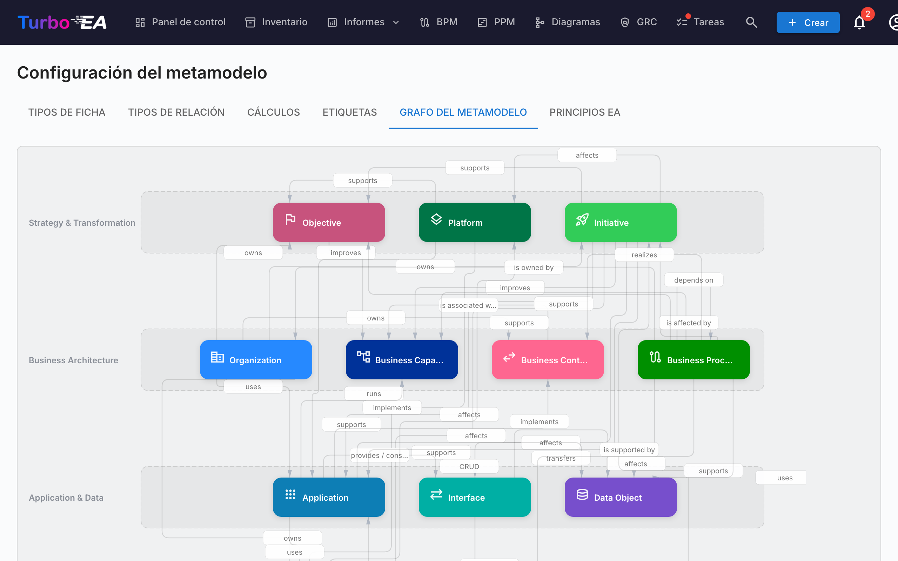

# Metamodelo

El **Metamodelo** define la estructura de datos completa de su plataforma — qué tipos de fichas existen, qué campos tienen, cómo se relacionan entre sí y cómo se organizan las páginas de detalle de fichas. Todo es **basado en datos**: usted configura el metamodelo a través de la interfaz de administración, no modificando código.

Navegue a **Administración > Metamodelo** para acceder al editor. Tiene siete pestañas: **Tipos de Fichas**, **Tipos de Relación**, **Cálculos**, **Etiquetas**, **Grafo del Metamodelo**, **Principios EA** y **Regulaciones de Cumplimiento**.

## Tipos de Fichas

La pestaña Tipos de Fichas lista todos los tipos en el sistema. Turbo EA incluye 14 tipos predefinidos en cuatro capas de arquitectura:

| Capa | Tipos |
|------|-------|
| **Estrategia y Transformación** | Objetivo, Plataforma, Iniciativa |
| **Arquitectura de Negocio** | Organización, Capacidad de Negocio, Contexto de Negocio, Proceso de Negocio |
| **Aplicación y Datos** | Aplicación, Interfaz, Objeto de Datos |
| **Arquitectura Técnica** | Componente TI, Categoría Tecnológica, Proveedor, Sistema |

### Crear un Tipo Personalizado

Haga clic en **+ Nuevo Tipo** para crear un tipo de ficha personalizado. Configure:

| Campo | Descripción |
|-------|-------------|
| **Clave** | Identificador único (minúsculas, sin espacios) — no se puede cambiar después de la creación |
| **Etiqueta** | Nombre para mostrar en la interfaz |
| **Icono** | Nombre del icono de Google Material Symbols |
| **Color** | Color de marca para el tipo (usado en inventario, informes y diagramas) |
| **Categoría** | Agrupación por capa de arquitectura |
| **Tiene Jerarquía** | Si las fichas de este tipo pueden tener relaciones padre/hijo |

### Editar un Tipo

Haga clic en cualquier tipo para abrir el **Panel de Detalle del Tipo**. Aquí puede configurar:

#### Color del tipo

Cada tipo de tarjeta — incluidos los integrados — tiene un color personalizable que se usa en el inventario, los informes, las vistas de dependencias y los diagramas. Esto permite alinear Turbo EA con las convenciones visuales de su organización (por ejemplo, paletas TOGAF/ArchiMate: elementos de negocio en amarillo/naranja, aplicaciones en azul).

- Elija un color con la muestra de color del panel. Aparece un aviso cuando el color elegido tiene muy poco contraste sobre fondos claros u oscuros.
- Los tipos integrados muestran un botón de **restablecer** junto a la muestra de color cuando el color difiere del predeterminado de Turbo EA, para poder volver siempre a la paleta estándar.
- El texto mostrado sobre los colores de tipo (chips, formas de diagrama) cambia automáticamente entre negro y blanco para mantener la legibilidad, tanto en modo claro como oscuro.
- El selector muestra una **vista previa en vivo** junto a la paleta: el nombre del tipo, el chip, el icono de la tarjeta, el subtipo, la píldora de ID de tarjeta y un nodo de la vista de dependencias, renderizados una vez en modo claro y otra en modo oscuro, actualizándose mientras elige.

#### Campos

Los campos definen los atributos personalizados disponibles en fichas de este tipo. Cada campo tiene:

| Configuración | Descripción |
|---------------|-------------|
| **Clave** | Identificador único del campo |
| **Etiqueta** | Nombre para mostrar |
| **Tipo** | texto, texto_multilínea, número, costo, booleano, fecha, url, selección_única o selección_múltiple |
| **Opciones** | Para campos de selección: las opciones disponibles con etiquetas y colores opcionales |
| **Requerido** | Si el campo debe completarse para la puntuación de calidad de datos |
| **Calidad de datos** | La contribución de cada campo a la puntuación se gestiona en el panel **Calidad de datos** (ver más abajo) |
| **Solo lectura** | Impide la edición manual (útil para campos calculados) |

Haga clic en **+ Agregar Campo** para crear un nuevo campo, o haga clic en un campo existente para editarlo en el **Diálogo Editor de Campos**.

#### Secciones

Los campos se organizan en **secciones** en la página de detalle de la ficha. Puede:

- Crear secciones con nombre para agrupar campos relacionados
- Configurar secciones con diseño de **1 columna** o **2 columnas**
- Organizar campos en **grupos** dentro de una sección (renderizados como sub-encabezados colapsables)
- Reordenar campos dentro de una sección arrastrándolos, y mover un campo a otra sección desde su acción **mover**

El nombre de sección especial `__description` agrega campos a la sección Descripción de la página de detalle.

#### ID de tarjeta

Active la **generación de ID de tarjeta** para asignar a las tarjetas de este tipo un ID estable y legible (por ejemplo `APP-00001`). El ID aparece como una etiqueta copiable junto al tipo de la tarjeta, como columna opcional (ordenable y filtrable) en el inventario, en las exportaciones a Excel y en las fórmulas de campos calculados (mediante `data.reference`).

El **número siempre se genera automáticamente**; solo controla el **prefijo**. Al activarlo, se muestra como texto un prefijo sugerido (derivado del nombre del tipo, p. ej. `APP-`) — haga clic en el lápiz para cambiarlo. Dos ajustes definen el número:

- **Empezar en** — el primer número de la serie (predeterminado `1`).
- **Dígitos mín.** — ancho del relleno con ceros (predeterminado `5`), de modo que `1` se muestra `00001`. Es un mínimo; los números se amplían al superarlo. Un **Ejemplo** muestra en vivo el primer ID.

Los ID son **únicos globalmente, de solo lectura y nunca se reutilizan ni cambian**. La secuencia numérica se lleva **por prefijo en todo el espacio de trabajo**, de modo que dos tipos que comparten prefijo forman una única serie continua y sin colisiones. Una vez que una tarjeta de este tipo tiene un ID, todo el formato — prefijo, inicio y dígitos mín. — se bloquea (los campos quedan de solo lectura); aún puede desactivar la generación. Guardar nunca asigna ID a las tarjetas existentes; use el botón dedicado **Generar ID** para completar el backlog bajo demanda (con barra de progreso y confirmación).

#### Puntuación de calidad de datos

La puntuación de **calidad de datos** de una tarjeta mide de forma ponderada cuán completa está. Cada factor que contribuye —cada campo y cinco factores integrados— se gestiona en un solo lugar: la pestaña **Calidad de datos** del editor del tipo de tarjeta. (El editor se organiza en pestañas: General, Relaciones, Roles de partes interesadas y Calidad de datos; las traducciones están disponibles desde el icono del encabezado.)

La importancia de cada factor se establece con un control deslizante simple de cuatro niveles, que también muestra el número subyacente:

- **Ignorar (0)**: excluido por completo de la puntuación.
- **Normal (1)**: cuenta una vez (predeterminado).
- **Importante (2)**: cuenta el doble.
- **Crítico (3)**: cuenta el triple.

El panel enumera los cinco **factores integrados** —**Descripción**, **Ciclo de vida** (si hay alguna fecha de ciclo de vida establecida), **Relaciones obligatorias** , **Etiquetas obligatorias** y **Roles de partes interesadas** (cada rol definido para el tipo se cumple cuando se le asigna una parte interesada)— seguidos de cada campo agrupado por su sección, todos con el mismo control deslizante. Por ejemplo, establezca el **Ciclo de vida** en *Ignorar* para un tipo cuyas tarjetas legítimamente nunca llevan fechas, para que no se penalicen.

Una barra de **composición de la puntuación** en la parte superior del panel muestra la proporción de cada factor en la puntuación máxima posible, para ver de un vistazo qué factores dominan. En el diseño de la tarjeta de la pestaña **Main**, cada campo —y las secciones integradas Descripción, Ciclo de vida y Relaciones— muestra una pequeña insignia con su nivel actual, para ver la ponderación sin salir de esa pestaña.

Cambiar cualquier importancia vuelve a puntuar inmediatamente todas las tarjetas existentes de ese tipo. Los campos nuevos son *Normal* de forma predeterminada, por lo que cuentan para la puntuación en cuanto los agrega.

#### Subtipos (Sub-plantillas)

Los subtipos actúan como **sub-plantillas** dentro de un tipo de ficha. Cada subtipo puede controlar qué campos son visibles para fichas de ese subtipo, mientras que todos los campos permanecen definidos a nivel del tipo de ficha.

Por ejemplo, el tipo Aplicación tiene subtipos: Aplicación de Negocio, Microservicio, Agente IA y Despliegue. Un administrador podría ocultar los campos relacionados con servidores para el subtipo SaaS, ya que no son relevantes.

**Configurar la visibilidad de campos por subtipo:**

1. Abra un tipo de ficha en la administración del metamodelo.
2. Haga clic en cualquier chip de subtipo para abrir el diálogo **Plantilla de subtipo**.
3. Active o desactive la visibilidad de los campos usando los interruptores — los campos desactivados se ocultarán para fichas de ese subtipo.
4. Los campos ocultos se excluyen de la puntuación de calidad de datos, de modo que los usuarios no son penalizados por campos que no pueden ver.

Cuando no se selecciona ningún subtipo en una ficha (o el tipo no tiene subtipos), todos los campos son visibles. Los campos ocultos conservan sus datos — si el subtipo de una ficha cambia, los valores previamente ocultos se mantienen.

#### Roles de Partes Interesadas

Defina roles personalizados para este tipo (ej., «Propietario de Aplicación», «Propietario Técnico»). Cada rol tiene **permisos a nivel de ficha** que se combinan con el rol a nivel de aplicación del usuario al acceder a una ficha. Ver [Usuarios y Roles](users.es.md) para más información sobre el modelo de permisos.

#### Traducciones

Haga clic en el botón **Traducir** en la barra de herramientas del cajón de tipo para abrir el **Diálogo de Traducciones**. Aquí puede proporcionar traducciones para todas las etiquetas del metamodelo en cada idioma soportado:

- **Etiqueta del tipo** — El nombre de visualización del tipo de ficha
- **Subtipos** — Etiquetas para cada subtipo
- **Secciones** — Encabezados de sección en la página de detalle de la ficha
- **Campos** — Etiquetas de campos y etiquetas de opciones de selección
- **Roles de Parte Interesada** — Nombres de roles mostrados en la interfaz de asignación de stakeholders

Las traducciones se almacenan junto con cada tipo de ficha y se resuelven en tiempo de renderizado según el idioma seleccionado por el usuario. Las etiquetas sin traducir recurren al valor predeterminado en inglés.

### Eliminar un Tipo

- Los **tipos predefinidos** se eliminan suavemente (se ocultan) y pueden restaurarse
- Los **tipos personalizados** se eliminan permanentemente

## Tipos de Relación

Los tipos de relación definen las conexiones permitidas entre tipos de fichas. Cada tipo de relación especifica:

| Campo | Descripción |
|-------|-------------|
| **Clave** | Identificador único |
| **Etiqueta** | Etiqueta de dirección directa (ej., «utiliza») |
| **Etiqueta Inversa** | Etiqueta de dirección inversa (ej., «es utilizado por») |
| **Tipo Origen** | El tipo de ficha en el lado «de» |
| **Tipo Destino** | El tipo de ficha en el lado «a» |
| **Cardinalidad** | n:m (muchos a muchos) o 1:n (uno a muchos) |

Haga clic en **+ Nuevo Tipo de Relación** para crear una relación, o haga clic en una existente para editar sus etiquetas y atributos.

### Atributos de relación

Algunas relaciones incluyen atributos adicionales que se establecen en cada enlace individual en lugar de en el tipo de relación. Por ejemplo, la relación integrada **Organización → Aplicación** («utiliza») tiene un atributo **Tipo de uso**: establézcalo en **Propietario**, **Usuario** o **Parte interesada** en cada enlace. Así puede modelar una aplicación *propiedad de* una organización y *utilizada por* otras mediante un único tipo de relación. El valor elegido aparece como una etiqueta de color en la sección **Relaciones** de la tarjeta; establézcalo al añadir la relación o más tarde mediante el icono de edición en la fila de la relación.

Solo puede existir un tipo de relación entre un par dado de tipos de tarjeta, así que utilice estos atributos para matizar el significado de un enlace en lugar de crear un segundo tipo de relación para el mismo origen y destino.

### Gestionar valores de relación

Haga clic en el icono **Gestionar valores de relación** (etiqueta) en una fila de relación para editar los valores de sus atributos de «tipo». Puede:

- **Añadir sus propios valores** a un selector existente, por ejemplo un nuevo Tipo de uso más allá de Propietario / Usuario / Parte interesada.
- **Añadir un selector de tipo completamente nuevo** a una relación que no tenga ninguno, mediante **Añadir tipo**, incluso en relaciones integradas.

Los valores integrados (Propietario, Usuario, Parte interesada, los valores de dirección del flujo…) están **bloqueados**: no se pueden renombrar, recolorear ni eliminar. No obstante, puede **ocultar** un valor integrado para que ya no aparezca en el selector de las fichas; un valor ya establecido permanece visible. Sus propios valores son totalmente editables y se pueden eliminar.

## Cálculos

Los campos calculados usan fórmulas definidas por el administrador para calcular automáticamente valores cuando se guardan fichas. Ver [Cálculos](calculations.es.md) para la guía completa.

## Etiquetas

Los grupos de etiquetas y etiquetas se pueden gestionar desde esta pestaña. Ver [Etiquetas](tags.es.md) para la guía completa.

## Principios EA

La pestaña **Principios EA** permite definir los principios de arquitectura que gobiernan el paisaje de TI de su organización. Estos principios sirven como barandillas estratégicas — por ejemplo, «Reutilizar antes de comprar antes de construir» o «Si compramos, compramos SaaS».

Cada principio tiene cuatro campos:

| Campo | Descripción |
|-------|-------------|
| **Título** | Un nombre conciso para el principio |
| **Enunciado** | Qué establece el principio |
| **Justificación** | Por qué este principio es importante |
| **Implicaciones** | Consecuencias prácticas de seguir el principio |

Los principios se pueden **activar** o **desactivar** individualmente mediante el interruptor en cada tarjeta.

### Importar desde el Catálogo de principios

Turbo EA incluye un **catálogo de referencia comisariado con 10 principios EA estándar del sector** para que no tenga que empezar desde una página en blanco. Abra el menú de avatar en la esquina superior derecha y seleccione **Catálogos de referencia → Catálogo de principios**. Desde ahí puede:

- Buscar y explorar los principios incluidos (título, descripción, justificación, implicaciones).
- Seleccionar varias entradas y pulsar **Importar** — los principios seleccionados aparecerán en la pestaña «Principios EA» como entradas estándar totalmente editables.
- Reimportar con seguridad: los principios que ya existen (identificados por su ID de catálogo estable) se omiten, incluso si los ha renombrado localmente. El catálogo muestra una insignia verde «Ya importado» para estas entradas.

Use el catálogo como punto de partida y luego adapte el título, el enunciado, la justificación y las implicaciones de cada principio a su organización.

### Cómo los principios influyen en los insights de IA

Cuando genera **Insights IA del portafolio** en el [Informe de portafolio](../guide/reports.md#ai-portfolio-insights), todos los principios activos se incluyen en el análisis. La IA evalúa los datos de su portafolio frente a cada principio e informa:

- Si el portafolio **se alinea** o **viola** el principio
- Puntos de datos específicos como evidencia
- Acciones correctivas recomendadas

Por ejemplo, un principio «Comprar SaaS» haría que la IA señale aplicaciones alojadas on-premise o en IaaS y sugiera prioridades de migración a la nube.

## Grafo del Metamodelo

La pestaña **Grafo del Metamodelo** muestra un diagrama SVG visual de todos los tipos de fichas y sus tipos de relación. Esta es una visualización de solo lectura que ayuda a comprender las conexiones en su metamodelo de un vistazo.

## Regulaciones de Cumplimiento

La pestaña **Regulaciones de Cumplimiento** gestiona los marcos regulatorios contra los que el [escáner de Cumplimiento de GRC](../guide/grc.md#compliance) ejecuta el análisis. Seis marcos vienen habilitados por defecto:

| Regulación | Alcance |
|------------|---------|
| **Ley de IA de la UE** | Requisitos para sistemas de IA / ML puestos en el mercado de la UE |
| **RGPD** | Reglamento General de Protección de Datos de la UE |
| **NIS2** | Directiva 2 de la UE sobre seguridad de redes y sistemas de información |
| **DORA** | Reglamento europeo de resiliencia operativa digital para entidades financieras |
| **SOC 2** | Criterios AICPA Service Organization Controls Trust Services |
| **ISO/IEC 27001** | Norma para sistemas de gestión de la seguridad de la información |

Para cada fila puede:

- **Habilitar / deshabilitar** la regulación con el interruptor — los marcos deshabilitados se omiten en cada análisis posterior y sus hallazgos se excluyen de los cuadros de mando. Los hallazgos existentes se conservan (no se eliminan) por si vuelve a habilitarla más tarde.
- **Editar** el título, la descripción del alcance y el contexto de prompt que se proporciona al LLM.
- **Añadir una regulación personalizada** con **+ Nueva Regulación** — por ejemplo HIPAA, políticas internas o marcos sectoriales. Las regulaciones personalizadas son de pleno derecho: aparecen en la pestaña por regulación, contribuyen a la puntuación global de cumplimiento y admiten las mismas acciones sobre hallazgos (reconocer, aceptar, promover a Riesgo).
- **Eliminar** una regulación personalizada — las regulaciones integradas no pueden eliminarse, solo deshabilitarse.

El escáner de cumplimiento y el flujo de promoción a Riesgo funcionan **incluso sin un proveedor de IA configurado** — la entrada manual de hallazgos, las transiciones de estado y la ruta de promoción a Riesgo siguen disponibles. La IA solo es necesaria cuando realmente dispara un nuevo análisis.

## Editor de Disposición de Fichas

Para cada tipo de ficha, la sección **Diseño** en el panel del tipo controla cómo se estructura la página de detalle:

- **Orden de secciones** — Arrastre secciones (Descripción, EOL, Ciclo de Vida, Jerarquía, Relaciones y secciones personalizadas) para reordenarlas
- **Visibilidad** — Oculte secciones que no sean relevantes para un tipo
- **Expansión predeterminada** — Elija si cada sección comienza expandida o colapsada
- **Diseño de columnas** — Configure 1 o 2 columnas por sección personalizada
- **Mover campos entre secciones** — Usar la acción **mover** de un campo (junto a sus botones de editar y eliminar) para reubicarlo en otra sección, conservando su configuración

## Recursos

La pestaña **Recursos** gestiona las dos listas que se ofrecen en la pestaña **Recursos** de cada tarjeta:

- **Tipos de enlace** — la categoría de un enlace de documento (p. ej. *Documentación*, *Contrato*, *Seguridad*). Cada tipo de enlace lleva además un **icono** que se muestra junto al enlace.
- **Categorías de archivo** — la categoría asignada a un archivo adjunto subido.

Para cada lista puede:

- **Añadir una entrada** — con una clave (un identificador en minúsculas almacenado en las tarjetas, fijo tras crearse), una etiqueta visible y — para los tipos de enlace — un icono.
- **Editar** la etiqueta, el icono, el orden y las traducciones por idioma de cualquier entrada, incluidas las integradas.
- **Activar / desactivar** una entrada con el interruptor — las entradas desactivadas desaparecen del selector, pero se conservan los valores existentes en las tarjetas.
- **Eliminar** una entrada personalizada — las entradas integradas no se pueden eliminar, solo desactivar.

Un tipo de enlace **Contrato** integrado viene activado por defecto. Ambas listas se incluyen en la **Transferencia de espacio de trabajo**, por lo que sus personalizaciones se clonan entre instancias.
