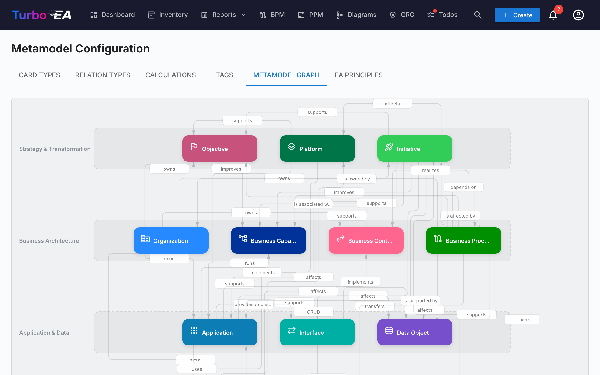

# Metamodel

The **Metamodel** defines your platform's entire data structure — what types of cards exist, what fields they have, how they relate to each other, and how card detail pages are laid out. Everything is **data-driven**: you configure the metamodel through the admin UI, not by changing code.

Navigate to **Admin > Metamodel** to access the metamodel editor. It has eight tabs: **Card Types**, **Relation Types**, **Calculations**, **Tags**, **Metamodel Graph**, **EA Principles**, **Compliance Regulations**, and **Resources**.

## Card Types

The Card Types tab lists all types in the system. Turbo EA ships with 14 built-in types across four architecture layers:

| Layer | Types |
|-------|-------|
| **Strategy & Transformation** | Objective, Platform, Initiative |
| **Business Architecture** | Organization, Business Capability, Business Context, Business Process |
| **Application & Data** | Application, Interface, Data Object |
| **Technical Architecture** | IT Component, Tech Category, Provider, System |

### Creating a Custom Type

Click **+ New Type** to create a custom card type. Configure:

| Field | Description |
|-------|-------------|
| **Key** | Unique identifier (lowercase, no spaces) — cannot be changed after creation |
| **Label** | Display name shown in the UI |
| **Icon** | Google Material Symbol icon name |
| **Color** | Brand color for the type (used in inventory, reports, and diagrams) |
| **Category** | Architecture layer grouping |
| **Has Hierarchy** | Whether cards of this type can have parent/child relationships |

### Editing a Type

Click any type to open the **Type Detail Drawer**. Here you can configure:

#### Type Color

Every card type — including the built-in ones — has a customizable color used across the inventory, reports, dependency views, and diagrams. This lets you align Turbo EA with your organization's visual conventions (for example TOGAF/ArchiMate palettes: business elements in yellow/orange, applications in blue).

- Pick a color with the color swatch in the drawer. A hint appears when the chosen color has very low contrast against light or dark backgrounds.
- Built-in types show a **reset** button next to the color swatch whenever the color differs from the Turbo EA default, so you can always return to the standard palette.
- Text rendered on top of type colors (chips, diagram shapes) automatically switches between black and white for readability, in both light and dark mode.
- The picker shows a **live preview** beside the palette: the type name, chip, card icon, subtype, card ID pill, and a dependency-view node, rendered once for the light theme and once for the dark theme, updating as you pick.

#### Fields

Fields define the custom attributes available on cards of this type. Each field has:

| Setting | Description |
|---------|-------------|
| **Key** | Unique field identifier |
| **Label** | Display name |
| **Type** | text, multiline_text, number, cost, boolean, date, url, single_select, or multiple_select |
| **Options** | For select fields: the available choices with labels and optional colors |
| **Required** | Whether the field must be filled for data quality scoring |
| **Data quality** | Each field's contribution to the score is managed in the **Data quality** panel — see [Data quality scoring](#data-quality-scoring) below |
| **Read-only** | Prevents manual editing (useful for calculated fields) |

Click **+ Add Field** to create a new field, or click an existing field to edit it in the **Field Editor Dialog**.

#### Sections

Fields are organized into **sections** on the card detail page. You can:

- Create named sections to group related fields
- Set sections to **1-column** or **2-column** layout
- Organize fields into **groups** within a section (rendered as collapsible sub-headers)
- Reorder fields within a section by dragging, and move a field to a different section from its **move** action

The special section name `__description` adds fields to the Description section of the card detail page.

#### Card ID

Toggle **Card ID generation** on to give cards of this type a stable, human-readable ID (for example `APP-00001`). The ID shows as a copy-to-clipboard pill next to the card's type on the detail page, as an optional sortable/filterable column in the inventory, in Excel exports, and in calculated-field formulas (via `data.reference`).

The **number is always generated automatically**; you only control the **prefix**. When you turn the toggle on, a suggested prefix (derived from the type name, e.g. `APP-`) is shown as text — click the pencil to change it. Two settings tune the number:

- **Start at** — the first number in the series (default `1`).
- **Min digits** — zero-padding width (default `5`), so `1` renders as `00001`. It's a minimum; numbers widen once they exceed it. A live **Example** shows the first ID as you type.

IDs are **globally unique, read-only, and never reused or changed** once assigned. The number sequence is tracked **per prefix across the whole workspace**, so two card types that share a prefix form one continuous, collision-free series. **Once any card of the type has an ID, the whole format — prefix, start, and min digits — is locked** (the fields become read-only), so existing IDs can never drift; you can still turn generation off.

**Saving the type never assigns IDs to existing cards** — that bulk action is deliberately separate. New cards get their ID automatically on creation; to fill the existing backlog, use the dedicated **Generate IDs** button in the ID section (it shows how many cards still need one, runs on demand with a progress bar, and confirms when done). It is fill-only and idempotent — it only assigns IDs to cards that don't have one yet, never rewriting an existing ID.

#### Data quality scoring

A card's **data quality** score is a weighted measure of how complete it is. Every contributing factor — each field plus five built-in factors — is managed in one place: the **Data quality** tab of the card-type editor. (The editor is organised into tabs — Main, Relations, Stakeholder roles, and Data quality — with translations available from the icon in the header.)

Each factor has an importance set with a simple slider across four tiers, which also shows the underlying number:

- **Ignore (0)** — excluded from the score entirely.
- **Normal (1)** — counts once (the default).
- **Important (2)** — counts twice as much.
- **Critical (3)** — counts three times as much.

The panel lists the five **built-in factors** — **Description**, **Lifecycle** (whether any lifecycle date is set), **mandatory Relations**, **mandatory Tags**, and **Stakeholder roles** (each role defined for the type is satisfied once a stakeholder is assigned to it) — followed by every field grouped by its section, each with the same slider. For example, set **Lifecycle** to *Ignore* for a type whose cards legitimately never carry dates, so they are not penalized.

A **score composition** bar at the top of the tab shows each factor's share of the maximum possible score, so you can see at a glance which factors dominate. In the **Main** tab's card layout, each field — and the built-in Description, Lifecycle and Relations sections — shows a small badge with its current tier number, so you can see the weighting without leaving that tab.

Changing any importance immediately re-scores every existing card of that type. New fields default to *Normal*, so they count toward the score as soon as you add them.

#### Subtypes (Sub-Templates)

Subtypes act as **sub-templates** within a card type. Each subtype can control which fields are visible for cards of that subtype, while all fields remain defined at the card type level.

For example, the Application type has subtypes: Business Application, Microservice, AI Agent, and Deployment. An admin might hide server-related fields for the SaaS subtype since they are not relevant.

**Configuring field visibility per subtype:**

1. Open a card type in the metamodel admin.
2. Click on any subtype chip to open the **Subtype Template** dialog.
3. Toggle field visibility using the switches — fields turned off will be hidden for cards of that subtype.
4. Hidden fields are excluded from the data quality score, so users are not penalized for fields they cannot see.

When no subtype is selected on a card (or the type has no subtypes), all fields are visible. Hidden fields preserve their data — if a card's subtype changes, previously hidden values are retained.

#### Stakeholder Roles

Define custom roles for this type (e.g., "Application Owner", "Technical Owner"). Each role carries **card-level permissions** that are combined with the user's app-level role when accessing a card. See [Users & Roles](users.md) for more on the permission model.

#### Translations

Click the **Translate** button in the type drawer toolbar to open the **Translation Dialog**. Here you can provide translations for all metamodel labels in each supported language:

- **Type label** — The display name of the card type
- **Subtypes** — Labels for each subtype
- **Sections** — Section headings on the card detail page
- **Fields** — Field labels and select option labels
- **Stakeholder Roles** — Role names displayed in the stakeholder assignment UI

Translations are stored alongside each card type and are resolved at render time using the user's selected locale. Untranslated labels fall back to the English default.

### Deleting a Type

- **Built-in types** are soft-deleted (hidden) and can be restored
- **Custom types** are permanently deleted

## Relation Types

Relation types define the allowed connections between card types. Each relation type specifies:

| Field | Description |
|-------|-------------|
| **Key** | Unique identifier |
| **Label** | Forward direction label (e.g., "uses") |
| **Reverse Label** | Backward direction label (e.g., "is used by") |
| **Source Type** | The card type on the "from" side |
| **Target Type** | The card type on the "to" side |
| **Cardinality** | n:m (many-to-many) or 1:n (one-to-many) |

Click **+ New Relation Type** to create a relation, or click an existing one to edit its labels and attributes.

### Relation attributes

Some relations carry extra attributes that you set on each individual link rather than on the relation type. For example, the built-in **Organization → Application** relation ("uses") has a **Usage Type** attribute — set it to **Owner**, **User**, or **Stakeholder** on each link. This lets you model an application that is *owned by* one Organization and *used by* others through a single relation type. The chosen value appears as a coloured chip in the card's **Relations** section; set it when adding the relation, or later via the edit icon on the relation row.

Only one relation type can exist between a given pair of card types, so use these attributes to qualify the meaning of a link rather than creating a second relation type for the same source and target.

### Managing relation values

Click the **Manage relation values** (tag) icon on any relation row to edit the values of its "type" attributes. You can:

- **Add your own values** to an existing picker — for example, a new Usage Type beyond Owner / User / Stakeholder.
- **Add a brand-new type picker** to a relation that has none, using **Add type**, including on built-in relations.

Built-in values (Owner, User, Stakeholder, the flow-direction values, …) are **locked**: they cannot be renamed, recoloured, or deleted. You can, however, **hide** a built-in value so it no longer appears in the picker on cards — an already-set value stays visible. Your own custom values are fully editable and can be removed.

## Calculations

Calculated fields use admin-defined formulas to automatically compute values when cards are saved. See [Calculations](calculations.md) for the full guide.

## Tags

Tag groups and tags can be managed from this tab. See [Tags](tags.md) for the full guide.

## EA Principles

The **EA Principles** tab lets you define the architecture principles that govern your organisation's IT landscape. These principles serve as strategic guardrails — for example, "Reuse before Buy before Build" or "If we Buy, we Buy SaaS".

Each principle has four fields:

| Field | Description |
|-------|-------------|
| **Title** | A concise name for the principle |
| **Statement** | What the principle states |
| **Rationale** | Why this principle is important |
| **Implications** | Practical consequences of following the principle |

Principles can be **activated** or **deactivated** individually using the toggle switch on each card.

### Importing from the Principles Catalogue

Turbo EA ships a **curated reference catalogue of 10 industry-standard EA principles** so you don't have to start from a blank page. Open the avatar menu in the top-right corner and pick **Reference Catalogues → Principles Catalogue**. From there you can:

- Search and browse the bundled principles (title, description, rationale, implications).
- Multi-select the entries you want and click **Import** — selected principles land in the EA Principles tab as standard, fully-editable rows.
- Re-import safely: principles that already exist (matched by their stable catalogue ID) are skipped, even if you've renamed them locally. The catalogue shows a green "Already imported" badge for these.

Use the catalogue as a starting point and then tailor each principle's title, statement, rationale, and implications to your organisation.

### How Principles Influence AI Insights

When you generate **AI Portfolio Insights** on the [Portfolio Report](../guide/reports.md#ai-portfolio-insights), all active principles are included in the analysis. The AI evaluates your portfolio data against each principle and reports:

- Whether the portfolio **aligns with** or **violates** the principle
- Specific data points as evidence
- Recommended corrective actions

For example, a "Buy SaaS" principle would cause the AI to flag on-premise or IaaS-hosted applications and suggest cloud migration priorities.

## Metamodel Graph

The **Metamodel Graph** tab shows a visual SVG diagram of all card types and their relation types. This is a read-only visualization that helps you understand the connections in your metamodel at a glance.

## Compliance Regulations

The **Compliance Regulations** tab manages the regulatory frameworks that the [GRC → Compliance scanner](../guide/grc.md#compliance) runs against. Six frameworks ship enabled by default:

| Regulation | Scope |
|------------|-------|
| **EU AI Act** | Requirements for AI / ML systems placed on the EU market |
| **GDPR** | EU General Data Protection Regulation |
| **NIS2** | EU Network and Information Security Directive 2 |
| **DORA** | EU Digital Operational Resilience Act for financial entities |
| **SOC 2** | AICPA Service Organization Controls Trust Services Criteria |
| **ISO/IEC 27001** | Information security management system standard |

For each row you can:

- **Enable / disable** the regulation with the toggle — disabled frameworks are skipped on every subsequent scan and their findings are excluded from the dashboards. Existing findings are preserved (not deleted) in case you re-enable later.
- **Edit** the title, scope description and prompt context used by the LLM.
- **Add a custom regulation** with **+ New Regulation** — for example, HIPAA, internal policies, or sector-specific frameworks. Custom regulations are first-class: they appear in the per-regulation tab, contribute to the overall compliance score, and support all the same finding actions (acknowledge, accept, promote to Risk).
- **Delete** a custom regulation — built-in regulations cannot be deleted, only disabled.

The compliance scanner and risk-promotion flow work **even when no AI provider is configured** — manual finding entry, status transitions and the promotion-to-Risk path all stay available. AI is only required when you actually trigger a new scan.

## Resources

The **Resources** tab manages the two lists offered on every card's **Resources** tab:

- **Link types** — the category of a document link (e.g. *Documentation*, *Contract*, *Security*). Each link type also carries an **icon** shown next to the link.
- **File categories** — the category assigned to an uploaded file attachment.

For each list you can:

- **Add an entry** — give it a key (a lowercase identifier stored on cards, fixed once created), a display label, and — for link types — an icon.
- **Edit** the label, icon, sort order, and per-language translations of any entry, including the built-in ones.
- **Enable / disable** an entry with the toggle — disabled entries disappear from the picker but existing values on cards are preserved.
- **Delete** a custom entry — built-in entries cannot be deleted, only disabled.

A built-in **Contract** link type ships enabled by default. Both lists are included in **Workspace Transfer**, so your customisations clone between instances.

## Card Layout Editor

For each card type, the **Layout** section in the type drawer controls how the card detail page is structured:

- **Section order** — Drag sections (Description, EOL, Lifecycle, Hierarchy, Relations, and custom sections) to reorder them
- **Visibility** — Hide sections that are not relevant for a type
- **Default expansion** — Choose whether each section starts expanded or collapsed
- **Column layout** — Set 1 or 2 columns per custom section
- **Move fields between sections** — Use a field's **move** action (next to its edit and delete buttons) to relocate it to another section, keeping its configuration
