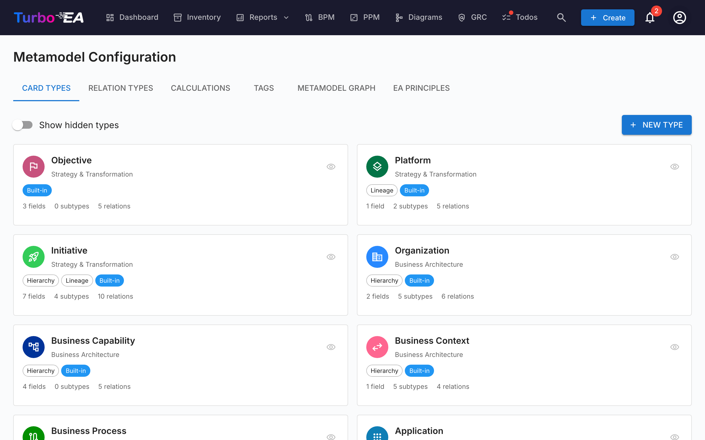

# 元模型

**元模型**定义了平台的整个数据结构 —— 存在哪些卡片类型、它们有哪些字段、它们如何相互关联以及卡片详情页面的布局方式。一切都是**数据驱动的**：您通过管理 UI 配置元模型，而不是更改代码。

导航到**管理 > 元模型**访问元模型编辑器。它有六个标签页：**卡片类型**、**关系类型**、**计算**、**标签**、**EA原则**和**元模型图**。

## 卡片类型

卡片类型标签页列出系统中的所有类型。Turbo EA 内置 14 种类型，分布在四个架构层：

| 层 | 类型 |
|----|------|
| **战略与转型** | 目标、平台、项目 |
| **业务架构** | 组织、业务能力、业务上下文、业务流程 |
| **应用与数据** | 应用程序、接口、数据对象 |
| **技术架构** | IT 组件、技术类别、供应商、系统 |

### 创建自定义类型

点击 **+ 新建类型**创建自定义卡片类型。配置：

| 字段 | 描述 |
|------|------|
| **键** | 唯一标识符（小写，无空格）—— 创建后不可更改 |
| **标签** | 在 UI 中显示的名称 |
| **图标** | Google Material Symbol 图标名称 |
| **颜色** | 类型的品牌颜色（用于清单、报告和图表） |
| **类别** | 架构层分组 |
| **支持层级** | 此类型的卡片是否可以有父子关系 |

### 编辑类型

点击任何类型打开**类型详情面板**。在这里您可以配置：

#### 字段

字段定义此类型卡片上可用的自定义属性。每个字段具有：

| 设置 | 描述 |
|------|------|
| **键** | 唯一的字段标识符 |
| **标签** | 显示名称 |
| **类型** | text、number、cost、boolean、date、url、single_select 或 multiple_select |
| **选项** | 对于选择字段：可用的选项及其标签和可选颜色 |
| **必填** | 字段是否必须填写（用于数据质量评分） |
| **权重** | 此字段对数据质量评分的贡献程度（0-10） |
| **只读** | 禁止手动编辑（适用于计算字段） |

点击 **+ 添加字段**创建新字段，或点击现有字段在**字段编辑器对话框**中编辑。

#### 分区

字段在卡片详情页面上按**分区**组织。您可以：

- 创建命名分区来分组相关字段
- 将分区设置为 **1 列**或 **2 列**布局
- 在分区内将字段组织为**组**（渲染为可折叠的子标题）
- 在分区之间拖拽字段并重新排序

特殊分区名称 `__description` 将字段添加到卡片详情页面的描述分区。

#### 子类型

子类型在类型内提供次级分类。例如，应用程序类型有子类型：业务应用、微服务、AI 代理和部署。每个子类型可以有翻译标签。

#### 干系人角色

为此类型定义自定义角色（例如「应用所有者」、「技术所有者」）。每个角色携带**卡片级权限**，在访问卡片时与用户的应用级角色组合。有关权限模型的更多信息，请参阅[用户与角色](users.md)。

### 删除类型

- **内置类型**被软删除（隐藏），可以恢复
- **自定义类型**被永久删除

## 关系类型

关系类型定义卡片类型之间允许的连接。每个关系类型指定：

| 字段 | 描述 |
|------|------|
| **键** | 唯一标识符 |
| **标签** | 正向标签（例如「使用」） |
| **反向标签** | 反向标签（例如「被使用」） |
| **源类型** | 「起始」侧的卡片类型 |
| **目标类型** | 「目标」侧的卡片类型 |
| **基数** | n:m（多对多）或 1:n（一对多） |

点击 **+ 新建关系类型**创建关系，或点击现有关系编辑其标签和属性。

## 计算

计算字段使用管理员定义的公式在卡片保存时自动计算值。请参阅[计算](calculations.md)获取完整指南。

## 标签

标签组和标签可以从此标签页管理。请参阅[标签](tags.md)获取完整指南。

## EA原则

**EA原则**选项卡允许您定义管理组织IT环境的架构原则。这些原则作为战略护栏——例如「复用优先于购买优先于构建」或「如果购买，我们购买SaaS」。

每个原则有四个字段：

| 字段 | 描述 |
|------|------|
| **标题** | 原则的简洁名称 |
| **声明** | 原则阐述的内容 |
| **理由** | 为什么该原则很重要 |
| **影响** | 遵循该原则的实际后果 |

可以通过每张卡片上的切换开关单独**启用**或**停用**原则。

### 原则如何影响AI洞察

当您在[投资组合报告](../guide/reports.md#ai-portfolio-insights)中生成**AI投资组合洞察**时，所有活跃的原则都会被纳入分析。AI会根据每个原则评估您的投资组合数据并报告：

- 投资组合是否**符合**或**违反**该原则
- 具体的数据点作为证据
- 建议的纠正措施

例如，「购买SaaS」原则会导致AI标记本地部署或IaaS托管的应用程序，并建议云迁移优先级。

## 元模型图

**元模型图**标签页显示所有卡片类型及其关系类型的可视化 SVG 图表。这是一个只读可视化，帮助您一目了然地理解元模型中的连接。

## 卡片布局编辑器

对于每种卡片类型，类型面板中的**布局**部分控制卡片详情页面的结构：

- **分区顺序** —— 拖动分区（描述、EOL、生命周期、层级、关系和自定义分区）重新排序
- **可见性** —— 隐藏与某种类型无关的分区
- **默认展开** —— 选择每个分区是否默认展开或折叠
- **列布局** —— 为每个自定义分区设置 1 列或 2 列
