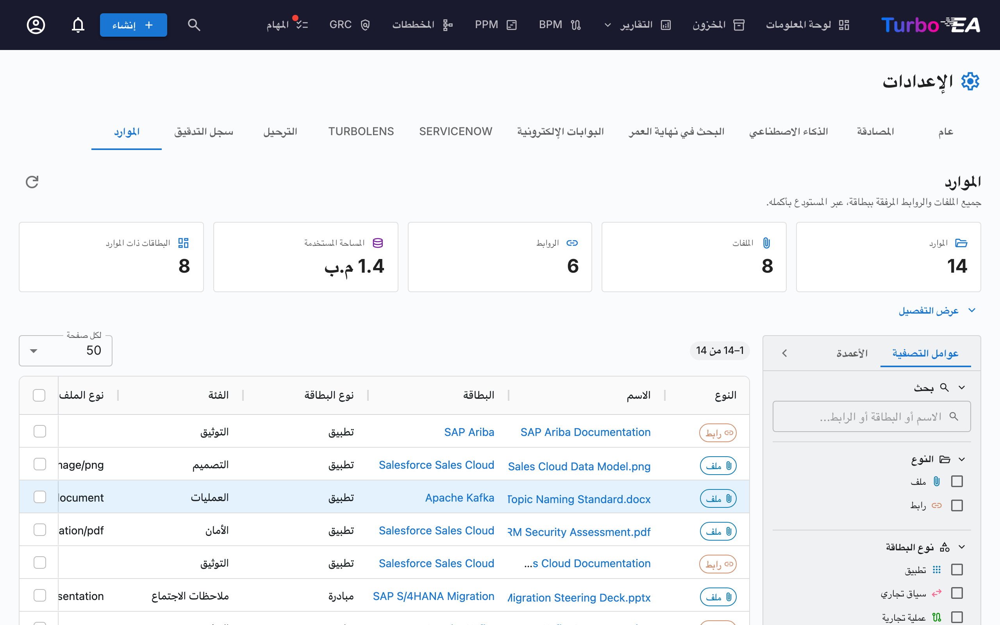

# الموارد

تبويب **الموارد** (**Admin → Settings → Resources**، `/admin/settings?tab=resources`) هو العرض الشامل على مستوى المستودع لكل ملف ورابط مرفق ببطاقة.

تُضاف الموارد وتُدار عادةً بطاقةً بطاقة، من تبويب **الموارد** الخاص بالبطاقة نفسها. وهذا يجعل أعمال الصيانة صعبة: لا توجد طريقة لرؤية كل شيء دفعة واحدة، ولا لمعرفة حجم المساحة التي تستهلكها المرفقات، ولا للتنظيف بالجملة. تجيب هذه الصفحة عن تلك الأسئلة من جدول واحد.

## ما الذي تغطّيه

نوعان من الموارد، يُعرضان جنبًا إلى جنب ويُميَّزان بعمود **النوع**:

| النوع | من أين يأتي | ما يحمله |
|-------|-------------|----------|
| **ملف** | ملف مرفوع إلى بطاقة (PDF، DOCX، XLSX، PPTX، PNG، JPG، SVG، TXT) | نوع الملف، الحجم، فئة الملف |
| **رابط** | رابط URL مُضاف إلى بطاقة | الرابط، نوع الرابط |

تظهر أيضًا قرارات البنية والمخططات وروابط ServiceNow في تبويب الموارد الخاص بالبطاقة، لكنها **غير** مدرجة هنا — إذ إن لكل منها صفحته الخاصة على مستوى المستودع (**EA Delivery → Decisions** و**Diagrams** و**Admin → Settings → ServiceNow**).

## الإحصاءات

تلخّص البطاقات الموجودة أعلى الجدول مجموعة النتائج الحالية:

| البطاقة | المعنى |
|---------|--------|
| **الموارد** | الملفات مضافًا إليها الروابط |
| **الملفات** | الملفات المرفقة المرفوعة |
| **الروابط** | روابط المستندات |
| **المساحة المستخدمة** | الحجم الإجمالي للملفات المرفقة — تُخزَّن الملفات في قاعدة البيانات، لذا فهذا نموّ فعلي في قاعدة البيانات |
| **البطاقات ذات الموارد** | عدد البطاقات المتمايزة التي ترتبط بها هذه الموارد |

يوسّع زر **عرض التفصيل** ثلاثة جداول: الموارد حسب الفئة / نوع الرابط، والموارد حسب نوع البطاقة، وأكبر عشرة ملفات (يمكن تنزيل كل منها مباشرةً من القائمة).

!!! note "الأرقام تتبع عوامل التصفية لديك"
    تصف البطاقات والتفصيل ما تحدّده عوامل التصفية حاليًا، لا مساحة العمل بأكملها. وتظهر شارة **مُصفّى** كلما كان أحد عوامل التصفية نشطًا؛ حتى لا تُفهم الأرقام على أنها إجماليات المستودع.

## التصفية والبحث

يعكس الشريط الجانبي الأيسر جدول المخزون. تجري كل عمليات التصفية والفرز والتقسيم إلى صفحات على الخادم، لذا فهي تنطبق على المستودع بأكمله لا على الصفحة المعروضة على الشاشة.

| عامل التصفية | ملاحظات |
|--------------|---------|
| **بحث** | يطابق اسم المورد واسم البطاقة و(بالنسبة إلى الروابط) الرابط |
| **النوع** | الملفات أو الروابط أو كلاهما |
| **نوع البطاقة** | أي نوع بطاقة من نموذجك الفوقي |
| **الفئة / نوع الرابط** | فئات الملفات وأنواع الروابط المعرّفة ضمن **Admin → Metamodel → Resource Types** |
| **نوع الملف** | نوع MIME للملف المرفوع — للملفات فقط |
| **البطاقة** | التضييق إلى بطاقة واحدة |
| **أضافه** | المستخدم الذي رفع الملف أو أضاف الرابط |
| **البطاقات المؤرشفة** | **الكل** (الافتراضي)، أو **نشطة** فقط، أو **مؤرشفة** فقط |
| **تاريخ الإضافة** | نطاق شامل من/إلى |

يعرض تبويب **الأعمدة** في الشريط الجانبي أعمدة الجدول أو يخفيها. ويحتفظ متصفحك بعوامل التصفية واختيارات الأعمدة وعرض الشريط الجانبي وحجم الصفحة.

!!! tip "البطاقات المؤرشفة مُدرجة افتراضيًا"
    لا تؤدي أرشفة بطاقة إلى حذف مواردها، وتظل ملفاتها تشغل مساحة في قاعدة البيانات. ولذلك تُدرج افتراضيًا — وإلا لكانت **المساحة المستخدمة** أقل من الاستهلاك الفعلي. وتحمل الصفوف الخاصة ببطاقة مؤرشفة شارة **مؤرشف**.

## التعامل مع الموارد

- **تنزيل ملف** — انقر على اسمه، أو استخدم زر التنزيل في عمود الإجراءات.
- **فتح رابط** — انقر على اسمه لفتح الرابط في تبويب جديد.
- **الانتقال إلى البطاقة** — انقر على اسم البطاقة لفتحها على تبويب الموارد الخاص بها.
- **حذف مورد واحد** — زر الحذف في عمود الإجراءات، مع رسالة تأكيد.
- **حذف عدة موارد** — حدّد الصفوف، ثم اختر **حذف المحدد** في شريط التحديد الأزرق. ويوضّح التأكيد عدد الموارد التي ستُحذف ومقدار المساحة التي سيحرّرها ذلك.

!!! warning "الحذف نهائي"
    على عكس أرشفة بطاقة، لا يمكن التراجع عن حذف مورد — إذ تُزال بايتات الملف من قاعدة البيانات. ويُسجَّل كل حذف في تبويب **السجل** للبطاقة المعنية، فيمكنك دائمًا معرفة ما حُذف ومن حذفه؛ غير أن المحتوى نفسه يكون قد زال.

## الأذونات

تعيد الصفحة استخدام الأذونات نفسها المستخدمة في تبويب الموارد الخاص بالبطاقة — فهي لا تكشف أي بيانات ولا تتيح أي إجراء لم يكن ممكنًا أصلًا بطاقةً بطاقة.

| الإجراء | يتطلّب |
|---------|--------|
| الوصول إلى التبويب | `admin.settings` (فهو موجود ضمن Admin → Settings) |
| عرض القائمة والإحصاءات والتنزيل | `documents.view` |
| الحذف، فرديًا أو بالجملة | `documents.manage`، **أو** إذن مستوى البطاقة `card.manage_documents` على تلك البطاقة تحديدًا |

يُتحقَّق من الحذف بالجملة **لكل صف على حدة**. فإذا تضمّن تحديدك موارد على بطاقات لا يحقّ لك إدارتها، تُتخطّى تلك الصفوف بدلًا من إخفاق العملية بأكملها، ويسرد تحذيرٌ أيها بالضبط ولماذا.

## عند تعطيل رفع الملفات

إن إيقاف **رفع الملفات** ضمن **Admin → Settings → General** يمنع عمليات الرفع الجديدة فحسب. أما الملفات الموجودة فتظل مدرجة هنا وقابلة للتنزيل والحذف، بحيث يمكنك مواصلة التدقيق والتنظيف. وتظهر لافتة معلوماتية على الصفحة ما دام المفتاح مُوقفًا.

## روابط ذات صلة

- [الإعدادات](settings.md) — المفتاح الذي يُفعّل رفع الملفات أو يعطّله
- [النموذج الفوقي](metamodel.md) — حيث تُعرَّف فئات الملفات وأنواع الروابط
- [المستخدمون والأدوار](users.md) — حيث يُمنح `documents.view` و`documents.manage`
