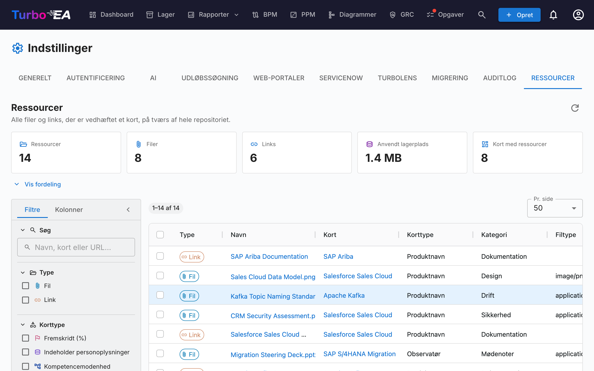

# Ressourcer

Fanebladet **Ressourcer** (**Admin → Indstillinger → Ressourcer**, `/admin/settings?tab=resources`) er den repositorie-brede oversigt over hver eneste fil og hvert eneste link, der er vedhæftet et kort.

Ressourcer tilføjes og administreres normalt ét kort ad gangen fra kortets eget faneblad **Ressourcer**. Det gør oprydning besværligt: der er ingen måde at se det hele på én gang, finde ud af hvor meget lagerplads vedhæftningerne bruger, eller rydde op i massevis. Denne side besvarer de spørgsmål fra ét enkelt gitter.

## Hvad den dækker

To slags ressourcer, vist side om side og adskilt af kolonnen **Type**:

| Type | Hvor den kommer fra | Bærer |
|------|---------------------|-------|
| **Fil** | En fil uploadet til et kort (PDF, DOCX, XLSX, PPTX, PNG, JPG, SVG, TXT) | Filtype, størrelse, filkategori |
| **Link** | En URL tilføjet til et kort | URL, linktype |

Arkitekturbeslutninger, diagrammer og ServiceNow-links optræder også på et korts Ressourcer-faneblad, men de er **ikke** vist her — hver af dem har allerede sin egen repositorie-brede side (**EA-levering → Arkitekturbeslutninger**, **Diagrammer** og **Admin → Indstillinger → ServiceNow**).

## Statistik

Felterne over gitteret opsummerer det aktuelle resultatsæt:

| Felt | Betydning |
|------|-----------|
| **Ressourcer** | Filer plus links |
| **Filer** | Uploadede filvedhæftninger |
| **Links** | URL-dokumentlinks |
| **Anvendt lagerplads** | Den samlede størrelse af filvedhæftningerne — filer gemmes i databasen, så dette er reel databasevækst |
| **Kort med ressourcer** | Hvor mange forskellige kort ressourcerne hænger på |

**Vis fordeling** udfolder tre tabeller: ressourcer pr. kategori / linktype, ressourcer pr. korttype og de ti største filer (hver enkelt kan downloades direkte fra listen).

!!! note "Tallene følger dine filtre"
    Felterne og fordelingen beskriver det, filtrene aktuelt udvælger, ikke hele arbejdsområdet. En **Filtreret**-chip vises, så snart et filter er aktivt, så tallene aldrig forveksles med totaler for hele repositoriet.

## Filtrering og søgning

Sidepanelet til venstre afspejler Lager-gitteret. Al filtrering, sortering og sideinddeling sker på serveren, så det gælder hele repositoriet og ikke kun den side, der er på skærmen.

| Filter | Bemærkninger |
|--------|--------------|
| **Søg** | Matcher ressourcens navn, kortets navn og (for links) URL'en |
| **Type** | Filer, links eller begge dele |
| **Korttype** | Alle korttyper fra din metamodel |
| **Kategori / linktype** | De filkategorier og linktyper, der er defineret under **Admin → Metamodel → Ressourcetyper** |
| **Filtype** | MIME-typen for en uploadet fil — kun filer |
| **Kort** | Indsnævr til ét enkelt kort |
| **Tilføjet af** | Den bruger, der uploadede filen eller tilføjede linket |
| **Arkiverede kort** | **Alle** (standard), kun **Aktive** eller kun **Arkiverede** |
| **Tilføjelsesdato** | Et inklusivt fra/til-interval |

Sidepanelets faneblad **Kolonner** viser og skjuler kolonner i gitteret. Dine filtre, kolonnevalg, sidepanelets bredde og sidestørrelsen huskes i din browser.

!!! tip "Arkiverede kort er inkluderet som standard"
    Arkivering af et kort sletter ikke dets ressourcer, og deres filer optager fortsat lagerplads i databasen. De vises derfor som standard — ellers ville **Anvendt lagerplads** undervurdere det reelle forbrug. Rækker på et arkiveret kort bærer en **Arkiveret**-chip.

## Arbejde med ressourcer

- **Download en fil** — klik på dens navn, eller brug download-knappen i Handlinger-kolonnen.
- **Åbn et link** — klik på dets navn for at åbne URL'en i et nyt faneblad.
- **Gå til kortet** — klik på kortets navn for at åbne det på dets Ressourcer-faneblad.
- **Slet én ressource** — slet-knappen i Handlinger-kolonnen, med en bekræftelse.
- **Slet flere** — sæt flueben ved rækkerne, og vælg derefter **Slet valgte** i den blå markeringslinje. Bekræftelsen viser, hvor mange ressourcer der forsvinder, og hvor meget lagerplads det frigør.

!!! warning "Sletning er permanent"
    I modsætning til arkivering af et kort kan sletning af en ressource ikke fortrydes — filens bytes fjernes fra databasen. Hver sletning registreres på det berørte korts **Historik**-faneblad, så du altid kan se, hvad der blev fjernet og af hvem, men selve indholdet er væk.

## Tilladelser

Siden genbruger de samme tilladelser som et korts Ressourcer-faneblad — den blotlægger ingen data og tillader ingen handling, der ikke allerede var mulig ét kort ad gangen.

| Handling | Kræver |
|----------|--------|
| Nå frem til fanebladet | `admin.settings` (det ligger inde under Admin → Indstillinger) |
| Se listen og statistikken samt downloade | `documents.view` |
| Slette, enkeltvis eller i massevis | `documents.manage`, **eller** kortniveau-tilladelsen `card.manage_documents` på netop det kort |

Massesletning kontrolleres **pr. række**. Hvis din markering omfatter ressourcer på kort, du ikke må administrere, springes disse rækker over i stedet for at få hele handlingen til at fejle, og en advarsel angiver præcis hvilke og hvorfor.

## Når filupload er deaktiveret

At slå **Filupload** fra under **Admin → Indstillinger → Generelt** blokerer kun nye uploads. Eksisterende filer vises fortsat her og kan stadig downloades og slettes, så du kan blive ved med at revidere og rydde op. Et informationsbanner vises på siden, mens kontakten er slået fra.

## Se også

- [Indstillinger](settings.md) — kontakten, der aktiverer eller deaktiverer filupload
- [Metamodel](metamodel.md) — hvor filkategorier og linktyper defineres
- [Brugere og roller](users.md) — hvor `documents.view` og `documents.manage` tildeles
