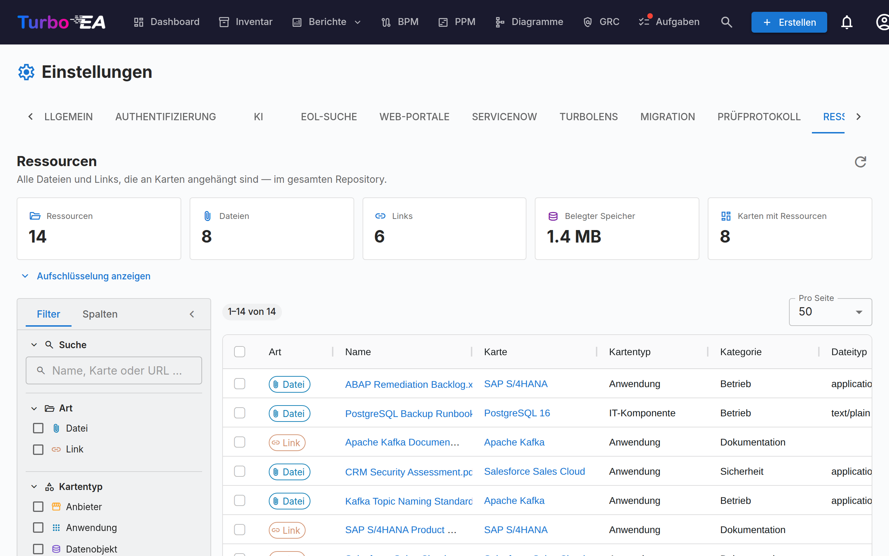

# Ressourcen

Der Reiter **Ressourcen** (**Admin → Einstellungen → Ressourcen**, `/admin/settings?tab=resources`) ist die repository-weite Ansicht aller Dateien und Links, die an eine Karte angehängt sind.

Ressourcen werden normalerweise Karte für Karte über den Reiter **Ressourcen** der jeweiligen Karte hinzugefügt und verwaltet. Das erschwert die Pflege: Es gibt keine Möglichkeit, alles auf einmal zu sehen, herauszufinden, wie viel Speicher die Anhänge belegen, oder in großem Umfang aufzuräumen. Diese Seite beantwortet diese Fragen in einem einzigen Grid.

## Was sie abdeckt

Zwei Arten von Ressourcen, nebeneinander dargestellt und durch die Spalte **Art** unterschieden:

| Art | Woher sie stammt | Enthält |
|-----|------------------|---------|
| **Datei** | Eine an eine Karte hochgeladene Datei (PDF, DOCX, XLSX, PPTX, PNG, JPG, SVG, TXT) | Dateityp, Größe, Dateikategorie |
| **Link** | Eine an eine Karte hinzugefügte URL | URL, Linktyp |

Architekturentscheidungen, Diagramme und ServiceNow-Links erscheinen ebenfalls auf dem Ressourcen-Reiter einer Karte, werden hier aber **nicht** gelistet — jedes davon hat bereits eine eigene repository-weite Seite (**EA-Lieferung → Architekturentscheidungen**, **Diagramme** und **Admin → Einstellungen → ServiceNow**).

## Statistik

Die Kacheln oberhalb des Grids fassen die aktuelle Ergebnismenge zusammen:

| Kachel | Bedeutung |
|--------|-----------|
| **Ressourcen** | Dateien plus Links |
| **Dateien** | Hochgeladene Dateianhänge |
| **Links** | URL-Dokumentverknüpfungen |
| **Belegter Speicher** | Gesamtgröße der Dateianhänge — Dateien werden in der Datenbank gespeichert, dies ist also echtes Datenbankwachstum |
| **Karten mit Ressourcen** | Wie viele verschiedene Karten die Ressourcen tragen |

**Aufschlüsselung anzeigen** öffnet drei Tabellen: Ressourcen pro Kategorie / Linktyp, Ressourcen pro Kartentyp und die zehn größten Dateien (jede direkt aus der Liste herunterladbar).

!!! note "Die Zahlen folgen Ihren Filtern"
    Die Kacheln und die Aufschlüsselung beschreiben genau das, was die Filter derzeit auswählen, nicht den gesamten Workspace. Sobald ein Filter aktiv ist, erscheint ein Chip **Gefiltert**, damit die Zahlen nie mit Repository-Gesamtwerten verwechselt werden.

## Filtern und Suchen

Die linke Seitenleiste entspricht der des Inventar-Grids. Filtern, Sortieren und Blättern erfolgen serverseitig und gelten daher für das gesamte Repository, nicht nur für die angezeigte Seite.

| Filter | Hinweise |
|--------|----------|
| **Suche** | Trifft auf den Namen der Ressource, den Kartennamen und (bei Links) die URL zu |
| **Art** | Dateien, Links oder beides |
| **Kartentyp** | Beliebige Kartentypen aus Ihrem Metamodell |
| **Kategorie / Linktyp** | Die Dateikategorien und Linktypen, die unter **Admin → Metamodell → Ressourcentypen** definiert sind |
| **Dateityp** | Der MIME-Typ einer hochgeladenen Datei — nur Dateien |
| **Karte** | Auf eine einzelne Karte eingrenzen |
| **Hinzugefügt von** | Der Benutzer, der die Datei hochgeladen oder den Link hinzugefügt hat |
| **Archivierte Karten** | **Alle** (Standard), nur **Aktiv** oder nur **Archiviert** |
| **Hinzugefügt am** | Ein einschließender Von/Bis-Zeitraum |

Der Reiter **Spalten** der Seitenleiste blendet Grid-Spalten ein und aus. Ihre Filter, Spaltenauswahl, Seitenleistenbreite und Seitengröße werden in Ihrem Browser gespeichert.

!!! tip "Archivierte Karten sind standardmäßig enthalten"
    Das Archivieren einer Karte löscht ihre Ressourcen nicht, und deren Dateien belegen weiterhin Datenbankspeicher. Sie werden daher standardmäßig gelistet — andernfalls würde **Belegter Speicher** den tatsächlichen Verbrauch zu niedrig ausweisen. Zeilen auf einer archivierten Karte tragen einen Chip **Archiviert**.

## Arbeiten mit Ressourcen

- **Eine Datei herunterladen** — klicken Sie auf ihren Namen oder nutzen Sie die Download-Schaltfläche in der Spalte Aktionen.
- **Einen Link öffnen** — klicken Sie auf seinen Namen, um die URL in einem neuen Tab zu öffnen.
- **Zur Karte springen** — klicken Sie auf den Kartennamen, um sie auf ihrem Ressourcen-Reiter zu öffnen.
- **Eine einzelne Ressource löschen** — die Löschen-Schaltfläche in der Spalte Aktionen, mit Bestätigung.
- **Mehrere löschen** — markieren Sie die Zeilen und wählen Sie dann **Auswahl löschen** in der blauen Auswahlleiste. Die Bestätigung zeigt, wie viele Ressourcen entfernt werden und wie viel Speicher dadurch frei wird.

!!! warning "Das Löschen ist endgültig"
    Anders als beim Archivieren einer Karte kann das Löschen einer Ressource nicht rückgängig gemacht werden — die Bytes der Datei werden aus der Datenbank entfernt. Jede Löschung wird auf dem Reiter **Historie** der betroffenen Karte protokolliert, sodass Sie stets nachvollziehen können, was von wem entfernt wurde, aber der Inhalt selbst ist weg.

## Berechtigungen

Die Seite verwendet dieselben Berechtigungen wie der Ressourcen-Reiter einer Karte — sie legt keine Daten offen und erlaubt keine Aktion, die nicht ohnehin schon Karte für Karte möglich war.

| Aktion | Erfordert |
|--------|-----------|
| Den Reiter erreichen | `admin.settings` (er liegt innerhalb von Admin → Einstellungen) |
| Liste und Statistik ansehen sowie herunterladen | `documents.view` |
| Löschen, einzeln oder als Massenaktion | `documents.manage` **oder** die kartenbezogene Berechtigung `card.manage_documents` auf genau dieser Karte |

Das Massenlöschen wird **pro Zeile** geprüft. Enthält Ihre Auswahl Ressourcen auf Karten, die Sie nicht verwalten dürfen, werden diese Zeilen übersprungen, statt den gesamten Vorgang scheitern zu lassen, und eine Warnung listet genau auf, welche und warum.

## Wenn Datei-Uploads deaktiviert sind

Das Ausschalten von **Datei-Uploads** unter **Admin → Einstellungen → Allgemein** blockiert lediglich neue Uploads. Vorhandene Dateien bleiben hier gelistet und weiterhin herunterladbar und löschbar, sodass Sie weiterhin prüfen und aufräumen können. Solange der Schalter aus ist, erscheint auf der Seite ein Informationsbanner.

## Verwandte Themen

- [Einstellungen](settings.md) — der Schalter, der Datei-Uploads aktiviert oder deaktiviert
- [Metamodell](metamodel.md) — wo Dateikategorien und Linktypen definiert werden
- [Benutzer & Rollen](users.md) — wo `documents.view` und `documents.manage` vergeben werden
