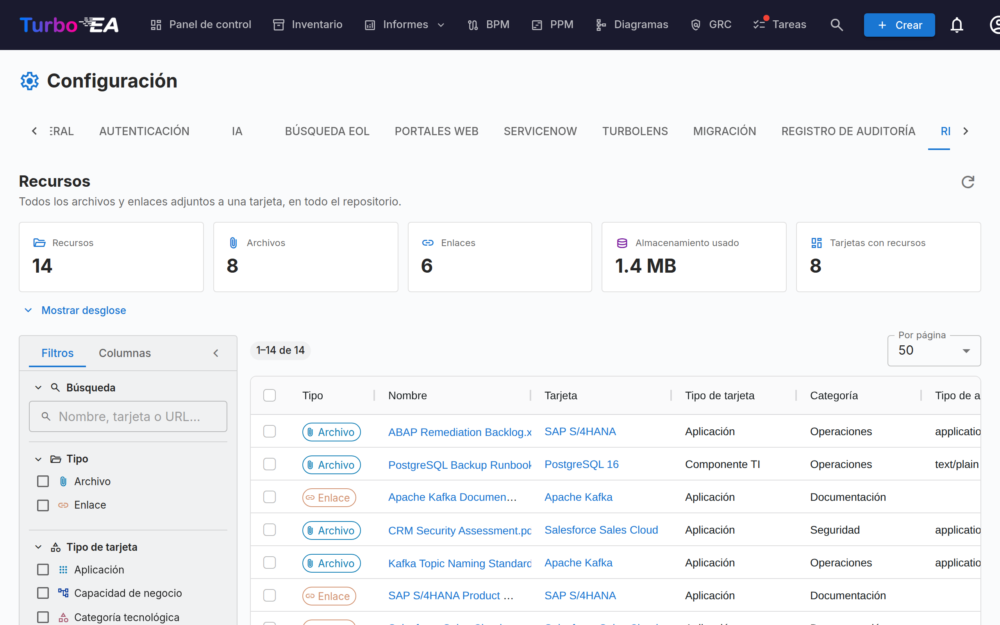

# Recursos

La pestaña **Recursos** (**Administración → Configuración → Recursos**, `/admin/settings?tab=resources`) es la vista, a nivel de todo el repositorio, de cada archivo y enlace adjunto a una tarjeta.

Normalmente los recursos se añaden y gestionan tarjeta a tarjeta, desde la pestaña **Recursos** de la tarjeta. Eso complica el mantenimiento: no hay forma de verlo todo a la vez, de averiguar cuánto almacenamiento consumen los adjuntos, ni de limpiar de forma masiva. Esta página responde a esas preguntas desde una única cuadrícula.

## Qué abarca

Dos clases de recurso, mostradas una junto a otra y diferenciadas por la columna **Tipo**:

| Tipo | De dónde procede | Incluye |
|------|------------------|---------|
| **Archivo** | Un archivo subido a una tarjeta (PDF, DOCX, XLSX, PPTX, PNG, JPG, SVG, TXT) | Tipo de archivo, tamaño, categoría de archivo |
| **Enlace** | Una URL añadida a una tarjeta | URL, tipo de enlace |

Las decisiones de arquitectura, los diagramas y los enlaces de ServiceNow también aparecen en la pestaña Recursos de una tarjeta, pero **no** se listan aquí — cada uno dispone ya de su propia página a nivel de repositorio (**Entrega EA → Decisiones de arquitectura**, **Diagramas** y **Administración → Configuración → ServiceNow**).

## Estadísticas

Los mosaicos situados sobre la cuadrícula resumen el conjunto de resultados actual:

| Mosaico | Significado |
|---------|-------------|
| **Recursos** | Archivos más enlaces |
| **Archivos** | Archivos adjuntos subidos |
| **Enlaces** | Enlaces URL a documentos |
| **Almacenamiento usado** | Tamaño total de los archivos adjuntos — los archivos se guardan en la base de datos, así que esto es crecimiento real de la base de datos |
| **Tarjetas con recursos** | Cuántas tarjetas distintas sostienen esos recursos |

**Mostrar desglose** despliega tres tablas: recursos por categoría / tipo de enlace, recursos por tipo de tarjeta y los diez archivos más grandes (cada uno descargable directamente desde la lista).

!!! note "Las cifras siguen sus filtros"
    Los mosaicos y el desglose describen lo que los filtros seleccionan en ese momento, no todo el espacio de trabajo. Siempre que hay un filtro activo aparece un chip **Filtrado**, de modo que las cifras nunca se confundan con totales del repositorio.

## Filtrar y buscar

La barra lateral izquierda replica la de la cuadrícula de Inventario. El filtrado, la ordenación y la paginación se realizan en el servidor, por lo que se aplican a todo el repositorio y no solo a la página en pantalla.

| Filtro | Notas |
|--------|-------|
| **Búsqueda** | Coincide con el nombre del recurso, el nombre de la tarjeta y (en los enlaces) la URL |
| **Tipo** | Archivos, enlaces o ambos |
| **Tipo de tarjeta** | Cualquier tipo de tarjeta de su metamodelo |
| **Categoría / tipo de enlace** | Las categorías de archivo y los tipos de enlace definidos en **Administración → Metamodelo → Tipos de recurso** |
| **Tipo de archivo** | El tipo MIME de un archivo subido — solo archivos |
| **Tarjeta** | Restringir a una sola tarjeta |
| **Añadido por** | El usuario que subió el archivo o añadió el enlace |
| **Tarjetas archivadas** | **Todas** (predeterminado), solo **Activas** o solo **Archivadas** |
| **Fecha de adición** | Un rango desde/hasta, con ambos extremos incluidos |

La pestaña **Columnas** de la barra lateral muestra y oculta columnas de la cuadrícula. Sus filtros, la elección de columnas, el ancho de la barra lateral y el tamaño de página se recuerdan en su navegador.

!!! tip "Las tarjetas archivadas se incluyen de forma predeterminada"
    Archivar una tarjeta no elimina sus recursos, y sus archivos siguen ocupando almacenamiento en la base de datos. Por eso se listan de forma predeterminada — de lo contrario, **Almacenamiento usado** subestimaría el consumo real. Las filas de una tarjeta archivada llevan un chip **Archivada**.

## Trabajar con los recursos

- **Descargar un archivo** — haga clic en su nombre, o use el botón de descarga de la columna Acciones.
- **Abrir un enlace** — haga clic en su nombre para abrir la URL en una pestaña nueva.
- **Ir a la tarjeta** — haga clic en el nombre de la tarjeta para abrirla en su pestaña Recursos.
- **Eliminar un recurso** — el botón de eliminar de la columna Acciones, con confirmación.
- **Eliminar varios** — marque las filas y luego **Eliminar selección** en la barra azul de selección. La confirmación indica cuántos recursos desaparecerán y cuánto almacenamiento se libera.

!!! warning "La eliminación es permanente"
    A diferencia de archivar una tarjeta, eliminar un recurso no se puede deshacer — los bytes del archivo se borran de la base de datos. Cada eliminación queda registrada en la pestaña **Historial** de la tarjeta afectada, de modo que siempre podrá ver qué se eliminó y quién lo hizo, pero el contenido en sí se ha perdido.

## Permisos

La página reutiliza los mismos permisos que la pestaña Recursos de una tarjeta — no expone ningún dato ni permite ninguna acción que no fuera ya posible tarjeta a tarjeta.

| Acción | Requiere |
|--------|----------|
| Llegar a la pestaña | `admin.settings` (está dentro de Administración → Configuración) |
| Ver la lista, las estadísticas y descargar | `documents.view` |
| Eliminar, individual o masivamente | `documents.manage`, **o** el permiso a nivel de tarjeta `card.manage_documents` sobre esa tarjeta concreta |

La eliminación masiva se comprueba **fila por fila**. Si su selección incluye recursos de tarjetas que no puede gestionar, esas filas se omiten en lugar de hacer fallar toda la operación, y una advertencia enumera exactamente cuáles y por qué.

## Cuando las cargas de archivos están deshabilitadas

Desactivar las **Cargas de archivos** en **Administración → Configuración → General** solo bloquea las nuevas cargas. Los archivos existentes siguen listados aquí y se pueden descargar y eliminar, así que aún puede auditar y limpiar. Mientras el interruptor está desactivado, aparece un aviso informativo en la página.

## Relacionado

- [Configuración](settings.md) — el interruptor que habilita o deshabilita las cargas de archivos
- [Metamodelo](metamodel.md) — donde se definen las categorías de archivo y los tipos de enlace
- [Usuarios y roles](users.md) — donde se conceden `documents.view` y `documents.manage`
