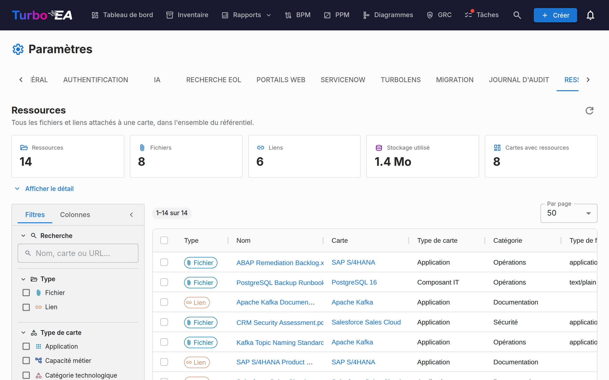

# Ressources

L'onglet **Ressources** (**Admin → Paramètres → Ressources**, `/admin/settings?tab=resources`) est la vue, à l'échelle du référentiel, de tous les fichiers et liens attachés à une carte.

Les ressources sont normalement ajoutées et gérées carte par carte, depuis l'onglet **Ressources** de la carte. Cela rend l'entretien difficile : il n'existe aucun moyen de tout voir d'un coup, de savoir quel volume de stockage les pièces jointes consomment, ni de faire du ménage en masse. Cette page répond à ces questions depuis une grille unique.

## Ce qu'elle couvre

Deux natures de ressource, affichées côte à côte et distinguées par la colonne **Type** :

| Type | D'où elle provient | Contient |
|------|--------------------|----------|
| **Fichier** | Un fichier téléversé sur une carte (PDF, DOCX, XLSX, PPTX, PNG, JPG, SVG, TXT) | Type de fichier, taille, catégorie de fichier |
| **Lien** | Une URL ajoutée à une carte | URL, type de lien |

Les décisions d'architecture, les diagrammes et les liens ServiceNow apparaissent également dans l'onglet Ressources d'une carte, mais ils ne sont **pas** listés ici — chacun dispose déjà de sa propre page à l'échelle du référentiel (**Livraison EA → Décisions d'architecture**, **Diagrammes** et **Admin → Paramètres → ServiceNow**).

## Statistiques

Les tuiles au-dessus de la grille résument le jeu de résultats courant :

| Tuile | Signification |
|-------|---------------|
| **Ressources** | Fichiers plus liens |
| **Fichiers** | Fichiers joints téléversés |
| **Liens** | Liens URL vers des documents |
| **Stockage utilisé** | Taille totale des fichiers joints — les fichiers sont stockés en base de données, il s'agit donc d'une croissance réelle de la base |
| **Cartes avec ressources** | Le nombre de cartes distinctes auxquelles les ressources sont rattachées |

**Afficher le détail** déploie trois tableaux : ressources par catégorie / type de lien, ressources par type de carte, et les dix fichiers les plus volumineux (chacun téléchargeable directement depuis la liste).

!!! note "Les chiffres suivent vos filtres"
    Les tuiles et le détail décrivent ce que les filtres sélectionnent à l'instant présent, et non l'ensemble de l'espace de travail. Une puce **Filtré** apparaît dès qu'un filtre est actif, afin que les nombres ne soient jamais pris pour des totaux du référentiel.

## Filtrer et rechercher

La barre latérale gauche reprend celle de la grille Inventaire. Le filtrage, le tri et la pagination s'effectuent côté serveur : ils s'appliquent donc à l'ensemble du référentiel et non à la seule page affichée.

| Filtre | Remarques |
|--------|-----------|
| **Recherche** | Porte sur le nom de la ressource, le nom de la carte et (pour les liens) l'URL |
| **Type** | Fichiers, liens ou les deux |
| **Type de carte** | N'importe quel type de carte de votre métamodèle |
| **Catégorie / type de lien** | Les catégories de fichiers et les types de liens définis dans **Admin → Métamodèle → Types de ressources** |
| **Type de fichier** | Le type MIME d'un fichier téléversé — fichiers uniquement |
| **Carte** | Restreindre à une seule carte |
| **Ajouté par** | L'utilisateur qui a téléversé le fichier ou ajouté le lien |
| **Cartes archivées** | **Toutes** (par défaut), **Actives** seulement ou **Archivées** seulement |
| **Date d'ajout** | Une plage du/au, bornes incluses |

L'onglet **Colonnes** de la barre latérale affiche et masque les colonnes de la grille. Vos filtres, vos choix de colonnes, la largeur de la barre latérale et la taille de page sont mémorisés dans votre navigateur.

!!! tip "Les cartes archivées sont incluses par défaut"
    Archiver une carte ne supprime pas ses ressources, et leurs fichiers continuent d'occuper du stockage en base de données. Elles sont donc listées par défaut — sinon, **Stockage utilisé** sous-estimerait la consommation réelle. Les lignes portant sur une carte archivée affichent une puce **Archivée**.

## Travailler avec les ressources

- **Télécharger un fichier** — cliquez sur son nom, ou utilisez le bouton de téléchargement dans la colonne Actions.
- **Ouvrir un lien** — cliquez sur son nom pour ouvrir l'URL dans un nouvel onglet.
- **Aller à la carte** — cliquez sur le nom de la carte pour l'ouvrir sur son onglet Ressources.
- **Supprimer une ressource** — le bouton de suppression dans la colonne Actions, avec confirmation.
- **En supprimer plusieurs** — cochez les lignes, puis **Supprimer la sélection** dans la barre de sélection bleue. La confirmation indique combien de ressources vont disparaître et quel volume de stockage cela libère.

!!! warning "La suppression est définitive"
    Contrairement à l'archivage d'une carte, la suppression d'une ressource est irréversible — les octets du fichier sont retirés de la base de données. Chaque suppression est consignée dans l'onglet **Historique** de la carte concernée, si bien que vous pouvez toujours voir ce qui a été retiré et par qui, mais le contenu lui-même est perdu.

## Permissions

La page réutilise les mêmes permissions que l'onglet Ressources d'une carte — elle n'expose aucune donnée et n'autorise aucune action qui n'était pas déjà possible carte par carte.

| Action | Nécessite |
|--------|-----------|
| Accéder à l'onglet | `admin.settings` (il se trouve dans Admin → Paramètres) |
| Voir la liste, les statistiques et télécharger | `documents.view` |
| Supprimer, à l'unité ou en masse | `documents.manage`, **ou** la permission au niveau carte `card.manage_documents` sur cette carte précise |

La suppression en masse est vérifiée **ligne par ligne**. Si votre sélection contient des ressources rattachées à des cartes que vous n'avez pas le droit de gérer, ces lignes sont ignorées plutôt que de faire échouer toute l'opération, et un avertissement indique précisément lesquelles et pourquoi.

## Lorsque les téléversements de fichiers sont désactivés

Désactiver les **Téléversements de fichiers** dans **Admin → Paramètres → Général** bloque uniquement les nouveaux téléversements. Les fichiers existants restent listés ici, téléchargeables et supprimables, ce qui vous permet de continuer à auditer et à faire le ménage. Une bannière d'information s'affiche sur la page tant que la bascule est désactivée.

## Voir aussi

- [Paramètres](settings.md) — la bascule qui active ou désactive les téléversements de fichiers
- [Métamodèle](metamodel.md) — où sont définies les catégories de fichiers et les types de liens
- [Utilisateurs & Rôles](users.md) — où sont accordées les permissions `documents.view` et `documents.manage`
