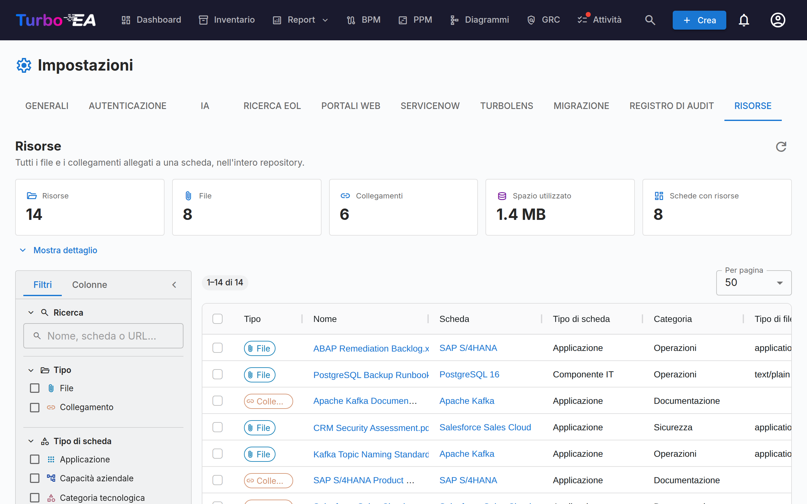

# Risorse

Il tab **Risorse** (**Admin → Impostazioni → Risorse**, `/admin/settings?tab=resources`) è la vista, estesa a tutto il repository, di ogni file e collegamento allegato a una scheda.

Normalmente le risorse vengono aggiunte e gestite una scheda alla volta, dal tab **Risorse** della scheda stessa. Questo rende difficile la manutenzione: non c'è modo di vedere tutto in una volta, di scoprire quanto spazio di archiviazione consumano gli allegati o di fare pulizia in blocco. Questa pagina risponde a queste domande da un'unica griglia.

## Che cosa copre

Due tipi di risorsa, mostrati fianco a fianco e distinti dalla colonna **Tipo**:

| Tipo | Da dove proviene | Contiene |
|------|--------------------|---------|
| **File** | Un file caricato su una scheda (PDF, DOCX, XLSX, PPTX, PNG, JPG, SVG, TXT) | Tipo di file, dimensione, categoria del file |
| **Collegamento** | Un URL aggiunto a una scheda | URL, tipo di collegamento |

Anche le decisioni architetturali, i diagrammi e i collegamenti ServiceNow compaiono nel tab Risorse di una scheda, ma **non** sono elencati qui — ognuno dispone già di una propria pagina estesa a tutto il repository (**Consegna EA → Decisioni architetturali**, **Diagrammi** e **Admin → Impostazioni → ServiceNow**).

## Statistiche

I riquadri sopra la griglia riassumono l'insieme dei risultati corrente:

| Riquadro | Significato |
|------|---------|
| **Risorse** | File più collegamenti |
| **File** | Allegati file caricati |
| **Collegamenti** | Collegamenti URL a documenti |
| **Spazio utilizzato** | Dimensione totale degli allegati file — i file sono archiviati nel database, quindi si tratta di crescita reale del database |
| **Schede con risorse** | Su quante schede distinte sono agganciate le risorse |

**Mostra dettaglio** espande tre tabelle: risorse per categoria / tipo di collegamento, risorse per tipo di scheda e i dieci file più grandi (ciascuno scaricabile direttamente dall'elenco).

!!! note "I numeri seguono i vostri filtri"
    I riquadri e il dettaglio descrivono ciò che i filtri selezionano in quel momento, non l'intero workspace. Un chip **Filtrato** compare ogni volta che un filtro è attivo, così i numeri non vengono mai scambiati per totali del repository.

## Filtri e ricerca

La barra laterale sinistra rispecchia la griglia dell'Inventario. Filtri, ordinamento e paginazione avvengono tutti sul server, quindi si applicano all'intero repository e non alla sola pagina visualizzata.

| Filtro | Note |
|--------|-------|
| **Ricerca** | Corrisponde al nome della risorsa, al nome della scheda e (per i collegamenti) all'URL |
| **Tipo** | File, collegamenti o entrambi |
| **Tipo di scheda** | Qualsiasi tipo di scheda del vostro metamodello |
| **Categoria / tipo di collegamento** | Le categorie di file e i tipi di collegamento definiti in **Admin → Metamodello → Risorse** |
| **Tipo di file** | Il tipo MIME di un file caricato — solo file |
| **Scheda** | Restringe a una singola scheda |
| **Aggiunto da** | L'utente che ha caricato il file o aggiunto il collegamento |
| **Schede archiviate** | **Tutte** (predefinito), solo **Attive** oppure solo **Archiviate** |
| **Data di aggiunta** | Un intervallo da/a inclusivo |

Il tab **Colonne** della barra laterale mostra e nasconde le colonne della griglia. I vostri filtri, la scelta delle colonne, la larghezza della barra laterale e la dimensione della pagina vengono ricordati nel browser.

!!! tip "Le schede archiviate sono incluse per impostazione predefinita"
    Archiviare una scheda non ne elimina le risorse, e i relativi file continuano a occupare spazio nel database. Per questo sono elencate per impostazione predefinita — altrimenti **Spazio utilizzato** sottostimerebbe il consumo reale. Le righe di una scheda archiviata riportano un chip **Archiviata**.

## Lavorare con le risorse

- **Scaricare un file** — cliccate sul suo nome, oppure usate il pulsante di download nella colonna Azioni.
- **Aprire un collegamento** — cliccate sul suo nome per aprire l'URL in una nuova scheda del browser.
- **Andare alla scheda** — cliccate sul nome della scheda per aprirla sul suo tab Risorse.
- **Eliminare una risorsa** — il pulsante di eliminazione nella colonna Azioni, con una conferma.
- **Eliminarne diverse** — selezionate le righe, poi **Elimina selezione** nella barra di selezione blu. La conferma indica quante risorse verranno rimosse e quanto spazio questo libera.

!!! warning "L'eliminazione è definitiva"
    A differenza dell'archiviazione di una scheda, l'eliminazione di una risorsa non può essere annullata — i byte del file vengono rimossi dal database. Ogni eliminazione viene registrata nel tab **Cronologia** della scheda interessata, quindi potete sempre vedere che cosa è stato rimosso e da chi, ma il contenuto in sé è perduto.

## Permessi

La pagina riutilizza gli stessi permessi del tab Risorse di una scheda — non espone alcun dato e non consente alcuna azione che non fosse già possibile una scheda alla volta.

| Azione | Richiede |
|--------|----------|
| Raggiungere il tab | `admin.settings` (si trova dentro Admin → Impostazioni) |
| Visualizzare l'elenco e le statistiche, e scaricare | `documents.view` |
| Eliminare, singolarmente o in blocco | `documents.manage`, **oppure** il permesso a livello di scheda `card.manage_documents` su quella specifica scheda |

L'eliminazione in blocco viene verificata **riga per riga**. Se la vostra selezione include risorse su schede che non potete gestire, quelle righe vengono saltate anziché far fallire l'intera operazione, e un avviso elenca esattamente quali e perché.

## Quando il caricamento di file è disabilitato

Disattivare **Caricamento di file** in **Admin → Impostazioni → Generali** blocca soltanto i nuovi caricamenti. I file esistenti restano elencati qui e rimangono scaricabili ed eliminabili, così potete comunque fare audit e pulizia. Mentre l'interruttore è disattivato, sulla pagina compare un banner informativo.

## Correlati

- [Impostazioni](settings.md) — l'interruttore che abilita o disabilita il caricamento di file
- [Metamodello](metamodel.md) — dove sono definite le categorie di file e i tipi di collegamento
- [Utenti e ruoli](users.md) — dove vengono concessi `documents.view` e `documents.manage`
