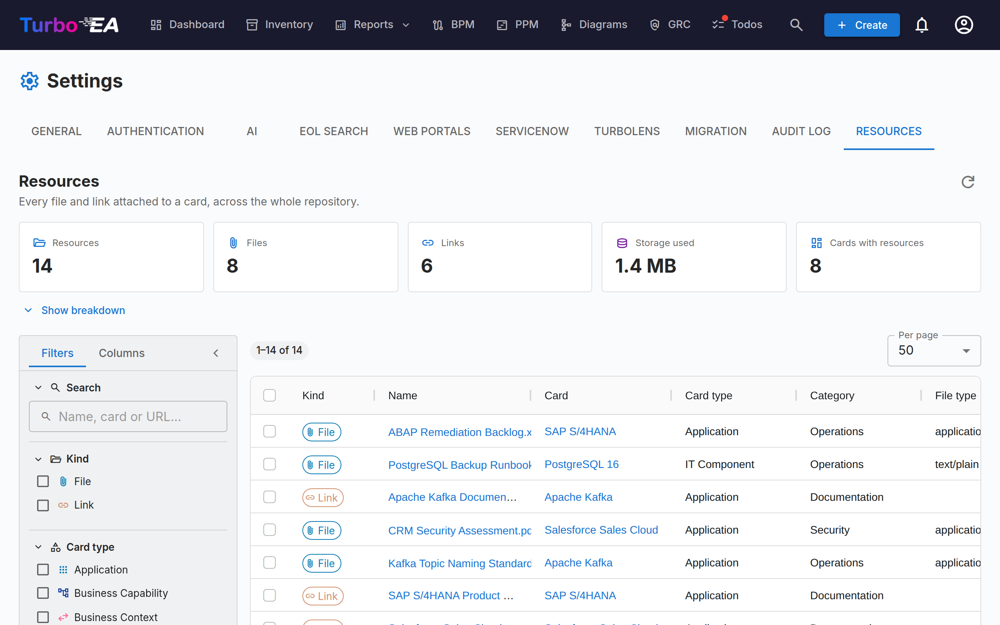

# Resources

The **Resources** tab (**Admin → Settings → Resources**, `/admin/settings?tab=resources`) is the repository-wide view of every file and link attached to a card.

Resources are normally added and managed one card at a time, from the card's **Resources** tab. That makes housekeeping hard: there is no way to see everything at once, find out how much storage attachments are consuming, or clean up in bulk. This page answers those questions from a single grid.

## What it covers

Two kinds of resource, shown side by side and distinguished by the **Kind** column:

| Kind | Where it comes from | Carries |
|------|--------------------|---------|
| **File** | A file uploaded to a card (PDF, DOCX, XLSX, PPTX, PNG, JPG, SVG, TXT) | File type, size, file category |
| **Link** | A URL added to a card | URL, link type |

Architecture Decisions, diagrams, and ServiceNow links also appear on a card's Resources tab, but they are **not** listed here — each already has its own repository-wide page (**EA Delivery → Decisions**, **Diagrams**, and **Admin → Settings → ServiceNow**).

## Statistics

The tiles above the grid summarise the current result set:

| Tile | Meaning |
|------|---------|
| **Resources** | Files plus links |
| **Files** | Uploaded file attachments |
| **Links** | URL document links |
| **Storage used** | Total size of the file attachments — files are stored in the database, so this is real database growth |
| **Cards with resources** | How many distinct cards the resources hang off |

**Show breakdown** expands three tables: resources per category / link type, resources per card type, and the ten largest files (each downloadable straight from the list).

!!! note "The figures follow your filters"
    The tiles and the breakdown describe whatever the filters currently select, not the whole workspace. A **Filtered** chip appears whenever a filter is active, so the numbers are never mistaken for repository totals.

## Filtering and searching

The left sidebar mirrors the Inventory grid. All filtering, sorting, and paging happen on the server, so they apply to the whole repository rather than the page on screen.

| Filter | Notes |
|--------|-------|
| **Search** | Matches the resource name, the card name, and (for links) the URL |
| **Kind** | Files, links, or both |
| **Card type** | Any card types from your metamodel |
| **Category / link type** | The file categories and link types defined in **Admin → Metamodel → Resource Types** |
| **File type** | The MIME type of an uploaded file — files only |
| **Card** | Narrow to a single card |
| **Added by** | The user who uploaded the file or added the link |
| **Archived cards** | **All** (default), **Active** only, or **Archived** only |
| **Date added** | An inclusive from/to range |

The **Columns** tab of the sidebar shows and hides grid columns. Your filters, column choices, sidebar width, and page size are remembered in your browser.

!!! tip "Archived cards are included by default"
    Archiving a card does not delete its resources, and their files keep occupying database storage. They are therefore listed by default — otherwise **Storage used** would understate real consumption. Rows on an archived card carry an **Archived** chip.

## Working with resources

- **Download a file** — click its name, or use the download button in the Actions column.
- **Open a link** — click its name to open the URL in a new tab.
- **Go to the card** — click the card name to open it on its Resources tab.
- **Delete one resource** — the delete button in the Actions column, with a confirmation.
- **Delete several** — tick the rows, then **Delete selected** in the blue selection bar. The confirmation shows how many resources will go and how much storage that frees.

!!! warning "Deletion is permanent"
    Unlike archiving a card, deleting a resource cannot be undone — the file's bytes are removed from the database. Every deletion is recorded on the affected card's **History** tab, so you can always see what was removed and by whom, but the content itself is gone.

## Permissions

The page reuses the same permissions as a card's Resources tab — it exposes no data and allows no action that was not already possible one card at a time.

| Action | Requires |
|--------|----------|
| Reach the tab | `admin.settings` (it lives inside Admin → Settings) |
| View the list, statistics, and download | `documents.view` |
| Delete, single or bulk | `documents.manage`, **or** the card-level `card.manage_documents` on that particular card |

Bulk delete is checked **per row**. If your selection includes resources on cards you may not manage, those rows are skipped rather than failing the whole operation, and a warning lists exactly which ones and why.

## When file uploads are disabled

Turning off **File uploads** in **Admin → Settings → General** only blocks new uploads. Existing files stay listed here and remain downloadable and deletable, so you can still audit and clean up. An information banner appears on the page while the toggle is off.

## Related

- [Settings](settings.md) — the toggle that enables or disables file uploads
- [Metamodel](metamodel.md) — where file categories and link types are defined
- [Users & Roles](users.md) — where `documents.view` and `documents.manage` are granted
