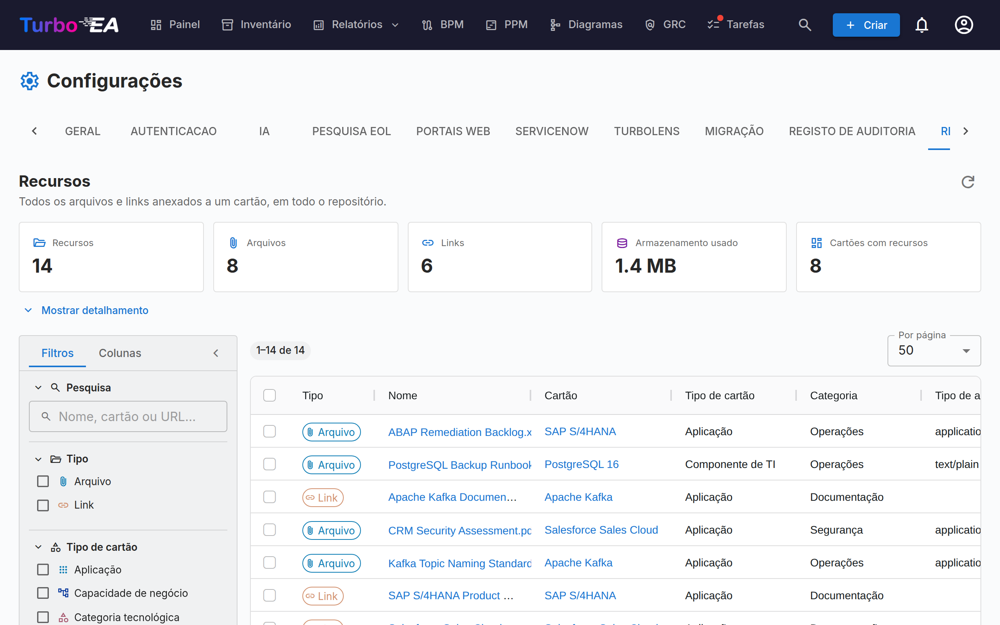

# Recursos

A aba **Recursos** (**Admin → Configurações → Recursos**, `/admin/settings?tab=resources`) é a visão, em todo o repositório, de cada arquivo e link anexado a um cartão.

Normalmente os recursos são adicionados e gerenciados um cartão por vez, a partir da aba **Recursos** do próprio cartão. Isso dificulta a manutenção: não há como ver tudo de uma só vez, descobrir quanto armazenamento os anexos estão consumindo ou fazer limpeza em massa. Esta página responde a essas perguntas a partir de uma única grade.

## O que ela abrange

Dois tipos de recurso, exibidos lado a lado e distinguidos pela coluna **Tipo**:

| Tipo | De onde vem | Contém |
|------|--------------------|---------|
| **Arquivo** | Um arquivo enviado a um cartão (PDF, DOCX, XLSX, PPTX, PNG, JPG, SVG, TXT) | Tipo de arquivo, tamanho, categoria do arquivo |
| **Link** | Uma URL adicionada a um cartão | URL, tipo de link |

Decisões de arquitetura, diagramas e links do ServiceNow também aparecem na aba Recursos de um cartão, mas **não** são listados aqui — cada um já possui a sua própria página abrangendo todo o repositório (**Entrega EA → Decisões de arquitetura**, **Diagramas** e **Admin → Configurações → ServiceNow**).

## Estatísticas

Os blocos acima da grade resumem o conjunto de resultados atual:

| Bloco | Significado |
|------|---------|
| **Recursos** | Arquivos mais links |
| **Arquivos** | Anexos de arquivos enviados |
| **Links** | Links URL para documentos |
| **Armazenamento usado** | Tamanho total dos anexos de arquivo — os arquivos ficam armazenados no banco de dados, portanto isso é crescimento real do banco |
| **Cartões com recursos** | Em quantos cartões distintos os recursos estão pendurados |

**Mostrar detalhamento** expande três tabelas: recursos por categoria / tipo de link, recursos por tipo de cartão e os dez maiores arquivos (cada um baixável diretamente da lista).

!!! note "Os números seguem os seus filtros"
    Os blocos e o detalhamento descrevem aquilo que os filtros selecionam no momento, não o workspace inteiro. Um chip **Filtrado** aparece sempre que um filtro está ativo, de modo que os números nunca sejam confundidos com totais do repositório.

## Filtragem e pesquisa

A barra lateral esquerda espelha a grade do Inventário. Toda a filtragem, ordenação e paginação acontecem no servidor, portanto se aplicam ao repositório inteiro e não apenas à página exibida na tela.

| Filtro | Observações |
|--------|-------|
| **Pesquisa** | Corresponde ao nome do recurso, ao nome do cartão e (para links) à URL |
| **Tipo** | Arquivos, links ou ambos |
| **Tipo de cartão** | Quaisquer tipos de cartão do seu metamodelo |
| **Categoria / tipo de link** | As categorias de arquivo e os tipos de link definidos em **Admin → Metamodelo → Recursos** |
| **Tipo de arquivo** | O tipo MIME de um arquivo enviado — somente arquivos |
| **Cartão** | Restringe a um único cartão |
| **Adicionado por** | O usuário que enviou o arquivo ou adicionou o link |
| **Cartões arquivados** | **Todos** (padrão), somente **Ativos** ou somente **Arquivados** |
| **Data de adição** | Um intervalo de/até inclusivo |

A aba **Colunas** da barra lateral exibe e oculta colunas da grade. Os seus filtros, as colunas escolhidas, a largura da barra lateral e o tamanho da página ficam memorizados no seu navegador.

!!! tip "Cartões arquivados são incluídos por padrão"
    Arquivar um cartão não exclui os seus recursos, e os arquivos correspondentes continuam ocupando armazenamento no banco de dados. Por isso eles são listados por padrão — caso contrário, **Armazenamento usado** subestimaria o consumo real. As linhas de um cartão arquivado exibem um chip **Arquivado**.

## Trabalhando com recursos

- **Baixar um arquivo** — clique no seu nome, ou use o botão de download na coluna Ações.
- **Abrir um link** — clique no seu nome para abrir a URL em uma nova aba do navegador.
- **Ir para o cartão** — clique no nome do cartão para abri-lo na sua aba Recursos.
- **Excluir um recurso** — o botão de exclusão na coluna Ações, com uma confirmação.
- **Excluir vários** — marque as linhas e depois **Excluir selecionados** na barra azul de seleção. A confirmação mostra quantos recursos serão removidos e quanto armazenamento isso libera.

!!! warning "A exclusão é permanente"
    Diferentemente de arquivar um cartão, excluir um recurso não pode ser desfeito — os bytes do arquivo são removidos do banco de dados. Toda exclusão fica registrada na aba **Histórico** do cartão afetado, portanto você sempre consegue ver o que foi removido e por quem, mas o conteúdo em si desaparece.

## Permissões

A página reutiliza as mesmas permissões da aba Recursos de um cartão — ela não expõe nenhum dado nem permite nenhuma ação que já não fosse possível um cartão por vez.

| Ação | Requer |
|--------|----------|
| Chegar à aba | `admin.settings` (ela fica dentro de Admin → Configurações) |
| Ver a lista e as estatísticas, e baixar | `documents.view` |
| Excluir, individualmente ou em massa | `documents.manage`, **ou** a permissão de nível de cartão `card.manage_documents` naquele cartão específico |

A exclusão em massa é verificada **por linha**. Se a sua seleção incluir recursos em cartões que você não pode gerenciar, essas linhas são ignoradas em vez de fazer a operação inteira falhar, e um aviso lista exatamente quais e por quê.

## Quando os envios de arquivos estão desabilitados

Desligar **Envio de arquivos** em **Admin → Configurações → Geral** bloqueia apenas os novos envios. Os arquivos existentes continuam listados aqui e permanecem baixáveis e excluíveis, para que você ainda possa auditar e limpar. Enquanto a alternância estiver desligada, um banner informativo aparece na página.

## Relacionados

- [Configurações](settings.md) — a alternância que habilita ou desabilita o envio de arquivos
- [Metamodelo](metamodel.md) — onde as categorias de arquivo e os tipos de link são definidos
- [Usuários e papéis](users.md) — onde `documents.view` e `documents.manage` são concedidos
