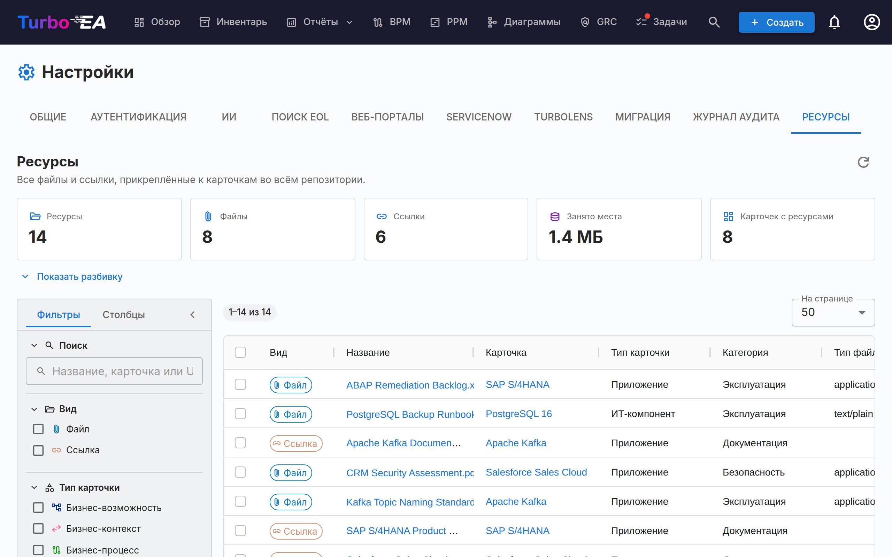

# Ресурсы

Вкладка **Ресурсы** (**Администрирование → Настройки → Ресурсы**, `/admin/settings?tab=resources`) — это общий для всего репозитория обзор каждого файла и каждой ссылки, прикреплённых к карточке.

Обычно ресурсы добавляются и обслуживаются по одной карточке за раз, на вкладке **Ресурсы** самой карточки. Из-за этого наводить порядок неудобно: невозможно увидеть всё сразу, узнать, сколько места занимают вложения, или выполнить массовую очистку. Эта страница отвечает на все эти вопросы из одной таблицы.

## Что она охватывает

Два вида ресурсов, показанные рядом и различаемые по столбцу **Вид**:

| Вид | Откуда берётся | Содержит |
|-----|----------------|----------|
| **Файл** | Файл, загруженный в карточку (PDF, DOCX, XLSX, PPTX, PNG, JPG, SVG, TXT) | Тип файла, размер, категорию файла |
| **Ссылка** | URL, добавленный в карточку | URL, тип ссылки |

Архитектурные решения, диаграммы и ссылки ServiceNow тоже отображаются на вкладке «Ресурсы» карточки, но здесь они **не** перечислены — у каждого из них уже есть собственная страница уровня репозитория (**Поставка EA → Архитектурные решения**, **Диаграммы** и **Администрирование → Настройки → ServiceNow**).

## Статистика

Плитки над таблицей обобщают текущий набор результатов:

| Плитка | Значение |
|--------|----------|
| **Ресурсы** | Файлы плюс ссылки |
| **Файлы** | Загруженные файловые вложения |
| **Ссылки** | Ссылки на документы по URL |
| **Занято места** | Общий размер файловых вложений — файлы хранятся в базе данных, поэтому это реальный рост базы данных |
| **Карточек с ресурсами** | Сколько различных карточек связано с этими ресурсами |

**Показать разбивку** раскрывает три таблицы: ресурсы по категориям / типам ссылок, ресурсы по типам карточек и десять самых больших файлов (каждый из них можно скачать прямо из списка).

!!! note "Цифры следуют за вашими фильтрами"
    Плитки и разбивка описывают то, что в данный момент выбрано фильтрами, а не всё рабочее пространство. Пока фильтр активен, отображается чип **С фильтрами**, чтобы эти числа не приняли за итоги по всему репозиторию.

## Фильтрация и поиск

Левая боковая панель повторяет таблицу Инвентаря. Вся фильтрация, сортировка и разбивка на страницы выполняются на сервере, поэтому они применяются ко всему репозиторию, а не только к странице на экране.

| Фильтр | Примечания |
|--------|------------|
| **Поиск** | Ищет по названию ресурса, названию карточки и (для ссылок) по URL |
| **Вид** | Файлы, ссылки или и то и другое |
| **Тип карточки** | Любые типы карточек из вашей метамодели |
| **Категория / тип ссылки** | Категории файлов и типы ссылок, определённые в разделе **Администрирование → Метамодель → Типы ресурсов** |
| **Тип файла** | MIME-тип загруженного файла — только для файлов |
| **Карточка** | Ограничить одной карточкой |
| **Добавил** | Пользователь, загрузивший файл или добавивший ссылку |
| **Архивные карточки** | **Все** (по умолчанию), только **Активные** или только **Архивные** |
| **Дата добавления** | Включающий диапазон «с/по» |

Вкладка **Столбцы** боковой панели показывает и скрывает столбцы таблицы. Ваши фильтры, выбор столбцов, ширина боковой панели и размер страницы запоминаются в браузере.

!!! tip "Архивные карточки включены по умолчанию"
    Архивирование карточки не удаляет её ресурсы, и их файлы продолжают занимать место в базе данных. Поэтому они перечислены по умолчанию — иначе показатель **Занято места** занижал бы реальное потребление. Строки, относящиеся к архивной карточке, помечены чипом **В архиве**.

## Работа с ресурсами

- **Скачать файл** — нажмите на его название или воспользуйтесь кнопкой скачивания в столбце «Действия».
- **Открыть ссылку** — нажмите на её название, чтобы открыть URL в новой вкладке.
- **Перейти к карточке** — нажмите на название карточки, чтобы открыть её на вкладке «Ресурсы».
- **Удалить один ресурс** — кнопка удаления в столбце «Действия», с подтверждением.
- **Удалить несколько** — отметьте строки, затем нажмите **Удалить выбранное** в синей панели выделения. В подтверждении показано, сколько ресурсов будет удалено и сколько места это освободит.

!!! warning "Удаление необратимо"
    В отличие от архивирования карточки, удаление ресурса отменить нельзя — байты файла удаляются из базы данных. Каждое удаление записывается на вкладке **История** затронутой карточки, поэтому вы всегда сможете увидеть, что и кем было удалено, но само содержимое утрачено.

## Разрешения

Страница использует те же разрешения, что и вкладка «Ресурсы» карточки, — она не раскрывает данных и не допускает действий, которые не были бы возможны и при работе с карточками по одной.

| Действие | Требуется |
|----------|-----------|
| Открыть вкладку | `admin.settings` (она находится внутри Администрирование → Настройки) |
| Просмотр списка, статистики и скачивание | `documents.view` |
| Удаление, одиночное или массовое | `documents.manage` **или** разрешение уровня карточки `card.manage_documents` для этой конкретной карточки |

Массовое удаление проверяется **для каждой строки**. Если в выделение попали ресурсы карточек, которыми вам не разрешено управлять, эти строки будут пропущены, а не приведут к сбою всей операции, и предупреждение перечислит, какие именно и почему.

## Когда загрузка файлов отключена

Отключение параметра **Загрузка файлов** в разделе **Администрирование → Настройки → Общие** блокирует только новые загрузки. Существующие файлы остаются в списке, их по-прежнему можно скачивать и удалять, так что аудит и очистка остаются доступны. Пока переключатель выключен, на странице отображается информационный баннер.

## См. также

- [Настройки](settings.md) — переключатель, который включает или отключает загрузку файлов
- [Метамодель](metamodel.md) — где определяются категории файлов и типы ссылок
- [Пользователи и роли](users.md) — где выдаются `documents.view` и `documents.manage`
