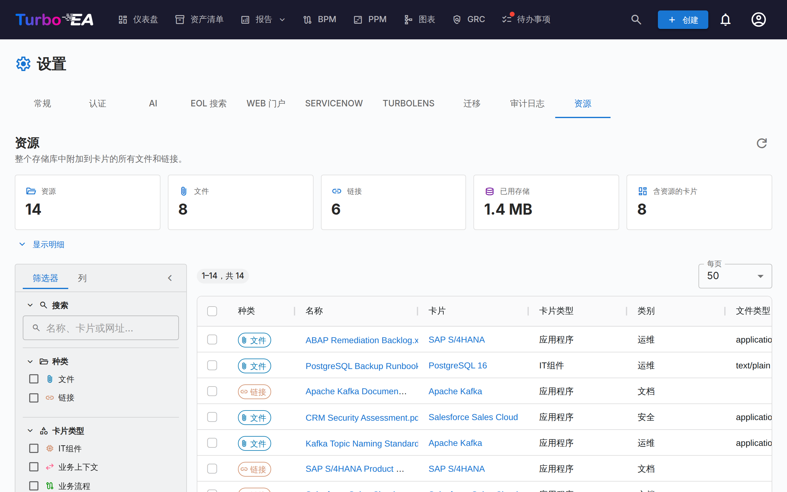

# 资源

**资源**标签页（**管理 → 设置 → 资源**，`/admin/settings?tab=resources`）提供整个存储库中附加到卡片的每一个文件和链接的总览视图。

资源通常是逐张卡片添加和管理的，入口在卡片自身的**资源**标签页。这使得日常整理变得困难：无法一次性查看全部内容，无法了解附件占用了多少存储空间，也无法批量清理。本页通过一张网格回答了这些问题。

## 涵盖范围

两种资源并排显示，通过**种类**列加以区分：

| 种类 | 来源 | 携带信息 |
|------|--------------------|---------|
| **文件** | 上传到卡片的文件（PDF、DOCX、XLSX、PPTX、PNG、JPG、SVG、TXT） | 文件类型、大小、文件类别 |
| **链接** | 添加到卡片的网址 | 网址、链接类型 |

架构决策、图表和 ServiceNow 链接同样会出现在卡片的资源标签页中，但**不会**列在这里 —— 它们各自已经拥有覆盖整个存储库的专属页面（**EA 交付 → 架构决策**、**图表**以及**管理 → 设置 → ServiceNow**）。

## 统计

网格上方的信息块汇总了当前的结果集：

| 信息块 | 含义 |
|------|---------|
| **资源** | 文件加链接 |
| **文件** | 已上传的文件附件 |
| **链接** | 网址文档链接 |
| **已用存储** | 文件附件的总大小 —— 文件存储在数据库中，因此这是真实的数据库增长 |
| **含资源的卡片** | 这些资源挂载在多少张不同的卡片上 |

**显示明细**会展开三张表格：按类别 / 链接类型统计的资源、按卡片类型统计的资源，以及最大的十个文件（每个都可直接从列表下载）。

!!! note "数字随筛选条件变化"
    信息块和明细描述的是筛选器当前选中的内容，而非整个工作区。只要有筛选条件处于激活状态，就会出现**已筛选**标记，因此这些数字绝不会被误认为存储库总量。

## 筛选与搜索

左侧边栏与清单网格一致。所有筛选、排序和分页均在服务器端完成，因此作用于整个存储库，而不仅仅是屏幕上的当前页。

| 筛选器 | 说明 |
|--------|-------|
| **搜索** | 匹配资源名称、卡片名称以及（对于链接）网址 |
| **种类** | 文件、链接或两者 |
| **卡片类型** | 元模型中的任意卡片类型 |
| **类别 / 链接类型** | 在**管理 → 元模型 → 资源**中定义的文件类别和链接类型 |
| **文件类型** | 已上传文件的 MIME 类型 —— 仅限文件 |
| **卡片** | 缩小到单张卡片 |
| **添加者** | 上传该文件或添加该链接的用户 |
| **已归档卡片** | **全部**（默认）、仅**活动**或仅**已归档** |
| **添加日期** | 一个含边界的起止区间 |

侧边栏的**列**标签页用于显示和隐藏网格中的列。您的筛选条件、列的选择、侧边栏宽度和每页条数都会记忆在浏览器中。

!!! tip "默认包含已归档卡片"
    归档一张卡片并不会删除它的资源，其文件仍会继续占用数据库存储。因此它们默认被列出 —— 否则**已用存储**会低估真实消耗量。位于已归档卡片上的行会带有**已归档**标记。

## 操作资源

- **下载文件** —— 点击文件名，或使用操作列中的下载按钮。
- **打开链接** —— 点击名称即可在新的浏览器标签页中打开该网址。
- **跳转到卡片** —— 点击卡片名称，即可打开该卡片并定位到它的资源标签页。
- **删除单个资源** —— 使用操作列中的删除按钮，会有确认提示。
- **删除多个** —— 勾选相应的行，然后在蓝色选择栏中点击**删除所选**。确认框会显示将删除多少项资源，以及由此释放多少存储空间。

!!! warning "删除是永久性的"
    与归档卡片不同，删除资源无法撤消 —— 文件的字节会从数据库中移除。每次删除都会记录在受影响卡片的**历史**标签页中，因此您始终可以查看删除了什么以及由谁删除，但内容本身已经不复存在。

## 权限

本页复用与卡片资源标签页相同的权限 —— 它不会暴露任何数据，也不会允许任何原本无法逐张卡片完成的操作。

| 操作 | 需要 |
|--------|----------|
| 进入该标签页 | `admin.settings`（它位于管理 → 设置之内） |
| 查看列表、统计信息并下载 | `documents.view` |
| 删除（单个或批量） | `documents.manage`，**或**在该特定卡片上具有卡片级的 `card.manage_documents` |

批量删除会**逐行**校验。如果您的选择中包含位于您无权管理的卡片上的资源，这些行会被跳过，而不会导致整个操作失败，同时会有一条警告准确列出究竟是哪些行以及原因。

## 文件上传被禁用时

在**管理 → 设置 → 常规**中关闭**文件上传**只会阻止新的上传。现有文件仍会列在此处，并且仍可下载和删除，因此您依然可以进行审计和清理。在该开关处于关闭状态期间，页面上会显示一条信息横幅。

## 相关页面

- [设置](settings.md) —— 启用或禁用文件上传的开关
- [元模型](metamodel.md) —— 定义文件类别和链接类型的地方
- [用户与角色](users.md) —— 授予 `documents.view` 和 `documents.manage` 的地方
