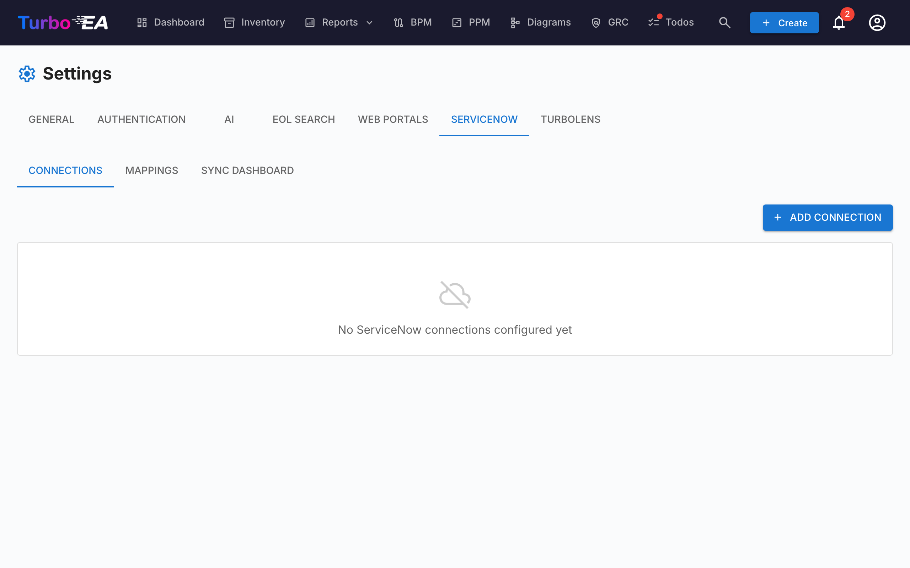

# ServiceNow-integration

ServiceNow-integrationen (**Admin > Indstillinger > ServiceNow**) muliggør tovejssynkronisering mellem Turbo EA og din ServiceNow CMDB. Denne vejledning dækker alt fra indledende opsætning til avancerede opskrifter og operationelle bedste praksisser.



## Hvorfor integrere ServiceNow med Turbo EA?

ServiceNow CMDB og Enterprise Architecture-værktøjer tjener forskellige, men komplementære formål:

| | ServiceNow CMDB | Turbo EA |
|--|-----------------|----------|
| **Fokus** | IT-drift — hvad der kører, hvem der ejer det, hvilke hændelser der er sket | Strategisk planlægning — hvordan skal landskabet se ud om 3 år? |
| **Vedligeholdt af** | IT-drift, Asset Management | EA-team, forretningsarkitekter |
| **Styrke** | Automatiseret opdagelse, ITSM-arbejdsprocesser, operationel nøjagtighed | Forretningskontekst, capability-kortlægning, livscyklusplanlægning, vurderinger |
| **Typiske data** | Værtsnavne, IP'er, installationsstatus, tildelingsgrupper, kontrakter | Forretningskritikalitet, funktionelt fit, teknisk gæld, strategisk roadmap |

**Turbo EA er system of record** for dit arkitekturlandskab — navne, beskrivelser, livscyklusplaner, vurderinger og forretningskontekst lever alle her. ServiceNow supplerer Turbo EA med operationelle og tekniske metadata (værtsnavne, IP'er, SLA-data, installationsstatus), der kommer fra automatiseret opdagelse og ITSM-arbejdsprocesser. Integrationen holder disse to systemer forbundet, samtidig med at den respekterer, at Turbo EA leder.

### Hvad du kan gøre

- **Pull-synkronisering** — Seed Turbo EA med CI'er fra ServiceNow, og tag derefter ejerskab. Løbende pulls opdaterer kun operationelle felter (IP'er, status, SLA'er), som SNOW opdager automatisk
- **Push-synkronisering** — Eksportér EA-kurerede data tilbage til ServiceNow (navne, beskrivelser, vurderinger, livscyklusplaner), så ITSM-teams ser EA-kontekst
- **Tovejs-synkronisering** — Turbo EA leder de fleste felter; SNOW leder et lille sæt af operationelle/tekniske felter. Begge systemer forbliver synkroniseret
- **Identitetskortlægning** — Persistent krydsreferencesporing (sys_id <-> kort-UUID) sikrer, at poster forbliver tilknyttede på tværs af synkroniseringer

---

## Integrationsarkitektur

```
+------------------+         HTTPS / Table API          +------------------+
|   Turbo EA       | <--------------------------------> |  ServiceNow      |
|                  |                                     |                  |
|  Cards           |  Pull: SNOW CIs -> Turbo Cards      |  CMDB CIs        |
|  (Application,   |  Push: Turbo Cards -> SNOW CIs      |  (cmdb_ci_appl,  |
|   ITComponent,   |                                     |   cmdb_ci_server, |
|   Provider, ...) |  Identity Map tracks sys_id <-> UUID |   core_company)  |
+------------------+                                     +------------------+
```

Integrationen bruger ServiceNows Table API over HTTPS. Legitimationsoplysninger krypteres i hvile ved hjælp af Fernet (AES-128-CBC) udledt af din `SECRET_KEY`. Alle synkroniseringsoperationer logges som hændelser med `source: "servicenow_sync"` for et komplet revisionsspor.

---

## Planlægning af din integration

Før du konfigurerer noget, så besvar disse spørgsmål:

### 1. Hvilke korttyper har brug for data fra ServiceNow?

Start småt. De mest almindelige integrationspunkter er:

| Prioritet | Turbo EA-type | ServiceNow-kilde | Hvorfor |
|----------|---------------|-------------------|-----|
| **Høj** | Application | `cmdb_ci_business_app` | Applikationer er kernen i EA — CMDB har autoritative navne, ejere og status |
| **Høj** | ITComponent (Software) | `cmdb_ci_spkg` | Softwareprodukter fødes ind i EOL-sporing og tech radar |
| **Mellem** | ITComponent (Hardware) | `cmdb_ci_server` | Serverlandskab til infrastrukturkortlægning |
| **Mellem** | Provider | `core_company` | Leverandørregister til omkostnings- og relationshåndtering |
| **Lavere** | Interface | `cmdb_ci_endpoint` | Integrationsendpoints (ofte vedligeholdt manuelt i EA) |
| **Lavere** | DataObject | `cmdb_ci_database` | Database-instanser |

### 2. Hvilket system er kilden til sandheden for hvert felt?

Dette er den vigtigste beslutning. Standarden bør være **Turbo EA leder** — EA-værktøjet er system of record for dit arkitekturlandskab. ServiceNow bør kun lede for et smalt sæt af operationelle og tekniske felter, der kommer fra automatiseret opdagelse eller ITSM-arbejdsprocesser. Alt andet — navne, beskrivelser, vurderinger, livscyklusplanlægning, omkostninger — ejes og kureres af EA-teamet i Turbo EA.

**Anbefalet model — "Turbo EA leder, SNOW supplerer":**

| Felttype | Kilde til sandhed | Hvorfor |
|------------|----------------|-----|
| **Navne og beskrivelser** | **Turbo leder** | EA-team kurerer autoritative navne og skriver strategiske beskrivelser; CMDB-navne kan være rodede eller auto-genererede |
| **Forretningskritikalitet** | **Turbo leder** | EA-teamets strategiske vurdering — ikke operationelle data |
| **Funktionel/teknisk fit** | **Turbo leder** | TIME-modelscores er en EA-bekymring |
| **Livscyklus (alle faser)** | **Turbo leder** | Plan, phaseIn, active, phaseOut, endOfLife — alle EA-planlægningsdata |
| **Omkostningsdata** | **Turbo leder** | EA sporer total ejerskabsomkostning; CMDB kan have kontraktlinjer, men EA ejer det konsoliderede syn |
| **Hostingtype, kategori** | **Turbo leder** | EA klassificerer applikationer efter hosting-model for strategisk analyse |
| **Tekniske metadata** | SNOW leder | IP'er, OS-versioner, værtsnavne, serienumre — automatiserede opdagelsesdata, som EA ikke vedligeholder |
| **SLA/operationel status** | SNOW leder | Installationsstatus, SLA-mål, tilgængelighedsmetrikker — ITSM operationelle data |
| **Tildelingsgruppe/support** | SNOW leder | Operationelt ejerskab sporet i ServiceNow-arbejdsprocesser |
| **Opdagelsesdatoer** | SNOW leder | Først/sidst opdaget, sidste scanning — CMDB-automatiserings-metadata |

### 3. Hvor ofte skal du synkronisere?

| Scenarie | Hyppighed | Bemærkninger |
|----------|-----------|-------|
| Indledende import | Én gang | Additiv tilstand, gennemgå omhyggeligt |
| Aktiv landskabsadministration | Dagligt | Automatiseret via cron i ikke-spidstider |
| Compliance-rapportering | Ugentligt | Før rapportgenerering |
| Ad-hoc | Efter behov | Før større EA-gennemgange eller præsentationer |

---

## Trin 1: ServiceNow-forudsætninger

### Opret en servicekonto

I ServiceNow skal du oprette en dedikeret servicekonto (brug aldrig personlige konti):

| Rolle | Formål | Påkrævet? |
|------|---------|-----------|
| `itil` | Læseadgang til CMDB-tabeller | Ja |
| `cmdb_read` | Læs Configuration Items | Ja |
| `rest_api_explorer` | Nyttig til at teste forespørgsler | Anbefalet |
| `import_admin` | Skriveadgang til måltabeller | Kun til push-synkronisering |

**Bedste praksis**: Opret en brugerdefineret rolle med skrivebeskyttet adgang til kun de specifikke tabeller, du planlægger at synkronisere. `itil`-rollen er bred — en brugerdefineret afgrænset rolle begrænser eksplosionsradius.

### Netværkskrav

- Turbo EA-backend skal nå din SNOW-instans over HTTPS (port 443)
- Konfigurer firewallregler og IP-tilladelseslister
- Instans-URL-format: `https://company.service-now.com` eller `https://company.servicenowservices.com`

### Vælg autentificeringsmetode

| Metode | Fordele | Ulemper | Anbefaling |
|--------|------|------|----------------|
| **Basic Auth** | Simpel opsætning | Legitimationsoplysninger sendes ved hver anmodning | Kun udvikling/test |
| **OAuth 2.0** | Token-baseret, afgrænset, revisionsvenlig | Flere opsætningstrin | **Anbefalet til produktion** |

Til OAuth 2.0:
1. I ServiceNow: **System OAuth > Application Registry**
2. Opret et nyt OAuth API-endpoint for eksterne klienter
3. Notér Client ID og Client Secret
4. Rotér hemmeligheder på en 90-dages cyklus

---

## Trin 2: Opret en forbindelse

Naviger til fanebladet **Admin > ServiceNow > Forbindelser**.

### Opret og test

1. Klik på **Tilføj forbindelse**
2. Udfyld:

| Felt | Eksempelværdi | Bemærkninger |
|-------|---------------|-------|
| Navn | `Production CMDB` | Beskrivende etiket for dit team |
| Instans-URL | `https://company.service-now.com` | Skal bruge HTTPS |
| Auth-type | Basic Auth eller OAuth 2.0 | OAuth anbefalet til produktion |
| Legitimationsoplysninger | (pr. auth-type) | Krypteret i hvile via Fernet |

3. Klik på **Opret**, og klik derefter på **test-ikonet** (wifi-symbol) for at verificere forbindelse

- **Grøn "Connected"-chip** — Klar til at gå i gang
- **Rød "Failed"-chip** — Tjek legitimationsoplysninger, netværk og URL

### Flere forbindelser

Du kan oprette flere forbindelser til:
- **Produktions**- vs **udviklings**-instanser
- **Regionale** SNOW-instanser (f.eks. EMEA, APAC)
- **Forskellige teams** med separate servicekonti

Hver mapping refererer til en specifik forbindelse.

---

## Trin 3: Design dine mappings

Skift til fanebladet **Mappings**. En mapping forbinder én Turbo EA-korttype til én ServiceNow-tabel.

### Opret en mapping

Klik på **Tilføj mapping** og konfigurer:

| Felt | Beskrivelse | Eksempel |
|-------|-------------|---------|
| **Forbindelse** | Hvilken ServiceNow-instans der skal bruges | Production CMDB |
| **Korttype** | Den Turbo EA-korttype, der skal synkroniseres | Application |
| **SNOW-tabel** | ServiceNow-tabel-API-navnet | `cmdb_ci_business_app` |
| **Synkroniseringsretning** | Hvilke operationer er tilgængelige (se nedenfor) | ServiceNow -> Turbo EA |
| **Synkroniseringstilstand** | Hvordan sletninger håndteres | Conservative |
| **Maks. sletningsforhold** | Sikkerhedstærskel for bulk-sletninger | 50% |
| **Filterforespørgsel** | ServiceNow-kodet forespørgsel til at begrænse omfanget | `active=true^install_status=1` |
| **Spring staging over** | Anvend ændringer direkte uden gennemgang | Fra (anbefalet til indledende synkronisering) |

### Almindelige SNOW-tabel-mappings

| Turbo EA-type | ServiceNow-tabel | Beskrivelse |
|---------------|------------------|-------------|
| Application | `cmdb_ci_business_app` | Forretningsapplikationer (mest almindelige) |
| Application | `cmdb_ci_appl` | Generelle applikations-CI'er |
| ITComponent (Software) | `cmdb_ci_spkg` | Softwarepakker |
| ITComponent (Hardware) | `cmdb_ci_server` | Fysiske/virtuelle servere |
| ITComponent (SaaS) | `cmdb_ci_cloud_service_account` | Cloud-servicekonti |
| Provider | `core_company` | Leverandører/virksomheder |
| Interface | `cmdb_ci_endpoint` | Integrationsendpoints |
| DataObject | `cmdb_ci_database` | Database-instanser |
| System | `cmdb_ci_computer` | Computer-CI'er |
| Organization | `cmn_department` | Afdelinger |

### Eksempler på filterforespørgsler

Filtrer altid for at undgå at importere forældede eller udfasede poster:

```
# Only active CIs (minimum recommended filter)
active=true

# Active CIs with install status "Installed"
active=true^install_status=1

# Applications in production use
active=true^used_for=Production

# CIs updated in the last 30 days
active=true^sys_updated_on>=javascript:gs.daysAgoStart(30)

# Specific assignment group
active=true^assignment_group.name=IT Operations

# Exclude retired CIs
active=true^install_statusNOT IN7,8
```

**Bedste praksis**: Inkludér altid `active=true` som minimum. CMDB-tabeller indeholder ofte tusindvis af udfasede eller dekommissionerede poster, der ikke bør importeres i dit EA-landskab.

---

## Trin 4: Konfigurer feltmappings

Hver mapping indeholder **feltmappings**, der definerer, hvordan individuelle felter oversættes mellem de to systemer. Turbo EA-feltinputtet leverer autocomplete-forslag baseret på den valgte korttype — inklusive kernefelter, livscyklusdatoer og alle brugerdefinerede egenskaber fra typens skema.

### Tilføjelse af felter

For hver feltmapping konfigurerer du:

| Indstilling | Beskrivelse |
|---------|-------------|
| **Turbo EA-felt** | Feltsti i Turbo EA (autocomplete foreslår muligheder baseret på korttype) |
| **SNOW-felt** | ServiceNow-kolonne-API-navn (f.eks. `name`, `short_description`). Lad stå tomt for at skrive en fast konstant (se nedenfor) |
| **Standardværdi** | Værdi der skrives, når ServiceNow-feltet er tomt eller mangler (se nedenfor) |
| **Retning** | Per-felt-kilde til sandhed: SNOW leder eller Turbo leder |
| **Transformer** | Hvordan værdier konverteres: Direct, Value Map, Date, Boolean |
| **Identitet** (ID-afkrydsningsboks) | Bruges til at matche poster under indledende synkronisering |

### Turbo EA-feltstier

Autocomplete grupperer felter efter sektion. Her er den fulde stireference:

| Sti | Mål | Eksempelværdi |
|------|--------|---------------|
| `name` | Kort-visningsnavn | `"SAP S/4HANA"` |
| `description` | Kortbeskrivelse | `"Core ERP system for financials"` |
| `subtype` | Kortets undertype (fra korttypens undertypeliste) | `"hardware"` |
| `lifecycle.plan` | Livscyklus: Plan-dato | `"2024-01-15"` |
| `lifecycle.phaseIn` | Livscyklus: Phase In-dato | `"2024-03-01"` |
| `lifecycle.active` | Livscyklus: Active-dato | `"2024-06-01"` |
| `lifecycle.phaseOut` | Livscyklus: Phase Out-dato | `"2028-12-31"` |
| `lifecycle.endOfLife` | Livscyklus: End of Life-dato | `"2029-06-30"` |
| `attributes.<key>` | Enhver brugerdefineret egenskab fra korttypens feltskema | Varierer efter felttype |

For eksempel, hvis din Application-type har et felt med nøglen `businessCriticality`, så vælg `attributes.businessCriticality` fra dropdown.

### Standard- og konstantværdier

**Standardværdien** på en feltmapping lader dig udfylde data, som ServiceNow ikke leverer. Den gælder **kun indgående** (under et pull) og opfører sig på to måder, afhængigt af om der er angivet et **SNOW-felt**:

- **Fallback** — Med både et SNOW-felt og en standardværdi bruges standardværdien kun, når ServiceNow-værdien er tom eller mangler. En reel ServiceNow-værdi vinder altid.
- **Konstant** — Lad SNOW-feltet stå tomt, og angiv kun en standardværdi for at skrive en fast værdi på hvert synkroniseret kort, uafhængigt af ServiceNow. Map f.eks. `subtype` uden SNOW-felt med standardværdien `hardware`, så hvert hentet CI lander som en hardware-IT-komponent.

Standardværdien konverteres til måltypens felttype: `boolean`-, `number`- og `cost`-felter fortolker værdien; **felter med flere valg accepterer en kommasepareret liste** (f.eks. bliver `web, backend` til to værdier). For at kombinere flere ServiceNow-felter i ét Turbo EA-felt skal du bruge et [beregnet felt](calculations.md), der samler mellemliggende mappede felter — mappinglaget mapper én kolonne ad gangen.

### Identitetsfelter — sådan fungerer matching

Markér et eller flere felter som **Identitet** (nøgleikon). Disse bruges under den første synkronisering til at matche ServiceNow-poster til eksisterende Turbo EA-kort:

1. **Identitetskort-opslag** — Hvis et sys_id <-> kort-UUID-link allerede eksisterer, brug det
2. **Eksakt navne-match** — Match på identitetsfeltværdien (f.eks. matching efter applikationsnavn)
3. **Fuzzy match** — Hvis intet eksakt match, brug SequenceMatcher med 85% lighedstærskel

**Bedste praksis**: Markér altid `name`-feltet som et identitetsfelt. Hvis navne adskiller sig mellem systemer (f.eks. SNOW inkluderer versionsnumre som "SAP S/4HANA v2.1", men Turbo EA har "SAP S/4HANA"), så ryd op i dem før den første synkronisering for bedre match-kvalitet.

Efter at den første synkronisering etablerer identitetskort-links, bruger efterfølgende synkroniseringer det persistente identitetskort og er ikke afhængige af navnematching.

---

### Åbn ServiceNow-posten

Når et kort er synkroniseret, viser dets **Ressourcer**-fane en **ServiceNow**-sektion med et direkte link, der åbner den tilsvarende post (`https://<din-instans>/<tabel>.do?sys_id=<id>`) i en ny fane. Linket er skrivebeskyttet og vedligeholdes automatisk af synkroniseringen — intet at konfigurere. Kort, der aldrig er blevet synkroniseret, viser ikke sektionen; du kan stadig tilføje et manuelt link under **Dokumentlinks** på samme fane.


## Trin 5: Kør din første synkronisering

Skift til fanebladet **Sync Dashboard**.

### Udløsning af en synkronisering

For hver aktiv mapping ser du Pull- og/eller Push-knapper afhængigt af den konfigurerede synkroniseringsretning:

- **Pull** (sky-download-ikon) — Henter data fra SNOW ind i Turbo EA
- **Push** (sky-upload-ikon) — Sender Turbo EA-data til ServiceNow

### Hvad der sker under en pull-synkronisering

```
1. FETCH     Retrieve all matching records from SNOW (batches of 500)
2. MATCH     Match each record to an existing card:
             a) Identity map (persistent sys_id <-> card UUID lookup)
             b) Exact name match on identity fields
             c) Fuzzy name match (85% similarity threshold)
3. TRANSFORM Apply field mappings to convert SNOW -> Turbo EA format
4. DIFF      Compare transformed data against existing card fields
5. STAGE     Assign an action to each record:
             - create: New, no matching card found
             - update: Match found, fields differ
             - skip:   Match found, no differences
             - delete: In identity map but absent from SNOW
6. APPLY     Execute staged actions (create/update/archive cards)
```

Når **Spring staging over** er aktiveret, fusioneres trin 5 og 6 — handlinger anvendes direkte uden at skrive staged poster.

### Gennemgang af synkroniseringsresultater

Tabellen **Synkroniseringshistorik** vises efter hvert kørsel:

| Kolonne | Beskrivelse |
|--------|-------------|
| Startet | Hvornår synkroniseringen begyndte |
| Retning | Pull eller Push |
| Status | `completed`, `failed` eller `running` |
| Hentet | Total poster hentet fra ServiceNow |
| Oprettet | Nye kort oprettet i Turbo EA |
| Opdateret | Eksisterende kort opdateret |
| Slettet | Kort arkiveret (soft-deleted) |
| Fejl | Poster, der mislykkedes at behandle |
| Varighed | Vægur-tid |

Klik på **liste-ikonet** på enhver kørsel for at inspicere individuelle staged poster, inklusive feltniveau-diff for hver opdatering.

### Anbefalet første synkroniseringsprocedure

```
1. Set mapping to ADDITIVE mode with staging ON
2. Run pull sync
3. Review staged records — check creates look correct
4. Go to Inventory, verify imported cards
5. Adjust field mappings or filter query if needed
6. Run again until satisfied
7. Switch to CONSERVATIVE mode for ongoing use
8. After several successful runs, enable Skip Staging
```

---

## Forståelse af synkroniseringsretning vs feltretning

Dette er det mest almindeligt misforståede koncept. Der er **to niveauer af retning**, der arbejder sammen:

### Tabel-niveau: Synkroniseringsretning

Indstillet på selve mappingen. Styrer **hvilke synkroniseringsoperationer der er tilgængelige** på Sync Dashboard:

| Synkroniseringsretning | Pull-knap? | Push-knap? | Brug, når... |
|----------------|-------------|-------------|-------------|
| **ServiceNow -> Turbo EA** | Ja | Nej | CMDB er master-kilden, du importerer bare |
| **Turbo EA -> ServiceNow** | Nej | Ja | EA-værktøj beriger CMDB med vurderinger |
| **Tovejs** | Ja | Ja | Begge systemer bidrager med forskellige felter |

### Felt-niveau: Retning

Indstillet **pr. feltmapping**. Styrer **hvilket systems værdi vinder** under en synkroniseringskørsel:

| Feltretning | Under Pull (SNOW -> Turbo) | Under Push (Turbo -> SNOW) |
|-----------------|--------------------------|---------------------------|
| **SNOW leder** | Værdi importeres fra ServiceNow | Værdi **springes over** (ikke pushet) |
| **Turbo leder** | Værdi **springes over** (ikke overskrevet) | Værdi eksporteres til ServiceNow |

### Hvordan de arbejder sammen — eksempel

Mapping: Application <-> `cmdb_ci_business_app`, **Tovejs**

| Felt | Retning | Pull gør... | Push gør... |
|-------|-----------|-------------|-------------|
| `name` | **Turbo leder** | Springer over (EA kurerer navne) | Pusher EA-navn -> SNOW |
| `description` | **Turbo leder** | Springer over (EA skriver beskrivelser) | Pusher beskrivelse -> SNOW |
| `lifecycle.active` | **Turbo leder** | Springer over (EA administrerer livscyklus) | Pusher go-live-dato -> SNOW |
| `attributes.businessCriticality` | **Turbo leder** | Springer over (EA-vurdering) | Pusher vurdering -> SNOW brugerdefineret felt |
| `attributes.ipAddress` | SNOW leder | Importerer IP fra opdagelse | Springer over (operationelle data) |
| `attributes.installStatus` | SNOW leder | Importerer operationel status | Springer over (ITSM-data) |

**Nøgleindsigt**: Tabel-niveau-retningen bestemmer *hvilke knapper der vises*. Felt-niveau-retningen bestemmer *hvilke felter der faktisk overføres* under hver operation. En tovejs-mapping, hvor Turbo EA leder de fleste felter, og SNOW kun leder operationelle/tekniske felter, er den mest kraftfulde konfiguration.

### Bedste praksis: Feltretning efter datatype

Standarden bør være **Turbo leder** for det store flertal af felter. Indstil kun SNOW leder for operationelle og tekniske metadata, der kommer fra automatiseret opdagelse eller ITSM-arbejdsprocesser.

| Datakategori | Anbefalet retning | Begrundelse |
|---------------|----------------------|-----------|
| **Navne, visningsetiketter** | **Turbo leder** | EA-team kurerer autoritative, rene navne — CMDB-navne er ofte auto-genererede eller inkonsistente |
| **Beskrivelse** | **Turbo leder** | EA-beskrivelser fanger strategisk kontekst, forretningsværdi og arkitektonisk betydning |
| **Forretningskritikalitet (TIME-model)** | **Turbo leder** | Kerne-EA-vurdering — ikke operationelle data |
| **Funktionel/teknisk egnethed** | **Turbo leder** | EA-specifik scoring og roadmap-klassifikation |
| **Livscyklus (alle faser)** | **Turbo leder** | Plan, phaseIn, active, phaseOut, endOfLife er alle EA-planlægningsbeslutninger |
| **Omkostningsdata** | **Turbo leder** | EA sporer total ejerskabsomkostning og budgetallokering |
| **Hostingtype, klassifikation** | **Turbo leder** | Strategisk kategorisering vedligeholdt af arkitekter |
| **Leverandør/udbyder-info** | **Turbo leder** | EA administrerer leverandørstrategi, kontrakter og risiko — SNOW kan have et leverandørnavn, men EA ejer relationen |
| Tekniske metadata (OS, IP, værtsnavn) | SNOW leder | Automatiserede opdagelsesdata — EA vedligeholder ikke dette |
| SLA-mål, tilgængelighedsmetrikker | SNOW leder | Operationelle data fra ITSM-arbejdsprocesser |
| Installationsstatus, operationel tilstand | SNOW leder | CMDB sporer, om en CI er installeret, udfaset osv. |
| Tildelingsgruppe, supportteam | SNOW leder | Operationelt ejerskab administreret i ServiceNow |
| Opdagelses-metadata (først/sidst set) | SNOW leder | CMDB-automatiseringstidsstempler |

---

## Spring staging over — hvornår skal det bruges

Som standard følger pull-synkroniseringer en **stage-then-apply**-arbejdsproces:

```
Fetch -> Match -> Transform -> Diff -> STAGE -> Review -> APPLY
```

Poster skrives til en staging-tabel, så du kan gennemgå, hvad der vil ændre sig, før du anvender. Dette er synligt i Sync Dashboard under "View staged records."

### Spring staging over-tilstand

Når du aktiverer **Spring staging over** på en mapping, anvendes poster direkte:

```
Fetch -> Match -> Transform -> Diff -> APPLY DIRECTLY
```

Ingen staged poster oprettes — ændringer sker øjeblikkeligt.

| | Staging (standard) | Spring staging over |
|--|-------------------|-------------|
| **Gennemgangstrin** | Ja — inspicér diffs før anvendelse | Nej — ændringer anvendes øjeblikkeligt |
| **Staged poster-tabel** | Udfyldt med create/update/delete-poster | Ikke udfyldt |
| **Revisionsspor** | Staged poster + hændelseshistorik | Kun hændelseshistorik |
| **Ydeevne** | Lidt langsommere (skriver staging-rækker) | Lidt hurtigere |
| **Fortryd** | Kan afbryde før anvendelse | Skal omgøres manuelt |

### Hvornår skal hver bruges

| Scenarie | Anbefaling |
|----------|---------------|
| Førstegangsimport | **Brug staging** — Gennemgå, hvad der oprettes før anvendelse |
| Ny eller ændret mapping | **Brug staging** — Verificér, at felttransformationer producerer korrekt output |
| Stabil, velafprøvet mapping | **Spring staging over** — Ingen grund til at gennemgå hver kørsel |
| Automatiserede daglige synkroniseringer (cron) | **Spring staging over** — Uovervågede kørsler kan ikke vente på gennemgang |
| Stor CMDB (10.000+ CI'er) | **Spring staging over** — Undgår at oprette tusindvis af staging-rækker |
| Compliance-følsomt miljø | **Brug staging** — Vedligehold fuldt revisionsspor i staging-tabel |

**Bedste praksis**: Start med staging aktiveret til dine første flere synkroniseringer. Når du er sikker på, at mappingen producerer korrekte resultater, så aktivér spring staging over for automatiserede kørsler.

---

## Synkroniseringstilstande og sletningssikkerhed

### Synkroniseringstilstande

| Tilstand | Opretter | Opdaterer | Sletter | Bedst til |
|------|---------|---------|---------|----------|
| **Additiv** | Ja | Ja | **Aldrig** | Indledende imports, lav-risiko-miljøer |
| **Conservative** | Ja | Ja | Kun kort **oprettet af synkronisering** | Standard for løbende synkroniseringer |
| **Strict** | Ja | Ja | Alle tilknyttede kort | Fuld spejling af CMDB |

**Additiv** fjerner aldrig kort fra Turbo EA, hvilket gør den til den sikreste mulighed for førstegangsimporter og miljøer, hvor Turbo EA indeholder kort, der ikke findes i ServiceNow (manuelt oprettede kort, kort fra andre kilder).

**Conservative** (standard) sporer, om hvert kort oprindeligt blev oprettet af synkroniseringsmotoren. Kun disse kort kan auto-arkiveres, hvis de forsvinder fra ServiceNow. Kort, der er oprettet manuelt i Turbo EA eller importeret fra andre kilder, røres aldrig.

**Strict** arkiverer ethvert tilknyttet kort, hvis tilsvarende ServiceNow CI ikke længere vises i forespørgselsresultaterne, uanset hvem der oprettede det. Brug kun dette, når ServiceNow er den absolutte kilde til sandhed, og du vil have Turbo EA til at spejle den nøjagtigt.

### Maks. sletningsforhold — sikkerhedsnet

Som et sikkerhedsnet **springer motoren alle sletninger over**, hvis antallet overstiger det konfigurerede forhold:

```
deletions / total_linked > max_deletion_ratio  ->  SKIP ALL DELETIONS
```

Eksempel med 10 tilknyttede poster og 50%-tærskel:

| Scenarie | Sletninger | Forhold | Resultat |
|----------|-----------|-------|--------|
| 3 CI'er fjernet normalt | 3 / 10 = 30% | Under tærskel | Sletninger fortsætter |
| 6 CI'er fjernet på én gang | 6 / 10 = 60% | **Over tærskel** | Alle sletninger springes over |
| SNOW returnerer tom (driftafbrydelse) | 10 / 10 = 100% | **Over tærskel** | Alle sletninger springes over |

Dette forhindrer katastrofalt datatab fra filterforespørgselsændringer, midlertidige ServiceNow-driftafbrydelser eller fejlkonfigurerede tabelnavne.

**Bedste praksis**: Hold sletningsforholdet på **50% eller lavere** for tabeller med færre end 100 poster. For store tabeller (1.000+) kan du sikkert sætte det til 25%.

### Anbefalet progression

```
Week 1:   ADDITIVE mode, staging ON, run manually, review every record
Week 2-4: CONSERVATIVE mode, staging ON, run daily, spot-check results
Month 2+: CONSERVATIVE mode, staging OFF (skip), automated daily cron
```

---

## Anbefalede opskrifter efter type

### Opskrift 1: Applikationer fra CMDB (mest almindelige)

**Mål**: Importér applikationslandskabet fra ServiceNow, og tag derefter ejerskab af navne, beskrivelser, vurderinger og livscyklus i Turbo EA. SNOW leder kun operationelle felter.

**Mapping:**

| Indstilling | Værdi |
|---------|-------|
| Korttype | Application |
| SNOW-tabel | `cmdb_ci_business_app` |
| Retning | Tovejs |
| Tilstand | Conservative |
| Filter | `active=true^install_status=1` |

**Feltmappings:**

| Turbo EA-felt | SNOW-felt | Retning | Transformer | ID? |
|----------------|------------|-----------|-----------|-----|
| `name` | `name` | **Turbo leder** | Direct | Ja |
| `description` | `short_description` | **Turbo leder** | Direct | |
| `lifecycle.active` | `go_live_date` | **Turbo leder** | Date | |
| `lifecycle.endOfLife` | `retirement_date` | **Turbo leder** | Date | |
| `attributes.businessCriticality` | `busines_criticality` | **Turbo leder** | Value Map | |
| `attributes.hostingType` | `hosting_type` | **Turbo leder** | Direct | |
| `attributes.installStatus` | `install_status` | SNOW leder | Direct | |
| `attributes.ipAddress` | `ip_address` | SNOW leder | Direct | |

Value map-konfiguration for `businessCriticality`:

```json
{
  "mapping": {
    "1 - most critical": "missionCritical",
    "2 - somewhat critical": "businessCritical",
    "3 - less critical": "businessOperational",
    "4 - not critical": "administrativeService"
  }
}
```

**Tip til første synkronisering**: Ved den allerførste pull udfylder SNOW-værdier alle felter (da kort ikke eksisterer endnu). Derefter ejes Turbo-leder-felter af EA-teamet — efterfølgende pulls opdaterer kun de operationelle SNOW-leder-felter (installationsstatus, IP), mens EA-teamet administrerer alt andet direkte i Turbo EA.

**Efter import**: Forfin applikationsnavne, skriv strategiske beskrivelser, map til Business Capabilities, tilføj funktionelle/tekniske egnethedsvurderinger og indstil livscyklusfaser — alt dette ejes nu af Turbo EA og vil blive pushet tilbage til ServiceNow ved push-synkroniseringer.

---

### Opskrift 2: IT-komponenter (servere)

**Mål**: Importér serverinfrastruktur til infrastrukturkortlægning og afhængighedsanalyse. Servere er mere operationelle end applikationer, så flere felter kommer fra SNOW — men Turbo EA leder stadig navne og beskrivelser.

**Mapping:**

| Indstilling | Værdi |
|---------|-------|
| Korttype | ITComponent |
| SNOW-tabel | `cmdb_ci_server` |
| Retning | Tovejs |
| Tilstand | Conservative |
| Filter | `active=true^hardware_statusNOT IN6,7` |

**Feltmappings:**

| Turbo EA-felt | SNOW-felt | Retning | Transformer | ID? |
|----------------|------------|-----------|-----------|-----|
| `name` | `name` | **Turbo leder** | Direct | Ja |
| `description` | `short_description` | **Turbo leder** | Direct | |
| `attributes.manufacturer` | `manufacturer.name` | **Turbo leder** | Direct | |
| `attributes.operatingSystem` | `os` | SNOW leder | Direct | |
| `attributes.ipAddress` | `ip_address` | SNOW leder | Direct | |
| `attributes.serialNumber` | `serial_number` | SNOW leder | Direct | |
| `attributes.hostname` | `host_name` | SNOW leder | Direct | |

**Bemærk**: For servere kommer operationelle/opdagelsesfelter som OS, IP, serienummer og værtsnavn naturligt fra SNOW's automatiserede opdagelse. Men EA-teamet ejer stadig visningsnavnet (som kan adskille sig fra værtsnavnet) og beskrivelse for strategisk kontekst.

**Efter import**: Tilknyt IT-komponenter til Applications ved hjælp af relationer, hvilket fødes ind i afhængighedsgrafen og infrastrukturrapporter.

---

### Opskrift 3: Softwareprodukter med EOL-sporing

**Mål**: Importér softwareprodukter og kombiner med Turbo EA's endoflife.date-integration. Turbo EA leder navne, beskrivelser og leverandør — version er et faktuelt felt, som SNOW kan lede.

**Mapping:**

| Indstilling | Værdi |
|---------|-------|
| Korttype | ITComponent |
| SNOW-tabel | `cmdb_ci_spkg` |
| Retning | Tovejs |
| Tilstand | Conservative |
| Filter | `active=true` |

**Feltmappings:**

| Turbo EA-felt | SNOW-felt | Retning | Transformer | ID? |
|----------------|------------|-----------|-----------|-----|
| `name` | `name` | **Turbo leder** | Direct | Ja |
| `description` | `short_description` | **Turbo leder** | Direct | |
| `attributes.version` | `version` | SNOW leder | Direct | |
| `attributes.vendor` | `manufacturer.name` | **Turbo leder** | Direct | |

**Efter import**: Gå til **Admin > EOL** og brug Massesøgning til automatisk at matche importerede IT-komponenter mod endoflife.date-produkter. Dette giver dig automatiseret EOL-risikosporing, der kombinerer CMDB-lager med offentlige livscyklusdata.

---

### Opskrift 4: Leverandører/Udbydere (tovejs)

**Mål**: Hold leverandørregistret synkroniseret. Turbo EA ejer leverandørnavne, beskrivelser og strategisk kontekst. SNOW supplerer med operationelle kontaktdata.

**Mapping:**

| Indstilling | Værdi |
|---------|-------|
| Korttype | Provider |
| SNOW-tabel | `core_company` |
| Retning | Tovejs |
| Tilstand | Additiv |
| Filter | `vendor=true` |

**Feltmappings:**

| Turbo EA-felt | SNOW-felt | Retning | Transformer | ID? |
|----------------|------------|-----------|-----------|-----|
| `name` | `name` | **Turbo leder** | Direct | Ja |
| `description` | `notes` | **Turbo leder** | Direct | |
| `attributes.website` | `website` | **Turbo leder** | Direct | |
| `attributes.contactEmail` | `email` | SNOW leder | Direct | |

**Hvorfor Turbo leder de fleste felter**: EA-teamet kurerer leverandørstrategi, administrerer relationer og sporer risiko — dette inkluderer leverandørens visningsnavn, beskrivelse og webtilstedeværelse. SNOW leder kun operationelle kontaktdata, der kan opdateres af indkøbs- eller asset management-teams.

---

### Opskrift 5: Push EA-vurderinger tilbage til ServiceNow

**Mål**: Eksportér EA-specifikke vurderinger til ServiceNow brugerdefinerede felter, så ITSM-teams kan se EA-kontekst.

**Mapping:**

| Indstilling | Værdi |
|---------|-------|
| Korttype | Application |
| SNOW-tabel | `cmdb_ci_business_app` |
| Retning | Turbo EA -> ServiceNow |
| Tilstand | Additiv |

**Feltmappings:**

| Turbo EA-felt | SNOW-felt | Retning | Transformer | ID? |
|----------------|------------|-----------|-----------|-----|
| `name` | `name` | SNOW leder | Direct | Ja |
| `attributes.businessCriticality` | `u_ea_business_criticality` | Turbo leder | Value Map | |
| `attributes.functionalSuitability` | `u_ea_functional_fit` | Turbo leder | Value Map | |
| `attributes.technicalSuitability` | `u_ea_technical_fit` | Turbo leder | Value Map | |

> **Vigtigt**: Push-synkronisering til brugerdefinerede felter (præfikset med `u_`) kræver, at disse kolonner allerede eksisterer i ServiceNow. Arbejd med din ServiceNow-admin for at oprette dem, før du konfigurerer push-mappingen. Servicekontoen har brug for `import_admin`-rollen til skriveadgang.

**Hvorfor dette betyder noget**: ITSM-teams ser EA-vurderinger direkte i ServiceNow incident/change-arbejdsprocesser. Når en "Mission Critical"-applikation har en hændelse, kan prioritetseskaleringsregler bruge den EA-leverede kritikalitetsscore.

---

## Transformertyper-reference

### Direct (standard)

Send værdien igennem uændret. Brug til tekstfelter, der har det samme format i begge systemer.

### Value Map

Oversætter opregnede værdier mellem systemer. Konfigurér med en JSON-mapping:

```json
{
  "mapping": {
    "1": "missionCritical",
    "2": "businessCritical",
    "3": "businessOperational",
    "4": "administrativeService"
  }
}
```

Mappingen vendes automatisk om, når der pushes fra Turbo EA til ServiceNow. For eksempel under push bliver `"missionCritical"` til `"1"`.

### Date Format

Trunkerer ServiceNow datetime-værdier (`2024-06-15 14:30:00`) til kun-dato (`2024-06-15`). Brug til livscyklusfase-datoer, hvor tidspunkt er irrelevant.

### Boolean

Konverterer mellem ServiceNow streng-booleans (`"true"`, `"1"`, `"yes"`) og native booleans. Nyttig for felter som "is_virtual", "active" osv.

---

## Sikkerheds-bedste praksisser

### Legitimationsoplysningshåndtering

| Praksis | Detaljer |
|----------|---------|
| **Kryptering i hvile** | Alle legitimationsoplysninger krypteret via Fernet (AES-128-CBC) udledt fra `SECRET_KEY`. Hvis du roterer `SECRET_KEY`, skal du genindtaste alle ServiceNow-legitimationsoplysninger. |
| **Mindst privilegium** | Opret en dedikeret SNOW-servicekonto med skrivebeskyttet adgang til specifikke tabeller. Tildel kun skriveadgang, hvis du bruger push-synkronisering. |
| **OAuth 2.0 foretrukket** | Basic Auth sender legitimationsoplysninger ved hvert API-kald. OAuth bruger kortlivede tokens med scope-begrænsninger. |
| **Legitimationsoplysningsrotation** | Rotér adgangskoder eller client secrets hver 90. dag. |

### Netværkssikkerhed

| Praksis | Detaljer |
|----------|---------|
| **HTTPS påkrævet** | HTTP-URL'er afvises ved valideringstidspunktet. Alle forbindelser skal bruge HTTPS. |
| **Tabelnavn-validering** | Tabelnavne valideret mod `^[a-zA-Z0-9_]+$` for at forhindre injection. |
| **sys_id-validering** | sys_id-værdier valideret som 32-tegns hex-strenge. |
| **IP-tilladelsesliste** | Konfigurér ServiceNow IP Access Control til kun at tillade din Turbo EA-servers IP. |

### Adgangskontrol

| Praksis | Detaljer |
|----------|---------|
| **RBAC-bevogtet** | Skrivebeskyttede ServiceNow-endpoints kræver `servicenow.view`-tilladelse; alle ændringer kræver `servicenow.manage`. |
| **Revisionsspor** | Alle synkroniserings-oprettede ændringer publicerer hændelser med `source: "servicenow_sync"`, synlige i korthistorik. |
| **Ingen legitimationsoplysnings-eksponering** | Adgangskoder og hemmeligheder returneres aldrig i API-svar. |

### Produktions-tjekliste

- [ ] Dedikeret ServiceNow-servicekonto (ikke en personlig konto)
- [ ] OAuth 2.0 med client credentials grant
- [ ] Legitimationsoplysnings-rotationsplan (hver 90. dag)
- [ ] Servicekonto begrænset til kun mappede tabeller
- [ ] ServiceNow IP-tilladelsesliste konfigureret til Turbo EA-server-IP
- [ ] Maks. sletningsforhold sat til 50% eller lavere
- [ ] Synkroniseringskørsler overvåget for usædvanlige fejl- eller sletningstællinger
- [ ] Filterforespørgsler inkluderer `active=true` som minimum

---

## Operationel driftsbog

### Indledende opsætningssekvens

```
1. Create ServiceNow service account with minimum required roles
2. Verify network connectivity (can Turbo EA reach SNOW over HTTPS?)
3. Create connection in Turbo EA and test it
4. Verify metamodel types have all fields you want to sync
5. Create first mapping with ADDITIVE mode, staging ON
6. Use the Preview button (via API) to verify mapping produces correct output
7. Run first pull sync — review staged records in the Sync Dashboard
8. Apply staged records
9. Verify imported cards in the Inventory
10. Adjust field mappings if needed, re-run
11. Switch mapping to CONSERVATIVE mode for ongoing use
12. After several successful runs, enable Skip Staging for automation
```

### Løbende operationer

| Opgave | Hyppighed | Hvordan |
|------|-----------|-----|
| Kør pull-synkronisering | Dagligt eller ugentligt | Sync Dashboard > Pull-knap (eller cron) |
| Gennemgå synkroniseringsstatistik | Efter hver kørsel | Tjek fejl-/sletningstællinger |
| Test forbindelser | Månedligt | Klik på test-knappen på hver forbindelse |
| Rotér legitimationsoplysninger | Kvartalsvis | Opdater i både SNOW og Turbo EA |
| Gennemgå identitetskort | Kvartalsvis | Tjek forældreløse poster via synkroniseringsstatistik |
| Auditér korthistorik | Efter behov | Filtrer hændelser efter `servicenow_sync`-kilde |

### Opsætning af automatiserede synkroniseringer

Synkroniseringer kan udløses via API til automatisering:

```bash
# Daily pull sync at 2:00 AM
0 2 * * * curl -s -X POST \
  -H "Authorization: Bearer $TURBOEA_TOKEN" \
  "https://turboea.company.com/api/v1/servicenow/sync/pull/$MAPPING_ID" \
  >> /var/log/turboea-sync.log 2>&1
```

**Bedste praksis**: Kør synkroniseringer i ikke-spidstider. For store CMDB-tabeller (10.000+ CI'er) skal du forvente 2-5 minutter afhængigt af netværkslatens og posttælling.

### Kapacitetsplanlægning

| CMDB-størrelse | Forventet varighed | Anbefaling |
|-----------|-------------------|----------------|
| < 500 CI'er | < 30 sekunder | Synkronisér dagligt, staging valgfri |
| 500-5.000 CI'er | 30s - 2 minutter | Synkronisér dagligt, spring staging over |
| 5.000-20.000 CI'er | 2-5 minutter | Synkronisér natligt, spring staging over |
| 20.000+ CI'er | 5-15 minutter | Synkronisér ugentligt, brug filterforespørgsler til at opdele |

---

## Fejlfinding

### Forbindelsesproblemer

| Symptom | Årsag | Løsning |
|---------|-------|-----|
| `Connection failed: [SSL]` | Selvsigneret eller udløbet certifikat | Sørg for, at SNOW bruger et gyldigt offentligt CA-certifikat |
| `HTTP 401: Unauthorized` | Forkerte legitimationsoplysninger | Genindtast brugernavn/adgangskode; tjek at kontoen ikke er låst |
| `HTTP 403: Forbidden` | Utilstrækkelige roller | Tildel `itil` og `cmdb_read` til servicekontoen |
| `Connection failed: timed out` | Firewall-blokering | Tjek regler; tilføj Turbo EA's IP til tilladelsesliste i SNOW |
| Test OK, men synkronisering fejler | Tabel-niveau-tilladelser | Tildel læseadgang til den specifikke CMDB-tabel |

### Synkroniseringsproblemer

| Symptom | Årsag | Løsning |
|---------|-------|-----|
| 0 poster hentet | Forkert tabel eller filter | Bekræft tabelnavn; forenkl filterforespørgsel |
| Alle poster er "create" | Identitetsmisforhold | Markér `name` som identitet; bekræft, at navne matcher mellem systemer |
| Høj fejltælling | Transformerfejl | Tjek staged poster for fejlmeddelelser |
| Sletninger springet over | Forhold overskredet | Forhøj tærsklen eller undersøg, hvorfor CI'er forsvandt |
| Ændringer ikke synlige | Browser-cache | Hård-opdater; tjek korthistorik for hændelser |
| Duplikatkort | Flere mappings for samme type | Brug én mapping pr. korttype pr. forbindelse |
| Push-ændringer afvist | Manglende SNOW-tilladelser | Tildel `import_admin`-rolle til servicekonto |

### Diagnostiske værktøjer

```bash
# Preview how records will map (5 samples, no side effects)
POST /api/v1/servicenow/mappings/{mapping_id}/preview

# Browse tables on the SNOW instance
GET /api/v1/servicenow/connections/{conn_id}/tables?search=cmdb

# Inspect columns for a table
GET /api/v1/servicenow/connections/{conn_id}/tables/cmdb_ci_business_app/fields

# Filter staged records by action or status
GET /api/v1/servicenow/sync/runs/{run_id}/staged?action=create
GET /api/v1/servicenow/sync/runs/{run_id}/staged?action=update
GET /api/v1/servicenow/sync/runs/{run_id}/staged?status=error
```

---

## API-reference (hurtig)

Alle endpoints kræver `Authorization: Bearer <token>`. Skrivebeskyttede endpoints kræver `servicenow.view`-tilladelse; ændrende endpoints kræver `servicenow.manage`. Basissti: `/api/v1`.

### Forbindelser

| Metode | Sti | Beskrivelse |
|--------|------|-------------|
| GET | `/servicenow/connections` | List forbindelser |
| POST | `/servicenow/connections` | Opret forbindelse |
| GET | `/servicenow/connections/{id}` | Hent forbindelse |
| PATCH | `/servicenow/connections/{id}` | Opdater forbindelse |
| DELETE | `/servicenow/connections/{id}` | Slet forbindelse + alle mappings |
| POST | `/servicenow/connections/{id}/test` | Test forbindelse |
| GET | `/servicenow/connections/{id}/tables` | Browse SNOW-tabeller |
| GET | `/servicenow/connections/{id}/tables/{table}/fields` | List tabelkolonner |

### Mappings

| Metode | Sti | Beskrivelse |
|--------|------|-------------|
| GET | `/servicenow/mappings` | List mappings med feltmappings |
| POST | `/servicenow/mappings` | Opret mapping med feltmappings |
| GET | `/servicenow/mappings/{id}` | Hent mapping med feltmappings |
| PATCH | `/servicenow/mappings/{id}` | Opdater mapping (erstatter felter, hvis angivet) |
| DELETE | `/servicenow/mappings/{id}` | Slet mapping |
| POST | `/servicenow/mappings/{id}/preview` | Dry-run-forhåndsvisning (5 eksempelposter) |

### Synkroniseringsoperationer

| Metode | Sti | Beskrivelse |
|--------|------|-------------|
| POST | `/servicenow/sync/pull/{mapping_id}` | Pull-synkronisering (`?auto_apply=true` standard) |
| POST | `/servicenow/sync/push/{mapping_id}` | Push-synkronisering |
| GET | `/servicenow/sync/runs` | List synkroniseringshistorik (`?limit=20`) |
| GET | `/servicenow/sync/runs/{id}` | Hent kørselsdetaljer + statistik |
| GET | `/servicenow/sync/runs/{id}/staged` | List staged poster for en kørsel |
| POST | `/servicenow/sync/runs/{id}/apply` | Anvend afventende staged poster |
