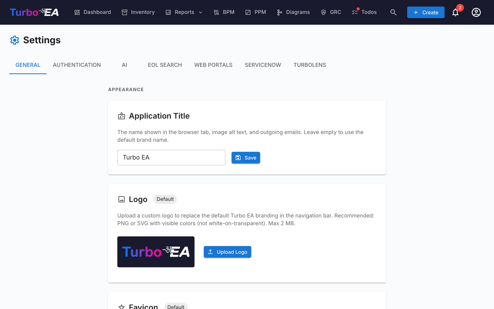

# Indstillinger

Siden **Indstillinger** under **Admin → Indstillinger** (`/admin/settings`) er det centrale konfigurationsknudepunkt. Den er organiseret som en række faneblade — vælg det rigtige faneblad fra tabellen nedenfor for den dedikerede gennemgang:

| Faneblad | URL | Hvad det styrer | Fuld vejledning |
|-----|-----|------------------|------------|
| **Generelt** | `/admin/settings?tab=general` | Udseende (logo, favicon, valuta, datoformat, aktiverede sprog, regnskabsår), SMTP-e-mail, **modulkontakter** (BPM, PPM, GRC, TurboLens, Sponsor button) | Denne side |
| **Autentificering** | `/admin/settings?tab=authentication` | SSO-udbydere, registrering, adgangskodepolitik | [Autentificering og SSO](sso.md) |
| **AI** | `/admin/settings?tab=ai` | LLM-udbyder, model, websøgningsbackend, AI-forslagskontakter pr. korttype | [AI-funktioner](ai.md) |
| **EOL** | `/admin/settings?tab=eol` | Massetilknytning af produkter til endoflife.date-poster | [End-of-Life (EOL)](eol.md) |
| **Webportaler** | `/admin/settings?tab=web-portals` | Offentlige skrivebeskyttede portal-slugs, synlighedsfiltre | [Webportaler](web-portals.md) |
| **ServiceNow** | `/admin/settings?tab=servicenow` | ServiceNow-forbindelse, synkroniseringskonfiguration, identitetskortlægning | [ServiceNow-integration](servicenow.md) |
| **TurboLens** | `/admin/settings?tab=turbolens` | TurboLens-specifikke kontakter, aktiverede reguleringer, analysepolling | Se afsnittet [TurboLens-indstillinger](#turbolens-indstillinger) nedenfor |

Resten af denne side dækker fanebladet **Generelt**.

## Udseende

### Logo

Upload et brugerdefineret logo, der vises i den øverste navigationslinje. Understøttede formater: PNG, JPEG, SVG, WebP, GIF. Klik på **Nulstil** for at vende tilbage til standard-Turbo EA-logoet.

### Favicon

Upload et brugerdefineret browserikon (favicon). Ændringen træder i kraft ved næste sideindlæsning. Klik på **Nulstil** for at vende tilbage til standardikonet.

### Valuta

Vælg den valuta, der bruges til omkostningsfelter på tværs af platformen. Dette påvirker, hvordan omkostningsværdier formateres på kortdetaljesider, i rapporter og eksporter. Over 40 valutaer er understøttet, herunder USD, EUR, GBP, JPY, CNY, CHF, INR, BRL, IDR og flere.

### Datoformat

Vælg, hvordan datoer vises i hele applikationen. Det valgte format gælder for kortets livscyklusdatoer, lagergittret, ADR- og SoAW-underskrevne datoer, Risikoregisteret, PPM-rapporter og -opgaver, BPM-procesflowversioner, kommentarer, historik, dashboardets aktivitetsfeed, notifikationer og admin-sider. Fem formater tilbydes med live forhåndsvisning, mens du vælger:

- `MM/DD/YYYY` — Amerikansk stil (f.eks. `04/29/2026`)
- `DD/MM/YYYY` — Europæisk stil (f.eks. `29/04/2026`)
- `YYYY-MM-DD` — ISO 8601 (f.eks. `2026-04-29`)
- `DD MMM YYYY` — standard (f.eks. `29 Apr 2026`)
- `MMM DD, YYYY` (f.eks. `Apr 29, 2026`)

Ændringer træder straks i kraft for alle — ingen genindlæsning påkrævet.

### Aktiverede sprog

Slå til, hvilke sprog der er tilgængelige for brugere i deres sprogvælger. Alle ni understøttede lokaliteter kan aktiveres eller deaktiveres individuelt:

- English, Deutsch, Français, Español, Italiano, Português, 中文, Русский, Dansk

Mindst ét sprog skal forblive aktiveret til enhver tid.

### Regnskabsårets start

Vælg den måned, der starter din organisations regnskabsår (januar til december). Denne indstilling påvirker, hvordan **budgetlinjer** i PPM-modulet grupperes efter regnskabsår. For eksempel, hvis regnskabsåret starter i april, tilhører en budgetlinje dateret juni 2026 regnskabsåret 2026-2027.

Standarden er **januar** (kalenderår = regnskabsår).

## Datahåndtering

Styr, hvor længe **arkiverede kort** opbevares, før de slettes permanent.

Når et kort arkiveres, skjules det fra oversigten, rapporter og relationer, men beholder hele sin historik og kan gendannes når som helst, før det udrenses.

| Felt | Beskrivelse |
|------|-------------|
| **Opbevaringsperiode (dage)** | Antal dage, et arkiveret kort opbevares, før det slettes permanent. Standardværdien er **30**. |
| **Behold arkiverede kort på ubestemt tid** | Når aktiveret (opbevaring sat til **0**), slettes arkiverede kort aldrig automatisk og opbevares — med deres historik — på ubestemt tid. |

Udrensningen kører hver time og genindlæser denne indstilling ved hver kørsel, så ændringer træder i kraft uden at genstarte applikationen. Arkiveringsbannere og bekræftelsesdialoger afspejler automatisk den konfigurerede periode.

## E-mail (SMTP)

Konfigurer e-maillevering til invitationsmails, undersøgelsesnotifikationer og andre systemmeddelelser.

| Felt | Beskrivelse |
|-------|-------------|
| **SMTP-vært** | Dit mailserverværtsnavn (f.eks. `smtp.gmail.com`) |
| **SMTP-port** | Serverport (typisk 587 for TLS) |
| **SMTP-bruger** | Autentificeringsbrugernavn |
| **SMTP-adgangskode** | Autentificeringsadgangskode (gemmes krypteret) |
| **Brug TLS** | Aktivér TLS-kryptering (anbefales) |
| **Fra-adresse** | Afsenderens e-mailadresse for udgående meddelelser |
| **App-basis-URL** | Den offentlige URL til din Turbo EA-instans (bruges i e-maillinks) |

Efter konfiguration skal du klikke på **Send test-e-mail** for at verificere, at indstillingerne fungerer korrekt.

!!! note
    E-mail er valgfri. Hvis SMTP ikke er konfigureret, vil funktioner, der sender e-mails (invitationer, undersøgelsesnotifikationer), elegant springe e-maillevering over.

## BPM-modul

Slå **Business Process Management**-modulet til eller fra. Når det er deaktiveret:

- **BPM**-navigationselementet skjules for alle brugere
- Business Process-kort forbliver i databasen, men BPM-specifikke funktioner (procesflow-editor, BPM-dashboard, BPM-rapporter) er ikke tilgængelige

Dette er nyttigt for organisationer, der ikke bruger BPM og ønsker en renere navigationsoplevelse.

## PPM-modul

Slå **Project Portfolio Management**-modulet til eller fra. Når det er deaktiveret:

- **PPM**-navigationselementet skjules for alle brugere
- Initiativ-kort forbliver i databasen, men PPM-specifikke funktioner (statusrapporter, budget- og omkostningssporing, risikoregister, opgavetavle, Gantt-diagram) er ikke tilgængelige

Når det er aktiveret, får Initiativ-kort en **PPM**-fane i deres detaljevisning, og PPM-porteføljedashboardet bliver tilgængeligt i hovednavigationen. Se [Project Portfolio Management](../guide/ppm.md) for den fulde funktionsvejledning.

## GRC-modul

Slå **Governance, Risk and Compliance**-modulet til eller fra. Når det er deaktiveret:

- **GRC**-navigationselementet skjules for alle brugere
- Arbejdsområdet `/grc` (Governance-principper og ADR'er, Risikoregister, Compliance-fund) er utilgængeligt og viser standardpladsholderen "modul deaktiveret" for alle med et direkte link
- Fanebladene **Risici** og **Compliance** på Kortdetalje skjules, så individuelle kort heller ikke længere viser GRC-data
- Risici og compliance-fund forbliver i databasen — de underliggende `risks.*`- og `compliance.*`-tilladelser er uændrede, så dataene bevares og dukker uændret op igen, hvis modulet aktiveres på ny

Se [GRC-vejledningen](../guide/grc.md) for den fulde funktionsreference.

## Støt-knap

Vis eller skjul **Støt**-knappen i brugermenuen (avatar). Når den er skjult, ser brugerne ikke længere Støt-knappen i deres profilmenu. Støt-knappen — og dialogen, der forklarer, hvordan man støtter Turbo EA — er altid tilgængelig fra dette indstillingspanel, så administratorer stadig kan nå den, selv når den er skjult i menuen.

Hvis din virksomhed sponsorerer Turbo EA og gerne vil have sit logo vist på turbo-ea.org, så kontakt [sponsorship@turbo-ea.org](mailto:sponsorship@turbo-ea.org).

## TurboLens-indstillinger

Fanebladet **TurboLens** samler de kontakter, der styrer AI-analysefladen. I modsætning til de modulvise omskiftere ovenfor er TurboLens **ikke** en binær til/fra — den er "klar", når både en AI-udbyder er konfigureret (under fanebladet **AI**), og analysedataene er synkroniseret mindst én gang. Siden eksponerer også:

- **Aktiverede reguleringer** — sæt flueben ved, hvilke af de seks indbyggede rammer (EU AI Act, GDPR, NIS2, DORA, SOC 2, ISO 27001) der deltager i [Compliance-scanninger](../guide/compliance.md). Brugerdefinerede reguleringer defineret under **Metamodel → Reguleringer** kan også aktiveres her.
- **Analyse-polling-kadence** — hvor ofte UI'et re-poller langvarige TurboLens-analyser for fremskridt. Højere kadence = lavere oplevet latency, mere API-belastning.
- **Resultatcache-TTL** — hvor længe afsluttede analyseresultater caches, før knappen **Kør analyse** aktiveres igen.

Se [TurboLens AI Intelligence](../guide/turbolens.md) for den fulde funktionsflade og [Compliance](../guide/compliance.md) for scanningsarbejdsprocessen.
