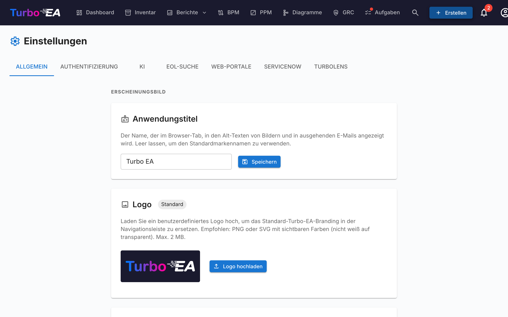

# Einstellungen

Die **Einstellungen**-Seite unter **Admin → Einstellungen** (`/admin/settings`) ist die zentrale Konfigurationsstelle. Sie ist in Reiter organisiert — wähle den passenden Reiter aus der Tabelle unten für den entsprechenden Deep Dive:

| Reiter | URL | Was er steuert | Vollständige Anleitung |
|--------|-----|----------------|------------------------|
| **Allgemein** | `/admin/settings?tab=general` | Erscheinungsbild (Logo, Favicon, Währung, Datumsformat, aktivierte Sprachen, Geschäftsjahr), E-Mail-Versand, **Modul-Schalter** (BPM, PPM, GRC, TurboLens, Sponsor button) | Diese Seite |
| **Authentifizierung** | `/admin/settings?tab=authentication` | SSO-Provider, Registrierung, Passwortrichtlinie | [Authentifizierung & SSO](sso.md) |
| **KI** | `/admin/settings?tab=ai` | LLM-Provider, Modell, Websuch-Backend, Pro-Kartentyp-KI-Suggestionsschalter | [KI-Funktionen](ai.md) |
| **EOL** | `/admin/settings?tab=eol` | Massen-Verknüpfung von Produkten zu endoflife.date-Einträgen | [End-of-Life (EOL)](eol.md) |
| **Webportale** | `/admin/settings?tab=web-portals` | Öffentliche schreibgeschützte Portal-Slugs, Sichtbarkeits-Filter | [Webportale](web-portals.md) |
| **ServiceNow** | `/admin/settings?tab=servicenow` | ServiceNow-Verbindung, Sync-Konfiguration, Identitäts-Mapping | [ServiceNow-Integration](servicenow.md) |
| **TurboLens** | `/admin/settings?tab=turbolens` | TurboLens-spezifische Schalter, aktivierte Regulierungen, Analyse-Polling | Siehe Abschnitt [TurboLens-Einstellungen](#turbolens-einstellungen) unten |

Der Rest dieser Seite behandelt den **Allgemein**-Reiter.

## Erscheinungsbild

### Logo

Laden Sie ein benutzerdefiniertes Logo hoch, das in der oberen Navigationsleiste erscheint. Unterstützte Formate: PNG, JPEG, SVG, WebP, GIF. Klicken Sie auf **Zurücksetzen**, um zum Standard-Turbo-EA-Logo zurückzukehren.

### Stil der Navigationsleiste

Wählen Sie Hintergrund- und Textfarbe der oberen Navigationsleiste. Der gewählte Stil gilt für **alle Benutzer** der Instanz, auf Desktop und Mobilgeräten (einschließlich des mobilen Menüs). Wählen Sie eine der sieben kuratierten Voreinstellungen — Marineblau (Standard), Hell, Anthrazit, Schiefer, Blau, Waldgrün oder Pflaume — oder wählen Sie **Benutzerdefiniert**, um Hintergrund- und Textfarbe frei über die Farbwähler festzulegen. Eine Live-Vorschau zeigt vor dem Speichern, wie die Navigationsleiste aussehen wird, und eine Warnung erscheint, wenn der Kontrast zwischen Text und Hintergrund zu gering ist (unter WCAG AA). Klicken Sie auf **Auf Standard zurücksetzen**, um zum Standard zurückzukehren.

### Favicon

Laden Sie ein benutzerdefiniertes Browser-Symbol (Favicon) hoch. Die Änderung wird beim nächsten Seitenaufruf wirksam. Klicken Sie auf **Zurücksetzen**, um zum Standardsymbol zurückzukehren.

### Währung

Wählen Sie die Währung, die für Kostenfelder in der gesamten Plattform verwendet wird. Dies beeinflusst, wie Kostenwerte auf Kartendetailseiten, in Berichten und Exporten formatiert werden. Über 40 Währungen werden unterstützt, darunter USD, EUR, GBP, JPY, CNY, CHF, INR, BRL, IDR und mehr.

### Datumsformat

Wählen Sie, wie Datumsangaben in der gesamten Anwendung dargestellt werden. Das gewählte Format gilt für Lebenszyklus-Daten von Karten, das Inventar-Grid, signierte ADR- und SoAW-Dokumente, das Risikoregister, PPM-Berichte und -Aufgaben, BPM-Prozessflussversionen, Kommentare, Verlauf, den Aktivitätsstrom des Dashboards, Benachrichtigungen und Admin-Seiten. Fünf Formate stehen mit Live-Vorschau zur Auswahl:

- `MM/DD/YYYY` — US-Stil (z. B. `04/29/2026`)
- `DD/MM/YYYY` — Europäischer Stil (z. B. `29/04/2026`)
- `YYYY-MM-DD` — ISO 8601 (z. B. `2026-04-29`)
- `DD MMM YYYY` — Standard (z. B. `29 Apr 2026`)
- `MMM DD, YYYY` (z. B. `Apr 29, 2026`)

Änderungen werden für alle Benutzer sofort wirksam — kein Neuladen erforderlich.

### Aktivierte Sprachen

Schalten Sie um, welche Sprachen den Benutzern in ihrer Sprachauswahl zur Verfügung stehen. Alle acht unterstützten Gebietsschemas können einzeln aktiviert oder deaktiviert werden:

- English, Deutsch, Français, Español, Italiano, Português, 中文, Русский

Mindestens eine Sprache muss jederzeit aktiviert bleiben.

### Beginn des Geschäftsjahres

Wählen Sie den Monat, in dem das Geschäftsjahr Ihrer Organisation beginnt (Januar bis Dezember). Diese Einstellung beeinflusst, wie **Budgetzeilen** im PPM-Modul nach Geschäftsjahr gruppiert werden. Wenn das Geschäftsjahr beispielsweise im April beginnt, gehört eine Budgetzeile vom Juni 2026 zum GJ 2026–2027.

Der Standardwert ist **Januar** (Kalenderjahr = Geschäftsjahr).

## Datenverwaltung

Legen Sie fest, wie lange **archivierte Karten** aufbewahrt werden, bevor sie endgültig gelöscht werden.

Wenn eine Karte archiviert wird, ist sie im Inventar, in Berichten und in Beziehungen ausgeblendet, behält aber ihre vollständige Historie und kann jederzeit vor der Bereinigung wiederhergestellt werden.

| Feld | Beschreibung |
|------|--------------|
| **Aufbewahrungsdauer (Tage)** | Anzahl der Tage, die eine archivierte Karte aufbewahrt wird, bevor sie endgültig gelöscht wird. Der Standardwert ist **30**. |
| **Archivierte Karten unbegrenzt aufbewahren** | Wenn aktiviert (Aufbewahrung auf **0** gesetzt), werden archivierte Karten nie automatisch gelöscht und – mitsamt ihrer Historie – unbegrenzt aufbewahrt. |

Die Bereinigung läuft stündlich und liest diese Einstellung bei jedem Durchlauf neu, sodass Änderungen ohne Neustart der Anwendung wirksam werden. Archiv-Banner und Bestätigungsdialoge zeigen die konfigurierte Dauer automatisch an.

## E-Mail

Turbo EA versendet Einladungs-E-Mails, Umfrage-Benachrichtigungen, Passwort-Zurücksetzungen und andere Systemnachrichten. Wählen Sie eine **Versandmethode**, die zu Ihrer Mail-Plattform passt.

!!! warning "Basis-SMTP-Authentifizierung wird abgeschafft"
    Microsoft 365 deaktiviert die Basis-SMTP-Authentifizierung (für neue Mandanten nicht verfügbar, für bestehende über 2026–2027 entfernt), und Google Workspace hat sie im März 2025 deaktiviert. Verwenden Sie für diese Plattformen eine der untenstehenden OAuth-Methoden anstelle eines Postfachpassworts.

### Versandmethoden

| Methode | Wann verwenden |
|---------|----------------|
| **SMTP (Benutzername & Passwort)** | Klassisches SMTP für Server, die weiterhin Basisauthentifizierung akzeptieren. Der Standard. |
| **SMTP mit OAuth 2.0 (XOAUTH2)** | SMTP, authentifiziert mit einem kurzlebigen OAuth-Token — Microsoft 365 (App-only) oder Google Workspace (Dienstkonto). |
| **Microsoft Graph API** | App-only Microsoft Graph `sendMail`. Die empfohlene Microsoft-365-Option — kein SMTP, kein gespeichertes Passwort. |

### Gemeinsame Felder

| Feld | Beschreibung |
|------|--------------|
| **Absenderadresse** | Die Absenderadresse für ausgehende Nachrichten |
| **App-Basis-URL** | Die öffentliche URL Ihrer Instanz (für Links in E-Mails) |

### SMTP (Benutzername & Passwort)

| Feld | Beschreibung |
|------|--------------|
| **SMTP-Host** | Hostname Ihres Mailservers (z. B. `smtp.gmail.com`) |
| **SMTP-Port** | Server-Port (üblicherweise 587 für TLS) |
| **SMTP-Benutzer** | Authentifizierungs-Benutzername |
| **SMTP-Passwort** | Authentifizierungspasswort (verschlüsselt gespeichert) |
| **TLS verwenden** | STARTTLS-Verschlüsselung aktivieren (empfohlen) |

### Microsoft Graph API (empfohlen für Microsoft 365)

1. Erstellen Sie unter **Microsoft Entra ID → App-Registrierungen** eine dedizierte App-Registrierung.
2. Fügen Sie unter **API-Berechtigungen** die **Anwendungsberechtigung** **Mail.Send** hinzu und erteilen Sie die **Administratoreinwilligung**.
3. Erstellen Sie unter **Zertifikate & Geheimnisse** ein **Client-Geheimnis**.
4. Wählen Sie in Turbo EA **Microsoft Graph API** und geben Sie **Mandanten-ID**, **Client-ID**, **Client-Geheimnis** und das **Absenderpostfach** (den User Principal Name, von dem gesendet wird) ein.

Es wird kein Postfachpasswort gespeichert; Turbo EA fordert für jeden Versand ein kurzlebiges Token an.

Die **Absenderadresse** ist bei Graph optional: Belassen Sie sie auf dem Standardwert, um als Absenderpostfach zu senden. Eine abweichende Adresse erfordert eine **Send-As-Berechtigung** für diese Adresse auf dem Absenderpostfach.

### SMTP mit OAuth 2.0

- **Microsoft 365:** Geben Sie **Mandanten-ID**, **Client-ID** und **Client-Geheimnis** einer App-Registrierung sowie das **Absenderpostfach** ein. SMTP AUTH muss für das Postfach aktiviert sein.
- **Google Workspace:** Wählen Sie **Google**, fügen Sie den **Dienstkontoschlüssel (JSON)** mit aktivierter domänenweiter Delegierung für das Absenderpostfach ein und legen Sie das zu imitierende **Absenderpostfach** fest.

Die Felder **Bereich** und **Token-Endpunkt** sind optionale Überschreibungen — lassen Sie sie leer, sofern Ihr Mandant keine benutzerdefinierten Werte erfordert.

Klicken Sie nach der Konfiguration auf **Test-E-Mail senden**, um die Funktion zu überprüfen.

!!! note
    E-Mail ist optional. Wenn keine Methode konfiguriert ist, überspringen Funktionen, die E-Mails senden, die Zustellung ohne Fehler.

## BPM-Modul

Schalten Sie das **Business Process Management**-Modul ein oder aus. Wenn deaktiviert:

- Der **BPM**-Navigationspunkt wird für alle Benutzer ausgeblendet
- Geschäftsprozess-Karten verbleiben in der Datenbank, aber BPM-spezifische Funktionen (Prozessfluss-Editor, BPM-Dashboard, BPM-Berichte) sind nicht zugänglich

Dies ist nützlich für Organisationen, die BPM nicht nutzen und eine übersichtlichere Navigation wünschen.

## PPM-Modul

Schalten Sie das **Projektportfoliomanagement**-Modul (PPM) ein oder aus. Wenn deaktiviert:

- Der **PPM**-Navigationspunkt wird für alle Benutzer ausgeblendet
- Initiativen-Karten verbleiben in der Datenbank, aber PPM-spezifische Funktionen (Statusberichte, Budget- und Kostenverfolgung, Risikoregister, Aufgabentafel, Gantt-Diagramm) sind nicht zugänglich

Wenn aktiviert, erhalten Initiativen-Karten einen **PPM**-Tab in ihrer Detailansicht und das PPM-Portfolio-Dashboard wird in der Hauptnavigation verfügbar. Siehe [Projektportfoliomanagement](../guide/ppm.md) für die vollständige Funktionsübersicht.

## GRC-Modul

Schalten Sie das **Governance, Risk and Compliance**-Modul (GRC) ein oder aus. Wenn deaktiviert:

- Der **GRC**-Navigationspunkt wird für alle Benutzer ausgeblendet
- Der Arbeitsbereich `/grc` (Governance-Prinzipien und ADRs, Risikoregister, Compliance-Findings) ist nicht erreichbar und zeigt für jeden direkten Link den Standard-Platzhalter „Modul deaktiviert"
- Die **Risiken**- und **Compliance**-Reiter in der Kartendetailansicht werden ausgeblendet, sodass auch einzelne Karten keine GRC-Daten mehr anzeigen
- Risiken und Compliance-Findings verbleiben in der Datenbank — die zugrunde liegenden Berechtigungen `risks.*` und `compliance.*` bleiben unverändert, sodass die Daten erhalten bleiben und unverändert wieder erscheinen, wenn das Modul erneut aktiviert wird

Siehe den [GRC-Leitfaden](../guide/grc.md) für die vollständige Funktionsübersicht.

## Sponsor-Schaltfläche

Blenden Sie die **Sponsor**-Schaltfläche im Benutzermenü (Avatar) ein oder aus. Wenn sie ausgeblendet ist, sehen Benutzer die Sponsor-Schaltfläche nicht mehr in ihrem Profilmenü. Die Sponsor-Schaltfläche — und der Dialog, der erklärt, wie man Turbo EA unterstützt — bleibt in diesem Einstellungsbereich immer verfügbar, sodass Administratoren sie auch dann erreichen, wenn sie im Menü ausgeblendet ist.

Wenn Ihr Unternehmen Turbo EA sponsert und sein Logo auf turbo-ea.org präsentieren möchte, wenden Sie sich an [sponsorship@turbo-ea.org](mailto:sponsorship@turbo-ea.org).

## TurboLens-Einstellungen

Der **TurboLens**-Reiter bündelt die Schalter, die die KI-Analyse-Oberfläche regeln. Anders als die per-Modul-Schalter oben ist TurboLens **kein** binäres An/Aus — es ist «bereit», wenn sowohl ein KI-Provider konfiguriert ist (unter dem **KI**-Reiter) als auch die Analyse-Daten mindestens einmal synchronisiert wurden. Die Seite exponiert ausserdem:

- **Aktivierte Regulierungen** — markiere, welche der sechs eingebauten Frameworks (EU AI Act, GDPR, NIS2, DORA, SOC 2, ISO 27001) an [Compliance-Scans](../guide/compliance.md) teilnehmen. Eigene unter **Metamodell → Regulierungen** definierte Regulierungen können hier ebenfalls aktiviert werden.
- **Analyse-Polling-Kadenz** — wie oft die UI lang laufende TurboLens-Analysen auf Fortschritt erneut abfragt. Höhere Kadenz = geringere wahrgenommene Latenz, mehr API-Last.
- **Ergebnis-Cache-TTL** — wie lange abgeschlossene Analyseergebnisse zwischengespeichert werden, bevor der **Analyse ausführen**-Button wieder aktiviert wird.

Siehe [TurboLens KI-Intelligenz](../guide/turbolens.md) für die vollständige Funktionsoberfläche und [Compliance](../guide/compliance.md) für den Scan-Workflow.
