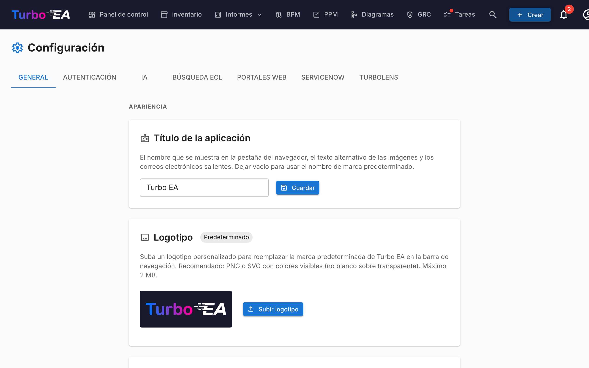

# Configuración

La página de **Configuración** en **Administrador → Configuración** (`/admin/settings`) es el hub central de configuración. Está organizada en pestañas — elige la pestaña adecuada de la tabla siguiente para el desarrollo dedicado:

| Pestaña | URL | Qué controla | Guía completa |
|---------|-----|--------------|---------------|
| **General** | `/admin/settings?tab=general` | Apariencia (logo, favicon, moneda, formato de fecha, idiomas habilitados, año fiscal), envío de correo, **interruptores de módulos** (BPM, PPM, GRC, TurboLens, Sponsor button) | Esta página |
| **Autenticación** | `/admin/settings?tab=authentication` | Proveedores SSO, registro, política de contraseñas | [Autenticación y SSO](sso.md) |
| **IA** | `/admin/settings?tab=ai` | Proveedor LLM, modelo, backend de búsqueda web, interruptores de sugerencia IA por tipo de tarjeta | [Capacidades de IA](ai.md) |
| **EOL** | `/admin/settings?tab=eol` | Vinculación masiva de productos a entradas de endoflife.date | [Fin de vida (EOL)](eol.md) |
| **Portales web** | `/admin/settings?tab=web-portals` | Slugs de portal público de solo lectura, filtros de visibilidad | [Portales web](web-portals.md) |
| **ServiceNow** | `/admin/settings?tab=servicenow` | Conexión ServiceNow, configuración de sincronización, mapeo de identidad | [Integración con ServiceNow](servicenow.md) |
| **TurboLens** | `/admin/settings?tab=turbolens` | Interruptores específicos de TurboLens, regulaciones habilitadas, sondeo de análisis | Ver la sección [Configuración de TurboLens](#configuracion-de-turbolens) más abajo |

El resto de esta página cubre la pestaña **General**.

## Apariencia

### Logotipo

Cargue un logotipo personalizado que aparecerá en la barra de navegación superior. Formatos compatibles: PNG, JPEG, SVG, WebP, GIF. Haga clic en **Restablecer** para volver al logotipo predeterminado de Turbo EA.

### Estilo de la barra de navegación

Elija los colores de fondo y de texto de la barra de navegación superior. El estilo elegido se aplica a **todos los usuarios** de la instancia, en escritorio y móvil (incluido el menú lateral móvil). Seleccione uno de los siete estilos predefinidos — Azul marino (predeterminado), Claro, Carbón, Pizarra, Azul, Verde bosque o Ciruela — o elija **Personalizado** para definir libremente los colores de fondo y de texto con los selectores de color. Una vista previa en vivo muestra cómo se verá la barra de navegación antes de guardar, y aparece una advertencia cuando el contraste entre el texto y el fondo es demasiado bajo (por debajo de WCAG AA). Haga clic en **Restablecer valores predeterminados** para volver al estilo predeterminado.

### Favicon

Cargue un icono de navegador personalizado (favicon). El cambio se aplicará en la siguiente carga de página. Haga clic en **Restablecer** para volver al icono predeterminado.

### Moneda

Seleccione la moneda utilizada para los campos de costo en toda la plataforma. Esto afecta a cómo se formatean los valores de costo en las páginas de detalle de fichas, informes y exportaciones. Se admiten más de 40 monedas, incluyendo USD, EUR, GBP, JPY, CNY, CHF, INR, BRL, IDR, entre otras.

### Formato de fecha

Elija cómo se muestran las fechas en toda la aplicación. El formato seleccionado se aplica a las fechas de ciclo de vida de las fichas, a la cuadrícula de inventario, a las firmas de ADR y SoAW, al Registro de Riesgos, a los informes y tareas de PPM, a las versiones de flujos de procesos BPM, a los comentarios, al historial, al panel de actividad del dashboard, a las notificaciones y a las páginas de administración. Se ofrecen cinco formatos con vista previa en vivo:

- `MM/DD/YYYY` — estilo EE. UU. (p. ej. `04/29/2026`)
- `DD/MM/YYYY` — estilo europeo (p. ej. `29/04/2026`)
- `YYYY-MM-DD` — ISO 8601 (p. ej. `2026-04-29`)
- `DD MMM YYYY` — predeterminado (p. ej. `29 abr 2026`)
- `MMM DD, YYYY` (p. ej. `abr 29, 2026`)

Los cambios surten efecto de inmediato para todos los usuarios — no se requiere recargar la página.

### Idiomas Habilitados

Active o desactive los idiomas disponibles para los usuarios en su selector de idioma. Los ocho idiomas soportados pueden habilitarse o deshabilitarse individualmente:

- English, Deutsch, Français, Español, Italiano, Português, 中文, Русский

Al menos un idioma debe permanecer habilitado en todo momento.

### Inicio del Año Fiscal

Seleccione el mes en que comienza el año fiscal de su organización (enero a diciembre). Esta configuración afecta cómo se agrupan las **líneas de presupuesto** en el módulo PPM por año fiscal. Por ejemplo, si el año fiscal comienza en abril, una línea de presupuesto de junio de 2026 pertenece al AF 2026–2027.

El valor predeterminado es **enero** (año calendario = año fiscal).

## Gestión de datos

Controle cuánto tiempo se conservan las **fichas archivadas** antes de eliminarse permanentemente.

Cuando una ficha se archiva, queda oculta en el inventario, los informes y las relaciones, pero conserva todo su historial y puede restaurarse en cualquier momento antes de su purga.

| Campo | Descripción |
|-------|-------------|
| **Período de retención (días)** | Número de días que se conserva una ficha archivada antes de eliminarse permanentemente. El valor predeterminado es **30**. |
| **Conservar las fichas archivadas indefinidamente** | Cuando se activa (retención establecida en **0**), las fichas archivadas nunca se eliminan automáticamente y se conservan —con su historial— indefinidamente. |

La purga se ejecuta cada hora y vuelve a leer este ajuste en cada ejecución, por lo que los cambios surten efecto sin reiniciar la aplicación. Los avisos de archivado y los cuadros de diálogo de confirmación reflejan automáticamente el período configurado.

## Correo Electrónico

Turbo EA envía correos de invitación, notificaciones de encuestas, restablecimientos de contraseña y otros mensajes del sistema. Elija un **método de envío** que se ajuste a su plataforma de correo.

!!! warning "La autenticación SMTP básica se está retirando"
    Microsoft 365 está deshabilitando la autenticación SMTP básica (no disponible para inquilinos nuevos, eliminada para los existentes durante 2026–2027) y Google Workspace la deshabilitó en marzo de 2025. Para esas plataformas, use uno de los métodos OAuth a continuación en lugar de una contraseña de buzón.

### Métodos de envío

| Método | Cuándo usarlo |
|--------|---------------|
| **SMTP (usuario y contraseña)** | SMTP clásico para servidores que aún aceptan autenticación básica. El predeterminado. |
| **SMTP con OAuth 2.0 (XOAUTH2)** | SMTP autenticado con un token OAuth de corta duración — Microsoft 365 (solo aplicación) o Google Workspace (cuenta de servicio). |
| **API de Microsoft Graph** | `sendMail` de Microsoft Graph solo de aplicación. La opción recomendada para Microsoft 365 — sin SMTP, sin contraseña almacenada. |

### Campos comunes

| Campo | Descripción |
|-------|-------------|
| **Dirección de remitente** | La dirección del remitente de los mensajes salientes |
| **URL base de la aplicación** | La URL pública de su instancia (usada en los enlaces de los correos) |

### SMTP (usuario y contraseña)

| Campo | Descripción |
|-------|-------------|
| **Host SMTP** | El nombre de host de su servidor de correo (p. ej., `smtp.gmail.com`) |
| **Puerto SMTP** | El puerto del servidor (normalmente 587 para TLS) |
| **Usuario SMTP** | El nombre de usuario de autenticación |
| **Contraseña SMTP** | La contraseña de autenticación (almacenada cifrada) |
| **Usar TLS** | Habilitar el cifrado STARTTLS (recomendado) |

### API de Microsoft Graph (recomendada para Microsoft 365)

1. En **Microsoft Entra ID → Registros de aplicaciones**, cree un registro de aplicación dedicado.
2. En **Permisos de API**, agregue el permiso **de aplicación** **Mail.Send** y otorgue el **consentimiento del administrador**.
3. Cree un **secreto de cliente** en **Certificados y secretos**.
4. En Turbo EA, elija **API de Microsoft Graph** e introduzca el **ID de inquilino**, el **ID de cliente**, el **secreto de cliente** y el **buzón de remitente** (el nombre principal de usuario desde el que se envía el correo).

No se almacena ninguna contraseña de buzón; Turbo EA solicita un token de corta duración para cada envío.

La **dirección de remitente** es opcional con Graph: déjela en el valor predeterminado para enviar como el buzón de remitente. Definir una dirección diferente requiere un permiso de **Send As** para esa dirección en el buzón de remitente.

### SMTP con OAuth 2.0

- **Microsoft 365:** introduzca el **ID de inquilino**, el **ID de cliente** y el **secreto de cliente** de un registro de aplicación, además del **buzón de remitente**. SMTP AUTH debe estar habilitado para el buzón.
- **Google Workspace:** elija **Google**, pegue la **clave de cuenta de servicio (JSON)** con la delegación en todo el dominio habilitada para el buzón de remitente, y establezca el **buzón de remitente** que se suplantará.

Los campos **Ámbito** y **Punto de conexión de token** son anulaciones opcionales — déjelos vacíos a menos que su inquilino requiera valores personalizados.

Después de configurar cualquier método, haga clic en **Enviar correo de prueba** para verificar que funciona.

!!! note
    El correo es opcional. Si no se configura ningún método, las funciones que envían correos omiten la entrega de forma silenciosa.

## Módulo BPM

Active o desactive el módulo de **Gestión de Procesos de Negocio** (BPM). Cuando está desactivado:

- El elemento de navegación **BPM** se oculta para todos los usuarios
- Las fichas de Proceso de Negocio permanecen en la base de datos, pero las funciones específicas de BPM (editor de flujos de proceso, panel de control BPM, informes BPM) no están accesibles

Esto es útil para organizaciones que no utilizan BPM y desean una experiencia de navegación más limpia.

## Módulo PPM

Active o desactive el módulo de **Gestión de Portafolio de Proyectos** (PPM). Cuando está desactivado:

- El elemento de navegación **PPM** se oculta para todos los usuarios
- Las fichas de Iniciativa permanecen en la base de datos, pero las funciones específicas de PPM (informes de estado, seguimiento de presupuesto y costos, registro de riesgos, tablero de tareas, diagrama de Gantt) no están accesibles

Cuando está habilitado, las fichas de Iniciativa obtienen una pestaña **PPM** en su vista de detalle y el panel de portafolio PPM está disponible en la navegación principal. Consulte [Gestión de Portafolio de Proyectos](../guide/ppm.md) para la guía completa de funciones.

## Módulo GRC

Active o desactive el módulo de **Gobernanza, Riesgo y Cumplimiento** (GRC). Cuando está desactivado:

- El elemento de navegación **GRC** se oculta para todos los usuarios
- El espacio `/grc` (principios de Gobernanza y ADRs, Registro de Riesgos, hallazgos de Cumplimiento) deja de ser accesible y muestra el marcador estándar de «módulo deshabilitado» para quien llegue por un enlace directo
- Las pestañas **Riesgos** y **Cumplimiento** en el detalle de la ficha se ocultan, de modo que las fichas individuales tampoco siguen mostrando datos de GRC
- Los riesgos y los hallazgos de cumplimiento permanecen en la base de datos — los permisos subyacentes `risks.*` y `compliance.*` no cambian, de modo que los datos se preservan y vuelven a aparecer sin cambios si el módulo se reactiva

Consulte la [guía de GRC](../guide/grc.md) para la referencia completa de funciones.

## Botón Patrocinar

Muestra u oculta el botón **Patrocinar** en el menú de usuario (avatar). Cuando está oculto, los usuarios ya no ven el botón Patrocinar en su menú de perfil. El botón Patrocinar — y el cuadro de diálogo que explica cómo apoyar Turbo EA — siempre permanece disponible desde este panel de configuración, por lo que los administradores aún pueden acceder a él incluso cuando está oculto en el menú.

Si tu empresa patrocina Turbo EA y desea que su logotipo aparezca en turbo-ea.org, escribe a [sponsorship@turbo-ea.org](mailto:sponsorship@turbo-ea.org).

## Configuración de TurboLens

La pestaña **TurboLens** agrupa los interruptores que gobiernan la superficie de análisis IA. A diferencia de los interruptores por módulo de arriba, TurboLens **no** es un on/off binario — está «listo» cuando tanto un proveedor IA está configurado (bajo la pestaña **IA**) como los datos de análisis se han sincronizado al menos una vez. La página también expone:

- **Regulaciones habilitadas** — marca cuáles de los seis frameworks integrados (EU AI Act, RGPD, NIS2, DORA, SOC 2, ISO 27001) participan en los [escaneos de Cumplimiento](../guide/compliance.md). Las regulaciones personalizadas definidas bajo **Metamodelo → Regulaciones** también pueden habilitarse aquí.
- **Cadencia de sondeo de análisis** — con qué frecuencia la UI vuelve a sondear los análisis TurboLens de larga duración en busca de progreso. Mayor cadencia = menor latencia percibida, más carga de API.
- **TTL de caché de resultados** — cuánto tiempo se cachean los resultados de análisis completados antes de que el botón **Ejecutar análisis** se vuelva a habilitar.

Consulta [Inteligencia IA TurboLens](../guide/turbolens.md) para la superficie de funciones completa y [Cumplimiento](../guide/compliance.md) para el flujo de escaneo.
