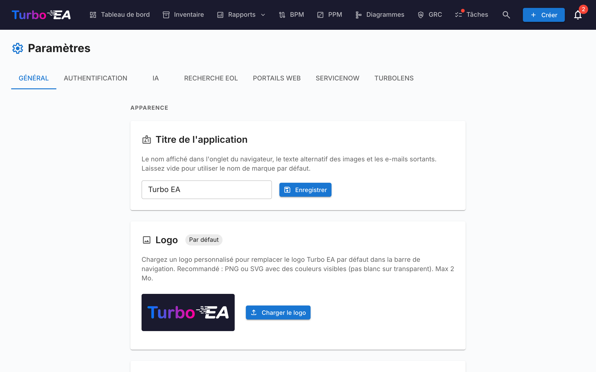

# Paramètres

La page **Paramètres** sous **Admin → Paramètres** (`/admin/settings`) est le hub central de configuration. Elle est organisée en onglets — choisissez l'onglet approprié dans le tableau ci-dessous pour l'approfondissement dédié :

| Onglet | URL | Ce qu'il contrôle | Guide complet |
|--------|-----|-------------------|---------------|
| **Général** | `/admin/settings?tab=general` | Apparence (logo, favicon, devise, format de date, langues activées, année fiscale), envoi d'e-mails, **bascules de modules** (BPM, PPM, GRC, TurboLens, Sponsor button) | Cette page |
| **Authentification** | `/admin/settings?tab=authentication` | Fournisseurs SSO, inscription, politique de mot de passe | [Authentification & SSO](sso.md) |
| **IA** | `/admin/settings?tab=ai` | Fournisseur LLM, modèle, backend de recherche web, bascules de suggestion IA par type de fiche | [Capacités IA](ai.md) |
| **EOL** | `/admin/settings?tab=eol` | Liaison en masse des produits aux entrées endoflife.date | [Fin de vie (EOL)](eol.md) |
| **Portails web** | `/admin/settings?tab=web-portals` | Slugs de portail en lecture seule, filtres de visibilité | [Portails web](web-portals.md) |
| **ServiceNow** | `/admin/settings?tab=servicenow` | Connexion ServiceNow, configuration de synchronisation, mappage d'identité | [Intégration ServiceNow](servicenow.md) |
| **TurboLens** | `/admin/settings?tab=turbolens` | Bascules spécifiques à TurboLens, réglementations activées, sondage d'analyses | Voir la section [Paramètres TurboLens](#parametres-turbolens) ci-dessous |

Le reste de cette page couvre l'onglet **Général**.

## Apparence

### Logo

Téléchargez un logo personnalisé qui apparaît dans la barre de navigation supérieure. Formats pris en charge : PNG, JPEG, SVG, WebP, GIF. Cliquez sur **Réinitialiser** pour revenir au logo Turbo EA par défaut.

### Style de la barre de navigation

Choisissez les couleurs d'arrière-plan et de texte de la barre de navigation supérieure. Le style choisi s'applique à **tous les utilisateurs** de l'instance, sur ordinateur comme sur mobile (y compris le menu latéral mobile). Sélectionnez l'un des sept préréglages — Bleu marine (par défaut), Clair, Anthracite, Ardoise, Bleu, Vert forêt ou Prune — ou choisissez **Personnalisé** pour définir librement les couleurs d'arrière-plan et de texte avec les sélecteurs de couleurs. Un aperçu en direct montre l'apparence de la barre de navigation avant l'enregistrement, et un avertissement apparaît lorsque le contraste entre le texte et l'arrière-plan est trop faible (inférieur à WCAG AA). Cliquez sur **Réinitialiser par défaut** pour revenir au style par défaut.

### Favicon

Téléchargez une icône de navigateur personnalisée (favicon). Le changement prend effet au prochain chargement de page. Cliquez sur **Réinitialiser** pour revenir à l'icône par défaut.

### Devise

Sélectionnez la devise utilisée pour les champs de coût dans toute la plateforme. Cela affecte la manière dont les valeurs de coût sont formatées dans les pages de détail des fiches, les rapports et les exports. Plus de 40 devises sont prises en charge, incluant USD, EUR, GBP, JPY, CNY, CHF, INR, BRL, IDR, et plus.

### Format de date

Choisissez la manière dont les dates sont affichées dans toute l'application. Le format sélectionné s'applique aux dates de cycle de vie des fiches, à l'inventaire, aux signatures ADR et SoAW, au registre des risques, aux rapports et tâches PPM, aux versions de flux de processus BPM, aux commentaires, à l'historique, au flux d'activité du tableau de bord, aux notifications et aux pages d'administration. Cinq formats sont proposés avec un aperçu en direct :

- `MM/DD/YYYY` — style US (ex. `04/29/2026`)
- `DD/MM/YYYY` — style européen (ex. `29/04/2026`)
- `YYYY-MM-DD` — ISO 8601 (ex. `2026-04-29`)
- `DD MMM YYYY` — par défaut (ex. `29 avr. 2026`)
- `MMM DD, YYYY` (ex. `avr. 29, 2026`)

Les changements prennent effet immédiatement pour tous — aucun rechargement nécessaire.

### Langues activées

Basculez les langues disponibles pour les utilisateurs dans leur sélecteur de langue. Les huit langues supportées peuvent être activées ou désactivées individuellement :

- English, Deutsch, Français, Español, Italiano, Português, 中文, Русский

Au moins une langue doit rester activée en permanence.

### Début de l'exercice fiscal

Sélectionnez le mois de début de l'exercice fiscal de votre organisation (janvier à décembre). Ce paramètre affecte le regroupement des **lignes budgétaires** dans le module PPM par exercice fiscal. Par exemple, si l'exercice fiscal commence en avril, une ligne budgétaire de juin 2026 appartient à l'EF 2026–2027.

La valeur par défaut est **janvier** (année civile = exercice fiscal).

## Gestion des données

Définissez la durée de conservation des **fiches archivées** avant leur suppression définitive.

Lorsqu'une fiche est archivée, elle est masquée de l'inventaire, des rapports et des relations, mais conserve tout son historique et peut être restaurée à tout moment avant sa purge.

| Champ | Description |
|-------|-------------|
| **Durée de conservation (jours)** | Nombre de jours pendant lesquels une fiche archivée est conservée avant sa suppression définitive. La valeur par défaut est **30**. |
| **Conserver les fiches archivées indéfiniment** | Lorsque cette option est activée (conservation définie sur **0**), les fiches archivées ne sont jamais supprimées automatiquement et sont conservées — avec leur historique — indéfiniment. |

La purge s'exécute toutes les heures et relit ce paramètre à chaque passage, de sorte que les modifications prennent effet sans redémarrer l'application. Les bannières d'archivage et les boîtes de dialogue de confirmation reflètent automatiquement la durée configurée.

## E-mail

Turbo EA envoie des e-mails d'invitation, des notifications d'enquête, des réinitialisations de mot de passe et d'autres messages système. Choisissez une **méthode d'envoi** adaptée à votre plateforme de messagerie.

!!! warning "L'authentification SMTP de base est en cours de retrait"
    Microsoft 365 désactive l'authentification SMTP de base (indisponible pour les nouveaux locataires, supprimée pour les existants au cours de 2026–2027) et Google Workspace l'a désactivée en mars 2025. Pour ces plateformes, utilisez l'une des méthodes OAuth ci-dessous au lieu d'un mot de passe de boîte aux lettres.

### Méthodes d'envoi

| Méthode | Quand l'utiliser |
|---------|------------------|
| **SMTP (nom d'utilisateur et mot de passe)** | SMTP classique pour les serveurs qui acceptent encore l'authentification de base. Par défaut. |
| **SMTP avec OAuth 2.0 (XOAUTH2)** | SMTP authentifié avec un jeton OAuth de courte durée — Microsoft 365 (application seule) ou Google Workspace (compte de service). |
| **API Microsoft Graph** | `sendMail` de Microsoft Graph en application seule. L'option recommandée pour Microsoft 365 — pas de SMTP, pas de mot de passe stocké. |

### Champs communs

| Champ | Description |
|-------|-------------|
| **Adresse d'expéditeur** | L'adresse d'expéditeur des messages sortants |
| **URL de base de l'application** | L'URL publique de votre instance (utilisée dans les liens des e-mails) |

### SMTP (nom d'utilisateur et mot de passe)

| Champ | Description |
|-------|-------------|
| **Hôte SMTP** | Le nom d'hôte de votre serveur de messagerie (par ex. `smtp.gmail.com`) |
| **Port SMTP** | Le port du serveur (587 pour STARTTLS, 465 pour TLS/SSL implicite) |
| **Utilisateur SMTP** | Le nom d'utilisateur d'authentification |
| **Mot de passe SMTP** | Le mot de passe d'authentification (stocké chiffré) |
| **Utiliser TLS** | Activer le chiffrement STARTTLS (recommandé). Ignoré sur le port 465, qui utilise toujours le TLS/SSL implicite |

### API Microsoft Graph (recommandée pour Microsoft 365)

1. Dans **Microsoft Entra ID → Inscriptions d'applications**, créez une inscription d'application dédiée.
2. Sous **Autorisations d'API**, ajoutez l'autorisation **d'application** **Mail.Send** et accordez le **consentement de l'administrateur**.
3. Créez un **secret client** sous **Certificats et secrets**.
4. Dans Turbo EA, choisissez **API Microsoft Graph** et saisissez l'**ID de locataire**, l'**ID client**, le **secret client** et la **boîte aux lettres d'expéditeur** (le nom principal d'utilisateur depuis lequel le courrier est envoyé).

Aucun mot de passe de boîte aux lettres n'est stocké ; Turbo EA demande un jeton de courte durée pour chaque envoi.

L'**adresse d'expéditeur** est facultative avec Graph : laissez-la à la valeur par défaut pour envoyer en tant que boîte aux lettres d'expéditeur. Définir une adresse différente nécessite une autorisation **Send As** pour cette adresse sur la boîte aux lettres d'expéditeur.

### SMTP avec OAuth 2.0

- **Microsoft 365 :** saisissez l'**ID de locataire**, l'**ID client** et le **secret client** d'une inscription d'application, ainsi que la **boîte aux lettres d'expéditeur**. SMTP AUTH doit être activé pour la boîte aux lettres.
- **Google Workspace :** choisissez **Google**, collez la **clé de compte de service (JSON)** avec la délégation à l'échelle du domaine activée pour la boîte aux lettres d'expéditeur, et définissez la **boîte aux lettres d'expéditeur** à usurper.

Les champs **Portée** et **Point de terminaison du jeton** sont des remplacements facultatifs — laissez-les vides sauf si votre locataire exige des valeurs personnalisées.

Après avoir configuré une méthode, cliquez sur **Envoyer un e-mail de test** pour vérifier son bon fonctionnement.

!!! note
    L'e-mail est facultatif. Si aucune méthode n'est configurée, les fonctionnalités qui envoient des e-mails ignorent simplement l'envoi.

## Module BPM

Activez ou désactivez le module **Gestion des processus métier**. Lorsqu'il est désactivé :

- L'élément de navigation **BPM** est masqué pour tous les utilisateurs
- Les fiches Processus Métier restent dans la base de données mais les fonctionnalités spécifiques au BPM (éditeur de flux de processus, tableau de bord BPM, rapports BPM) ne sont pas accessibles

Ceci est utile pour les organisations qui n'utilisent pas le BPM et souhaitent une expérience de navigation plus épurée.

## Module PPM

Activez ou désactivez le module **Gestion de portefeuille de projets** (PPM). Lorsqu'il est désactivé :

- L'élément de navigation **PPM** est masqué pour tous les utilisateurs
- Les fiches Initiative restent dans la base de données mais les fonctionnalités spécifiques au PPM (rapports de statut, suivi budgétaire et des coûts, registre des risques, tableau de tâches, diagramme de Gantt) ne sont pas accessibles

Lorsqu'il est activé, les fiches Initiative disposent d'un onglet **PPM** dans leur vue de détail et le tableau de bord du portefeuille PPM est disponible dans la navigation principale. Voir [Gestion de portefeuille de projets](../guide/ppm.md) pour le guide complet des fonctionnalités.

## Module GRC

Activez ou désactivez le module **Gouvernance, Risque et Conformité** (GRC). Lorsqu'il est désactivé :

- L'élément de navigation **GRC** est masqué pour tous les utilisateurs
- L'espace `/grc` (principes de Gouvernance et ADRs, registre des risques, constats de conformité) devient inaccessible et affiche le placeholder standard « module désactivé » pour toute personne arrivant par un lien direct
- Les onglets **Risques** et **Conformité** dans le détail des fiches sont masqués, afin que les fiches individuelles ne fassent plus apparaître de données GRC non plus
- Les risques et les constats de conformité restent dans la base de données — les permissions sous-jacentes `risks.*` et `compliance.*` sont inchangées, de sorte que les données sont préservées et réapparaissent telles quelles si le module est réactivé

Voir le [guide GRC](../guide/grc.md) pour la référence complète des fonctionnalités.

## Bouton Soutenir

Affichez ou masquez le bouton **Soutenir** dans le menu utilisateur (avatar). Lorsqu'il est masqué, les utilisateurs ne voient plus le bouton Soutenir dans leur menu de profil. Le bouton Soutenir — et la boîte de dialogue expliquant comment soutenir Turbo EA — reste toujours disponible depuis ce panneau de paramètres, de sorte que les administrateurs peuvent toujours y accéder même lorsqu'il est masqué du menu.

Si votre entreprise sponsorise Turbo EA et souhaite que son logo soit mis en avant sur turbo-ea.org, contactez-nous à [sponsorship@turbo-ea.org](mailto:sponsorship@turbo-ea.org).

## Paramètres TurboLens

L'onglet **TurboLens** rassemble les bascules qui régissent la surface d'analyse IA. Contrairement aux interrupteurs par module ci-dessus, TurboLens n'est **pas** un on/off binaire — il est « prêt » quand à la fois un fournisseur IA est configuré (sous l'onglet **IA**) et que les données d'analyse ont synchronisé au moins une fois. La page expose également :

- **Réglementations activées** — cochez lesquelles des six frameworks intégrés (EU AI Act, RGPD, NIS2, DORA, SOC 2, ISO 27001) participent aux [scans de Conformité](../guide/compliance.md). Les réglementations personnalisées définies sous **Métamodèle → Réglementations** peuvent également être activées ici.
- **Cadence de sondage des analyses** — à quelle fréquence l'interface ré-interroge les analyses TurboLens de longue durée pour leur progression. Cadence plus élevée = latence perçue plus faible, plus de charge API.
- **TTL du cache de résultats** — combien de temps les résultats d'analyses terminées sont mis en cache avant que le bouton **Lancer l'analyse** redevienne actif.

Voir [Intelligence IA TurboLens](../guide/turbolens.md) pour la surface fonctionnelle complète et [Conformité](../guide/compliance.md) pour le workflow de scan.
