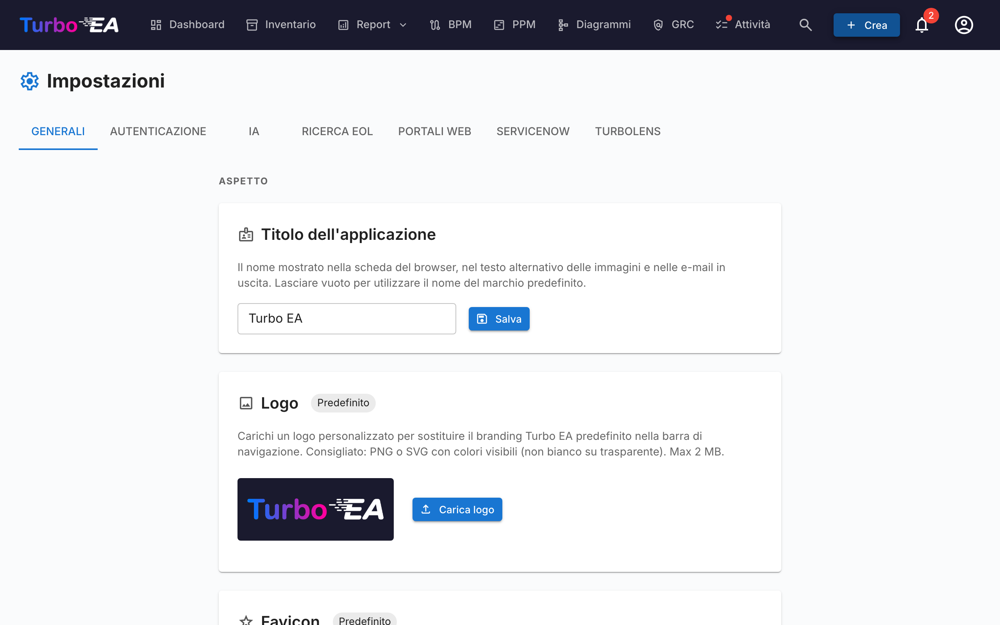

# Impostazioni

La pagina **Impostazioni** sotto **Admin → Impostazioni** (`/admin/settings`) è l'hub centrale di configurazione. È organizzata in schede — scegli la scheda giusta dalla tabella sottostante per l'approfondimento dedicato:

| Scheda | URL | Cosa controlla | Guida completa |
|--------|-----|----------------|----------------|
| **Generale** | `/admin/settings?tab=general` | Aspetto (logo, favicon, valuta, formato data, lingue abilitate, anno fiscale), email SMTP, **interruttori dei moduli** (BPM, PPM, GRC, TurboLens, Sponsor button) | Questa pagina |
| **Autenticazione** | `/admin/settings?tab=authentication` | Provider SSO, registrazione, politica delle password | [Autenticazione & SSO](sso.md) |
| **IA** | `/admin/settings?tab=ai` | Provider LLM, modello, backend di ricerca web, interruttori di suggerimento IA per tipo di card | [Funzionalità IA](ai.md) |
| **EOL** | `/admin/settings?tab=eol` | Collegamento in massa dei prodotti a voci di endoflife.date | [Fine vita (EOL)](eol.md) |
| **Portali web** | `/admin/settings?tab=web-portals` | Slug di portali pubblici in sola lettura, filtri di visibilità | [Portali web](web-portals.md) |
| **ServiceNow** | `/admin/settings?tab=servicenow` | Connessione ServiceNow, configurazione di sincronizzazione, mappatura identità | [Integrazione ServiceNow](servicenow.md) |
| **TurboLens** | `/admin/settings?tab=turbolens` | Interruttori specifici di TurboLens, normative abilitate, polling delle analisi | Vedi sezione [Impostazioni TurboLens](#impostazioni-turbolens) sotto |

Il resto di questa pagina copre la scheda **Generale**.

## Aspetto

### Logo

Caricate un logo personalizzato che appare nella barra di navigazione superiore. Formati supportati: PNG, JPEG, SVG, WebP, GIF. Cliccate su **Ripristina** per tornare al logo predefinito di Turbo EA.

### Favicon

Caricate un'icona personalizzata per il browser (favicon). La modifica ha effetto al prossimo caricamento della pagina. Cliccate su **Ripristina** per tornare all'icona predefinita.

### Valuta

Selezionate la valuta utilizzata per i campi costo in tutta la piattaforma. Questo influisce sulla formattazione dei valori di costo nelle pagine di dettaglio delle card, nei report e nelle esportazioni. Sono supportate oltre 40 valute, tra cui USD, EUR, GBP, JPY, CNY, CHF, INR, BRL, IDR e altre.

### Formato data

Scegli come vengono visualizzate le date in tutta l'applicazione. Il formato selezionato si applica alle date del ciclo di vita delle card, alla griglia inventario, alle firme di ADR e SoAW, al Registro dei rischi, ai report e alle attività PPM, alle versioni dei flussi di processo BPM, ai commenti, alla cronologia, al feed di attività della dashboard, alle notifiche e alle pagine di amministrazione. Vengono offerti cinque formati con anteprima in tempo reale:

- `MM/DD/YYYY` — stile USA (es. `04/29/2026`)
- `DD/MM/YYYY` — stile europeo (es. `29/04/2026`)
- `YYYY-MM-DD` — ISO 8601 (es. `2026-04-29`)
- `DD MMM YYYY` — predefinito (es. `29 apr 2026`)
- `MMM DD, YYYY` (es. `apr 29, 2026`)

Le modifiche hanno effetto immediato per tutti gli utenti — non è richiesto alcun ricaricamento.

### Lingue abilitate

Attivate/disattivate quali lingue sono disponibili per gli utenti nel selettore della lingua. Tutte e otto le localizzazioni supportate possono essere abilitate o disabilitate individualmente:

- English, Deutsch, Français, Español, Italiano, Português, 中文, Русский

Almeno una lingua deve rimanere abilitata in ogni momento.

### Inizio dell'anno fiscale

Selezionate il mese in cui inizia l'anno fiscale della vostra organizzazione (da gennaio a dicembre). Questa impostazione influisce sul raggruppamento delle **linee di budget** nel modulo PPM per anno fiscale. Ad esempio, se l'anno fiscale inizia ad aprile, una linea di budget di giugno 2026 appartiene all'AF 2026–2027.

Il valore predefinito è **gennaio** (anno solare = anno fiscale).

## Gestione dei dati

Controlla per quanto tempo le **schede archiviate** vengono conservate prima di essere eliminate definitivamente.

Quando una scheda viene archiviata, è nascosta dall'inventario, dai report e dalle relazioni, ma mantiene la cronologia completa e può essere ripristinata in qualsiasi momento prima dell'eliminazione.

| Campo | Descrizione |
|-------|-------------|
| **Periodo di conservazione (giorni)** | Numero di giorni per cui una scheda archiviata viene conservata prima di essere eliminata definitivamente. Il valore predefinito è **30**. |
| **Conserva le schede archiviate a tempo indeterminato** | Se attivata (conservazione impostata su **0**), le schede archiviate non vengono mai eliminate automaticamente e vengono conservate — con la loro cronologia — a tempo indeterminato. |

L'eliminazione viene eseguita ogni ora e rilegge questa impostazione a ogni esecuzione, quindi le modifiche hanno effetto senza riavviare l'applicazione. I banner di archiviazione e le finestre di conferma riflettono automaticamente il periodo configurato.

## Email (SMTP)

Configurate la consegna delle email per email di invito, notifiche dei sondaggi e altri messaggi di sistema.

| Campo | Descrizione |
|-------|-------------|
| **SMTP Host** | L'hostname del vostro server di posta (es. `smtp.gmail.com`) |
| **SMTP Port** | Porta del server (tipicamente 587 per TLS) |
| **SMTP User** | Nome utente per l'autenticazione |
| **SMTP Password** | Password per l'autenticazione (memorizzata crittografata) |
| **Usa TLS** | Abilita la crittografia TLS (consigliato) |
| **Indirizzo mittente** | L'indirizzo email del mittente per i messaggi in uscita |
| **URL base dell'app** | L'URL pubblico della vostra istanza Turbo EA (utilizzato nei link delle email) |

Dopo la configurazione, cliccate su **Invia email di test** per verificare che le impostazioni funzionino correttamente.

!!! note
    L'email è opzionale. Se SMTP non è configurato, le funzionalità che inviano email (inviti, notifiche dei sondaggi) salteranno la consegna via email in modo trasparente.

## Modulo BPM

Attivate/disattivate il modulo **Business Process Management**. Quando disabilitato:

- L'elemento di navigazione **BPM** è nascosto a tutti gli utenti
- Le card Business Process rimangono nel database ma le funzionalità specifiche del BPM (editor del flusso di processo, dashboard BPM, report BPM) non sono accessibili

Questo è utile per le organizzazioni che non utilizzano il BPM e desiderano un'esperienza di navigazione più pulita.

## Modulo PPM

Attivate/disattivate il modulo **Project Portfolio Management** (PPM). Quando disabilitato:

- L'elemento di navigazione **PPM** è nascosto a tutti gli utenti
- Le card Iniziativa rimangono nel database ma le funzionalità specifiche del PPM (report di stato, monitoraggio budget e costi, registro rischi, board delle attività, diagramma di Gantt) non sono accessibili

Quando abilitato, le card Iniziativa ottengono una scheda **PPM** nella vista di dettaglio e la dashboard del portfolio PPM diventa disponibile nella navigazione principale. Consultate [Project Portfolio Management](../guide/ppm.md) per la guida completa delle funzionalità.

## Modulo GRC

Attivate/disattivate il modulo **Governance, Rischio e Conformità** (GRC). Quando disabilitato:

- L'elemento di navigazione **GRC** è nascosto a tutti gli utenti
- Lo spazio `/grc` (Principi di Governance e ADR, Registro dei Rischi, finding di Conformità) non è raggiungibile e mostra il placeholder standard «modulo disabilitato» per chi arriva da un link diretto
- Le schede **Rischi** e **Conformità** nel dettaglio della card vengono nascoste, così le singole card non espongono più dati GRC
- I rischi e i finding di conformità rimangono nel database — i permessi sottostanti `risks.*` e `compliance.*` restano invariati, quindi i dati si conservano e ricompaiono invariati se il modulo viene riabilitato

Consultate la [guida GRC](../guide/grc.md) per il riferimento completo delle funzionalità.

## Pulsante Sostieni

Mostra o nascondi il pulsante **Sostieni** nel menu utente (avatar). Quando è nascosto, gli utenti non vedono più il pulsante Sostieni nel loro menu del profilo. Il pulsante Sostieni — e la finestra che spiega come sostenere Turbo EA — rimane sempre disponibile da questo pannello delle impostazioni, così gli amministratori possono comunque raggiungerlo anche quando è nascosto dal menu.

Se la tua azienda sostiene Turbo EA e desidera che il suo logo venga mostrato su turbo-ea.org, scrivi a [sponsorship@turbo-ea.org](mailto:sponsorship@turbo-ea.org).

## Impostazioni TurboLens

La scheda **TurboLens** raccoglie gli interruttori che governano la superficie di analisi IA. A differenza degli interruttori per-modulo sopra, TurboLens **non** è un on/off binario — è «pronto» quando sia un provider IA è configurato (sotto la scheda **IA**) sia i dati di analisi si sono sincronizzati almeno una volta. La pagina espone anche:

- **Normative abilitate** — spunta quali dei sei framework integrati (EU AI Act, GDPR, NIS2, DORA, SOC 2, ISO 27001) partecipano alle [scansioni di Conformità](../guide/compliance.md). Le normative personalizzate definite sotto **Metamodello → Normative** possono essere abilitate anche qui.
- **Cadenza di polling delle analisi** — con quale frequenza l'UI ri-interroga le analisi TurboLens di lunga durata per il progresso. Cadenza più alta = minore latenza percepita, maggiore carico API.
- **TTL della cache dei risultati** — quanto a lungo i risultati delle analisi completate sono nella cache prima che il pulsante **Esegui analisi** si riabiliti.

Vedi [Intelligenza IA TurboLens](../guide/turbolens.md) per la superficie funzionale completa e [Conformità](../guide/compliance.md) per il workflow di scansione.
