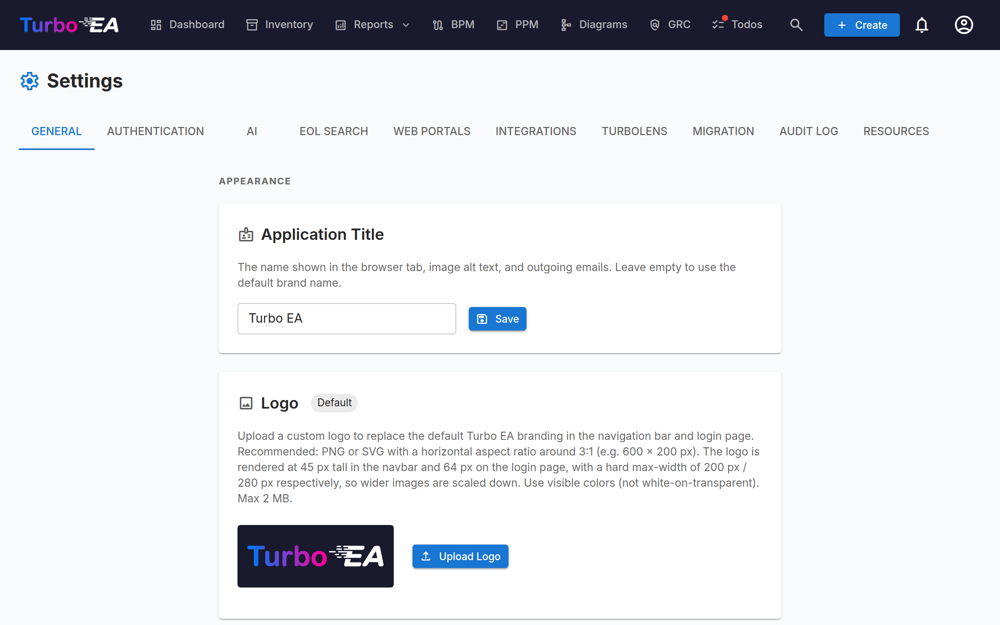

# Settings

The **Settings** page at **Admin → Settings** (`/admin/settings`) is the central configuration hub. It is organised as a set of tabs — pick the right tab from the table below for the dedicated deep-dive:

| Tab | URL | What it controls | Full guide |
|-----|-----|------------------|------------|
| **General** | `/admin/settings?tab=general` | Appearance (logo, favicon, currency, date format, enabled languages, fiscal year), email delivery, **module toggles** (BPM, PPM, GRC, TurboLens, Sponsor button) | This page |
| **Authentication** | `/admin/settings?tab=authentication` | SSO providers, registration, password policy | [Authentication & SSO](sso.md) |
| **AI** | `/admin/settings?tab=ai` | LLM provider, model, web search backend, per-card-type AI suggestion toggles | [AI Capabilities](ai.md) |
| **EOL** | `/admin/settings?tab=eol` | Mass-linking products to endoflife.date entries | [End-of-Life (EOL)](eol.md) |
| **Web Portals** | `/admin/settings?tab=web-portals` | Public read-only portal slugs, visibility filters | [Web Portals](web-portals.md) |
| **Integrations** | `/admin/settings?tab=integrations` | ServiceNow sync and integrations added by extensions | [ServiceNow Integration](servicenow.md) |
| **TurboLens** | `/admin/settings?tab=turbolens` | TurboLens-specific toggles, enabled regulations, analysis polling | See section [TurboLens settings](#turbolens-settings) below |
| **Migration** | `/admin/settings?tab=migration` | Imports from other EA platforms, and full workspace transfer between Turbo EA instances | [Platform Migration](migration.md) |
| **Audit log** | `/admin/settings?tab=audit-log` | Mutation-batch ledger — who changed what, and whether it came from the web UI, the API, or an AI tool | — |
| **Resources** | `/admin/settings?tab=resources` | Every file and link attached to a card, with storage statistics and bulk clean-up | [Resources](resources.md) |

The rest of this page covers the **General** tab.

## Appearance

### Logo

Upload a custom logo that appears in the top navigation bar. Supported formats: PNG, JPEG, SVG, WebP, GIF. Click **Reset** to revert to the default Turbo EA logo.

### Navigation bar style

Choose the background and text colors of the top navigation bar. The chosen style applies to **every user** of the instance, on desktop and mobile (including the mobile drawer menu). Pick one of the seven curated presets — Navy (default), Light, Charcoal, Slate, Blue, Forest, or Plum — or select **Custom** to set fully custom background and text colors with the color pickers. A live preview shows how the navigation bar will look before you save, and a warning appears when the contrast between text and background is too low to read comfortably (below WCAG AA). Click **Reset to default** to return to the navy default.

### Favicon

Upload a custom browser icon (favicon). The change takes effect on the next page load. Click **Reset** to revert to the default icon.

### Currency

Select the currency used for cost fields across the platform. This affects how cost values are formatted in card detail pages, reports, and exports. Over 20 currencies are supported, including USD, EUR, GBP, JPY, CNY, CHF, INR, BRL, and more.

### Date Format

Choose how dates are displayed throughout the application. The selected format applies to card lifecycle dates, the inventory grid, ADR and SoAW signed dates, the Risk Register, PPM reports and tasks, BPM process flow versions, comments, history, the dashboard activity feed, notifications, and admin pages. Five formats are offered with a live preview as you choose:

- `MM/DD/YYYY` — US style (e.g. `04/29/2026`)
- `DD/MM/YYYY` — European style (e.g. `29/04/2026`)
- `YYYY-MM-DD` — ISO 8601 (e.g. `2026-04-29`)
- `DD MMM YYYY` — default (e.g. `29 Apr 2026`)
- `MMM DD, YYYY` (e.g. `Apr 29, 2026`)

Changes take effect immediately for everyone — no reload required.

### Enabled Languages

Toggle which languages are available to users in their language selector. All eight supported locales can be individually enabled or disabled:

- English, Deutsch, Français, Español, Italiano, Português, 中文, Русский

At least one language must remain enabled at all times.

### Fiscal Year Start

Select the month that begins your organization's fiscal year (January through December). This setting affects how **budget lines** in the PPM module are grouped by fiscal year. For example, if the fiscal year starts in April, a budget line dated June 2026 belongs to FY 2026–2027.

The default is **January** (calendar year = fiscal year).

## Data management

Control how long **archived cards** are retained before they are permanently deleted.

When a card is archived it is hidden from the inventory, reports, and relations, but it keeps its full history and can be restored at any time before it is purged.

| Field | Description |
|-------|-------------|
| **Retention period (days)** | Number of days an archived card is kept before it is permanently deleted. The default is **30**. |
| **Keep archived cards indefinitely** | When enabled (retention set to **0**), archived cards are never auto-deleted and are retained — with their history — indefinitely. |

The purge job runs hourly and re-reads this setting on each run, so changes take effect without restarting the application. Archive banners and confirmation dialogs reflect the configured period automatically.

## Email

Turbo EA sends invitation emails, survey notifications, password resets, and other system messages. Choose a **sending method** that matches your mail platform.

!!! warning "Basic SMTP authentication is being retired"
    Microsoft 365 is disabling basic SMTP authentication (unavailable for new tenants, removed for existing ones across 2026–2027) and Google Workspace disabled it in March 2025. For those platforms, use one of the OAuth methods below instead of a mailbox password.

### Sending methods

| Method | When to use |
|--------|-------------|
| **SMTP (username & password)** | Classic SMTP for servers that still accept basic auth. The default. |
| **SMTP with OAuth 2.0 (XOAUTH2)** | SMTP authenticated with a short-lived OAuth token — Microsoft 365 (app-only) or Google Workspace (service account). |
| **Microsoft Graph API** | App-only Microsoft Graph `sendMail`. The recommended Microsoft 365 option — no SMTP, no stored password. |

### Common fields

| Field | Description |
|-------|-------------|
| **From Address** | The sender address for outgoing messages |
| **App Base URL** | The public URL of your instance (used in email links) |

### SMTP (username & password)

| Field | Description |
|-------|-------------|
| **SMTP Host** | Your mail server hostname (e.g., `smtp.gmail.com`) |
| **SMTP Port** | Server port (587 for STARTTLS, 465 for implicit TLS/SSL) |
| **SMTP User** | Authentication username |
| **SMTP Password** | Authentication password (stored encrypted) |
| **Use TLS** | Enable STARTTLS encryption (recommended). Ignored on port 465, which always uses implicit TLS/SSL |

### Microsoft Graph API (recommended for Microsoft 365)

1. In **Microsoft Entra ID → App registrations**, create a dedicated app registration.
2. Under **API permissions**, add the **Mail.Send** *application* permission and grant **admin consent**.
3. Create a **client secret** under **Certificates & secrets**.
4. In Turbo EA, choose **Microsoft Graph API** and enter the **Tenant ID**, **Client ID**, **Client secret**, and the **Sender mailbox** (the user principal name mail is sent from).

No mailbox password is stored; Turbo EA requests a short-lived token for each send.

The **From Address** is optional with Graph: leave it at the default to send as the sender mailbox. Setting a different address requires a **Send As** grant for that address on the sender mailbox.

### SMTP with OAuth 2.0

- **Microsoft 365:** enter the **Tenant ID**, **Client ID**, and **Client secret** of an app registration, plus the **Sender mailbox**. SMTP AUTH must be enabled for the mailbox.
- **Google Workspace:** choose **Google**, paste the **service-account key (JSON)** with domain-wide delegation enabled for the sender mailbox, and set the **Sender mailbox** to impersonate.

The **Scope** and **Token endpoint** fields are optional overrides — leave them empty unless your tenant requires custom values.

After configuring any method, click **Send Test Email** to verify it works.

!!! note
    Email is optional. If no method is configured, features that send emails gracefully skip delivery.

## BPM Module

Toggle the **Business Process Management** module on or off. When disabled:

- The **BPM** navigation item is hidden from all users
- Business Process cards remain in the database but BPM-specific features (process flow editor, BPM dashboard, BPM reports) are not accessible

This is useful for organizations that do not use BPM and want a cleaner navigation experience.

### Require a separate approver

Off by default. When enabled, the person who submits a process flow revision cannot be the one who approves it — segregation of duties, as quality systems such as GxP and ISO 9001 expect.

Leave it off for a small team where the same person drafts and signs off. Turning it on does not change what is recorded: every submission, approval, rejection and withdrawal is written to the card's **History** tab either way.

## PPM Module

Toggle the **Project Portfolio Management** module on or off. When disabled:

- The **PPM** navigation item is hidden from all users
- Initiative cards remain in the database but PPM-specific features (status reports, budget & cost tracking, risk register, task board, Gantt chart) are not accessible

When enabled, Initiative cards gain a **PPM** tab in their detail view and the PPM portfolio dashboard becomes available in the main navigation. See [Project Portfolio Management](../guide/ppm.md) for the full feature guide.

## GRC Module

Toggle the **Governance, Risk and Compliance** module on or off. When disabled:

- The **GRC** navigation item is hidden from all users
- The `/grc` workspace (Governance principles and ADRs, Risk Register, Compliance findings) is unreachable and shows the standard "module disabled" placeholder for anyone with a direct link
- The **Risks** and **Compliance** tabs on Card Detail are hidden, so individual cards no longer surface GRC data either
- Risks and compliance findings remain in the database — the underlying `risks.*` and `compliance.*` permissions are unchanged, so the data is preserved and re-appears unchanged if the module is re-enabled

See the [GRC guide](../guide/grc.md) for the full feature reference.

## Update notifications

Turbo EA checks once a day whether a newer version has been published and, when there is one, drops a notification into the bell for every user whose role grants `admin.settings`. Clicking it opens the release notes — the changelog for that version — in a dialog inside Turbo EA. Every notification keeps showing the version it announced, however long it has sat in the bell: the notes are read from the changelog shipped inside the image, so they cost no outbound request and work unchanged on an air-gapped install. Only a release you have not installed yet comes from the daily check's cache instead, because a changelog written at build time cannot describe it; for those, a **View on GitHub** button opens the release page in a new tab.

Notifications are titled with the name configured for this instance, so a renamed deployment does not announce itself under a different product name.

The check is **notification-only** — nothing is downloaded and nothing on the host is changed. Upgrading remains the deliberate, backed-up procedure described in [Operations](operations.md#the-upgrade-procedure). An administrator who would rather not be reminded can mute the **Update Available** row in their own notification preferences.

Turning the toggle **off** stops the daily request to github.com altogether, which is what an air-gapped or egress-restricted install wants. Either way the instance behaves normally: when the release feed cannot be reached, the failure is recorded quietly and nothing is shown.

### After the upgrade lands

A second switch, **Announce upgrades to users**, covers the other half of the story. When the instance restarts on a newer version, **every** user — not just administrators — gets one notification saying the app was updated, and clicking it shows the changelog for every version the upgrade crossed. An instance jumping from 2.57.0 to 2.60.0 shows all four releases, not just the last one. Each of these notices stays tied to its own upgrade, so opening one from a year ago still shows the versions *that* upgrade crossed.

The announcement is sent **once per version**: restarting ten times on the same version produces one notification, and a rollback produces none. A brand-new install announces nothing, because there is no upgrade to describe. These notes come from the changelog bundled inside the image, so this half needs no network at all.

This one is **in-app only** and is never emailed — it reaches every active user on every upgrade, and an email channel would turn each patch release into a mass mailing. Individual users can still mute it under **Update notifications** in their own notification preferences, where the email switch is shown disabled.

### Extension store notifications

A third switch, **Extension store notifications**, does the same job for the [Extension Store](extensions.md). Once a day the instance reads the store's public catalogue and, when something has changed, notifies every user whose role grants `admin.manage_extensions` — the same permission that opens the Extensions page. Two things are announced: an extension published to the store that you do not have installed, and a newer version of one you do.

Busy release days stay readable: however many extensions changed, each administrator gets **one** notification per kind ("3 extension updates are available"), not one per extension. Each is announced **once** — a catalogue that sits unchanged for a month produces one notification, not thirty — and clicking it opens the Store tab inside Turbo EA.

The very first successful reading of the catalogue announces **no** new extensions: an instance meeting the store for the first time would otherwise report everything in it. Updates to extensions you already have are reported straight away, because there are only ever a handful of them and they are immediately actionable.

Like the release check, this is **notification-only** — nothing is downloaded or installed, and installing stays a deliberate action on the Extensions page. Turning the toggle **off** stops the daily request to the store altogether. Individual administrators can mute the **New Extension Available** and **Extension Update Available** rows separately in their own notification preferences.

## Sponsor Button

Show or hide the **Sponsor** button in the user (avatar) menu. When hidden, users no longer see the Sponsor button in their profile menu. The Sponsor button — and the dialog explaining how to support Turbo EA — always remains available from this settings panel, so administrators can still reach it even when it is hidden from the menu.

If your company sponsors Turbo EA and would like its logo featured on turbo-ea.org, reach out at [sponsorship@turbo-ea.org](mailto:sponsorship@turbo-ea.org).

## TurboLens settings

The **TurboLens** tab gathers the toggles that govern the AI analysis surface. Unlike the per-module switches above, TurboLens is **not** a binary on/off — it is "ready" when both an AI provider is configured (under the **AI** tab) and the analysis data has synced at least once. The page also exposes:

- **Enabled regulations** — tick which of the six built-in frameworks (EU AI Act, GDPR, NIS2, DORA, SOC 2, ISO 27001) participate in [Compliance scans](../guide/compliance.md). Custom regulations defined under **Metamodel → Regulations** can also be enabled here.
- **Analysis polling cadence** — how often the UI re-polls long-running TurboLens analyses for progress. Higher cadence = lower perceived latency, more API load.
- **Result cache TTL** — how long completed analysis results are cached before the **Run analysis** button re-enables.

See [TurboLens AI Intelligence](../guide/turbolens.md) for the full feature surface and [Compliance](../guide/compliance.md) for the scan workflow.
