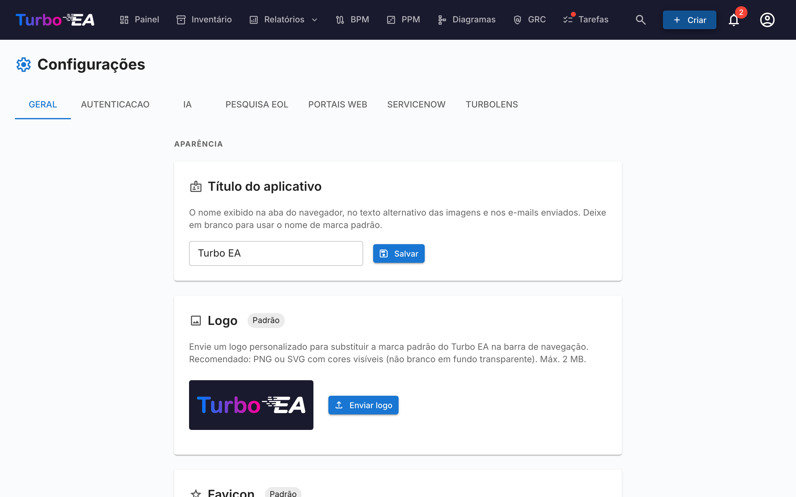

# Configurações

A página de **Configurações** em **Admin → Configurações** (`/admin/settings`) é o hub central de configuração. Está organizada em abas — escolha a aba certa na tabela abaixo para o aprofundamento dedicado:

| Aba | URL | O que controla | Guia completo |
|-----|-----|----------------|---------------|
| **Geral** | `/admin/settings?tab=general` | Aparência (logo, favicon, moeda, formato de data, idiomas habilitados, ano fiscal), envio de e-mail, **alternâncias de módulos** (BPM, PPM, GRC, TurboLens, Sponsor button) | Esta página |
| **Autenticação** | `/admin/settings?tab=authentication` | Provedores SSO, registro, política de senha | [Autenticação e SSO](sso.md) |
| **IA** | `/admin/settings?tab=ai` | Provedor LLM, modelo, backend de busca web, alternâncias de sugestão IA por tipo de card | [Capacidades de IA](ai.md) |
| **EOL** | `/admin/settings?tab=eol` | Vinculação em massa de produtos a entradas de endoflife.date | [Fim de vida (EOL)](eol.md) |
| **Portais web** | `/admin/settings?tab=web-portals` | Slugs de portais públicos somente leitura, filtros de visibilidade | [Portais web](web-portals.md) |
| **ServiceNow** | `/admin/settings?tab=servicenow` | Conexão ServiceNow, configuração de sincronização, mapeamento de identidade | [Integração com ServiceNow](servicenow.md) |
| **TurboLens** | `/admin/settings?tab=turbolens` | Alternâncias específicas de TurboLens, regulamentações habilitadas, polling de análises | Veja a seção [Configurações do TurboLens](#configuracoes-do-turbolens) abaixo |

O restante desta página cobre a aba **Geral**.

## Aparência

### Logo

Faça upload de um logotipo personalizado que aparece na barra de navegação superior. Formatos suportados: PNG, JPEG, SVG, WebP, GIF. Clique em **Redefinir** para reverter ao logotipo padrão do Turbo EA.

### Estilo da barra de navegação

Escolha as cores de fundo e do texto da barra de navegação superior. O estilo escolhido aplica-se a **todos os usuários** da instância, em desktop e mobile (incluindo o menu lateral móvel). Selecione uma das sete predefinições — Azul-marinho (padrão), Claro, Carvão, Ardósia, Azul, Verde floresta ou Ameixa — ou escolha **Personalizado** para definir livremente as cores de fundo e do texto com os seletores de cores. Uma pré-visualização ao vivo mostra como a barra de navegação ficará antes de salvar, e um aviso aparece quando o contraste entre o texto e o fundo é baixo demais (abaixo de WCAG AA). Clique em **Restaurar padrão** para voltar ao estilo padrão.

### Favicon

Faça upload de um ícone de navegador personalizado (favicon). A alteração entra em vigor no próximo carregamento de página. Clique em **Redefinir** para reverter ao ícone padrão.

### Moeda

Selecione a moeda usada para campos de custo em toda a plataforma. Isso afeta como os valores de custo são formatados nas páginas de detalhe de cards, relatórios e exportações. Mais de 40 moedas são suportadas, incluindo USD, EUR, GBP, JPY, CNY, CHF, INR, BRL, IDR e mais.

### Formato de data

Escolha como as datas são exibidas em todo o aplicativo. O formato selecionado aplica-se às datas de ciclo de vida dos cards, à grade de inventário, às assinaturas de ADR e SoAW, ao Registro de Riscos, aos relatórios e tarefas do PPM, às versões de fluxos de processos BPM, aos comentários, ao histórico, ao feed de atividade do painel, às notificações e às páginas de administração. Cinco formatos são oferecidos com pré-visualização em tempo real:

- `MM/DD/YYYY` — estilo EUA (ex. `04/29/2026`)
- `DD/MM/YYYY` — estilo europeu (ex. `29/04/2026`)
- `YYYY-MM-DD` — ISO 8601 (ex. `2026-04-29`)
- `DD MMM YYYY` — padrão (ex. `29 abr 2026`)
- `MMM DD, YYYY` (ex. `abr 29, 2026`)

As alterações entram em vigor imediatamente para todos os usuários — não é necessário recarregar.

### Idiomas Habilitados

Alterne quais idiomas estão disponíveis para os usuários no seletor de idioma. Todos os oito idiomas suportados podem ser individualmente habilitados ou desabilitados:

- English, Deutsch, Français, Español, Italiano, Português, 中文, Русский

Pelo menos um idioma deve permanecer habilitado o tempo todo.

### Início do Ano Fiscal

Selecione o mês em que o ano fiscal da sua organização começa (janeiro a dezembro). Esta configuração afeta como as **linhas de orçamento** no módulo PPM são agrupadas por ano fiscal. Por exemplo, se o ano fiscal começa em abril, uma linha de orçamento de junho de 2026 pertence ao AF 2026–2027.

O padrão é **janeiro** (ano civil = ano fiscal).

## Gestão de dados

Controle por quanto tempo as **fichas arquivadas** são mantidas antes de serem excluídas permanentemente.

Quando uma ficha é arquivada, ela fica oculta no inventário, nos relatórios e nas relações, mas mantém todo o seu histórico e pode ser restaurada a qualquer momento antes da purga.

| Campo | Descrição |
|-------|-----------|
| **Período de retenção (dias)** | Número de dias que uma ficha arquivada é mantida antes de ser excluída permanentemente. O padrão é **30**. |
| **Manter fichas arquivadas indefinidamente** | Quando ativado (retenção definida como **0**), as fichas arquivadas nunca são excluídas automaticamente e são mantidas — com o seu histórico — indefinidamente. |

A purga é executada de hora em hora e relê esta configuração a cada execução, portanto as alterações entram em vigor sem reiniciar a aplicação. Os avisos de arquivamento e as caixas de diálogo de confirmação refletem automaticamente o período configurado.

## E-mail

O Turbo EA envia e-mails de convite, notificações de pesquisas, redefinições de senha e outras mensagens do sistema. Escolha um **método de envio** adequado à sua plataforma de e-mail.

!!! warning "A autenticação SMTP básica está sendo descontinuada"
    O Microsoft 365 está desativando a autenticação SMTP básica (indisponível para novos locatários, removida para os existentes ao longo de 2026–2027) e o Google Workspace a desativou em março de 2025. Para essas plataformas, use um dos métodos OAuth abaixo em vez de uma senha de caixa de correio.

### Métodos de envio

| Método | Quando usar |
|--------|-------------|
| **SMTP (usuário e senha)** | SMTP clássico para servidores que ainda aceitam autenticação básica. O padrão. |
| **SMTP com OAuth 2.0 (XOAUTH2)** | SMTP autenticado com um token OAuth de curta duração — Microsoft 365 (somente aplicativo) ou Google Workspace (conta de serviço). |
| **API do Microsoft Graph** | `sendMail` do Microsoft Graph somente de aplicativo. A opção recomendada para o Microsoft 365 — sem SMTP, sem senha armazenada. |

### Campos comuns

| Campo | Descrição |
|-------|-----------|
| **Endereço do remetente** | O endereço do remetente das mensagens enviadas |
| **URL base do aplicativo** | A URL pública da sua instância (usada nos links dos e-mails) |

### SMTP (usuário e senha)

| Campo | Descrição |
|-------|-----------|
| **Host SMTP** | O nome de host do seu servidor de e-mail (ex.: `smtp.gmail.com`) |
| **Porta SMTP** | A porta do servidor (geralmente 587 para TLS) |
| **Usuário SMTP** | O nome de usuário de autenticação |
| **Senha SMTP** | A senha de autenticação (armazenada criptografada) |
| **Usar TLS** | Ativar a criptografia STARTTLS (recomendado) |

### API do Microsoft Graph (recomendada para o Microsoft 365)

1. Em **Microsoft Entra ID → Registros de aplicativo**, crie um registro de aplicativo dedicado.
2. Em **Permissões de API**, adicione a permissão **de aplicativo** **Mail.Send** e conceda o **consentimento do administrador**.
3. Crie um **segredo do cliente** em **Certificados e segredos**.
4. No Turbo EA, escolha **API do Microsoft Graph** e informe o **ID do locatário**, o **ID do cliente**, o **segredo do cliente** e a **Caixa de correio do remetente** (o nome principal de usuário de onde o e-mail é enviado).

Nenhuma senha de caixa de correio é armazenada; o Turbo EA solicita um token de curta duração para cada envio.

O **endereço do remetente** é opcional com o Graph: deixe-o no valor padrão para enviar como a caixa de correio do remetente. Definir um endereço diferente exige uma permissão **Send As** para esse endereço na caixa de correio do remetente.

### SMTP com OAuth 2.0

- **Microsoft 365:** informe o **ID do locatário**, o **ID do cliente** e o **segredo do cliente** de um registro de aplicativo, além da **Caixa de correio do remetente**. O SMTP AUTH deve estar habilitado para a caixa de correio.
- **Google Workspace:** escolha **Google**, cole a **chave da conta de serviço (JSON)** com a delegação em todo o domínio habilitada para a caixa de correio do remetente, e defina a **Caixa de correio do remetente** a ser representada.

Os campos **Escopo** e **Endpoint do token** são substituições opcionais — deixe-os vazios, a menos que o seu locatário exija valores personalizados.

Depois de configurar qualquer método, clique em **Enviar e-mail de teste** para verificar se funciona.

!!! note
    O e-mail é opcional. Se nenhum método for configurado, os recursos que enviam e-mails ignoram a entrega normalmente.

## Módulo BPM

Alterne o módulo de **Business Process Management** ligado ou desligado. Quando desabilitado:

- O item de navegação **BPM** é oculto para todos os usuários
- Cards de Processo de Negócio permanecem no banco de dados, mas recursos específicos de BPM (editor de fluxo de processo, painel BPM, relatórios BPM) não estão acessíveis

Isso é útil para organizações que não usam BPM e desejam uma experiência de navegação mais limpa.

## Módulo PPM

Alterne o módulo de **Gestão de Portfólio de Projetos** (PPM) ligado ou desligado. Quando desabilitado:

- O item de navegação **PPM** é oculto para todos os usuários
- Cards de Iniciativa permanecem no banco de dados, mas recursos específicos de PPM (relatórios de status, acompanhamento de orçamento e custos, registro de riscos, quadro de tarefas, gráfico de Gantt) não estão acessíveis

Quando habilitado, cards de Iniciativa ganham uma aba **PPM** na sua visualização de detalhes e o painel do portfólio PPM fica disponível na navegação principal. Veja [Gestão de Portfólio de Projetos](../guide/ppm.md) para o guia completo de funcionalidades.

## Módulo GRC

Alterne o módulo de **Governança, Risco e Conformidade** (GRC) ligado ou desligado. Quando desabilitado:

- O item de navegação **GRC** é oculto para todos os usuários
- O workspace `/grc` (princípios de Governança e ADRs, Registro de Riscos, achados de Conformidade) deixa de estar acessível e exibe o placeholder padrão «módulo desabilitado» para quem chega por um link direto
- As abas **Riscos** e **Conformidade** no detalhe do card ficam ocultas, de modo que os cards individuais também não exibem mais dados de GRC
- Os riscos e os achados de conformidade permanecem no banco de dados — as permissões subjacentes `risks.*` e `compliance.*` continuam inalteradas, de modo que os dados são preservados e reaparecem sem alterações se o módulo for reativado

Consulte o [guia do GRC](../guide/grc.md) para a referência completa de funcionalidades.

## Botão Apoiar

Mostre ou oculte o botão **Apoiar** no menu de utilizador (avatar). Quando está oculto, os utilizadores deixam de ver o botão Apoiar no seu menu de perfil. O botão Apoiar — e a caixa de diálogo que explica como apoiar o Turbo EA — permanece sempre disponível neste painel de definições, pelo que os administradores ainda conseguem aceder-lhe mesmo quando está oculto no menu.

Se a sua empresa apoia o Turbo EA e gostaria que o seu logótipo fosse divulgado em turbo-ea.org, contacte [sponsorship@turbo-ea.org](mailto:sponsorship@turbo-ea.org).

## Configurações do TurboLens

A aba **TurboLens** reúne as alternâncias que regem a superfície de análise IA. Ao contrário dos interruptores por módulo acima, o TurboLens **não** é um on/off binário — está «pronto» quando tanto um provedor IA está configurado (na aba **IA**) quanto os dados de análise sincronizaram pelo menos uma vez. A página também expõe:

- **Regulamentações habilitadas** — marque quais dos seis frameworks integrados (EU AI Act, LGPD/GDPR, NIS2, DORA, SOC 2, ISO 27001) participam das [varreduras de Conformidade](../guide/compliance.md). Regulamentações personalizadas definidas em **Metamodelo → Regulamentações** também podem ser habilitadas aqui.
- **Cadência de polling de análises** — com que frequência a UI re-consulta as análises TurboLens de longa duração para obter progresso. Cadência maior = menor latência percebida, mais carga de API.
- **TTL do cache de resultados** — por quanto tempo os resultados de análises concluídas ficam em cache antes do botão **Executar análise** voltar a ser habilitado.

Veja [Inteligência IA TurboLens](../guide/turbolens.md) para a superfície de funcionalidades completa e [Conformidade](../guide/compliance.md) para o fluxo de varredura.
